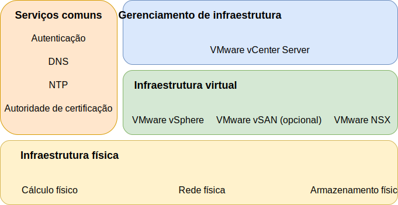

---

copyright:

  years:  2016, 2019

lastupdated: "2019-05-07"

subcollection: vmware-solutions

---
# Componentes do IBM Cloud for VMware Solutions
{: #design_overview}

O {{site.data.keyword.vmwaresolutions_full}} fornece automação para implementar componentes de tecnologia VMware no {{site.data.keyword.CloudDataCents_notm}} em todo o mundo.

As ofertas nesse portfólio de solução incluem os produtos do VMware vSphere dentro de um cluster implementado e configurado automaticamente: VMware vSphere ESXi, VMware vCenter Server Appliance com um Platform Services Controller (PSC) integrado, VMware NSX-V ou NSX-T e, opcionalmente, VMware vSAN.

A arquitetura consiste em uma única região de nuvem e suporta a capacidade de se estender em mais regiões de nuvem que estão localizadas em outra geografia e em outro pod do {{site.data.keyword.cloud_notm}} dentro do mesmo data center. Uma região é definida como uma instância exclusiva do vCenter Server. Esse design também permite a expansão automatizada e a contração da capacidade virtual dentro de uma instância do vCenter Server.

## Links relacionados
{: #design_overview-related}

* [ Design da infraestrutura física ](/docs/services/vmwaresolutions/archiref/solution?topic=vmware-solutions-design_physicalinfrastructure)
* [ Design de infraestrutura virtual ](/docs/services/vmwaresolutions/archiref/solution?topic=vmware-solutions-design_virtualinfrastructure)
* [ Design de serviços comuns ](/docs/services/vmwaresolutions/archiref/solution?topic=vmware-solutions-design_commonservice)
* [Design de gerenciamento de infraestrutura](/docs/services/vmwaresolutions/archiref/solution?topic=vmware-solutions-design_infrastructuremgmt)
