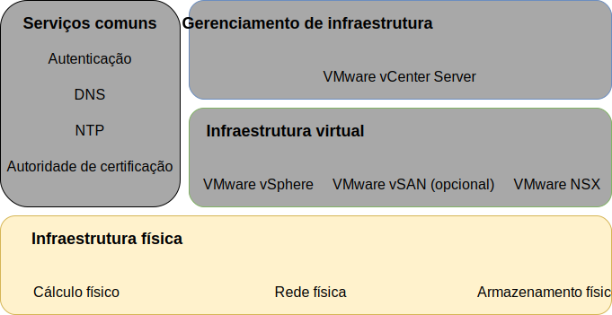
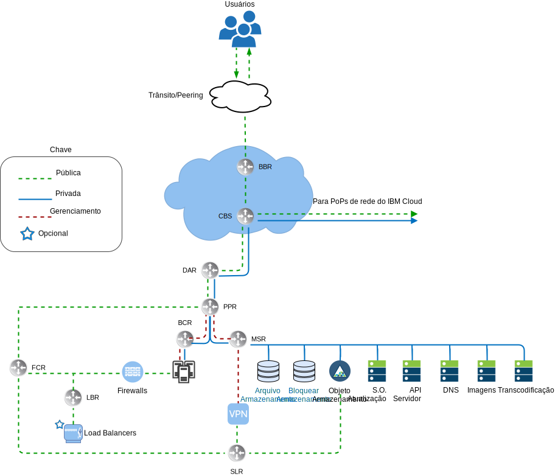
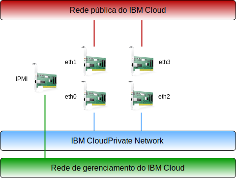
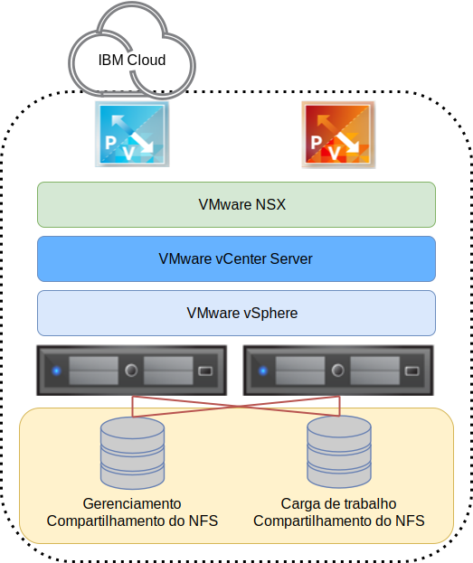
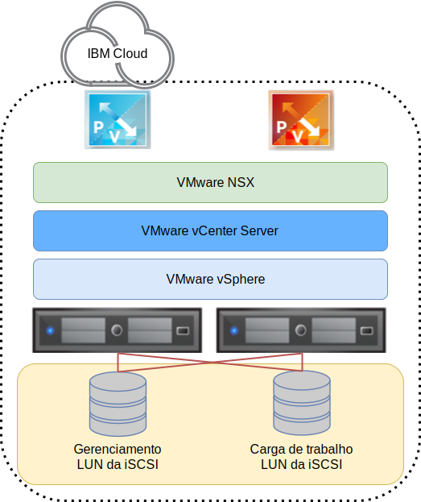

---

copyright:

  years:  2016, 2019

lastupdated: "2019-03-19"

subcollection: vmwaresolutions

---

{:tip: .tip}
{:note: .note}
{:important: .important}

# Design da infraestrutura física
{: #design_physicalinfrastructure}

A infraestrutura física consiste nos componentes a seguir:

<dl class="dl">
  <dt class="dt dlterm">Cálculo físico</dt>
  <dd class="dd">O cálculo físico fornece o processamento físico e a memória que é usada pela infraestrutura de virtualização. Para esse design, os componentes de cálculo são fornecidos pelo {{site.data.keyword.baremetal_long}} e são listados no [VMware Hardware Compatibility Guide (HCG)](https://www.vmware.com/resources/compatibility/search.php).</dd>
  <dt class="dt dlterm">Armazenamento físico</dt>
  <dd class="dd">O armazenamento físico fornece a capacidade de armazenamento bruto que é usada pela infraestrutura de virtualização. Os componentes de armazenamento são fornecidos pelo {{site.data.keyword.baremetal_short}} ou pela matriz compartilhada do armazenamento conectado à rede (NAS) que usa NFSv3 ou iSCSI.</dd>
  <dt class="dt dlterm">Rede física</dt>
  <dd class="dd">A rede física fornece a conectividade de rede para o ambiente que é usado, então, pela virtualização de rede. A rede é fornecida pela rede de serviços do {{site.data.keyword.cloud_notm}} e inclui serviços extras, como DNS e NTP.</dd>
</dl>

Para obter mais informações sobre os componentes físicos, consulte a [Lista de materiais do vCenter Server](/docs/services/vmwaresolutions/vcenter?topic=vmware-solutions-vc_bom).

Para obter mais informações sobre armazenamento, veja [Arquitetura de armazenamento compartilhado](/docs/services/vmwaresolutions/archiref/attached-storage?topic=vmware-solutions-storage-benefits#storage-benefits).

Figura 1. Infraestrutura física 

## Design de cálculo físico
{: #design_physicalinfrastructure-host-design}

As configurações do servidor disponíveis na solução atendem ou excedem os requisitos mínimos para instalar, configurar e gerenciar o vSphere ESXi. Várias configurações estão disponíveis para satisfazer requisitos diferentes. Para obter a listagem detalhada das especificações exatas usadas para a solução VMware on {{site.data.keyword.cloud_notm}}, consulte a lista de materiais para a [instância do vCenter Server](/docs/services/vmwaresolutions/vcenter?topic=vmware-solutions-vc_bom).

O  {{site.data.keyword.baremetal_short}}  reside no  {{site.data.keyword.cloud_notm}}.
{:note}

Cada instância do vCenter Server começa com uma implementação de 3 ou 4 hosts, dependendo da opção de solução de armazenamento.

O host físico emprega dois discos conectados localmente que são alocados para o hypervisor do vSphere ESXi. É possível alocar mais discos usando o vSAN conforme descrito na seção _Design de armazenamento físico_ ou usando o NetApp ONTAP conforme descrito em [Arquitetura do NetApp ONTAP Select](https://www.ibm.com/cloud/garage/files/IBM_Cloud_for_VMware_Solutions_NetApp_Architecture.pdf). Cada
host físico tem conexões de rede redundantes de 10 Gbps para o acesso público e privado à rede.

O Bare Metal Server tem as especificações a seguir:
* CPU: Dual Intel Xeon, configuração variada de núcleo e velocidade
* Memória: configuração variada, 64 GB ou maior
* Rede: 4 x 10 Gbps
* Número de unidades: 2 ou mais

## Design de rede física
{: #design_physicalinfrastructure-net-design}

A rede física é manipulada pelo {{site.data.keyword.cloud_notm}}. Revise as descrições a seguir da rede física que é fornecida pelas conexões do IBM Cloud e do host físico (VLANs, MTU) associadas aos hosts físicos.

### Visão geral da rede do IBM Cloud
{: #design_physicalinfrastructure-ibm-cloud-network}

A rede física do {{site.data.keyword.cloud_notm}} é separada em duas redes distintas: pública e privada. A rede privada contém o tráfego da Intelligent Platform Management Interface (IPMI) do gerenciamento fora da banda para os servidores físicos.

Figura 2. Rede de alto nível do {{site.data.keyword.cloud_notm}}

#### Rede pública
{: #design_physicalinfrastructure-public-net}

Os {{site.data.keyword.CloudDataCents_notm}} e os pontos de presença (PoPs) da rede têm várias conexões de 1 Gbps ou 10 Gbps com as operadoras de rede de trânsito e de peer da camada superior. O tráfego de rede de qualquer lugar no mundo se conecta ao PoP de rede mais próximo e viaja diretamente na rede para o seu data center, minimizando o número de hops e handoffs de rede entre os provedores.

Dentro do data center, o {{site.data.keyword.cloud_notm}} fornece 1 Gbps ou 10 Gbps de largura da banda de rede para servidores individuais por meio de um par de Front-end Customer Switches (FCS) separados, agregados por peer. Esses comutadores agregados estão conectados a um par de roteadores separados, FCR, para rede L3.

Esse design multicamada permite que a rede seja escalada em racks, linhas e pods dentro de um {{site.data.keyword.CloudDataCent_notm}}.

#### Rede Privada
{: #design_physicalinfrastructure-private-net}

Todos os {{site.data.keyword.CloudDataCents_notm}} e os PoPs são conectados pela backbone de rede privada. Essa rede privada é separada da rede pública e permite a conectividade com serviços em {{site.data.keyword.CloudDataCents_notm}} ao redor do mundo. A movimentação de dados entre {{site.data.keyword.CloudDataCents_notm}} é feita por meio de múltiplas conexões de 10 Gbps ou 40 Gbps para a rede privada.

Semelhante à rede pública, a rede privada tem multicamadas nesses servidores e outros componentes de infraestrutura são conectados a Back-end Customer Switches (BCS) agregados. Esses comutadores agregados são anexados a um par de Back-end Customer Routers (BCR) separados para rede L3. A rede privada também suporta a capacidade de usar quadros jumbo (MTU 9000) para conexões de host físico.

#### Rede de gerenciamento
{: #design_physicalinfrastructure-mgmt-net}

Além das redes pública e privada, cada servidor do {{site.data.keyword.cloud_notm}} é conectado para o gerenciamento fora da banda para a sub-rede de rede primária privada. Essa conexão permite o acesso da Intelligent Platform Management Interface (IPMI) ao servidor independentemente de sua CPU, firmware e sistema operacional, para propósitos de manutenção e administração.

#### Blocos IP primários e móveis
{: #design_physicalinfrastructure-ip-blocks}

O {{site.data.keyword.cloud_notm}} aloca dois tipos de endereços IP para serem usados dentro da infraestrutura do {{site.data.keyword.cloud_notm}}:
* Os endereços IP primários são designados a dispositivos, ao Bare Metal e a servidores virtuais provisionados pelo {{site.data.keyword.cloud_notm}}. Não designe nenhum endereço IP nesses blocos.
* Os endereços IP móveis são fornecidos para você designar e gerenciar conforme necessário. O vCenter Server provisiona vários intervalos de IP móveis para o seu uso. Use apenas os intervalos móveis designados a componentes específicos do NSX-T ou NSX-V especificados para uso do cliente. Por exemplo, **EDGE do cliente**.

Os endereços IP primários ou móveis poderão ser tornados roteáveis para qualquer VLAN dentro de sua conta quando a conta for configurada como uma conta de **Virtual Routing and Forwarding (VRF)**.

#### Virtual Routing and Forwarding
{: #design_physicalinfrastructure-vrf}

A conta do {{site.data.keyword.slportal}} deve ser configurada como uma conta de Virtual Routing and Forwarding (VRF), que ativará o roteamento global automático entre blocos de IP de sub-rede. Todas as contas com conexões de Link direto devem ser convertidas ou criadas como uma conta do VRF.

Como várias opções de conectividade juntamente com as opções de roteamento de rede requerem que a conta do {{site.data.keyword.cloud_notm}} esteja em um modo VRF, é recomendável que a conta esteja no modo VRF antes de provisionar o vCenter Server.

#### Conexões físicas do host
{: #design_physicalinfrastructure-host-connect}

Cada host físico nesse design tem dois pares redundantes de conexões Ethernet de 10 Gbps em cada comutador {{site.data.keyword.cloud_notm}} Top of Rack (ToR) (público e privado). Os adaptadores são configurados como conexões individuais (sem limites) para um total de conexões de 4 x 10 Gbps. Isso permite que as conexões de placa da interface de rede (NIC) funcionem independentemente umas das outras.

A remoção da conectividade de rede física para a rede pública ou privada para os servidores bare metal que são usados dentro da oferta do vCenter Server não é possível. As portas físicas no NIC interno do bare metal podem ser desativadas, mas não há suporte para desconectar os cabos.

Figura 3. Conexões de host físico 

#### VLANs e roteamento de subposição a sobreposição
{: #design_physicalinfrastructure-vlans}

As ofertas do {{site.data.keyword.vmwaresolutions_short}} são projetadas com 3 VLANs, uma pública e duas privadas, designadas na implementação. Conforme mostrado na figura anterior, a VLAN pública é designada a eth1 e a eth3, e as VLANs privadas são designadas a eth0 e a eth2.

A primeira VLAN privada e a pública criadas e designadas nesse design são não identificadas por padrão dentro do {{site.data.keyword.cloud_notm}}. Então, a VLAN privada adicional é truncada nas portas do comutador físico e identificada dentro dos grupos de portas do VMware que estão usando essas sub-redes.

A rede privada consiste em duas VLANs dentro desse design. Três sub-redes são alocadas para a primeira dessas VLANs (aqui designada VLAN privada A):
* A primeira sub-rede é um intervalo de sub-rede privada de IP primário que o {{site.data.keyword.cloud_notm}} designa aos hosts físicos.
* A segunda sub-rede é usada para máquinas virtuais de gerenciamento, como o vCenter Server Appliance e o Platform Services Controller.
* A terceira sub-rede é usada para os Terminais de túnel de rede de sobreposição encapsulados (VTEPs) designados a cada host por meio do NSX Manager.

Além da VLAN privada A, uma segunda VLAN privada (aqui designada VLAN privada B) existe para suportar recursos do VMware, como vSAN, vMotion, NFS e iSCSI. Como tal, a VLAN é dividida em duas, três ou quatro sub-redes móveis:
* A primeira sub-rede é designada a um grupo de portas do kernel para o tráfego vMotion.
* A sub-rede ou sub-redes restantes são usadas para o tráfego de armazenamento:
   * Ao usar o vSAN, uma sub-rede é designada a grupos de portas do kernel que são usados para tráfego vSAN.
   * Ao usar o NFS conectado ao NAS, uma sub-rede é designada a um grupo da porta que é dedicado ao tráfego do NFS.
   * Para o anexo da iSCSI, dois grupos de portas são criados para permitir os caminhos múltiplos ativos-ativos em ambas as portas do NIC privadas, uma vez que somente uma porta do NIC pode estar ativa de cada vez conforme a documentação da VMware iSCSI.

Todas as sub-redes configuradas como parte de uma implementação automatizada do vCenter Server ou do Cloud Foundation usam os intervalos gerenciados do {{site.data.keyword.cloud_notm}}. Isso é para assegurar que qualquer endereço IP possa ser roteado para qualquer data center dentro da conta do {{site.data.keyword.cloud_notm}} quando você precisar da conexão agora ou no futuro.

Revise a tabela a seguir para obter um resumo.

Tabela 1. Resumo de VLAN e sub-rede

| VLAN | Tipo | Descrição |
|:---- |:---- |:----------- |
| Pública| Primária  | Designada a hosts físicos para acesso à rede pública. Não usada na implementação inicial. |
| Privado A | Primária  | Sub-rede única designada a hosts físicos designados pelo {{site.data.keyword.cloud_notm}}. Usada pela interface de gerenciamento para o tráfego de gerenciamento do vSphere. |
| Privado A | Portable | Sub-rede única designada a máquinas virtuais que funcionam como componentes de gerenciamento |
| Privado A | Portable | Sub-rede única que é designada ao NSX-V ou ao NSX-T VTEP |
| Privado A | Portable | Sub-rede única que será designada para vSAN, se em uso |
| Privado B | Portable | Sub-rede única designada para o NAS, se em uso |
| Privado B | Portable | Duas sub-redes designadas para o iSCSI NAS, se em uso (uma por porta do NIC física) |
| Privado B | Portable | Sub-rede única designada para vMotion |

Nesse design, todos os hosts e máquinas virtuais auxiliados por VLAN são configurados para apontar para o roteador do cliente de "rede privada" de back-end (BCR) do {{site.data.keyword.cloud_notm}} como a rota padrão. Enquanto as instâncias do vCenter Server ativam o uso da rede definida por software (SDN), as sobreposições de rede criadas dentro de uma instância do VMware que incluem roteamento para sub-redes internas não são conhecidas pelos roteadores gerenciados do {{site.data.keyword.cloud_notm}}.

Se você desejar rotear entre a sobreposição e a subposição, deverá implementar um dispositivo de firewall IBM para a VLAN privada padrão específica quando a instância do vCenter Server for implementada. Esse dispositivo permite a inserção de rotas estáticas e o peering do protocolo de roteamento dinâmico com os dispositivos de rede de sobreposição para permitir o roteamento entre a subposição e a sobreposição.

As conexões de rede privada são configuradas para usar um tamanho de MTU de quadro gigante de 9000 para melhorar o desempenho de grandes transferências de dados, como armazenamento e vMotion. Esta é a MTU máxima que é permitida dentro do VMware e pelo {{site.data.keyword.cloud_notm}}. As conexões de rede pública usam uma MTU Ethernet padrão de 1500. Isso deve ser mantido, pois quaisquer mudanças podem causar fragmentação de pacotes na internet.

## Design de armazenamento físico
{: #design_physicalinfrastructure-storage-design}

O design de armazenamento físico consiste na configuração dos discos físicos que são instalados nos hosts físicos e na configuração do armazenamento de nível de arquivo compartilhado. Isso inclui o sistema operacional (vSphere ESXi) e os discos que são usados para armazenamento das máquinas virtuais (VMs). O armazenamento para VMs pode consistir em discos locais que são virtualizados pelo VMware vSAN, pelo armazenamento de nível de arquivo compartilhado ou armazenamento de nível de bloco compartilhado.

### Discos do sistema operacional
{: #design_physicalinfrastructure-os-disks}

O hypervisor do vSphere ESXi é instalado em um local persistente. Como resultado, os hosts físicos são compostos de dois discos em uma configuração do RAID-1 para suportar redundância para o hypervisor do vSphere ESXi.

### discos vSAN
{: #design_physicalinfrastructure-vsan-disks}

Esse design permite a opção de usar o VMware vSAN ou o armazenamento de nível de arquivo compartilhado como o armazenamento de dados primário para máquinas virtuais. Para o VMware vSAN, ele é configurado usando uma configuração all-flash. Esse design permite várias opções de configuração, incluindo chassis 2U e 4U, além de vários números e tamanhos de disco. Todas as configurações usam dois grupos de discos vSAN, com um solid-state disk (SSD) para cache e um ou mais SSDs para capacidade. Todas as unidades alocadas para o consumo de vSAN são configuradas no RAID-0 de disco único.

Para obter mais informações sobre as configurações suportadas, consulte a [Lista de materiais do vCenter Server](/docs/services/vmwaresolutions/vcenter?topic=vmware-solutions-vc_bom).

### Armazenamento de nível de arquivo compartilhado entre hosts
{: #design_physicalinfrastructure-shared-storage}

Ao usar o armazenamento de nível de arquivo compartilhado, um compartilhamento do NFS de 2 TB é conectado aos hosts que compõem o cluster inicial do VMware. Esse compartilhamento, conhecido como o compartilhamento de gerenciamento, é usado para componentes de gerenciamento, como o VMware vCenter Server, o Platform Services Controller e o VMware NSX.

O armazenamento é conectado usando o protocolo NFSv3 em um nível de 2 IOPS por GB por meio do IBM Cloud. A IBM normaliza o nível de IOP que é provisionado em um tamanho de bloco de 16 K, de modo que tamanhos de bloco maiores veem um limite inferior e tamanhos de bloco menores um limite mais alto.

Figura 4. Compartilhamentos do NFS que estão conectados à implementação do VMware

É possível alocar e montar mais compartilhamentos de arquivo em todos os hosts para as suas cargas de trabalho no momento da compra ou posterior dentro do console. É possível selecionar entre as opções de capacidade de armazenamento de arquivo do {{site.data.keyword.cloud_notm}} Endurance disponíveis e as camadas de desempenho no {{site.data.keyword.CloudDataCent_notm}} correspondente. Todos os compartilhamentos são conectados usando o protocolo NFSv3. Além disso, é possível anexar compartilhamentos de arquivo NFSv3 ao aplicar a oferta NetApp ONTAP Select.

A disponibilidade do 10 IOPS/GB depende do IBM Cloud Data Center. Os {{site.data.keyword.CloudDataCents_notm}} que oferecem a camada de desempenho de 10 IOPS/GB também incluem criptografia de dados em repouso (criptografia AES-256) gerenciada pelo provedor e são submetidos a backup pelo armazenamento totalmente em flash. A camada de desempenho de 10 IOPS/GB é limitada a uma capacidade máxima de 4 TB. Para obter mais informações sobre o NAS compartilhado usado nesta solução, consulte [Arquitetura de armazenamento compartilhado](/docs/services/vmwaresolutions/archiref/attached-storage?topic=vmware-solutions-storage-benefits#storage-benefits).

### Armazenamento de iSCSI compartilhado
{: #design_physicalinfrastructure-shared-iscsi}

Semelhante ao NFS, para armazenamento de iSCSI compartilhado, um LUN de iSCSI de 2 TB é conectado aos hosts que compõem o cluster do VMware inicial. Esse LUN da iSCSI é usado para componentes de gerenciamento, como o VMware vCenter Server, o Platform Services Controller e o VMware NSX. O armazenamento é conectado por meio do protocolo de iSCSI em um nível de 2 IOPs por GB por meio do IBM Cloud.

A IBM normaliza o nível de IOP provisionado em um tamanho de bloco de 16 K, de modo que tamanhos de bloco maiores veem um limite inferior e tamanhos de bloco menores um limite mais alto.

Figura 5. LUNs da iSCSI conectados à implementação do VMware 

LUNs de iSCSI adicionais para cargas de trabalho também podem ser alocados e montados em todos os hosts no momento da compra ou posterior dentro do console. Selecione dentre as opções de capacidade de armazenamento de bloco do IBM Cloud Endurance disponíveis e as camadas de desempenho no IBM Cloud Data Center correspondente. Todos os LUNs são conectados usando o protocolo da iSCSI. Além disso, é possível anexar LUNs da iSCSI por meio da oferta do NetApp ONTAP Select.

A disponibilidade do 10 IOPS/GB depende do IBM Cloud Data Center. Os data centers que oferecem a camada de desempenho de 10 IOPS/GB também incluem criptografia gerenciada por provedor de dados em repouso (criptografia AES-256) e são auxiliados pelo armazenamento all–flash. A camada de desempenho de 10 IOPS/GB é limitada a uma capacidade máxima de 4 TB.

Para obter mais informações sobre o NAS compartilhado usado nesta solução, consulte [Arquitetura de armazenamento compartilhado](/docs/services/vmwaresolutions/archiref/attached-storage?topic=vmware-solutions-storage-benefits#storage-benefits).

## Links relacionados
{: #design_physicalinfrastructure-related}

* [Lista de materiais do vCenter Server](/docs/services/vmwaresolutions/vcenter?topic=vmware-solutions-vc_bom)
* [Arquitetura de armazenamento compartilhado](/docs/services/vmwaresolutions/archiref/attached-storage?topic=vmware-solutions-storage-benefits#storage-benefits)
* [Arquitetura do NetApp ONTAP Select](https://www.ibm.com/cloud/garage/files/IBM_Cloud_for_VMware_Solutions_NetApp_Architecture.pdf)
