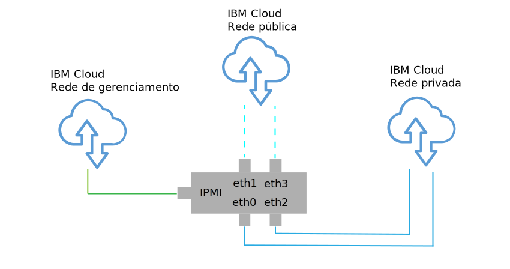
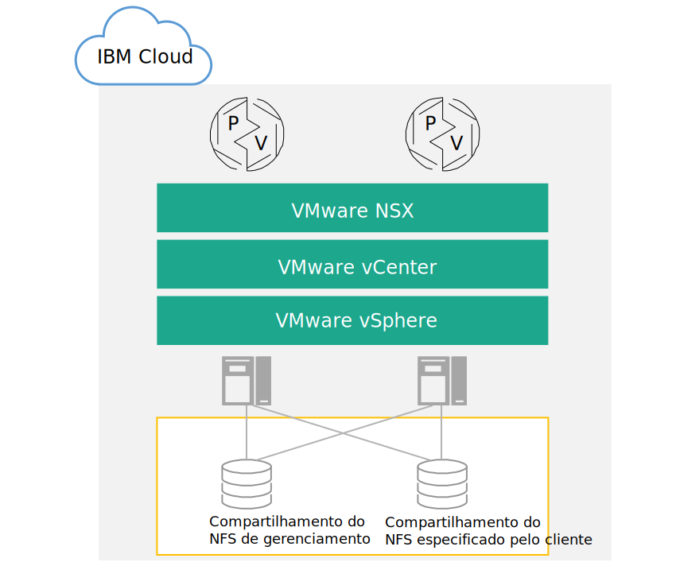

---

copyright:

  years:  2016, 2018

lastupdated: "2018-09-25"

---

# Design da infraestrutura física

A infraestrutura física inclui os componentes a seguir:

<dl class="dl">
  <dt class="dt dlterm">Cálculo físico</dt>
  <dd class="dd">O cálculo físico fornece o processamento físico e a memória que é usada pela infraestrutura de virtualização. Para esse design, os componentes de cálculo são fornecidos pelo {{site.data.keyword.baremetal_long}} e são listados no [VMware Hardware Compatibility Guide (HCG)](https://www.vmware.com/resources/compatibility/search.php).</dd>
  <dt class="dt dlterm">Armazenamento físico</dt>
  <dd class="dd">O armazenamento físico fornece a capacidade de armazenamento bruto usada pela infraestrutura de virtualização. Os componentes de armazenamento são fornecidos pelo {{site.data.keyword.baremetal_short}} ou pela matriz compartilhada do Armazenamento Conectado à Rede (NAS) usando o NFS v3.</dd>
  <dt class="dt dlterm">Rede física</dt>
  <dd class="dd">A rede física fornece a conectividade de rede para o ambiente que é usado, então, pela virtualização de rede. A rede é fornecida pela rede de serviços do {{site.data.keyword.cloud_notm}} e inclui serviços extras, como DNS e NTP.</dd>
</dl>

Para obter mais informações sobre os componentes físicos, veja a Lista de Materiais para a [instância do Cloud Foundation](../../sddc/sd_bom.html) ou [instância do vCenter Server](../../vcenter/vc_bom.html).

Para obter mais informações sobre armazenamento, veja [Arquitetura de armazenamento compartilhado](https://www.ibm.com/cloud/garage/files/AttachedStorageSolutionArchitecture_v1.0.pdf).

## Design do host físico

Host físico refere-se ao {{site.data.keyword.baremetal_short}} no ambiente que entrega recursos de cálculo. O {{site.data.keyword.baremetal_short}} aplicado nesta solução é certificado pelo VMware e listado no [VMware HCG](http://www.vmware.com/resources/compatibility/search.php).

As configurações do servidor disponíveis na solução atendem ou excedem os requisitos mínimos para instalar, configurar e gerenciar o vSphere ESXi. Várias configurações estão disponíveis para satisfazer requisitos diferentes. Para obter a listagem detalhada das especificações exatas usadas para a solução VMware on {{site.data.keyword.cloud_notm}}, veja a Lista de Materiais para a [instância do Cloud Foundation](../../sddc/sd_bom.html) ou [instância do vCenter Server](../../vcenter/vc_bom.html). Observe que o {{site.data.keyword.baremetal_short}} reside no {{site.data.keyword.cloud_notm}}.

Cada instância do Cloud Foundation é iniciada com uma implementação de 4 hosts e cada instância do vCenter Server é iniciada com uma implementação de 3 ou 4 hosts, dependendo da opção de solução de armazenamento.

O host físico emprega dois discos conectados localmente para serem alocados para o hypervisor vSphere ESXi. É possível alocar mais discos usando vSAN, conforme descrito na seção _Design do armazenamento físico_ nesta página ou usando o NetApp ONTAP, conforme descrito em [Arquitetura do NetApp ONTAP Select](https://www.ibm.com/cloud/garage/files/IBM_Cloud_for_VMware_Solutions_NetApp_Architecture.pdf). Cada
host físico tem conexões de rede redundantes de 10 Gbps para o acesso público e privado à rede.

As especificações técnicas do Bare Metal Server são as seguintes:
* CPU: Dual Intel Xeon, configuração variada de núcleo e velocidade
* Memória: configuração variada, 128 GB ou maior
* Rede: 4 x 10 Gbps
* Número de unidades: 2 ou mais

## Design de rede física

Esta seção descreve a rede física que é fornecida pelo {{site.data.keyword.cloud_notm}} e as conexões do host físico (VLANs, MTU) que estão associadas aos hosts físicos.

A rede física do {{site.data.keyword.cloud_notm}} é separada em três redes distintas: pública, privada e de gerenciamento. Para obter uma ilustração das três redes e como elas funcionam, veja [A rede do {{site.data.keyword.cloud_notm}}](https://www.ibm.com/cloud-computing/bluemix/our-network).

### Rede pública

Os {{site.data.keyword.CloudDataCents_notm}} e os pontos de presença (PoPs) da rede têm várias conexões de 1 Gbps ou 10 Gbps com as operadoras de rede de trânsito e de peer da camada superior.

O tráfego de rede externa de qualquer lugar no mundo se conecta ao PoP de rede mais próximo e viaja diretamente na rede para seu data center, minimizando o número de hops e handoffs de rede entre os provedores.

Dentro do data center, o {{site.data.keyword.cloud_notm}} fornece 1 Gbps ou 10 Gbps de largura da banda de rede para servidores individuais por meio de um par de Front-end Customer Switches (FCS) separados, agregados por peer. Esses comutadores agregados são anexados a um par de Front-end Customer Routers (FCR) separados para rede L3.

Esse design multicamada permite que a rede seja escalada em racks, linhas e pods dentro de um {{site.data.keyword.CloudDataCent_notm}}.

### Rede Privada

Todos os {{site.data.keyword.CloudDataCents_notm}} e PoPs são conectados por um backbone de rede privada. A rede privada é separada da rede pública e permite a conectividade com serviços em {{site.data.keyword.CloudDataCents_notm}} ao redor do mundo. A movimentação de dados entre os {{site.data.keyword.CloudDataCents_notm}} é feita por meio de várias conexões de 10 Gbps ou 40 Gbps com a rede privada.

Semelhante à rede pública, a rede privada tem multicamadas nesses servidores e outros componentes de infraestrutura são conectados a Back-end Customer Switches (BCS) agregados. Esses comutadores agregados são anexados a um par de Back-end Customer Routers (BCR) separados para rede L3. A rede privada também suporta a capacidade de usar quadros jumbo (MTU 9000) para conexões de host físico.

### Rede de gerenciamento

Além das redes públicas e privadas, cada servidor {{site.data.keyword.cloud_notm}} é conectado a uma rede de gerenciamento fora da banda. Essa rede de gerenciamento, acessível via VPN, permite acesso do Intelligent Platform Management Interface (IPMI) ao servidor independentemente de sua CPU, do firmware e do sistema operacional para propósitos de manutenção e administração.

### Blocos IP primários e portáteis

O {{site.data.keyword.cloud_notm}} aloca dois tipos de endereços IP para serem usados dentro da infraestrutura do {{site.data.keyword.cloud_notm}}:
* Os endereços IP primários são designados a dispositivos, ao Bare Metal e a servidores virtuais provisionados pelo {{site.data.keyword.cloud_notm}}. Você não deve designar nenhum endereço IP nesses blocos.
* Os endereços IP móveis são fornecidos para você designar e gerenciar conforme necessário.

Os endereços IP primário ou móvel podem se tornar roteáveis para qualquer VLAN dentro da conta do cliente quando o **VLAN Spanning** está ativado dentro do {{site.data.keyword.slportal}} ou a conta está configurada como uma conta do **Virtual Routing and Forwarding (VRF)**.

### VLAN Spanning

**VLAN Spanning** é uma configuração da conta do {{site.data.keyword.slportal}} que permite que os blocos de IP de sub-rede primário e móvel de todas as VLANs dentro da conta sejam roteáveis entre si. Quando a configuração do **VLAN Spanning** estiver desativada, os blocos de IP ainda poderão rotear para os serviços do {{site.data.keyword.cloud_notm}}, mas não entre si.

Para permitir a conexão transparente entre várias sub-redes em que os componentes da solução residem, é necessário ativar o **VLAN Spanning** na conta do {{site.data.keyword.slportal}} na qual as instâncias do Cloud Foundation e do vCenter Server são implementadas.

### Virtual Routing and Forwarding (VRF)

Também é possível configurar a conta do {{site.data.keyword.slportal}} como uma conta do VRF para fornecer funcionalidade semelhante ao VLAN Spanning, permitindo o roteamento automático entre blocos de IP de sub-rede. Todas as contas com conexões de Link direto devem ser convertidas ou criadas como uma conta do VRF.

O console do {{site.data.keyword.vmwaresolutions_short}} não pode detectar se o VRF está ativado no {{site.data.keyword.slportal}}. Você receberá um aviso que o faz lembrar de que ativou o **VLAN Spanning** ou o VRF em sua conta do {{site.data.keyword.slportal}}.

### Conexões físicas do host

Cada host físico no design tem dois pares redundantes de conexões Ethernet de 10 Gbps em cada comutador Top of Rack (ToR) (público ou privado) do {{site.data.keyword.cloud_notm}}. Os adaptadores são configurados como conexões individuais (sem limites) para um total de conexões de 4 x 10 Gbps. Isso permite que as conexões de placa da interface de rede (NIC) funcionem independentemente umas das outras.

Figura 1. Conexões NIC do host físico

### VLANs

As ofertas do {{site.data.keyword.vmwaresolutions_short}} são projetadas com 3 VLANs, uma pública e duas privadas, designadas na implementação. Conforme mostrado na Figura 2, a VLAN pública é designada ao eth1 e eth3 e as VLANs privadas são designadas ao eth0 e eth2.

A primeira VLAN privada e a pública criadas e designadas nesse design são não identificadas por padrão dentro do {{site.data.keyword.cloud_notm}}. A VLAN privada adicional é truncada nas portas do comutador físico e identificada dentro dos grupos de portas do VMware que estão usando essas sub-redes.

A rede privada consiste em duas VLANs dentro desse design. Três sub-redes são alocadas para a primeira dessas VLANs (aqui designada VLAN privada A):
* A primeira sub-rede é um intervalo de sub-rede privada de IP primário que o {{site.data.keyword.cloud_notm}} designa aos hosts físicos.
* A segunda sub-rede é usada para máquinas virtuais de gerenciamento, como o vCenter Server Appliance e o Platform Services Controller.
* A terceira sub-rede é usada para os VXLAN Tunnel Endpoints (VTEPs) designados a cada host por meio do VMware NSX Manager.

Além da VLAN privada A, existe uma segunda VLAN privada (aqui designada como VLAN privada B) para suportar recursos do VMware, como vSAN e vMotion, e para conectividade com o armazenamento conectado à rede (NAS). Como tal, a VLAN é dividida em duas ou três sub-redes móveis.

* A primeira sub-rede é designada a um grupo de portas do kernel para o tráfego vMotion.
* As sub-redes restantes são usadas para o tráfego de armazenamento:
   * Ao usar o vSAN, uma sub-rede é designada a grupos de portas do kernel que são usados para tráfego vSAN.
   * Ao usar o NAS, uma sub-rede é designada a um grupo de portas que é dedicado ao tráfego NFS.

Todas as sub-redes configuradas como parte de uma implementação automatizada do vCenter Server ou do Cloud Foundation usam os intervalos gerenciados do {{site.data.keyword.cloud_notm}}. Isso é para assegurar que qualquer endereço IP possa ser roteado para qualquer data center dentro da conta do {{site.data.keyword.cloud_notm}} quando você precisar da conexão agora ou no futuro.

Tudo isso é resumido na Tabela 1.

Tabela 1. Resumo de VLAN e sub-rede

| VLAN | Tipo | Descrição |
|:---- |:---- |:----------- |
| Público| Primário  | Designada a hosts físicos para acesso à rede pública. Não usada na implementação inicial. |
| Privado A | Primário  | Sub-rede única designada a hosts físicos designados pelo {{site.data.keyword.cloud_notm}}. Usada pela interface de gerenciamento para o tráfego de gerenciamento do vSphere. |
| Privado A | Portable | Sub-rede única designada a máquinas virtuais funcionando como componentes de gerenciamento |
| Privado A | Portable | Sub-rede única designada ao NSX VTEP |
| Privado B | Portable | Sub-rede única designada para vSAN, se em uso |
| Privado B | Portable | Sub-rede única designada para o NAS, se em uso |
| Privado B | Portable | Sub-rede única designada para vMotion |

Nesse design, todos os hosts e máquinas virtuais suportados por VLAN são configurados para apontar para o roteador do cliente de “rede privada” de backend do {{site.data.keyword.cloud_notm}} como a rota padrão. Embora as instâncias do vCenter Server e do Cloud Foundation permitam o uso de Rede Definida por Software (SDN), as sobreposições de rede criadas em uma instância do VMware que incluem roteamento para sub-redes internas não são conhecidas pelos roteadores gerenciados pelo {{site.data.keyword.cloud_notm}}. Portanto, talvez seja necessário criar rotas estáticas na instância do VMware em alguns ou em todos os componentes de gerenciamento.

As conexões de rede privada são configuradas para usar um tamanho de MTU de quadro gigante de 9000 para melhorar o desempenho de grandes transferências de dados, como armazenamento e vMotion. Esta é a MTU máxima que é permitida dentro do VMware e pelo {{site.data.keyword.cloud_notm}}. As conexões de rede pública usam uma MTU Ethernet padrão de 1500. Isso deve ser mantido, uma vez que qualquer mudança pode causar a fragmentação do pacote pela Internet.

## Design de armazenamento físico

O design de armazenamento físico consiste na configuração dos discos físicos que são instalados nos hosts físicos e na configuração do armazenamento de nível de arquivo compartilhado. Isso inclui os discos do sistema operacional do hypervisor do vSphere ESXi e aqueles usados para armazenamento das máquinas virtuais (VMs). O armazenamento para VMs pode consistir em discos locais virtualizados pelo VMware vSAN ou em armazenamento de nível de arquivo compartilhado.

### Discos do sistema operacional

O hypervisor do vSphere ESXi foi projetado para ser instalado em um local persistente. Como resultado, os hosts físicos contêm dois discos SATA de 1 TB na configuração RAID-1 para suportar redundância para o hypervisor do vSphere ESXi.

### Armazenamento de máquina virtual

Esse design permite a opção de usar o VMware vSAN ou armazenamento de nível de arquivo compartilhado como o armazenamento de dados primário para VMs.

### discos vSAN

Quando usados, o VMware vSAN é configurado usando uma configuração totalmente em flash. Esse design permite várias opções de configuração, incluindo chassis 2U e 4U, além de vários números e tamanhos de disco. Todas as configurações usam dois grupos de discos vSAN, com um solid-state disk (SSD) para cache e um ou mais SSDs para capacidade. Todas as unidades alocadas para o consumo de vSAN são configuradas no RAID-0 de disco único.

Para obter mais informações sobre as configurações suportadas, consulte a Lista de materiais para a [instância do Cloud Foundation](../../sddc/sd_bom.html) ou a [instância do vCenter Server](../../vcenter/vc_bom.html).

### Armazenamento de nível de arquivo compartilhado entre hosts

Ao usar o armazenamento em nível de arquivo compartilhado, um compartilhamento NFS de 2 TB é conectado aos hosts que compõem o cluster inicial do VMware. Esse compartilhamento, conhecido como o compartilhamento de gerenciamento, é usado para componentes de gerenciamento, como o VMware vCenter Server, o Platform Services Controller e o VMware NSX. O armazenamento é conectado usando o protocolo NFSv3 e pode suportar até 4000 IOPS.

Figura 2. Compartilhamentos do NFS conectados à implementação do VMware

É possível alocar e montar mais compartilhamentos de arquivos para as cargas de trabalho no momento da compra ou posteriormente no console. É possível selecionar entre as opções de capacidade de armazenamento de arquivo do {{site.data.keyword.cloud_notm}} Endurance disponíveis e as camadas de desempenho no {{site.data.keyword.CloudDataCent_notm}} correspondente. Todos os compartilhamentos são conectados usando o protocolo NFSv3. Além disso, é possível anexar compartilhamentos de arquivo NFSv3 ao aplicar a oferta NetApp ONTAP Select.

Os {{site.data.keyword.CloudDataCents_notm}} que oferecem a camada de desempenho de 10 IOPS/GB também incluem criptografia de dados em repouso (criptografia AES-256) gerenciada pelo provedor e são submetidos a backup pelo armazenamento totalmente em flash. A camada de desempenho de 10 IOPS/GB é limitada a uma capacidade máxima de 4 TB. Para obter mais informações sobre o NAS compartilhado usado nesta solução, consulte [Arquitetura de armazenamento compartilhado](https://www.ibm.com/cloud/garage/files/AttachedStorageSolutionArchitecture_v1.0.pdf).

### Links relacionados

* [Lista de materiais do Cloud Foundation](../../sddc/sd_bom.html)
* [Lista de materiais do vCenter Server](../../vcenter/vc_bom.html)
* [Arquitetura de armazenamento compartilhado](https://www.ibm.com/cloud/garage/files/AttachedStorageSolutionArchitecture_v1.0.pdf)
* [Arquitetura do NetApp ONTAP Select](https://www.ibm.com/cloud/garage/files/IBM_Cloud_for_VMware_Solutions_NetApp_Architecture.pdf)
