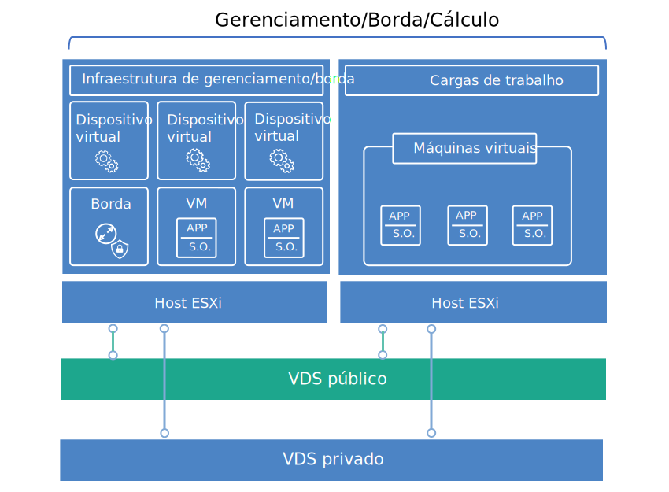

---

copyright:

  years:  2016, 2018

lastupdated: "2018-10-29"

---

{:tip: .tip}
{:note: .note}
{:important: .important}

# Design de infraestrutura virtual

A camada de infraestrutura virtual inclui os componentes de software do VMware que virtualizam os recursos de cálculo, armazenamento e rede fornecidos na camada de infraestrutura física: VMware vSphere ESXi, VMware NSX e, opcionalmente, VMware vSAN.

## Design do VMware vSphere

A configuração do vSphere ESXi consiste nos aspectos a seguir:
* Configuração de inicialização
* Sincronização de
* Acesso ao host
* Acesso de usuário
* Configuração de DNS

A Tabela 1 descreve as especificações para cada aspecto. Após a configuração e instalação do ESXi, o host é incluído em um VMware vCenter Server e é gerenciado de lá.

Com esse design, é possível acessar os hosts virtuais por meio do Direct Console User Interface (DCUI), do ESXi Shell e do Shell Seguro (SSH).

Por padrão, os únicos usuários que podem efetuar login diretamente são os usuários _raiz_ e _ibmvmadmin_ para a máquina física do host. O administrador pode incluir usuários do domínio do Microsoft Active Directory (MSAD) para permitir o acesso de usuário ao host. Todos os hosts no design da solução vCenter Server estão configurados para sincronizar com um servidor NTP central.

Tabela 1. Configuração do vSphere ESXi

| Atributo              | Parâmetro de configuração |
|:---------------------- |:----------------------- |
| Local de inicialização ESXi     | Usa discos locais que são configurados no RAID-1 |
| Sincronização de   | Usa  {{site.data.keyword.cloud}}  servidor NTP |
| Acesso ao host            | Suporta DCUI, Shell ESXi ou SSH |
| Acesso de usuário            | Autenticação local e MSAD |
| Resolução do nome de domínio | Usa o DNS conforme descrito em [Design de serviços comuns](design_commonservice.html). |

O cluster do vSphere hospeda as máquinas virtuais (VMs) que gerenciam a nuvem central e os recursos de cálculo para cargas de trabalho do usuário.

Para instâncias do Cloud Foundation:
* Uma instância contém 4 hosts ESXi na implementação inicial.
* É possível aumentar a capacidade até um máximo de 32 hosts ESXi após a implementação.

Para instâncias do vCenter Server:
* Quando uma instância usa somente NFS, o número mínimo de hosts ESXi na implementação inicial é 2, mas 3 é recomendado para HA. É possível escalar até um máximo de 59 hosts ESXi durante ou após a implementação inicial.
* Quando uma instância usa vSAN, o número mínimo de hosts ESXi na implementação inicial é 4. É possível escalar até um máximo de 59 hosts ESXi durante ou após a implementação inicial.

Para suportar mais cargas de trabalho do usuário, é possível escalar o ambiente da seguinte forma:  
* Implementando mais hosts de cálculo de clusters existentes
* Implementando mais clusters que são gerenciados pelo mesmo vCenter Server Appliance
* Implementando novas instâncias do vCenter Server ou do Cloud Foundation com seu próprio dispositivo vCenter Server

Para obter mais informações sobre clusters, consulte [{{site.data.keyword.cloud_notm}} executando o documento de arquitetura de solução de clusters VMware](https://www.ibm.com/cloud/garage/files/IBM-Cloud-for-VMware-Solutions-Multicluster-Architecture.pdf).

## Design do VMware vSAN

Nesse design, o armazenamento do VMware vSAN é empregado em instâncias do Cloud Foundation e, opcionalmente, em instâncias do vCenter Server para fornecer armazenamento compartilhado para os hosts do vSphere.

Conforme mostrado na Figura 1, o vSAN agrega o armazenamento local em múltiplos hosts ESXi dentro de um cluster do vSphere e gerencia o armazenamento agregado como um único armazenamento de dados da VM. Dentro desse design, os nós de cálculo contêm unidades de disco locais para o S.O. ESXi e o armazenamento de dados vSAN. Independentemente do nó ao qual o cluster pertence, duas unidades SATA de 1 TB
estão incluídas em cada nó para abrigar a instalação do ESXi.

Figura 1. Conceito vSAN

O vSAN emprega os componentes a seguir:
* O design do vSAN de grupo de dois discos; cada grupo de disco com dois ou mais discos. Um SSD do menor tamanho no grupo serve como a camada de cache e os SSDs restantes servem como a camada de capacidade.
* O controlador RAID integrado é configurado para cada unidade, exceto para as duas unidades de S.O., no nível do RAID-0.
* Um único armazenamento de dados do vSAN é criado a partir de todo o armazenamento.

Os recursos disponíveis do vSAN dependem da edição de licença que você seleciona ao pedir a instância. Para obter mais informações, veja [Comparação de edição do VMware vSAN](appendix.html#vmware-vsan-edition-comparison).

### Configuração de rede virtual para vSAN

Para esse design, o tráfego do vSAN atravessa entre hosts ESXi em uma VLAN privada dedicada. Os dois adaptadores de rede conectados ao comutador de rede privada são configurados no vSphere como um vSphere Distributed Switch (vDS) com os dois adaptadores de rede como uplinks. Um grupo de portas do kernel do vSAN dedicado que é configurado para a VLAN vSAN reside dentro do vDS. Quadros gigantes (MTU 9000) são ativados para o vDS privado.

O vSAN não carrega o tráfego de balanceamento entre uplinks. Como resultado, um adaptador está ativo enquanto o outro está em espera para suportar a alta disponibilidade (HA). A política de failover de rede para vSAN é configurada como **Failover explícito** entre portas de rede física.

Para obter mais informações sobre conexões NIC físicas, veja a Figura 2. Conexões NIC físicas do host em [Design de infraestrutura física](design_physicalinfrastructure.html).

### Design de política de armazenamento

Quando o vSAN está ativado e configurado, as políticas de armazenamento são configuradas para definir as características de armazenamento da VM. As características de armazenamento especificam níveis diferentes de serviço para VMs diferentes.

A política de armazenamento padrão nesse design tolera uma única falha. A política padrão é configurada com a codificação de apagamento do RAID 5, com o **Método de tolerância a falhas** configurado como **RAID-5/6 (codificação de apagamento) - Capacidade** e **Nível primário de falhas** configurado como 1.

A configuração do RAID 5 requer um mínimo de quatro hosts. Como alternativa, é possível escolher a configuração do RAID 6 com o **Método de tolerância a falhas** configurado como **RAID-5/6 (codificação de apagamento) - Capacidade** e **Nível primário de falhas** configurado como 2.

A configuração do RAID 6 requer um mínimo de seis hosts. A **duplicação** e a **compactação** também são ativadas na política de armazenamento padrão.

Uma instância usa a política padrão, a menos que especificado de outra forma por meio do console do vSphere. Quando uma política customizada for configurada, o vSAN garantirá isso quando possível. No entanto, se a política não puder ser garantida, não será possível provisionar uma VM que use a política, a menos que a política esteja ativada para forçar o fornecimento.

As políticas de armazenamento devem ser reaplicadas após a inclusão de novos hosts ESXi ou correção dos hosts ESXi.

### Configurações do vSAN

As configurações do vSAN são definidas com base nas melhores práticas para implementar soluções do VMware no {{site.data.keyword.cloud_notm}}. As configurações de vSAN incluem configurações de SIOC, grupo de portas de configurações de failover explícitas e configurações de cache de disco.
* Configurações de política de cache de SSD: No **Read Ahead**, **Write Through**, **Direct** (NRWTD)
* Configurações de controle de E/S de rede
   * Gerenciamento-20 compartilhamentos
   * Máquina virtual-30 compartilhamentos
   * vMotion-50 compartilhamentos
   * compartilhamentos do vSAN-100
* Portas do kernel vSAN:  ** Failover Explícito **

## Design do VMware NSX

A virtualização de rede fornece uma sobreposição de rede que existe dentro da camada virtual. A virtualização de rede fornece a arquitetura com recursos, tais como fornecimento rápido, implementação, reconfiguração e destruição de redes virtuais sob demanda. Esse design usa o vDS e o VMware NSX for vSphere para implementar a rede virtual.

Nesse design, o NSX Manager é implementado no cluster inicial. O NSX Manager é designado a um endereço IP suportado pela VLAN por meio bloco de endereço móvel privado, que é designado para componentes de gerenciamento e configurado com os servidores DNS e NTP que são apresentados em [Design de serviços comuns](design_commonservice.html). O NSX Manager é instalado com as especificações listadas na Tabela 2.

Tabela 2. Atributos do NSX Manager

| Atributo       | Especificação |
|:--------------- |:------------- |
| Gerenciador NSX     | Dispositivo Virtual |
| Número de vCPUs | 4 |
| Memória          | 16 GB |
| Disco            | 60 GB no compartilhamento do NFS de gerenciamento |
| Tipo de Disco       | Thin-provisioned |
| Rede         | **Privada A** móvel designada a componentes de gerenciamento |

A figura a seguir mostra o posicionamento do NSX Manager em relação a outros componentes na arquitetura.

Figura 2. Visão geral da rede do NSX Manager

Após a implementação inicial, a automação do {{site.data.keyword.cloud_notm}} implementa três controladores NSX dentro do cluster inicial. Cada um dos controladores é designado a um endereço IP suportado pela VLAN por meio da sub-rede móvel **Privada A** que está designada aos componentes de gerenciamento. Além disso, o design cria regras de antiafinidade VM-VM para separar os controladores entre os hosts no cluster. O cluster inicial deve conter um mínimo de três nós para assegurar alta disponibilidade para os controladores.

Além dos controladores, a automação do {{site.data.keyword.cloud_notm}} prepara os hosts vSphere implementados com o NSX VIBS para permitir o uso de uma rede virtualizada por meio de VXLAN Tunnel Endpoints (VTEPs). Os VTEPs são designados a um endereço IP suportado pela VLAN por meio do intervalo de endereço IP móvel **Privado A** que é especificado para VTEPs conforme listado na *Tabela 1. Resumo de VLAN e sub-rede* em [Design de infraestrutura física](design_physicalinfrastructure.html). O tráfego de VXLAN reside na VLAN não identificada e é designado ao vDS privado.

Em seguida, um conjunto de IDs de segmento é designado e os hosts no cluster são incluídos na zona de transporte. Somente unicast é usado na zona de transporte porque o rastreamento do Internet Group Management Protocol (IGMP) não está configurado dentro do {{site.data.keyword.cloud_notm}}.

Depois disso, os pares do NSX Edge Services Gateway são implementados. Em todos os casos, um par de gateways é usado para o tráfego de saída dos componentes de automação que residem na rede privada. Para o vCenter Server, um segundo gateway conhecido como a borda gerenciada pelo cliente é implementado e configurado com um uplink para a rede pública e uma interface que está designada à rede privada. Para obter mais informações sobre os Gateways do NSX Edge Services que são implementados como parte da solução, consulte [NSX Edge na arquitetura da solução {{site.data.keyword.cloud_notm}}](https://www.ibm.com/cloud/garage/files/IBM_Cloud_for_VMware_Solutions_NSX_Edge_Services_Gateway.pdf).

Os administradores em nuvem podem configurar quaisquer componentes NSX necessários, como o Distributed Logical Router (DLR), os comutadores lógicos e os firewalls. Os recursos do NSX disponíveis dependem da edição de licença do NSX escolhida ao pedir a instância. Para obter mais informações, veja [Comparação de edição do VMware NSX Edition](appendix.html#vmware-nsx-edition-comparison). Para instâncias do vCenter Server, a automação do {{site.data.keyword.cloud_notm}} inclui o vCenter Server Appliance e o Platform Services Controller (PSC)
na lista de exclusão de firewall distribuída do NSX Manager.

### Design do comutador distribuído

O design usa um número mínimo de Comutadores vDS. Os hosts no cluster são conectados às redes pública e privada. Os hosts são configurados com dois comutadores virtuais distribuídos. O uso de dois comutadores segue a prática de rede do {{site.data.keyword.cloud_notm}} que separa as redes pública e privada. O diagrama a seguir mostra o design do vDS.

Figura 3. Design do comutador distribuído

Conforme mostrado na figura, um vDS é configurado para conectividade de rede pública (SDDC-Dswitch-Public) e o outro vDS é configurado para conectividade de rede privada (SDDC-Dswitch-Private).

A separação de diferentes tipos de tráfego é necessária para reduzir a contenção e a latência e aumentar a segurança. As VLANs são usadas para segmentar funções de rede física.

Esse design usa três VLANs: duas para tráfego de rede privada e uma para tráfego de rede pública. A tabela a seguir mostra a separação de tráfego.

Tabela 3. Mapeamento de VLAN para tipos de tráfego

| VLAN  | Designação | Tipo de tráfego |
|:----- |:----------- |:------------ |
| VLAN1 | Público      | Disponível para acesso à Internet |
| VLAN2 | Privado A   | Gerenciamento de ESXi, gerenciamento, VXLAN (VTEP) |
| VLAN3 | Privado B   | vSAN, NFS, vMotion |

O tráfego de cargas de trabalho circulará em comutadores lógicos suportados pelo VXLAN.

O cluster do vSphere usa dois vSphere Distributed Switches que são configurados como nas tabelas a seguir. 

Tabela 4. Comutadores distribuídos de cluster convergido

| vSphere Distributed Nome do comutador | Função | Rede Controle de E/S | Balanceamento de Car Modo | NIC Físico Portas | MTU |
|:------------- |:------------- |:------------- |:------------- |:------------- |:------------- |
| SDDC-Dswitch-Privado | Gerenciamento do ESXi, vSAN, vSphere vMotion, terminal de túnel VXLAN, NFS (VTEP) | Ativado | Rota com base em failover explícito (vSAN, vMotion) originando porta virtual (tudo o mais) | 2 | 9.000 (Molduras Jumbo) |
| SDDC-Dswitch-Public | Tráfego de gerenciamento externo (norte-sul) | Ativado | Rota com base na porta virtual de origem | 2 | 1.500 (padrão) |

Os nomes, o número e a ordenação dos NICs do host podem variar dependendo do {{site.data.keyword.CloudDataCent_notm}} e da seleção de hardware do host.
{:note}

Tabela 5. Definições de configuração de grupo de portas do comutador distribuído de cluster convergido

| Parâmetro          | Configuração       |
|:------------------ |:------------- |
| Balanceamento de     | Rota baseada na porta virtual de origem \* |
| Detecção de Failover | Somente status do link |
| Notificar comutadores    | Ativado |
| Failback           | Não |
| Ordem de Failover     | Uplinks ativos: Uplink1, Uplink2 \* |

\ * O grupo de portas do vSAN usa failover explícito com ativo ou espera porque ele não suporta o balanceamento de carga do tráfego de armazenamento vSAN.
{:note}

Tabela 6. Grupos de portas do comutador virtual de cluster convergido e VLANs

| Comutador distribuído vSphere | Nome do grupo de portas | Equipe | Uplinks | ID de VLAN |
|:------------- |:------------- |:------------- |:------------- |:---------- |
| SDDC-Dswitch-Privado | SDDC-DPortGroup-Mgmt | Porta virtual de origem | Ativo: 0, 1 | VLAN1 |
| SDDC-Dswitch-Privado | SDDC-DPortGroup-vMotion | Porta virtual de origem | Ativo: 0, 1 | VLAN2 |
| SDDC-Dswitch-Privado | SDDC-DPortGroup-VSAN | Failover explícito | Ativo: 0 Standby: 1 | VLAN2 |
| SDDC-Dswitch-Privado | SDDC-DPortGroup-NFS | Porta virtual de origem | Ativo: 0, 1 | VLAN2 |
| SDDC-Dswitch-Privado | Gerado Automaticamente pelo NSX | Porta virtual de origem | Ativo: 0, 1 | VLAN1 |
| SDDC-Dswitch-Public | SDDC-DPortGroup-External | Porta virtual de origem | Ativo: 0, 1 | VLAN3 |

Tabela 7. Adaptadores de kernel da VM de cluster convergido

| Comutador distribuído vSphere | Propósito | Grupo de portas conectadas | Serviços Ativados | MTU |
|:-------------------------- |:------- |:-------------------- |:---------------- |:--- |
| SDDC-Dswitch-Privado | Gerenciamento | SDDC-DPortGroup-Mgmt | Tráfego de | 1.500 (padrão) |
| SDDC-Dswitch-Privado | vMotion | SDDC-DPortGroup-vMotion | Tráfego vMotion | 9.000 |
| SDDC-Dswitch-Privado | VTEP | *Gerado automaticamente pelo NSX* | \- | 9.000 |
| SDDC-Dswitch-Privado | VSAN | SDDC-DPortGroup-VSAN | vSAN | 9.000 |
| SDDC-Dswitch-Privado | NAS | SDDC-DPortGroup-NFS | \-  | 9.000 |

### Configuração do NSX

Esse design especifica a configuração de componentes NSX, mas não aplica nenhuma configuração de componente de sobreposição de rede. É possível projetar a sobreposição de rede com base em suas necessidades. Os aspectos a seguir são pré-configurados:

* Os servidores de gerenciamento e controladores são instalados e integrados à IU da web do vCenter
* Os agentes ESXi são instalados e os endereços IP do VTEP são configurados por host ESXi
* Configuração do VTEP, configuração do controlador e configuração de VXLAN (zona de transporte)
* Dispositivos NSX Edge Services Gateway para uso por componentes de gerenciamento
* Somente para instâncias do vCenter Server: dispositivos NSX Edge Services Gateway para uso do cliente

Os aspectos a seguir não estão configurados:
* Roteadores distribuídos virtuais
* Micro segmentação
* VXLANs
* Gerenciamento do NSX vinculado para outras instâncias do VMware

### Links relacionados

* [ {{site.data.keyword.cloud_notm}}  executando a arquitetura de solução de clusters VMware ](https://www.ibm.com/cloud/garage/files/IBM-Cloud-for-VMware-Solutions-Multicluster-Architecture.pdf)
* [ NSX Edge na  {{site.data.keyword.cloud_notm}}  arquitetura da solução ](https://www.ibm.com/cloud/garage/files/IBM_Cloud_for_VMware_Solutions_NSX_Edge_Services_Gateway.pdf)
