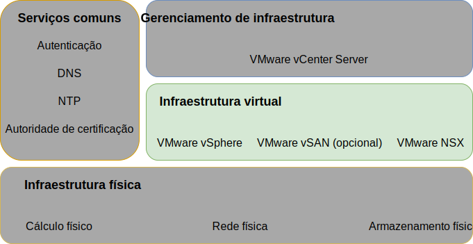
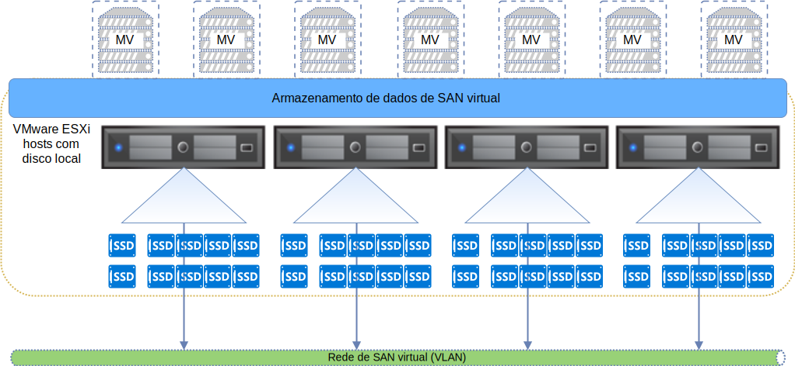
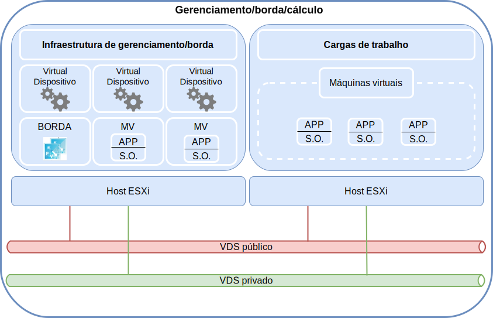

---

copyright:

  years:  2016, 2019

lastupdated: "2019-03-19"

subcollection: vmwaresolutions

---

{:tip: .tip}
{:note: .note}
{:important: .important}

# Design de infraestrutura virtual
{: #design_virtualinfrastructure}

A camada de infraestrutura virtual inclui os componentes de software do VMware que virtualizam os recursos de cálculo, armazenamento e rede fornecidos na camada de infraestrutura física: VMware vSphere ESXi, VMware NSX-V ou NSX-T e, opcionalmente, VMware vSAN.

Figura 1. Infraestrutura virtual 

## Design do VMware vSphere
{: #design_virtualinfrastructure-vsphere-design}

A configuração do vSphere ESXi consiste nos aspectos a seguir:
* Configuração de inicialização
* Sincronização de
* Acesso ao host
* Acesso de usuário
* Configuração de DNS

A tabela a seguir descreve as especificações para cada aspecto. Após a configuração e instalação do ESXi, o host é incluído em um VMware vCenter Server e é gerenciado de lá.

Com esse design, é possível acessar os hosts virtuais por meio do Direct Console User Interface (DCUI), do ESXi Shell e do Shell Seguro (SSH).

Por padrão, os únicos usuários que podem efetuar login diretamente são os usuários _raiz_ e _ibmvmadmin_ para a máquina física do host. O administrador pode incluir usuários do domínio do Microsoft Active Directory (MSAD) para permitir o acesso de usuário ao host. Todos os hosts no design da solução vCenter Server estão configurados para sincronizar com um servidor NTP central.

Tabela 1. Configuração do vSphere ESXi

| Atributo              | Parâmetro de configuração |
|:---------------------- |:----------------------- |
| Local de inicialização ESXi     | Usa discos locais que são configurados no RAID-1 |
| Sincronização de   | Usa  {{site.data.keyword.cloud}}  servidor NTP |
| Acesso ao host            | Suporta o DCUI, o ESXi Shell ou o SSH, se ativado |
| Acesso de usuário            | Autenticação local e MSAD |
| Resolução do nome de domínio | Usa o DNS conforme descrito em [Design de serviços comuns](/docs/services/vmwaresolutions/archiref/solution?topic=vmware-solutions-design_commonservice). |
| Modo EVC | Skylake (somente para implementações "greenfield" do vSphere 6.7) |

O cluster do vSphere hospeda as máquinas virtuais (VMs) que gerenciam a instância do vCenter Server, bem como recursos de cálculo para cargas de trabalho do usuário.

* Quando uma instância do vCenter Server usa a vSAN, o número mínimo de hosts do ESXi na implementação inicial é 4.
* Quando uma instância do vCenter Server usa o armazenamento de nível de arquivo compartilhado ou de nível de bloco, o número mínimo de hosts do ESXi na implementação inicial é 3.

É possível escalar até um máximo de 59 hosts ESXi durante ou após a implementação inicial.

Para suportar mais cargas de trabalho do usuário, é possível escalar o ambiente da seguinte forma:  
* Implementando mais hosts de cálculo de clusters existentes
* Implementando mais clusters que são gerenciados pelo mesmo vCenter Server Appliance
* Implementando novas instâncias do vCenter Server com o seu próprio vCenter Server Appliance

Para obter mais informações sobre clusters, consulte [executando a arquitetura de solução de clusters do VMware do {{site.data.keyword.cloud_notm}}](https://www.ibm.com/cloud/garage/files/IBM-Cloud-for-VMware-Solutions-Multicluster-Architecture.pdf).

## Design do VMware vSAN
{: #design_virtualinfrastructure-vsan-design}

Nesse design, o armazenamento do VMware vSAN é empregado em instâncias do vCenter Server para fornecer armazenamento compartilhado para os hosts do vSphere.

Conforme mostrado na figura a seguir, a vSAN agrega o armazenamento local em múltiplos hosts do ESXi dentro de um cluster do vSphere e gerencia o armazenamento agregado como um único armazenamento de dados da VM. Dentro desse design, os nós de cálculo contêm unidades de disco locais para o Sistema operacional do ESXi (S.O.) e o armazenamento de dados da vSAN. Independentemente de a qual cluster um nó pertence, duas unidades do S.O. estão incluídas em cada nó para abrigar a instalação do ESXi.

Figura 2. Conceito da vSAN

O vSAN emprega os componentes a seguir:
* O design do vSAN de grupo de dois discos; cada grupo de disco com dois ou mais discos. Uma unidade de SSD ou NVMe do menor tamanho no grupo serve como a camada de cache e os SSDs restantes servem como a camada de capacidade.
* O controlador RAID integrado é configurado para cada unidade, exceto para as duas unidades do S.O., que são configuradas em uma matriz RAID-0 por unidade.
* Um único armazenamento de dados do vSAN é criado a partir de todo o armazenamento.

Os recursos disponíveis do vSAN dependem da edição de licença que você seleciona ao pedir a instância. Para obter mais informações, veja [Comparação de edição do VMware vSAN](/docs/services/vmwaresolutions/archiref/solution?topic=vmware-solutions-solution-appendix#vmware-vsan-edition-comparison).

### Configuração de rede virtual para vSAN
{: #design_virtualinfrastructure-net-setup}

Para esse design, o tráfego do vSAN atravessa entre hosts ESXi em uma VLAN privada dedicada. Os dois adaptadores de rede conectados ao comutador de rede privada são configurados no vSphere como um vSphere Distributed Switch (vDS) com os dois adaptadores de rede como uplinks. Um grupo de portas do kernel do vSAN dedicado que é configurado para a VLAN vSAN reside dentro do vDS. Quadros gigantes (MTU 9000) são ativados para o vDS privado.

O vSAN não carrega o tráfego de balanceamento entre uplinks. Como resultado, um adaptador está ativo enquanto o outro está em espera para suportar a alta disponibilidade (HA). A política de failover de rede para vSAN é configurada como **Failover explícito** entre portas de rede física.

Para obter mais informações sobre conexões do NIC físicas, consulte [Conexões do NIC do host físico](/docs/services/vmwaresolutions/services?topic=vmware-solutions-design_physicalinfrastructure#design_physicalinfrastructure-host-connect).

### Design de política da vSAN
{: #design_virtualinfrastructure-storage-policy}

Quando o vSAN está ativado e configurado, as políticas de armazenamento são configuradas para definir as características de armazenamento da MV. As características de armazenamento especificam níveis diferentes de serviço para MVs diferentes.

A política de armazenamento padrão nesse design tolera uma única falha. A política padrão é configurada com a codificação de apagamento, com o **Método de tolerância a falhas** configurado como **RAID-5/6 (Codificação de apagamento) - Capacidade** e **Nível primário de falhas** configurado como 1. A configuração do RAID 5 requer um mínimo de quatro hosts.

Como alternativa, é possível escolher a configuração do RAID 6 com o **Método de tolerância a falhas** configurado como **RAID-5/6 (Codificação de apagamento) - Capacidade** e **Nível primário de falhas** configurado como 2. A configuração do RAID 6 requer um mínimo de seis hosts. A **duplicação** e a **compactação** também são ativadas na política de armazenamento padrão.

Uma instância usa a política padrão, a menos que especificado de outra forma por meio do console do vSphere. Quando uma política customizada for configurada, o vSAN garantirá isso quando possível. No entanto, se a política não puder ser garantida, não será possível provisionar uma MV que use a política, a menos que a política esteja ativada para forçar o fornecimento.

As políticas de armazenamento devem ser reaplicadas após a inclusão de novos hosts ESXi ou correção dos hosts ESXi.

### Configurações do vSAN
{: #design_virtualinfrastructure-vsan-sett}

As configurações da vSAN são configuradas com base nas melhores práticas para implementar soluções do VMware no {{site.data.keyword.cloud_notm}}. As configurações de vSAN incluem configurações de SIOC, grupo de portas de configurações de failover explícitas e configurações de cache de disco.
* Configurações de política de cache de SSD: No **Read Ahead**, **Write Through**, **Direct** (NRWTD)
* Configurações de controle de E/S de rede
   * Gerenciamento-20 compartilhamentos
   * Máquina virtual-30 compartilhamentos
   * vMotion-50 compartilhamentos
   * compartilhamentos do vSAN-100
* Portas do kernel vSAN:  ** Failover Explícito **

## Armazenamento conectado à iSCSI
{: #design_virtualinfrastructure-iscsi-storage}

Diferentemente do armazenamento conectado do NFS v3, o armazenamento conectado à iSCSI suporta caminhos ativos-ativos em todas as portas de placa do NIC configuradas e portas de destino. Devido a isso, um rendimento mais alto pode ser alcançado e, portanto, é uma alternativa desejável para o armazenamento de conexão do NFS. Isso vem a um custo de maior complexidade.

{{site.data.keyword.cloud_notm}} O armazenamento de bloco de Endurance suporta apenas um máximo de oito conexões de host por LUN. Isso é destinado a documentar o recurso que será incluído no vCenter Server após a mudança no Q1 devido de armazenamento do Endurance do {{site.data.keyword.cloud_notm}} para permitir conexão por até 64 hosts ou inicializadores de iSCSI, uma vez que cada host do ESXi terá um mínimo de dois iniciadores.

Um LUN da iSCSI de 2 TB é conectado ao vCenter Server para o uso dos componentes de gerenciamento e um mínimo de mais um LUN da iSCSI é configurado para o uso de carga de trabalho do cliente. Esse armazenamento é formatado como o sistema de arquivos do VMFS 6.x por cada LUN.

### Configuração de rede virtual para iSCSI
{: #design_virtualinfrastructure-setup-iscsi}

Para esse design, o tráfego de iSCSI tem permissão para usar ambas as portas de placa do NIC conectadas privadas em uma configuração ativa, ativa. Como o vSphere permite que apenas uma porta de placa do NIC esteja ativa em um grupo da porta específico dentro de um vDS por vez, dois grupos de portas devem ser criados (A e B) na VLAN de armazenamento.

Uma porta do kernel do ESXi é criada com um endereço IP exclusivo em sub-redes individuais para permitir a escalabilidade. Cada porta do kernel é designada ao seu próprio grupo da porta da iSCSI. Ambas as portas do kernel são designadas a um adaptador de barramento de host (HBA) de ISCSI virtual do ESXi. Para cada porta do kernel, o comutador de substituição do GW padrão é empregado para usar o gateway padrão para a sub-rede local para essa porta do kernel. Consulte a tabela a seguir.

Tabela 2. Grupos de portas de iSCSi

vDS Portgroup | Sub-rede da porta do kernel | VMHBA
--|:---|:--
**SDDC-Dprotgroup-iSCSI-A** |Sub-rede A |  vmhba64
**SDDC-Dprotgroup-iSCSI-B** |Sub-rede B | vmhba64

#### Controle de E/S de armazenamento - SIOC
{: #design_virtualinfrastructure-sioc}

O iSCSI LUNS é provisionado e formatado para um único sistema de arquivos do VMFS de arquivo por LUN. A configuração do SIOC recomendada padrão é 90% do rendimento de pico.

## Design do VMware NSX-V
{: #design_virtualinfrastructure-nsx-design}

A virtualização de rede fornece uma sobreposição de rede que existe dentro da camada virtual. A virtualização de rede fornece a arquitetura com recursos, tais como fornecimento rápido, implementação, reconfiguração e destruição de redes virtuais sob demanda. Esse design usa o vDS e o VMware NSX for vSphere para implementar a rede virtual.

Nesse design, o NSX Manager é implementado no cluster inicial. O NSX Manager é designado a um endereço IP suportado pela VLAN por meio bloco de endereço móvel privado, que é designado para componentes de gerenciamento e configurado com os servidores DNS e NTP que são apresentados em [Design de serviços comuns](/docs/services/vmwaresolutions/archiref/solution?topic=vmware-solutions-design_commonservice).

A figura a seguir mostra o posicionamento do NSX Manager em relação a outros componentes na arquitetura.

Figura 3. Visão geral da rede do NSX Manager

Após a implementação inicial, a automação do {{site.data.keyword.cloud_notm}} implementa três controladores NSX dentro do cluster inicial. Cada um dos controladores é designado a um endereço IP suportado pela VLAN por meio da sub-rede móvel **Privada A** que está designada aos componentes de gerenciamento. Além disso, o design cria regras de antiafinidade VM-VM para separar os controladores entre os hosts no cluster. O cluster inicial deve conter um mínimo de três nós para assegurar alta disponibilidade para os controladores.

Além dos controladores, a automação do {{site.data.keyword.cloud_notm}} prepara os hosts vSphere implementados com o NSX VIBS para permitir o uso de uma rede virtualizada por meio de VXLAN Tunnel Endpoints (VTEPs). Os VTEPs são designados com um endereço IP suportado pela VLAN por meio do intervalo de endereços IP móveis **Privados A** que é especificado para VTEPs conforme listado em [VLANs](/docs/services/vmwaresolutions/services?topic=vmware-solutions-design_physicalinfrastructure#design_physicalinfrastructure-vlans). O tráfego de VXLAN reside na VLAN não identificada e é designado ao vDS privado.

Em seguida, um conjunto de IDs de segmento é designado e os hosts no cluster são incluídos na zona de transporte. Somente unicast é usado na zona de transporte porque o rastreamento do Internet Group Management Protocol (IGMP) não está configurado dentro do {{site.data.keyword.cloud_notm}}. Duas portas do kernel do vTEP são configuradas por host na mesma sub-rede dedicada do VTEP por melhor prática de VMW.

Depois disso, os pares do NSX Edge Services Gateway são implementados. Em todos os casos, um par de gateways é usado para o tráfego de saída dos componentes de automação que residem na rede privada. Um segundo gateway que é conhecido como a borda gerenciada pelo cliente é implementado e configurado com um uplink para a rede pública e uma interface que é designada para a rede privada. Para obter mais informações sobre os Gateways do NSX Edge Services que são implementados como parte da solução, consulte [Arquitetura da solução do NSX Edge Services Gateway](/docs/services/vmwaresolutions/services?topic=vmware-solutions-nsx_overview#nsx_overview).

Os administradores em nuvem podem configurar quaisquer componentes NSX necessários, como o Distributed Logical Router (DLR), os comutadores lógicos e os firewalls. Os recursos do NSX disponíveis dependem da edição de licença do NSX escolhida ao pedir a instância. Para obter mais informações, veja [Comparação de edição do VMware NSX Edition](/docs/services/vmwaresolutions/archiref/solution?topic=vmware-solutions-solution-appendix#vmware-nsx-edition-comparison).

O NSX Manager é instalado com as especificações que estão listadas na tabela a seguir.

Tabela 3. Requisitos do NSX Manager

| Atributo       | Especificação |
|:--------------- |:------------- |
| Gerenciador NSX     | Dispositivo Virtual |
| Número de vCPUs | 4 |
| Memória          | 16 GB |
| Disco            | 60 GB no compartilhamento do NFS de gerenciamento |
| Tipo de disco       | Thin-provisioned |
| Rede         | **Privada A** móvel designada a componentes de gerenciamento |

### Design do comutador distribuído
{: #design_virtualinfrastructure-distr-switch}

O design usa um número mínimo de Comutadores vDS. Os hosts no cluster são conectados às redes pública e privada. Os hosts são configurados com dois comutadores virtuais distribuídos. O uso de dois comutadores segue a prática de rede do {{site.data.keyword.cloud_notm}} que separa as redes pública e privada. O diagrama a seguir mostra o design do vDS.

Figura 4. Design do comutador distribuído

Conforme mostrado na figura anterior, um vDS é configurado para a conectividade de rede pública (SDDC-Dswitch-Public) e o outro vDS é configurado para conectividade de rede privada (SDDC-Dswitch-Private). A separação de diferentes tipos de tráfego é necessária para reduzir a contenção e a latência e aumentar a segurança.

As VLANs são usadas para segmentar funções de rede física. Esse design usa três VLANs: duas para tráfego de rede privada e uma para tráfego de rede pública. A tabela a seguir mostra a separação de tráfego.

Tabela 4. Mapeamento de VLAN para tipos de tráfego

| VLAN  | Designação | Tipo de tráfego |
|:----- |:----------- |:------------ |
| VLAN1 | Pública      | Disponível para acesso à Internet |
| VLAN2 | Privada A   | Gerenciamento de ESXi, gerenciamento, VXLAN (VTEP) |
| VLAN3 | Privada B   | vSAN, NFS, vMotion, iSCSI |

O tráfego de cargas de trabalho circulará em comutadores lógicos suportados pelo VXLAN.

O cluster do vSphere usa dois vSphere Distributed Switches que são configurados como nas tabelas a seguir. 

Tabela 5. Comutadores distribuídos de cluster convergido

| vSphere Distributed Nome do comutador | Função | Rede Controle de E/S | Balanceamento de Car Modo | NIC Físico Portas | MTU |
|:------------- |:------------- |:------------- |:------------- |:------------- |:------------- |
| SDDC-Dswitch-Privado | Gerenciamento do ESXi, vSAN, vSphere vMotion, terminal de túnel VXLAN, NFS (VTEP) | Ativado | Rota com base em failover explícito (vSAN, vMotion) originando porta virtual (tudo o mais) | 2 | 9.000 (Molduras Jumbo) |
| SDDC-Dswitch-Public | Tráfego de gerenciamento externo (norte-sul) | Ativado | Rota com base na porta virtual de origem | 2 | 1.500 (padrão) |

Os nomes, o número e a ordenação dos NICs do host podem variar dependendo do {{site.data.keyword.CloudDataCent_notm}} e da seleção de hardware do host.
{:note}

Tabela 6. Definições de configuração de grupo da porta do comutador distribuído do cluster convergido

| Parâmetro          | Configuração       |
|:------------------ |:------------- |
| Balanceamento de     | Rota baseada na porta virtual de origem \* |
| Detecção de Failover | Somente status do link |
| Notificar comutadores    | Ativado |
| Failback           | Não |
| Ordem de Failover     | Uplinks ativos: Uplink1, Uplink2 \* |

\ * O grupo de portas do vSAN usa failover explícito com ativo ou espera porque ele não suporta o balanceamento de carga do tráfego de armazenamento vSAN. Os grupos de portas da iSCSI têm apenas um uplink ativo por vez (iSCSI A - Uplink1, iSCSI B - Uplink 2).
{:note}

Tabela 7. Grupos de portas do comutador virtual de cluster convergido e VLANs, Comutador distribuído **SDDC-Dswitch-Private**

Grupo da porta|Equipe|Uplinks|ID de VLAN
---|---|---|--
SDDC-DPortGroup-Mgmt|Porta virtual de origem|Ativo: 0, 1|VLAN 1
SDDC-DPortGroup-vMotion|Porta virtual de origem|Ativo: 0, 1|VLAN 2
SDDC-DPortGroup-VSAN|Failover explícito|Ativo: 0, Standby: 1|VLAN 2
SDDC-DPortGroup-NFS|Porta virtual de origem|Ativo: 0, 1|VLAN 2
Gerado por NSX|Porta virtual de origem|Ativo: 0,1|VLAN 1
SDDC-DPortGroup-External|Porta virtual de origem|Ativo: 0, 1|VLAN 3
SDDC-DPortGroup-iSCSI-A|Porta virtual de origem|Ativo: 0|VLAN 2
SDDC-DPortGroup-iSCSI-B|Porta virtual de origem|Ativo: 0|VLAN 2

Tabela 8. Adaptadores do VMkernel do cluster convergido, Comutador distribuído **SDDC-Dswitch-Private**

Propósito|Grupo de portas conectadas|Serviços Ativados|MTU
--|---|---|---|--
Gerenciamento|SDDC-DPortGroup-Mgmt|Tráfego de Gerenciamento|1500 (padrão)
vMotion|SDDC-DPortGroup-vMotion|Tráfego de vMotion|9000
VTEP|Gerado por NSX|-|9000
VSAN|SDDC-DPortGroup-VSAN|VSAN|9000
NAS|SDDC-DPortGroup-NFS|NAS|9000
iSCSI|SDDC-DPortGroup-iSCSI-A|iSCSI|9000
iSCSI|SDDC-DPortGroup-iSCSI-B|iSCSI|9000

### Configuração do NSX
{: #design_virtualinfrastructure-nsx-config}

Esse design especifica a configuração de componentes NSX, mas não aplica nenhuma configuração de componente de sobreposição de rede. É possível projetar a sobreposição de rede com base em suas necessidades.

Os aspectos a seguir são pré-configurados:
* Os servidores de gerenciamento e controladores são instalados e integrados à IU da web do vCenter
* Os agentes ESXi são instalados e os endereços IP do VTEP são configurados por host ESXi
* Configuração do VTEP, configuração do controlador e configuração de VXLAN (zona de transporte)
* Dispositivos NSX Edge Services Gateway para uso por componentes de gerenciamento
* Dispositivos do NSX Edge Services Gateway para uso do cliente
* Cargas de trabalho do cliente de trabalho da NSX VXLAN conectadas a um roteador local distribuído (DLR) com uma VXLAN de trânsito entre o DLR e o ESG do cliente.
* Espaço de endereço do RFC 1918 para as VXLANs e espaço de IP móvel privado e público do IBM Cloud para uso como rede de egresso no ESG do cliente.

Os aspectos a seguir não estão configurados:
* Micro segmentação
* Gerenciamento do NSX vinculado para outras instâncias do VMware

Figura 5. Topologia do NSX do cliente de exemplo implementada

## Links relacionados
{: #design_virtualinfrastructure-related}

* [ {{site.data.keyword.cloud_notm}}  executando a arquitetura de solução de clusters VMware ](https://www.ibm.com/cloud/garage/files/IBM-Cloud-for-VMware-Solutions-Multicluster-Architecture.pdf)
* [ Arquitetura da solução do NSX Edge Services Gateway ](/docs/services/vmwaresolutions/services?topic=vmware-solutions-nsx_overview#nsx_overview)
