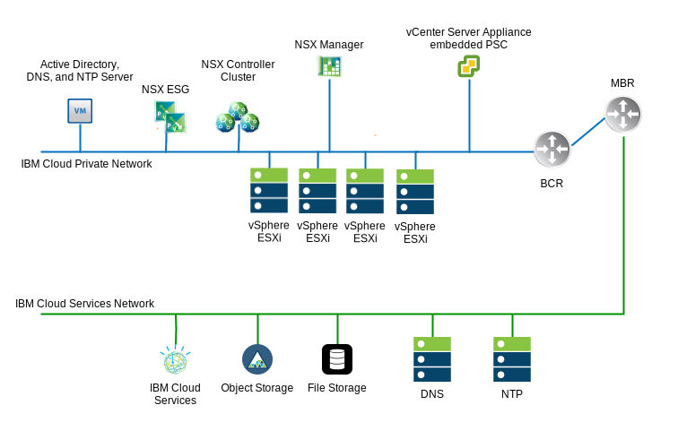
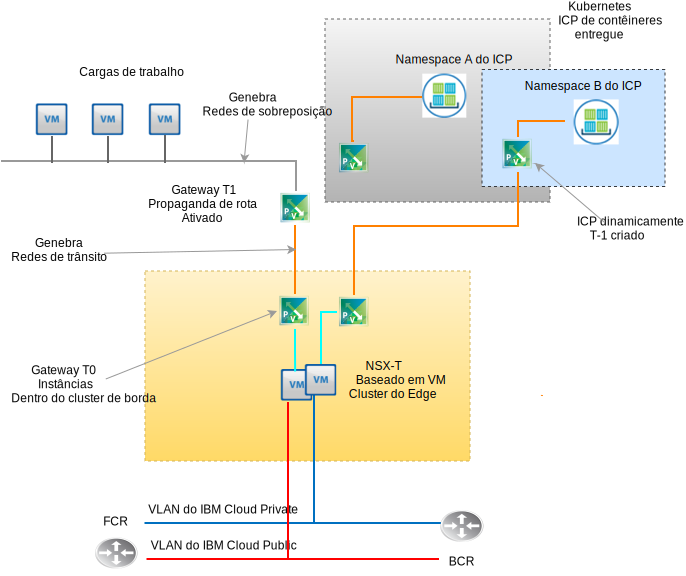

---

copyright:

  years:  2016, 2019

lastupdated: "2019-06-03"

subcollection: vmware-solutions

---

# Design do VMware NSX-T
{: #nsx-t-design}

Diferentemente do NSX-V (NSX on vSphere), o VMware NSX-T é projetado para abordar estruturas de aplicativos e arquiteturas que têm terminais heterogêneos e pilhas de tecnologia. Além do vSphere, esses ambientes podem incluir outros hypervisors, KVM, contêineres e bare metal. O NSX é projetado para abranger uma rede definida pelo software e a infraestrutura de segurança em plataformas diferentes de apenas o vSphere. Embora seja possível implementar componentes do NSX-T sem precisar do vSphere, esse design se concentra no NSX-T e em sua integração principalmente dentro de uma implementação automatizada do vCenter Server vSphere.

Há muitos recursos avançados dentro do NSX-T, como políticas de firewall, inclusão de introspecção de guest dentro de políticas de firewall e rastreamento de fluxo de rede avançado. Descrever esses recursos está além do escopo deste documento. Consulte a documentação do VMware para NSX-T. Nesse design, a Infraestrutura de gerenciamento do NSX-T é implementada durante a implementação inicial do cluster do vCenter Server no lugar do NSX-V.

## NSX-T vs. NSX-V
{: #nsx-t-design-nsx-t-nsx-v}

Para o NSX nativo do vSphere (NSX-V), revise os objetos do NSX-T mais bem conhecidos a seguir com função semelhante aos seus correspondentes do NSX-V. As limitações e as diferenças dentro de um ambiente do vSphere também são discutidas. Aqui está uma tabela de funções geralmente usadas entre T e V que correspondem.

Tabela 1. Terminologia do NSX-V para o NSX-T

NSX-V ou vSphere nativo | NSX-T
--|:---|:--
**Comutador distribuído virtual** | Comutador distribuído virtual de rede (N-VDS)
**Zona de transporte do NSX** | Zona de transporte (sobreposição ou suportado pela VLAN)
**Grupo da porta (vDS)** | Comutador lógico
**VXLAN (encapsulamento L2)** | GENEVE (encapsulamento L2)
**Gateway de borda** | Gateway T0 (mudado desde a v2.4)
**Roteador lógico distribuído** | Gateway T1 (mudado desde a v2.4)
**Servidor do ESXi (vTEP)** | Nó de transporte (Gateway T0 ESXi, KVM, Bare metal)

Há conceitos-chave do NSX-T que não correspondem à função do NSX-V que precisam ser compreendidos para a implementação desse design de NSX-T.

Como a seguir:
- Um cluster de borda é uma ou mais VMs ou máquinas físicas que participam de uma malha virtual do NSX-T. Eles são terminais para as zonas de transporte de rede de sobreposição e as zonas de transporte auxiliadas pela VLAN. Um cluster de borda pode suportar múltiplas instâncias de gateway T-0.
- Um gateway T-0 é uma instância de roteador virtual, mas não uma VM. Múltiplas instâncias de gateway T-0 podem ser executadas dentro de um cluster de borda cada uma com a sua própria tabela de roteamento e funções. Isso significa que um cluster de borda deve existir antes que seja possível criar uma instância de roteador T-0.
- Uma zona de transporte pode abranger os terminais em diferentes plataformas e múltiplas instâncias do vSphere vCenter. Nenhum NSX vinculado do vCenter cruzado é necessário. As zonas de transporte podem ser excluídas de terminais específicos. Um N-VDS é diretamente correlacionado a uma zona de transporte e é criado quando a zona de transporte é criada.
- A ordem de failover de uplink é criada independente de um comutador lógico específico, pois ela é criada em perfis como "Perfis de Uplink" e é aplicada a um comutador lógico específico com base na VLAN. Como é possível ter a necessidade de um pedido de failover diferente ou balanceamento de carga de uplinks físicos para a mesma VLAN, o perfil de uplink para uma determinada VLAN poderá conter múltiplas entradas para "Formação de equipes" com ordem de failover e balanceamento de carga diferentes. Quando você designa o perfil de uplink para um comutador lógico, o perfil de formação de equipe específico é, então, escolhido.

- Desde o NSX-T 2.4, a VM do gerenciador e a função de VM do controlador são combinadas. Isso resulta em três VMs do gerenciador do controlador sendo implementadas. Se na mesma sub-rede, elas usam um balanceador de carga de rede interna. Se em sub-redes diferentes, um balanceador de carga externo será necessário.

## Requisitos do recurso
{: #nsx-t-design-resource-req}

Nesse design, as VMs do controlador do NSX-T Manager são implementadas no cluster inicial. Além disso, cada gerenciador do controlador é designado com um endereço IP suportado pela VLAN por meio do bloco de endereço móvel privado que é designado para componentes de gerenciamento e configurado com os servidores do DNS e NTP que são discutidos na seção 0. Um resumo da instalação do NSX Manager é mostrado na tabela a seguir.

Tabela 2. NSX-T Manager - Especificações do controlador

Atributo | Especificação
--|--
**NSX Manager / Controlador** | 3 dispositivos virtuais
**Número de vCPUs** | 4
**Memória** |  16 GB
**Disco** | 60 GB
**Tipo de disco** | Thin provisioned
**NetworkPrivate A** | Privada A

A figura a seguir mostra o posicionamento dos controladores do NSX Manager em relação aos outros componentes nessa arquitetura.

## Considerações de implementação
{: #nsx-t-design-deployment}

Com o NSX-T no vSphere, o N-VDS deve ser designado com os adaptadores físicos dentro dos hosts. Como um N-VDS pode ser configurado somente dentro do NSX-T Manager, isso implica que, se a redundância precisar ser mantida, nenhum adaptador físico estará disponível para o comutador local nativo ou para a designação do vDS em um cluster que aloja os componentes do NSX-T e os componentes de rede de sobreposição associados.

Por essa razão, durante a instalação do NSX-T e de sua configuração, uma porta física do NIC em um adaptador deve permanecer designada para um vSphere vSwitch local ou um comutador virtual distribuído (vDS). Após a implementação do NSX-T, quaisquer portas do kernel do ESX precisam ser migradas para um N-VDS e fora de qualquer vSwitch local ou VDS. Após as portas do kernel serem removidas, as portas físicas do NIC restantes poderão ser designadas como um uplink do N-VDS atingindo redundância do N-VDS.

Após a implementação inicial, a automação do {{site.data.keyword.cloud_notm}} implementa três dispositivos virtuais do NSX-T Manager/Controlador dentro do cluster inicial. Os controladores são designados com um endereço IP suportado pela VLAN por meio da sub-rede móvel Privada A que é designada para componentes de gerenciamento. Além disso, as regras de antiafinidade VM-VM são criadas, de modo que os controladores sejam separados entre os hosts no cluster.

Deve-se implementar o cluster inicial com um mínimo de três nós para assegurar alta disponibilidade para o Gerenciador/os Controladores. Além do gerenciador/controladores, a automação do {{site.data.keyword.cloud_notm}} prepara os hosts do vSphere implementados como nós de transporte do NSX-T. Os nós de transporte do ESXi são designados com um endereço IP suportado pela VLAN por meio do intervalo de endereço IP móvel Privado A que é especificado por um conjunto de IPs do NSX IP derivado da VLAN e do Resumo da sub-rede. O tráfego do nó de transporte reside na VLAN não identificada e é designado ao comutador virtual distribuído do NSX-T privado (N-VDS).

Dependendo da topologia do NSX-T escolhida pelo cliente ser implementada, um NSX-T Edge Cluster é implementado como um par de VMs ou como software implementado em nós do cluster bare metal. Independentemente de o par de clusters ser virtual ou físico, os uplinks são configurados para comutadores do N-VDS tanto para a rede pública quanto para a privada do {{site.data.keyword.cloud_notm}}.

A tabela a seguir resume os requisitos para um ambiente de tamanho médio.

Tabela 3. Especificação de componente do NSX-T

 Recursos | Controlador de gerenciador x3 | Cluster x2 de borda | Borda bare metal
-----------|:---------|:-------|:---------
**Tamanho médio** | Dispositivo Virtual | Dispositivo Virtual | Servidor físico
**Número de vCPUs** | 4 | 4 | 8
**Memória** | 16 GB | 8 GB | 32 GB
**Disco** | 120 GB de VSAN/NFS de gerenciamento | 120 GB de VSAN/NFS de gerenciamento | 200 GB
**Tipo de disco** | Thin provisioned | Thin provisioned | Físico
**Rede** | Privada A | Privada A | Privada A

## Zonas de transporte e N-VDS
{: #nsx-t-design-transport-zones}

As zonas de transporte ditam quais hosts e quais VMs podem participar no uso de uma rede específica. Uma zona de transporte faz isso limitando os hosts que podem "ver" um comutador lógico e, portanto, quais VMs podem ser conectadas ao comutador lógico. Uma zona de transporte pode abranger um ou mais clusters do host. Esse design solicita que as zonas de transporte sejam criadas conforme a seguir:

Tabela 4. Zonas de transporte do NSX-T e N-VDS

Nome da zona de transporte | VLAN/VXLAN | Nome do N-VDS | Política de formação de equipe de uplink
--|:-------|:------|:-----
**Privado-Sobreposição** | VXLAN | SDDC-Sobreposição | Padrão
**Pública-VLAN** | VLAN | SDDC-Público | Padrão
**Privada-VLAN** | VLAN | SDDC-Privado | NFS,vSAN,iSCSI-A&B Padrão

## Nós de transporte
{: #nsx-t-design-transport-nodes}

Os nós de transporte definem os objetos do servidor físico ou VMs que participam da malha de rede virtual. Revise a tabela a seguir para entender o design.

Tabela 5. Nós de transporte do NSX-T

Tipo de nó de transporte | N-VDS | Perfil de uplink | Designação de IP | NICs
--|:--------|:--------|:---
**ESXi** | SDDC-Privado | SDDC-Privado-uplink | Conjunto de IPs | vmnic0, vmnic2
**Cluster de borda** | SDDC-Sobreposição | SDDC-Sobreposição-uplink | Conjunto de IPs | N/A
**Borda física** | SDDC-Privado | SDDC-Privado-uplink | Conjunto de IPs | eth0, eth2

## Perfis de uplink
{: #nsx-t-design-uplink-profiles}

Um perfil de uplink define políticas para os links de hosts do hypervisor para comutadores lógicos do NSX-T ou por meio de nós do NSX Edge para comutadores top-of-rack.

Tabela 6. Perfis de uplink do NSX-T

Nome do perfil de uplink | VLAN | Formações de equipe incluídas | MTU
--|:-----|:---|:---
**SDDC-Private-Uplink** | padrão | Padrão, Gerenciamento | 9000
**SDDC-Public-Uplink** | padrão| Padrão | 1500
**SDDC-Storage-Uplink** | VLAN de armazenamento | vSAN, iSCSI-A&B,NFS | 9000

## Equipe
{: #nsx-t-design-teaming}

Tabela 7. Especificação de formação de equipe da porta do NSX-T NIC

Nome de formação de equipe | Failover ou balanceamento de carga | NIC ativo | NIC de espera
--|:----|:---|:---
**Default** | Origem de balanceamento de carga | Uplink 1, 2 | N/A
**Management** | Failover| Uplink 1 | Uplink 2
**TEP** | Failover| Uplink 1 | Uplink 1
**vSAN** | Failover| Uplink 2 | Uplink 1
**iSCSI-A** | Failover| Uplink 1 | N/A
**iSCSI-B** | Failover| Uplink 2 | N/A
**NFS** | Origem de balanceamento de carga | Uplink 1, 2 | Uplink 1
**vMotion** | Failover| Uplink 2 | Uplink 1

## Conjuntos de VNI
{: #nsx-t-design-vni-pools}

Os Identificadores de rede virtual (VNIs) são semelhantes a VLANs para uma rede física. Eles são criados automaticamente quando um comutador lógico é criado por meio de um conjunto ou intervalo de IDs. Esse design usa o conjunto de VNI padrão que é implementado com o NSX-T.

## Comutadores lógicos
{: #nsx-t-design-logical-switches}

Um comutador lógico do NSX-T reproduz funções de comutação, transmissão, unicast desconhecido, tráfego de multicast (BUM), em um ambiente virtual que é completamente desacoplado do hardware subjacente.

Tabela 8. Comutadores lógicos do NSX-T

Nome do comutador lógico | VLAN |Zona de transporte | Política de formação de equipe de uplink
--|:---|:----|:---
**SDDC-LS-Mgmt** | padrão | Privada-VLAN | Gerenciamento
**SDDC-LS-NFS** | padrão | Privada-VLAN | NFS
**SDDC-LS-vMotion** | padrão | Privada-VLAN | vMotion
**SDDC-LS-VSAN** | VLAN de armazenamento identificada | Privada-VLAN | vSAN
**SDDC-LS-iSCSI-A** | VLAN de armazenamento identificada | Privada-VLAN| iSCSI-A
**SDDC-LS-iSCSi-B** | VLAN de armazenamento identificada | Privada-VLAN| iSCSi-B
**SDDC-LS-TEP** | padrão | Privada-VLAN| TEP
**SDDC-LS-External** | Padrão | Pública-VLAN | Padrão

### Cluster de borda
{: #nsx-t-design-edge-cluster}

Dentro desse design, um único cluster de borda virtual é provisionado para uso por gerenciamento e cargas de trabalho do cliente. O cluster de borda virtual pode abrigar múltiplas instâncias de Gateways T0. Conforme descrito anteriormente, múltiplas instâncias de gateway de borda do T0 podem ser instanciadas em um cluster de borda única, cada uma com as suas próprias tabelas de roteamento. Consulte a figura a seguir que diagrama os componentes funcionais de um cluster de borda do NSX-T.

#### Gateway lógico da Camada 0
{: #nsx-t-design-tier-0}

Um roteador lógico da Camada 0 do NSX-T fornece um serviço de gateway ligado e desligado entre a rede lógica e física. Para esse design, múltiplos gateways T-0 são implementados para as necessidades de gerenciamento, produtos complementares e, opcionalmente, para topologias escolhidas pelo cliente.

#### Gateway lógico da Camada 1
{: #nsx-t-design-tier-1}

Um gateway lógico da Camada 1 do NSX-T tem portas de downlink para se conectar aos comutadores lógicos do Data Center do NSX-T e portas de uplink para se conectar somente aos roteadores lógicos de camada 0 do NSX-T Data Center. Elas são executadas no nível de kernel do hypervisor para o qual elas são configuradas e não como uma máquina virtual ou física. Para esse design, um ou mais gateways lógicos T-1 são criados para as necessidades de topologias escolhidas pelo cliente.

#### Propaganda de rota da Camada 1 para Camada 0
{: #nsx-t-design-tier-1-tier-0}

Para fornecer a conectividade da Camada três entre VMs conectadas a comutadores lógicos que estão conectados a gateways lógicos diferentes de camada 1, é necessário ativar a propaganda de rota de camada 1 para a camada 0. Não é necessário configurar um protocolo de roteamento ou rotas estáticas entre os roteadores lógicos da camada 1 e camada 0. O NSX-T cria rotas estáticas automaticamente quando você ativa a propaganda de rota. Para esse design, a propaganda de rota é sempre ativada para qualquer gateway de T-1 criado por automação de IC4V.

### Topologias pré-configuradas
{: #nsx-t-design-preconfig-topo}

Carga de trabalho para gateway T1 para T0 – cluster de borda virtual

A topologia 1 implementada pelo IC4V é basicamente a mesma topologia que é implementada com o NSX-V DLR e Gateways de borda. Com o NSX-T, nenhuma configuração de protocolo de roteamento dinâmico entre T1 e T0. O espaço de endereço IP do RFC-1891 é usado para a rede de sobreposição de carga de trabalho e a rede de sobreposição de trânsito. Um espaço de IP móvel privado e público do cliente é designado para o uso do cliente. Um espaço de IP móvel privado e público do {{site.data.keyword.cloud_notm}} designado pelo cliente é designado ao T0 para uso do cliente.

A partir desse design, você terá a opção de não excluir esses intervalos de IP se a instância do vCenter Server for desatribuída e excluída.

Carga de trabalho para gateway T1 para T0 – cluster de borda virtual:

A Topologia implementada 2 é semelhante à exceção que substitui o cluster de borda baseado em VM por um par de servidores bare metal que executam o Red Hat Server. Um espaço de IP móvel privado e público do {{site.data.keyword.cloud_notm}} designado pelo cliente é designado ao T0 para uso do cliente. A partir desse design, você terá a opção de não excluir esses intervalos de IP se a instância do vCenter Server for desatribuída e excluída.

Consulte um documento separado ou um link para obter a lista de materiais sobre as especificações de hardware e S.O.

Carga de trabalho com gateway do ICP para T0 – cluster de borda virtual:

A Topologia 3 implementada contém a Topologia 1 com a inclusão de uma implementação do ICP que apresenta a integração do NSX-T no lugar do Calico, que é a pilha de rede padrão dentro de uma implementação do ICP. O cliente pode provisionar espaços de nomes de contêineres adicionais dentro do ICP, o que automatiza a criação de comutadores lógicos, de sub-rede de IP e de instâncias do Gateway T1 por cada namespace.

Para obter um entendimento completo de como o ICP funciona no vCenter Server, consulte o ICP na documentação de arquitetura do vCenter Server. Um espaço de IP móvel privado e público do {{site.data.keyword.cloud_notm}} designado pelo cliente é designado a cada T0 para uso do cliente.

A partir desse design, você terá a opção de não excluir esses intervalos de IP se a instância do vCenter Server for desatribuída e excluída.

## Links relacionados
{: #nsx-t-design-related}

* [Visão geral do vCenter Server on {{site.data.keyword.cloud_notm}} with Hybridity Bundle](/docs/services/vmwaresolutions/archiref/vcs?topic=vmware-solutions-vcs-hybridity-intro)
