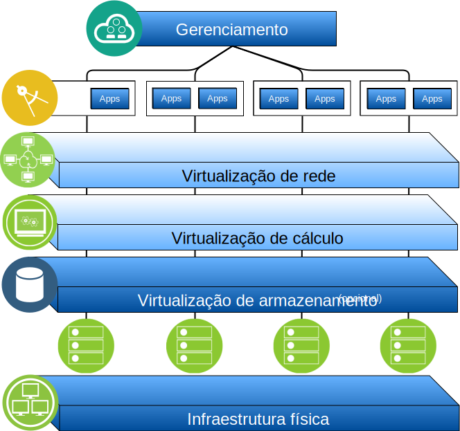

---

copyright:

  years:  2016, 2019

lastupdated: "2019-03-15"

subcollection: vmware-solutions

---

# Visão geral do IBM Cloud for VMware Solutions
{: #solution_overview}

As ofertas do {{site.data.keyword.vmwaresolutions_full}} permitem que você amplie seu data center virtualizado do VMware existente para o {{site.data.keyword.cloud_notm}} ou hospede os aplicativos nativos de nuvem.

A solução suporta casos de uso, como expansão de capacidade para a nuvem (e contração quando não necessária), migração para a nuvem, recuperação de desastre para a nuvem e backup na nuvem. Com a solução, é possível criar um ambiente de nuvem dedicada para desenvolvimento, teste, treinamento, laboratório ou produção.

Revise estas informações para o design do {{site.data.keyword.vmwaresolutions_short}} vCenter Server, cujas cargas de trabalho de destino requerem altos níveis de disponibilidade e escalabilidade.

Esse design serve como uma arquitetura de linha de base que fornece a base para outros componentes internos ou específicos do fornecedor serem incluídos para casos de uso específicos.

Figura 1. Visão geral do VMware on {{site.data.keyword.cloud_notm}}

## Benefícios principais do IBM Cloud for VMware Solutions
{: #solution_overview-benefits}

O VMware vCenter Server on {{site.data.keyword.cloud_notm}} fornece os blocos de construção fundamentais, que incluem as opções de armazenamento do VMware vSphere, vCenter Server, NSX e opções de armazenamento compartilhado, como vSAN. Esses componentes são necessários para projetar flexivelmente uma solução de data center definida pelo software do VMware que melhor se ajuste às suas cargas de trabalho.

Aplicando a automação avançada e a infraestrutura bare metal de único locatário, é possível implementar rapidamente o ambiente do VMware inteiro para o {{site.data.keyword.cloud_notm}} em horas. Em seguida, é possível acessar e gerenciar o ambiente hospedado pela IBM por meio dos clientes nativos do VMware, da Interface da Linha de Comandos (CLI), dos scripts existentes ou de outras ferramentas compatíveis com a API do vSphere familiar.

Após a implementação, é possível incluir em (e remover de) servidores do ESXi para uma instância, incluir e remover clusters, associar instâncias adicionais do vCenter Server a uma instância existente e incluir produtos e serviços usando o console do {{site.data.keyword.vmwaresolutions_short}}. É sua responsabilidade monitorar e gerenciar as instâncias do vCenter Server.

A sua responsabilidade inclui backups, correção, configuração e monitoramento do software do VMware e o hardware do hypervisor subjacente. O {{site.data.keyword.vmwaresolutions_short}} oferece soluções automatizadas para ajudar com o gerenciamento contínuo e o monitoramento da instância do vCenter Server.

Além disso, os {{site.data.keyword.cloud_notm}} Professional Services and Managed Services também estão disponíveis para ajudar a acelerar a sua jornada para a nuvem com ofertas, como migração, implementação e serviços de migração.

Ao contrário de uma oferta de serviços gerenciados, o vCenter Server fornece a você acesso integral a todos os componentes que permitem uma flexibilidade maior do que aquilo que um serviço gerenciado pode oferecer. No entanto, há determinadas restrições que se aplicam para permitir que a automação do IBM Cloud for VMware Solutions funcione, após a implementação do vCenter Server.

As ofertas do VMware on {{site.data.keyword.cloud_notm}} trazem os benefícios a seguir:

* **Acelerando a entrega** de projetos de TI para desenvolvedores e linhas de negócios, reduzindo o tempo que leva para compras, arquitetura, implementação e implementação de recursos de semanas ou meses a horas.
* **Aprimorando a segurança** com os Bare Metal Servers dedicados em uma nuvem particular hospedada, incluindo a criptografia de dados em repouso. Para armazenamento da vSAN, a criptografia de dados em repouso é opcional usando a criptografia da vSAN ou do vSphere. Para o nível de arquivo compartilhado ou armazenamento de bloco, a criptografia em repouso gerenciada por provedor de serviços está disponível por padrão em data centers selecionados ou é opcional usando a criptografia do vSphere. Deve-se gerenciar as chaves de criptografia necessárias.
* **Ativando o gerenciamento consistente e a governança** da nuvem híbrida implementada, fornecendo acesso administrativo integral ao gerenciamento de virtualização, preservando, assim, as suas ferramentas, scripts e investimentos em treinamento existentes do VMware.
* **Usando o conhecimento do VMware em escala global** com os IBM Professional and Managed Services abrangendo mais de 30 {{site.data.keyword.CloudDataCents_notm}} no mundo todo.

## Links relacionados
{: #solution_overview-related}

* [ Visão geral do design ](/docs/services/vmwaresolutions/archiref/solution?topic=vmware-solutions-design_overview)
* [ Capacidade de Escalação ](/docs/services/vmwaresolutions/archiref/solution?topic=vmware-solutions-solution_scaling)
* [Fazendo backup de componentes](/docs/services/vmwaresolutions/archiref/solution?topic=vmware-solutions-solution_backingup)
