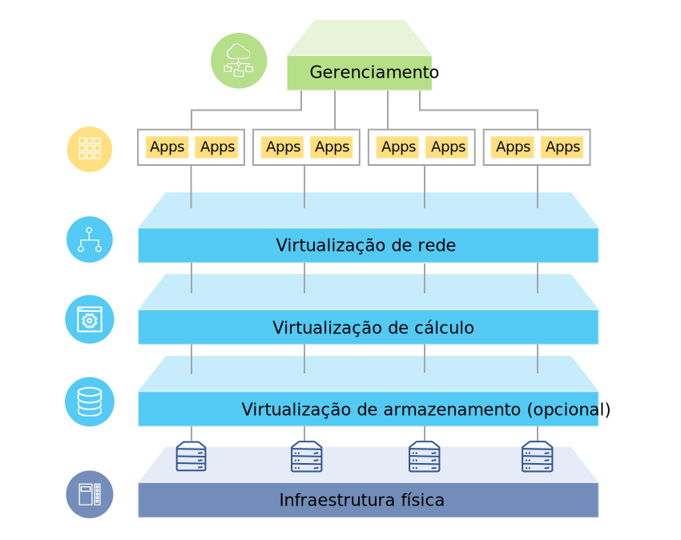

---

copyright:

  years:  2016, 2018

lastupdated: "2018-08-14"

---

# Visão geral da solução

As ofertas do {{site.data.keyword.vmwaresolutions_full}} permitem que você amplie seu data center virtualizado do VMware existente para o {{site.data.keyword.cloud_notm}} ou hospede os aplicativos nativos de nuvem.

A solução suporta casos de uso, como expansão de capacidade para a nuvem (e contração quando não necessária), migração para a nuvem, recuperação de desastre para a nuvem e backup na nuvem. Com a solução, é possível criar um ambiente de nuvem dedicada para desenvolvimento, teste, treinamento, laboratório ou produção.

Revise estas informações para o design das ofertas do {{site.data.keyword.vmwaresolutions_short}}, incluindo o VMware Cloud Foundation e o VMware vCenter Server, cujas cargas de trabalho de destino requerem altos níveis de disponibilidade e escalabilidade.

Esse design serve como uma arquitetura de linha de base que fornece a base para outros componentes internos ou específicos do fornecedor serem incluídos para casos de uso específicos.

## Visão geral do VMware on IBM Cloud

Figura 1. Visão geral do VMware on {{site.data.keyword.cloud_notm}}

## Principais benefícios

O VMware Cloud Foundation e o vCenter Server on {{site.data.keyword.cloud_notm}} fornecem os blocos de construção fundamentais, o que inclui VMware vSphere, vCenter Server, NSX e opções de armazenamento compartilhado, incluindo vSAN. Esses componentes são necessários para arquitetar flexivelmente uma solução de data center definida pelo software VMware que melhor se ajuste às cargas de trabalho. 

Aplicando a automação avançada e a infraestrutura bare metal de único locatário, é possível implementar rapidamente o ambiente do VMware inteiro para o {{site.data.keyword.cloud_notm}} em horas. Em seguida, é possível acessar e gerenciar o ambiente hospedado pela IBM por meio dos clientes nativos do VMware, da Interface da Linha de Comandos (CLI), dos scripts existentes ou de outras ferramentas compatíveis com a API do vSphere familiar.

Após a implementação, é possível incluir nós de host do ESXi e gerenciar o backup e a correção para alguns componentes de gerenciamento. Os serviços profissionais e gerenciados do {{site.data.keyword.cloud_notm}} também estão disponíveis para ajudar a acelerar sua jornada para a nuvem com ofertas como serviços de migração e implementação.

As ofertas do VMware on {{site.data.keyword.cloud_notm}} trazem os benefícios a seguir:

* **Acelerando a entrega** de projetos de TI para desenvolvedores e linhas de negócios, reduzindo o tempo que leva para compras, arquitetura, implementação e implementação de recursos de semanas ou meses a horas.
* **Aprimorando a segurança** com servidores bare metal dedicados em uma nuvem privada hospedada, incluindo a criptografia de dados em repouso.
* **Ativando gerenciamento e controle consistentes** da nuvem híbrida implementada, fornecendo acesso administrativo total ao gerenciamento de virtualização, preservando, assim, seus conjuntos de ferramentas, scripts e investimentos existentes do VMware em treinamento.
* **Alavancar o conhecimento do VMware em escala global** com o IBM Professional e Managed Services abrangendo 30 + {{site.data.keyword.CloudDataCents_notm}} no mundo todo.

### Links relacionados

* [ Visão geral do design ](design_overview.html)
* [ Capacidade de Escalação ](solution_scaling.html)
* [ Fazendo backup de componentes ](solution_backingup.html)
