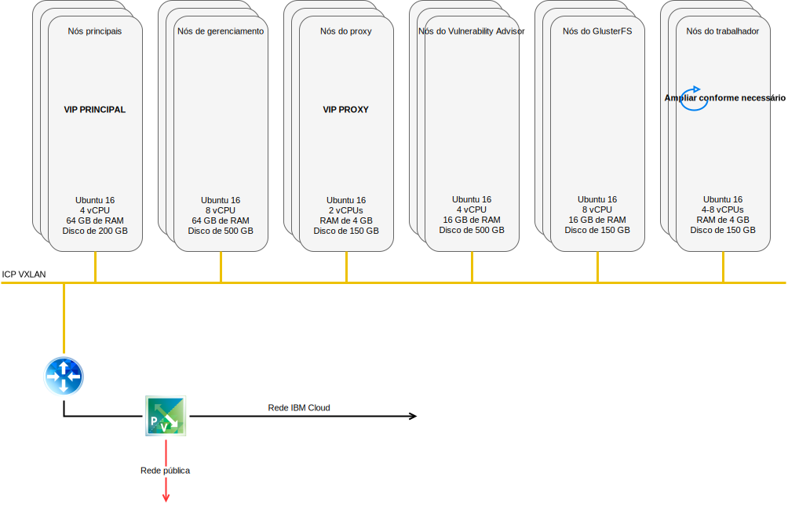

---

copyright:

  years:  2016, 2018

lastupdated: "2018-11-13"

---

# Rede e infraestrutura do IBM Cloud

## Virtual Routing and Forwarding

As contas do {{site.data.keyword.cloud}} também podem ser configuradas como uma conta Virtual Routing and Forwarding (VRF). Uma conta VRF fornece funções semelhantes ao VLAN Spanning, ativando o roteamento automático entre blocos de IP de sub-rede. Todas as contas com conexões de Link direto devem ser convertidas ou criadas como uma conta do VRF.

## Link Direto

O {{site.data.keyword.cloud_notm}} Direct Link Connect oferece acesso privado à infraestrutura do {{site.data.keyword.cloud_notm}} e a quaisquer outras nuvens vinculadas ao seu Provedor de serviços de rede por meio do {{site.data.keyword.CloudDataCent_notm}} local. Essa opção é perfeita para criar conectividade com múltiplas nuvens em um único ambiente.

Nós conectamos os clientes à rede do {{site.data.keyword.cloud_notm}} Private usando uma topologia de largura de banda compartilhada. Como ocorre com todos os produtos Direct Link, é possível incluir roteamento global, que permite tráfego de rede privada para todos os locais do {{site.data.keyword.cloud_notm}}.

## Redes privadas virtuais

### VPN do strongSwan

O serviço de VPN do IPSec do strongSwan fornece um canal de comunicação seguro de ponta a ponta sobre a Internet que é baseado no conjunto de protocolos padrão de mercado da Internet Protocol Security (IPSec).

### Hybridity (HCX)

O serviço VMware vCenter Server on {{site.data.keyword.cloud_notm}} Hybridity Bundle pode ampliar ininterruptamente as redes de data centers no local para o {{site.data.keyword.cloud_notm}}, que permite que máquinas virtuais (VMs) sejam migradas para e do {{site.data.keyword.cloud_notm}} sem nenhuma conversão ou mudança.

## Estrutura física

A infraestrutura física necessária para implementar uma instância de produção {{site.data.keyword.cloud_notm}} Private (ICP) em um cluster do VMware vCenter Server on {{site.data.keyword.cloud_notm}} requer a especificação mínima a seguir.

Tabela 1. Especificação do vCenter Server para o ICP

| Implementação do NFS | Implementação do vSAN | :--|:----:|:----: Número de servidores | 3 | 4 CPU | 28 núcleos 2.2 GHz | 28 núcleos 2.2 GHz de memória | 384 GB | 384 GB de armazenamento | Gerenciamento de 2.000 GB 2 IOPS/GB, Carga de trabalho de 2.000 GB 4 IOPS/GB, ICP de 4.000 GB 4 IOPS/GB | SSD mínima x 2 de 960 GB

Além dos requisitos de hardware do {{site.data.keyword.cloud_notm}} Private, deve-se criar volumes persistentes no ambiente do ICP para armazenar dados do log e do banco de dados do Cloud Automation Manager (CAM). Embora o CAM suporte todos os tipos de volumes persistentes que o ICP suporta, as duas configurações de armazenamento recomendadas para o CAM são NFS e GlusterFS.

## Estrutura virtual

Figura 1. Estrutura de implementação do vCenter Server e do ICP

Na instância do vCenter Server, a instância do ICP é implementada com um NSX Edge Services Gateway (ESG) dedicado e um Distributed Logical Router (DLR).
A instalação do ICP é carregada na sub-rede VXLAN definida nos componentes anteriores.

O ESG é configurado com uma regra do Source NAT (SNAT) para permitir o tráfego de saída, ativando a conectividade de Internet para fazer download dos pré-requisitos do ICP e a conectividade com o GitHub e o Docker ou um proxy da web pode ser usado para fornecer a conectividade de Internet. O ESG também é configurado para fornecer acesso a serviços DNS e NTP.

O ESG também é configurado com uma regra de destino do NAT (DNAT) para os endereços IP virtuais do ICP Principal/Proxy da rede do {{site.data.keyword.cloud_notm}} 10.x por meio do ambiente VXLAN.

### Links relacionados

* [Visão geral do vCenter Server on {{site.data.keyword.cloud_notm}} with Hybridity Bundle](../vcs/vcs-hybridity-intro.html)
