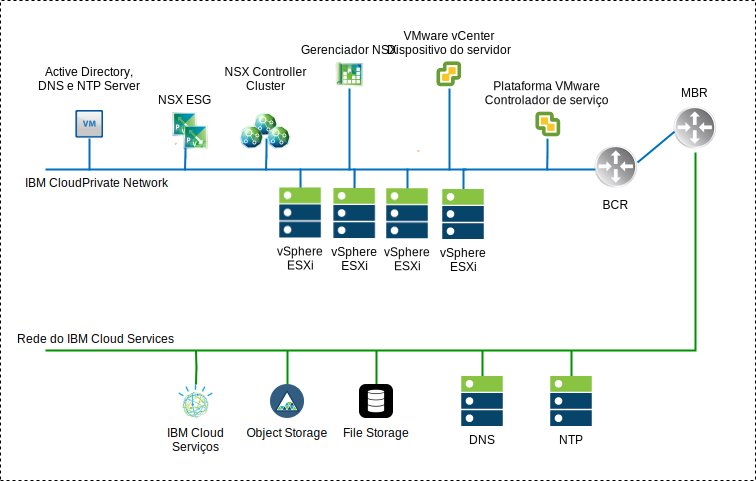
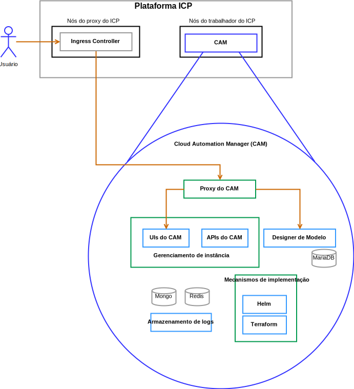

---

copyright:

  years:  2016, 2019

lastupdated: "2019-05-07"

subcollection: vmware-solutions

---

# Componentes da solução
{: #vcscar-arch-overview-solution}

## Componentes do VMware vCenter Server on IBM Cloud
{: #vcscar-arch-overview-solution-vcs-comp}

### Platform Service Controller
{: #vcscar-arch-overview-solution-psc}

A implementação do vCenter Server usa um único controlador de serviços de plataforma externa instalado em uma sub-rede móvel na VLAN privada associada a máquinas virtuais (MVs) de gerenciamento. Seu gateway padrão é configurado para o backend customer router (BCR).

### vCenter Server
{: #vcscar-arch-overview-solution-vcs}

Como o controlador de serviços de plataforma, o vCenter Server é implementado como um dispositivo. Além disso, o vCenter Server é instalado em uma sub-rede móvel na VLAN privada associada a máquinas virtuais de gerenciamento. Seu gateway padrão é configurado para o endereço IP designado no BCR para essa sub-rede específica.

### Gerenciador NSX
{: #vcscar-arch-overview-solution-nsx-manager}

O NSX Manager é implementado no cluster inicial. Além disso, o NSX Manager é designado a um endereço IP suportado pela VLAN por meio do bloco de endereço móvel privado que está designado a componentes de gerenciamento e configurado com os servidores DNS e NTP

### Controladores NSX
{: #vcscar-arch-overview-solution-nsx-controllers}

A automação do {{site.data.keyword.cloud}} implementa três Controladores NSX dentro do cluster inicial. Os controladores são designados a um endereço IP suportado pela VLAN por meio da sub-rede móvel privada que é designada a componentes de gerenciamento.

### NSX Edge e Distributed Logical Router
{: #vcscar-arch-overview-solution-nsx-edge}

Os pares do NSX Edge Services Gateway (ESG) são implementados. Em todos os casos, um par de gateway é usado para o tráfego de saída dos componentes de automação que residem na rede privada. Para o vCenter Server e o {{site.data.keyword.icpfull_notm}}, um segundo gateway conhecido como a borda gerenciada por icp é implementado e configurado com um uplink para a rede pública e uma interface que é designada à rede privada. O administrador pode configurar qualquer componente necessário do NSX, como o Distributed Logical Router (DLR), os comutadores lógicos e os firewalls.

Para obter mais informações sobre o design de rede, veja [Arquitetura de referência de Rede do vCenter Server](/docs/services/vmwaresolutions/archiref/vcsnsxt?topic=vmware-solutions-vcsnsxt-intro).

A tabela a seguir resume as especificações do {{site.data.keyword.icpfull_notm}} ESG e DLR.

Tabela 1. Especificações do {{site.data.keyword.icpfull_notm}} ESG

Atributo | Especificação
--|--
Gateway de Serviço de Edge | Dispositivo Virtual
Tamanho da borda    Grande | Número de vCPUs 2
Memória    | 1 GB
Disco    | 1000 GB no armazenamento de dados local

Tabela 2. Especificações do {{site.data.keyword.icpfull_notm}} DLR

Atributo | Especificação
--|--|
Roteador Lógico Distribuído |     Dispositivo Virtual
Tamanho da borda Compacto | Número de vCPUs 1
Memória    | 512 MB
Disco    | 1000 GB no armazenamento de dados local

## Componentes do IBM Cloud Private
{: #vcscar-arch-overview-solution-icp-comp}

O {{site.data.keyword.icpfull_notm}} é uma plataforma de aplicativo para desenvolver e gerenciar aplicativos conteinerizados no local. O {{site.data.keyword.icpfull_notm}} é um ambiente integrado para gerenciar contêineres que inclui o orquestrador de contêineres Kubernetes, um repositório de imagem privada, um console de gerenciamento e estruturas de monitoramento.

### Nó de inicialização
{: #vcscar-arch-overview-solution-boot-node}

Um nó de inicialização ou de autoinicialização (opcional) é usado para executar a instalação, a configuração, o ajuste de escala do nó e as atualizações do cluster. Somente um nó de inicialização é necessário para qualquer cluster. Use um único nó para principal e
inicialização.

### Nó Principal
{: #vcscar-arch-overview-solution-master-node}

Um nó principal fornece serviços de gerenciamento e controla os nós do trabalhador em um cluster. Nós principais hospedam processos que são responsáveis pela alocação de recurso, manutenção de estado, planejamento e monitoramento.

Como um ambiente de alta disponibilidade (HA) tem mais de um nó principal, se o nó principal líder falhar, a lógica de failover promoverá automaticamente um nó diferente para a função principal. Os hosts que podem agir como o principal são chamados de candidatos principais.

### Nó do trabalhador
{: #vcscar-arch-overview-solution-worker-node}

Um nó do trabalhador é um nó que fornece um ambiente conteinerizado para executar tarefas. Conforme as demandas aumentam, mais nós do trabalhador podem ser facilmente incluídos em seu cluster para melhorar o desempenho e a eficiência. Um cluster
pode ter qualquer número de nós do trabalhador, mas pelo menos um nó trabalhador
é necessário.

### Nó do proxy
{: #vcscar-arch-overview-solution-proxy-node}

Um nó do proxy é um nó que transmite uma solicitação externa para os serviços criados dentro de seu cluster. Como um ambiente de alta disponibilidade (HA) tem mais de um nó do proxy, se o nó do proxy líder falhar, a lógica de failover promoverá automaticamente um nó diferente para a função de proxy.

Embora seja possível usar um único nó como principal e proxy, é melhor usar nós de proxy dedicados para reduzir o carregamento no nó
principal. Um cluster deverá ter pelo menos um nó do proxy se o balanceamento de carga for necessário dentro do cluster.

### Nó de gerenciamento
{: #vcscar-arch-overview-solution-mgmt-node}

Um nó de gerenciamento é um nó opcional que hospeda serviços
de gerenciamento, tais como monitoramento, medição e criação de log. Configurando os nós de gerenciamento dedicados, é possível evitar que o nó principal fique sobrecarregado. É possível ativar o nó de gerenciamento apenas durante a instalação do {{site.data.keyword.icpfull_notm}}.

### Nó do Vulnerability Advisor
{: #vcscar-arch-overview-solution-va-node}

Um nó do Vulnerability Advisor (VA) é um nó opcional usado para
executar os serviços do Vulnerability Advisor. Os serviços do Vulnerability Advisor são intensivos em recurso. Se você usar o serviço Vulnerability Advisor, especifique um nó VA dedicado.

A tabela a seguir fornece as especificações de MV que são necessárias para uma instância do {{site.data.keyword.icpfull_notm}}
Altamente Disponível.

Tabela 3. {{site.data.keyword.icpfull_notm}}  Especificações da MV

Nó |     Instâncias    | IP    | CPU    | RAM (GB)    | DISCO (GB)
:-----|------------:|:----|----:|----------:|----------:|
Mestrado|    3    | IP (x3) VIP (x1)    | 4    | 64    | 200
Gerenciamento    |3    | IP (x3)    |8    |64    |500
Proxy    | 3    | IP (x3) VIP (x1)    |2    |4    |150
Vulnerability Advisor    |3    | IP (x3)    | 4    | 16    |500
GlusterFS    | 3    | IP (x3)    |8    |16    |150
Trabalhador    | 3-6    | IP (x3)    |4-8    |4    |150

O CAM requer que os nós do trabalhador tenham uma configuração de vCPU e de memória mais alta.

Tabela 4. {{site.data.keyword.icpfull_notm}}  Especificações da MV

Nó |     Instâncias    | IP    | CPU    | RAM (GB)    | DISCO (GB)
:-----|------------:|:----|----:|----------:|----------:|
Trabalhador  |  3 | IP (x3)  |  4-8 |16-20   |  150

## Componentes do IBM Cloud Automation Manager
{: #vcscar-arch-overview-solution-icam-comp}

O {{site.data.keyword.cloud_notm}} Automation Manager (CAM) é uma plataforma de gerenciamento de
autoatendimento multinuvem, executada no {{site.data.keyword.icpfull_notm}}, que ajuda Desenvolvedores e
administradores a atender às demandas de negócios.

### Proxy CAM
{: #vcscar-arch-overview-solution-cam-proxy}

Fornece um acesso de proxy nginx para o CAM.

### Interface com o usuário do CAM
{: #vcscar-arch-overview-solution-cam-ui}

Os componentes de interface com o usuário do CAM são divididos entre mais de um contêiner: interface com
o usuário de conexões em nuvem, interface com o usuário de Biblioteca de Modelos e interface com o usuário de instâncias implementadas.

### API CAM
{: #vcscar-arch-overview-solution-cam-api}

As APIs do CAM são divididas em mais de um contêiner.

### Helm
{: #vcscar-arch-overview-solution-helm}

Um contêiner com os arquivos binários necessários para implementar gráficos helm em
clusters do Kubernetes.

### Terraform
{: #vcscar-arch-overview-solution-terra}

Um contêiner com os arquivos binários necessários para implementar recursos do Terraform
em mais de uma nuvem.

### Registros
{: #vcscar-arch-overview-solution-logs}

O local para os logs do contêiner.

### Banco de dados do Mongo
{: #vcscar-arch-overview-solution-mongo-db}

O banco de dados Principal para o Aplicativo CAM.

### Redis
{: #vcscar-arch-overview-solution-redis}

O banco de dados Redis é usado para o armazenamento em cache de sessão e os bloqueios no CAM.

### Designer de Modelo
{: #vcscar-arch-overview-solution-templ-designer}

Uma interface gráfica com o usuário para criar modelos do Terraform com um recurso para arrastar módulos do Terraform.

### Maria Database
{: #vcscar-arch-overview-solution-maria-db}

O banco de dados para o aplicativo de designer modelo.

## Links Relacionados
{: #vcscar-arch-overview-solution-related}

* [Visão geral do vCenter Server on {{site.data.keyword.cloud_notm}} with Hybridity Bundle](/docs/services/vmwaresolutions/archiref/vcs?topic=vmware-solutions-vcs-hybridity-intro)
