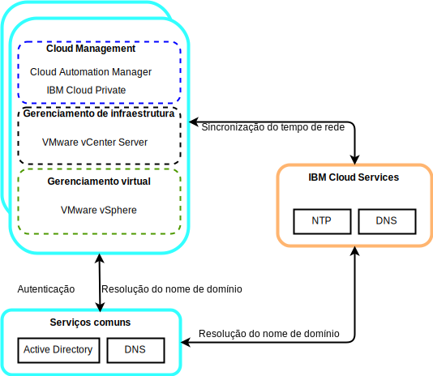

---

copyright:

  years:  2016, 2019

lastupdated: "2019-08-05"

subcollection: vmware-solutions

---

# Componentes de serviços comuns para o VMware e o Skate Advisor Concept Car
{: #vcscar-commonservices}

Os serviços comuns fornecem os serviços que são usados por outros serviços na plataforma de gerenciamento de nuvem. Os serviços comuns incluem serviços de identidade e acesso, serviços de nome de domínio e serviços NTP (Network Time Protocol).

## Serviços de identidade e de acesso
{: #vcscar-commonservices-identity}

Como parte da automação do VMware vCenter Server on {{site.data.keyword.cloud_notm}}, um Microsoft Active Directory (AD) é
empregado para Gerenciamento de Identidade. Uma única instância de servidor virtual (VSI) do AD é implementada. O vCenter é configurado para usar a autenticação do AD e é possível configurar o {{site.data.keyword.icpfull_notm}} também para autenticação LDAP.

## Domain Name Services
{: #vcscar-commonservices-dns}

A implementação usa as VSIs do AD
implementadas como servidores do Sistema de Nomes de Domínio (DNS) para a instância. Todos os componentes implementados são configurados para apontar para o AD como seu
DNS padrão. Os exemplos de componentes implementados incluem hosts vCenter, PSC, NSX e ESXi.

## Serviços do Network Time Protocol
{: #vcscar-commonservices-ntp}

A implementação do vCenter Server usa os servidores Network Time Protocol (NTP) da infraestrutura do {{site.data.keyword.cloud_notm}}. Todos os componentes implementados são configurados para usar esses servidores NTP. Ter todos os componentes que usam os mesmos servidores NTP
é crítico para que os certificados e a autenticação do AD funcionem
corretamente.
