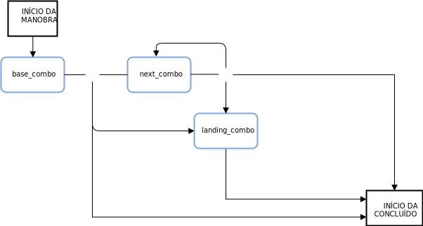

---

copyright:

  years:  2016, 2018

lastupdated: "2018-11-13"

---

# Conceitos de linguagem de skateboarding

## Linguagem do skatista

Um aspecto chave do Skate Advisor são as conversas possíveis com o robô de bate-papo orientado pelo Watson. A seção a seguir detalha as regras de conversação que definem uma interação humana com o robô de bate-papo do Skate Advisor.

A Linguagem do Skatista é o núcleo do sistema e é usada da maneira a seguir:
* Reconhecimento de manobra: usado pelo Watson Discovery para alimentar material de fontes on-line para reconhecer as manobras existentes e mapear para o material de origem.
* Conversas sobre skate: usadas pelo robô de bate-papo para ter conversas significativas com o usuário do sistema.
* Classificação de manobra: armazenar e classificar uma manobra com base em sua descrição textual. As manobras que são classificadas dessa maneira podem ter metadados anexados a elas, como referências de local e vídeo.

## Elementos de linguagem

### Elementos principais

A seguir, estão os elementos principais de linguagem para construir uma Manobra.

Tabela 1. Elementos principais de linguagem

Tipo de elemento | Texto de linguagem
---|---|---
Direção | fakie<br>nollie<br>switch
Rotação | halfcab<br>cab<br>180<br>360<br>540
Base | kickflip<br>heelflip<br>hardflip<br>bigspin<br>shuvit<br>impossible
Aterrissagem | manual (2 rodas de trás)<br>nosemanual (2 rodas da frente)<br>5-0 (grind)<br>nosegrind<br>tailslide<br>noseslide<br>crooked grind<br>smithgrind<br>boardslide<br>lipslide<br>

### Modificadores de elementos

Os modificadores de elementos são elementos de linguagem especiais que fornecem contexto para determinados aspectos da linguagem.

Tabela 2. Modificadores de linguagem

Tipo de elemento | Texto de linguagem |Avisos
---|---|---
Prefixo de giro | Frontside<br>backside | O Prefixo de giro está relacionado à direção de um giro
Varial | Inward<br>outward |

## Regras de linguagem

O conjunto de regras a seguir constrói a linguagem. As manobras são divididas em uma ou mais combinações de elementos que são referidos como uma "Combinação". Há uma diferença entre a primeira Combinação e as Combinações seguintes no sentido em que a direção é presumida como sendo a mesma que na Combinação de base, a menos que seja especificado de outra forma.

Para as regras a seguir, veja os Elementos principais e os Modificadores de elementos como uma referência porque eles são usados para construir a linguagem.

### Conjunto de regras de manobra

*   **base_combo** = 'direction \+ \[varial | turn_prefix\] \+
\[rotation\] \+ \[base_trick\]'
*   **next_combo** = ''\[varial | turn_prefix\] \+ \[rotation\] \+
\[base_trick\]'
*   **landing_combo** = ''\[varial | turn_prefix\] \+ landing'
*   **trick** = 'combo \+ \[“to” + combo\] \+ \[“to” \+ landing_combo\]'

### Mecanismo de regras de manobra

O diagrama a seguir é um resumo visual do mecanismo de regras.

Figura 1. Visão geral da linguagem de skate


## Linguagem de manobra de amostra

O exemplo a seguir é uma lista de manobras de amostra:

```

fakie-kickflip

fakie-kickflip to fakie-5-0 to fronside-halfcab (out)

fakie-heeflip

fakie-heeflip to fakie-maual to fakie-hardflip

fakie-inward (varial) heeflip to fakie-backside tailslide to fakie

switch-heeflip to fakie-maual to fakie-hardflip

switch-hardflip to fakie-manual

fakie-hardflp to fakie-nosegrind

nollie-hardflip-to-tailslide

nollie-inward-heelflip to frontside noseslide

kickflip-frontside to crooked grind

halfcab-heelflip to crooked grind

frontside-shuvit to nosegrind to nollie-flip (out)

kickflip to nosegrind to nollie-impossilbe (out)

nollie-kickflip to noseslide to nollieflip

nollie-kickflip to frontside-lipslide

nollie-impossible to manual

nollie-impossible to 5-0

nollie-kickflip to crooked grind

nollie-kickflip to crooked grind to nollie-halfcab-kickflip (out)

frontside-nollie-halfcab-heelflip to fakie-nosegrind

backside-nollie-halfcab-kickflip to backside-tailslide to backside-180-out

frontside-nollie-cab-kicflip halfcab to backside-smithgrind

halfcab to backside-smithgrind to backside-180-bigspin (out)

kickflip-backside-tailslide to backside-180-kickflip

kickflip-backside-tailslide to backside-backside-bigspin

360-kicflip to nosemanual to nollie-360-kickflip

360-kicflip to frontside-lipslide

harflip to backside-lipslide

kicflip to frontside-boardslidev

nollie-heelflip to frontside-boardslide

```

## Relevância

A Linguagem de manobra é a construção chave usada para treinar o Watson para reconhecer e alimentar documentos e mídia de skating e também formar a base de conversas com o usuário.

### Links relacionados

* [Visão geral do vCenter Server on {{site.data.keyword.cloud}} with Hybridity Bundle](../vcs/vcs-hybridity-intro.html)  
