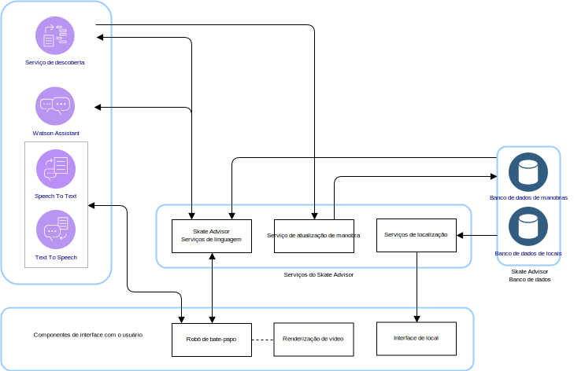
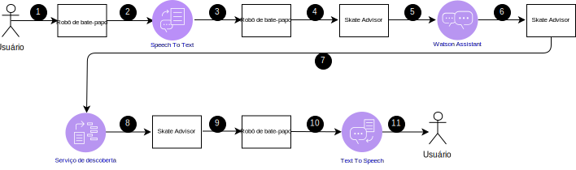
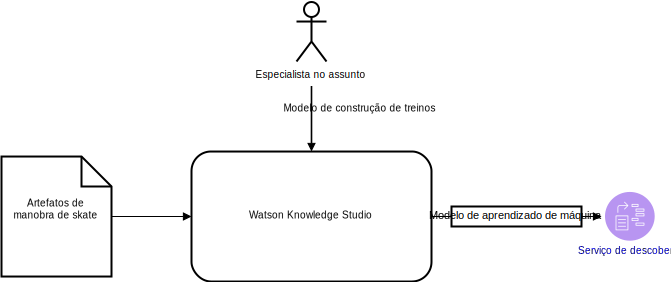

---

copyright:

  years:  2016, 2019

lastupdated: "2019-01-23"

---

# Design lógico do Skate Advisor

As informações a seguir detalham os elementos de aplicativo que formam o design lógico do sistema.

## Componentes do sistema

Figura 1. Componentes do Skate Advisor

O Skate Advisor consiste principalmente em um robô de bate-papo que pode aceitar o reconhecimento de texto ou fala para interagir com o sistema de uma maneira estruturada.

## Manobras

O elemento central de dados do Skate Advisor é a manobra. A linguagem de manobra define exclusivamente uma manobra. Essa linguagem pode ser usada para realizar as tarefas a seguir:
- Conversar com o robô de bate-papo sobre manobras.
- Procurar manobras por meio do Watson Discovery.
- Identificar e classificar as manobras ao treinar o Watson Discovery por meio de artigos de origem.
- Identificar uma manobra para propósitos de exibição de local e mídia.

### Definição de manobra

Uma manobra é definida exclusivamente pelas construções de linguagem que a descrevem. Veja o Mecanismo de regras de manobra para obter uma definição completa.

### Lista de manobras

Uma lista de manobras é retornada por uma consulta da Manobra de base ou Aterrissagem que está definida nos elementos de linguagem.

### Dados de manobra

Após serem retornadas, as manobras podem ter as informações a seguir:
- Descrição da manobra
- Um ou mais artefatos de mídia
- Informações de local

## Fluxos de conversação

O robô de bate-papo tem um número predefinido e limitado de possíveis conversas. As conversas são definidas pelas informações a seguir:
- Localização de manobra: localize um conjunto de manobras válidas com base em um parâmetro de consulta que representa a Manobra de base ou a Aterrissagem.
- Descoberta de local: localize um local próximo para uma manobra.
- Exibição de mídia: exiba um item de mídia, como um vídeo on-line por meio do qual uma manobra foi classificada e localizada.

Tabela 1. Conversa

Conversa | Estrutura | Resultado
---|---|---
Descoberta de manobra | Descrever uma manobra |Uma lista de manobras
Descoberta de local | Onde devo executar essa manobra? | Lista de locais para uma manobra específica
Exibição de mídia | Exibir um vídeo de manobra |Uma lista de resultados de mídia

## Componentes de interface com o usuário

### Robô de bate-papo

O robô de bate-papo é um componente da web que conversa com o usuário. O robô de bate-papo pode aceitar texto ou fala. Os resultados, como listas, são renderizados em texto com uma possível fala de acompanhamento para representar os resultados.

Os robôs de bate-papo interagem com o sistema da maneira a seguir:

Figura 2. Consulta típica do robô de bate-papo

Tabela 2. Interações do robô de bate-papo

Etapa | Descrição
---|---
1 | Inicie uma conversa válida, veja a seção sobre Fluxos de conversa.
2 | O robô de bate-papo envia Fala para o serviço Speech to Text.
3 | O serviço Speech to Text envia Texto para o robô de bate-papo.
4 | O robô de bate-papo envia a Consulta de texto para o Skate Advisor.
5 | O Skate Advisor avalia a solicitação e envia para o Watson Assistant.
6 | O Watson Assistant classifica a solicitação e responde ao Skate Advisor com a ação a ser tomada.
7 | O Skate Advisor solicita um conjunto de dados do Discovery Service.
8 | O Discovery Service avalia a consulta e envia a resposta.
9 |O Skate Advisor forma uma resposta e envia para o Robô de bate-papo no texto.
10 | O Robô de bate-papo envia a resposta de texto ao serviço Text to Speech.
11 | O resultado é enviado para o usuário por meio do Robô de bate-papo.

### Renderização de vídeo

O componente de renderização de vídeo reproduz um vídeo ou exibe um documento. Esses artefatos representam o artefato de origem por meio qual a manobra foi descoberta.

O componente de renderização de vídeo é um widget integrado na interface da web que exibe um vídeo. Os vídeos são exibidos no robô de bate-papo como resultado de uma consulta do usuário do sistema. O link de vídeo resultante, depois de selecionado, aciona a renderização de vídeo.

### Interface de local

O Skate Advisor inclui uma interface para os usuários do sistema registrarem o local de uma manobra específica. O componente de interface da web tem dois elementos principais:
1. Aceitar um local do usuário do sistema como o melhor local para executar uma manobra específica.
2. Exibir um ou mais locais que são recomendados para uma manobra específica.

## Componentes do Watson

Os componentes do Watson a seguir estão incluídos nesta arquitetura.
* Knowledge Studio - o Watson Studio é uma ferramenta pela qual podemos projetar a Linguagem de skate para o sistema e usar essa linguagem para reconhecer os documentos da web que implementam a Linguagem de skate. O Knowledge Studio fornece um modelo para ser usado pelo Watson Discovery.
* Speech to Text - Transcreve fala para texto. Esse componente aceita áudio de um dispositivo no qual o robô de bate-papo está em execução e o converte em texto para o Watson processar.
* Text to Speech – Combinar texto com fala Esse componente aceita texto do aplicativo Skate Advisor e o converte em fala para o dispositivo em que o robô de bate-papo está em execução, para reprodução.
* Discovery Service - o Watson Discovery Service é usado pelo sistema para recuperar o conteúdo relacionado a Skate que corresponde aos parâmetros solicitados. Um exemplo poderia ser "Listar todos os registros do Truque de Casper". O Watson Discovery usa técnicas avançadas de aprendizado de máquina para exibir as passagens mais relevantes do conteúdo alimentado.
* Watson Assistant - o Watson Assistant é uma ferramenta para projetar as interações entre os usuários e a máquina (robô de bate-papo). Ele deve ser treinado com uma linguagem específica do domínio, por exemplo, skateboarding, na forma de uma série de gramáticas para as quais o Assistente reconhece e constrói as respostas apropriadas.

## Serviços do Skate Advisor

O Skate Advisor Service é um componente de aplicativo que fornece um conjunto de serviços de API para renderizar solicitações. Os serviços que são expostos têm uma correlação direta com os fluxos de conversação descritos anteriormente. A
API exposta tem as categorias gerais a seguir:
* get_tricks - retorne uma lista de manobras com base em um <query\> em língua natural, que é apresentada ao Discovery Service.
* show_tricks - retorne uma lista de mídia para uma manobra específica.
* find_trick - retorne uma manobra específica.
* accept_command - aceite um comando textual do robô de bate-papo e atenda a solicitação.

## Treinamento do serviço de descoberta

O Watson Discovery deve ser treinado por meio de um modelo de aprendizado de máquina, que é criado de forma iterativa por um especialista no assunto, usando o Watson Knowledge Studio.

Figura 3. Treinamento do serviço de descoberta

Para o Skate Advisor, o modelo consiste no relacionamento entre os tipos de entidade com uma combinação de treinamento baseado em regra e treinamento baseado em dicionário para criar um modelo. Esse modelo permite que o Discovery Service reconheça e classifique as manobras que são alimentadas por meio de artigos e descrições de vídeo que são usados como o conjunto de treinamento.

Depois de treinado, o Discovery Service pode responder a consultas, como:
- Mostre-me todas as manobras com a manobra base de heelflip.
- Mostre-me todas as manobras.
- Mostre-me todas as manobras com múltiplas combinações.

### Links relacionados

* [Visão geral do vCenter Server on {{site.data.keyword.cloud}} with Hybridity Bundle](/docs/services/vmwaresolutions/archiref/vcs/vcs-hybridity-intro.html)
