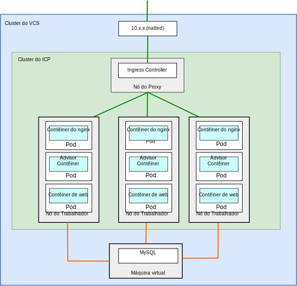
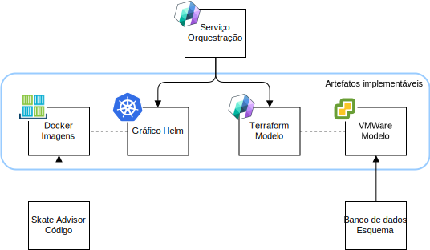
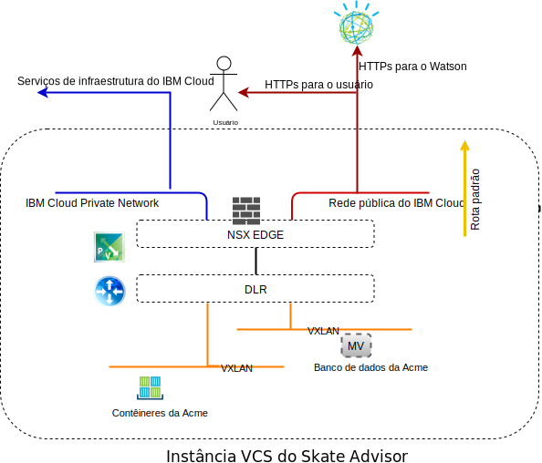
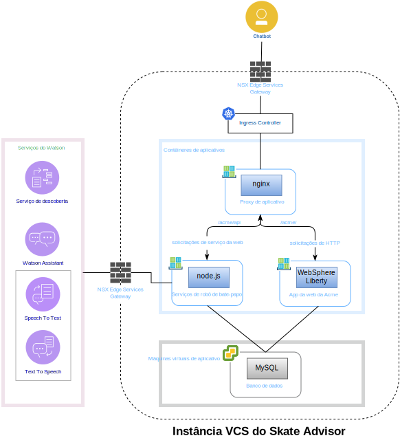
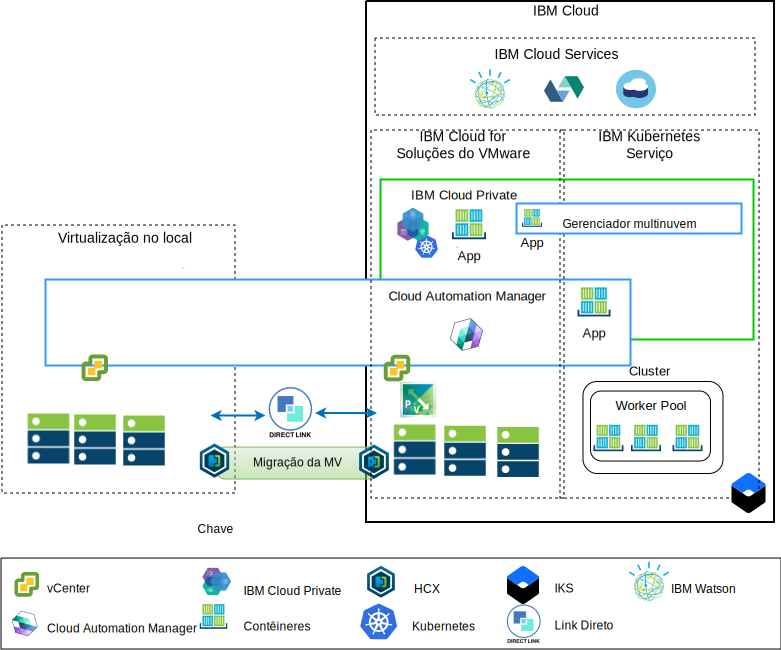

---

copyright:

  years:  2016, 2019

lastupdated: "2019-06-26"

subcollection: vmware-solutions

---

# Componentes do Skate Advisor
{: #vcscar-physical}

O {{site.data.keyword.vmwaresolutions_full}} fornece automação para implementar componentes de tecnologia do VMware em {{site.data.keyword.CloudDataCents_notm}} em todo o mundo. A
arquitetura consiste em uma única região de nuvem e suporta a capacidade
de ampliar em mais regiões de nuvem que estão localizadas em uma das opções a seguir:

1. Outra geografia.
2. Outro pod do {{site.data.keyword.cloud_notm}} dentro do mesmo data center.
3. Outra geografia e outro pod do {{site.data.keyword.cloud_notm}} dentro do mesmo data center.

Os produtos {{site.data.keyword.icpfull_notm}} e Cloud Automation Manager (CAM)
podem ser implementados manualmente em sua plataforma de virtualização no local,
permitindo o gerenciamento de nuvem por meio de locais no local. Como alternativa, o {{site.data.keyword.icpfull_notm}} e o CAM são oferecidos como extensões de serviço para uma implementação nova ou existente do VMware vCenter Server on {{site.data.keyword.cloud_notm}}, por meio da automação, permitindo o gerenciamento de nuvem por meio do {{site.data.keyword.cloud_notm}}.

O {{site.data.keyword.icpfull_notm}} é uma plataforma de aplicativo para desenvolver e gerenciar aplicativos conteinerizados no local. É um ambiente integrado para gerenciar
contêineres que inclui o orquestrador de contêineres Kubernetes, um
repositório de imagem privada, um console de gerenciamento e estruturas de
monitoramento.

O IBM Multi-cluster Manager fornece visibilidade do usuário, gerenciamento centrado
no aplicativo (política, implementações, funcionamento, operações) e conformidade com base em
política entre nuvens e clusters. Com o IBM Multi-Cluster Manager, você tem controle de seus clusters do Kubernetes. É possível assegurar que os clusters sejam seguros, operando com eficiência e entregando os níveis de serviço que os aplicativos esperam.

O {{site.data.keyword.cloud_notm}} Automation Manager é uma plataforma de gerenciamento de autoatendimento
multinuvem que é executada no {{site.data.keyword.cloud_notm}} Private que permite que os Desenvolvedores e
administradores atendam às demandas de negócios. O Cloud Automation Manager
Service Composer permite que você exponha os serviços de nuvem híbrida no catálogo do {{site.data.keyword.icpfull_notm}}.

## Componentes físicos do Skate Advisor
{: #vcscar-physical-skate-comp}

O diagrama a seguir descreve a implementação de referência do aplicativo
Acme Skate Advisor em uma implementação de infraestrutura de modernização de
aplicativo.

O aplicativo Skate Advisor amplia o aplicativo da web Acme existente com um componente baseado em microsserviços, que interage com o Watson e com um contêiner nginx para as solicitações de proxy para o contêiner da web e de microsserviços.

O aplicativo Skate Advisor aproveita a plataforma de
modernização de aplicativo que fornece a infraestrutura de hospedagem
necessária.

### Empacotamento e implementação de aplicativo
{: #vcscar-physical-app-pack-depl}

O aplicativo é implementado como uma Orquestração do CAM, que contém os seguintes elementos:
* Orquestração de serviço - uma orquestração de serviço do CAM é um recurso de
fluxo de trabalho que descreve os modelos do Terraform e os gráficos Helm para
implementar como um aspecto de um serviço. Um serviço pode ser publicado e é o
artefato de controle por meio do qual a implementação inteira é orquestrada.
* Gráfico do Helm - o gráfico do Helm reside no Repositório local do {{site.data.keyword.icpfull_notm}} e implementa contêineres e outros recursos no {{site.data.keyword.icpfull_notm}}. Um gráfico
Helm é uma descrição dos recursos do Kubernetes que incluem:
  - Implementações de contêiner
  - Serviços
  - Ingresso
  - Regras
  - Terminais

* Imagens do docker - as imagens o docker contêm o sistema operacional (ubuntu),
o middleware (WebSphere Liberty, nginx) e o código do Skate Advisor e
do Skate Store. As imagens do docker são objetos estáticos implementados
em contêineres em execução.
* Modelo do Terraform - um modelo do Terraform é um arquivo que descreve
os recursos em nuvem a serem implementados. Para o Skate Advisor, um modelo
ubuntu, que é pré-instalado com o mysql e o esquema do banco de dados, é
descrito.
* Modelo VMWare - o modelo VMWare é um modelo Ubuntu com o mysql
e o esquema do banco de dados pré-instalados.

### Balanceamento de carga e proxy
{: #vcscar-physical-load-balance-proxy}

O balanceamento de carga e o proxy são implementados por meio do componente {{site.data.keyword.icpfull_notm}} Ingress Controller. Esse componente manipula o ajuste de escala e o failover
do contêiner de uma maneira contínua.

O proxy de aplicativo é fornecido pelo contêiner nginx que equilibra
a carga da maneira a seguir.

Tabela 1. Regras de proxy reverso do Skate Advisor

URL	|Terminal
---|---
/acme	|Acme Web Container Service
/acme/api	|Skate Advisor Service
/acme/api/explorer	|Skate Advisor Service

Os contêineres têm endereços IP imprevisíveis que podem escalar dentro e fora conforme
as demandas do sistema. Para superar esse problema, os serviços do {{site.data.keyword.icpfull_notm}} são usados para
executar a resolução de endereço IP em tempo real dentro do sistema.

### Aplicativo da web Acme Skate
{: #vcscar-physical-acme-skate-web-app}

O aplicativo da web Acme Skate é um aplicativo Java Platform, Enterprise Edition (Java Platform, Enterprise Edition) com base no Spring
Framework. O aplicativo é implementado em um contêiner do WebSphere Liberty.

### Aplicativo Acme Skate Advisor
{: #vcscar-physical-acme-skate-advisor-app}

O aplicativo Acme Skate Advisor é um aplicativo baseado em microsserviço implementado em um contêiner do WebSphere Liberty. Um servidor da web nginx fornece um front-end para os microsserviços.

### Banco de dados Acme Skate
{: #vcscar-physical-acme-skate-db}

O banco de dados Acme Skate é um banco de dados MySQL implementado em uma
máquina virtual gerenciada pelo vSphere.

### Visão geral de comunicações
{: #vcscar-physical-comm-overview}

O Skate Advisor requer as comunicações a seguir:
-	Do contêiner da web para o usuário do sistema.
-	Do Advisor e do contêiner da qeb para os serviços do Watson.
-	Entre o contêiner e os aspectos da máquina virtual da
implementação.

A plataforma de modernização de aplicativo foi projetada com os
componentes a seguir para atingir esse objetivo.

O {{site.data.keyword.cloud_notm}} tem duas redes. A rede pública permite que os servidores sejam acessados da Internet e a rede privada permite que os servidores se comuniquem entre si por meio de um backbone de alta velocidade em todos os {{site.data.keyword.CloudDataCents_notm}}.

O Virtual Routing Appliance (VRA) permite aos clientes rotear o tráfego
de rede privada e pública associando as VLANs ao dispositivo.
O vCenter Server NSX Edge e a infraestrutura do {{site.data.keyword.containerlong_notm}} são configurados
com uma rota padrão para a rede pública e com uma rota
10.0.0.0/8 padrão para a rede privada.

Uma rota estática é necessária na infraestrutura do {{site.data.keyword.containerlong_notm}} para o dispositivo
VRA para quaisquer VXLANs do NSX definidas. No NSX Edge, nós configuramos
o peering do BGP com o VRA sobre a rede privada, permitindo a propaganda de
rota e a interjeição das VXLANs do NSX. Esse peering permite que a
rede de sobreposição VXLAN do NSX se comunique com o backbone do {{site.data.keyword.cloud_notm}} e
vice-versa.

### Mapeamento de componente de software
{: #vcscar-physical-soft-comp-mapping}

O aplicativo Skate Advisor usa os componentes de software
a seguir.

Os componentes de software a seguir são usados:

* nginx - fornece serviços de proxy reverso para o aplicativo.
Os microsserviços e as solicitações de aplicativo são distribuídos para os terminais
de contêiner corretos.
* WebSphere Liberty - hospeda o aplicativo Acme, que é um aplicativo
Java Platform, Enterprise Edition baseado em Spring.
* Node.js - fornece a estrutura de microsserviços para o robô de bate-papo. Esse
aplicativo usa serviços do Watson.
* mysql - o banco de dados de aplicativos é fornecido pelo Oracle Mysql.
* JavaScript - o robô de bate-papo é um aplicativo baseado em
JavaScript que é hospedado no Navegador do cliente. O robô de bate-papo
se comunica com o Watson por meio de microsserviços baseados no Node.js.

## Visão geral de gerenciamento
{: #vcscar-physical-mgmt-ovw}

O Acme Skate Advisor reside no {{site.data.keyword.cloud_notm}} e, como tal, é um
aspecto crítico da Arquitetura. O {{site.data.keyword.cloud_notm}} tem a arquitetura
a seguir.

Esse diagrama representa o {{site.data.keyword.icpfull_notm}} e o CAM implementados em uma instância
do vCenter Server, com conexões com o vCenter no local e o serviço
{{site.data.keyword.containerlong_notm}}. Usando o CAM, os administradores do sistema e os Desenvolvedores podem
implementar máquinas virtuais no local ou na instância do vCenter Server,
além de contêineres para os clusters do {{site.data.keyword.icpfull_notm}} e do {{site.data.keyword.containerlong_notm}}.

No diagrama, o CAM cria logicamente conexões em nuvem para os vCenters,
os provedores em nuvem e os ambientes do {{site.data.keyword.icpfull_notm}} e do {{site.data.keyword.containerlong_notm}}. Os clusters do {{site.data.keyword.icpfull_notm}} são implementados em cada data center ou ambiente de nuvem, com o fornecimento pelo MCM do mecanismo de conexão dos clusters do {{site.data.keyword.icpfull_notm}} em uma única visualização de gerenciamento.

## Links relacionados
{: #vcscar-physical-related}

* [Visão geral do vCenter Server on {{site.data.keyword.cloud_notm}} with Hybridity Bundle](/docs/services/vmwaresolutions/archiref/vcs?topic=vmware-solutions-vcs-hybridity-intro)
