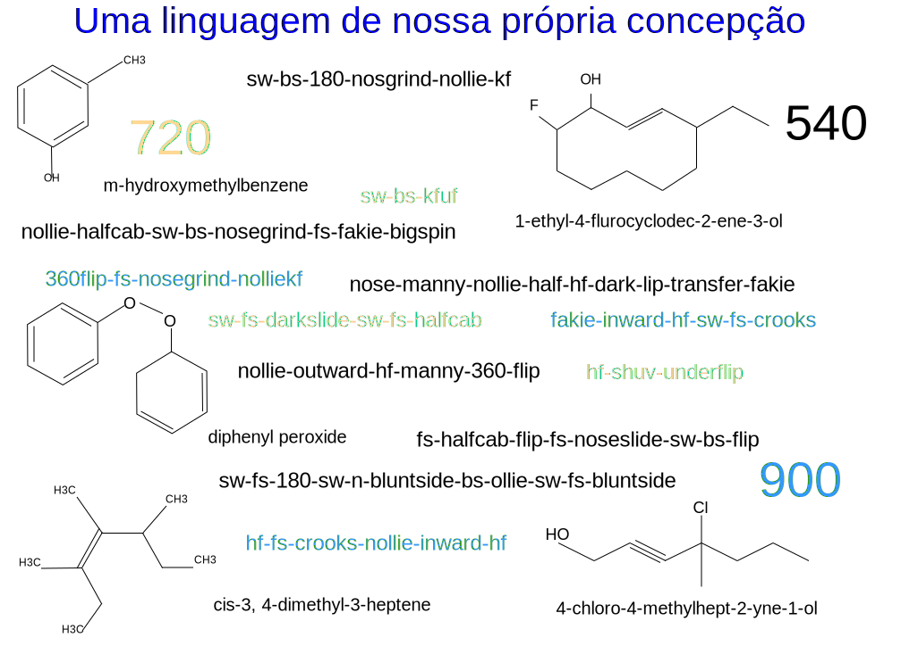

---

copyright:

  years:  2016, 2019

lastupdated: "2019-05-07"

subcollection: vmware-solutions

---

# Prefácio
{: #vcscar-preface}

## Introdução sobre a linguagem de skateboarding
{: #vcscar-preface-intro}

A forma como os skatistas combinam movimentos e submovimentos em manobras
impõe um tipo de gramática ou sintaxe, que se baseia na física do que está
acontecendo, a nomenclatura da química evoluiu por razões semelhantes. Hoje, um skatista de um lado do planeta pode
enviar mensagem de texto do nome de uma manobra para outro skatista do outro lado e seus
movimentos complexos são entendidos.

A riqueza da linguagem é alimentada pela complexidade do próprio
skateboarding. Os movimentos da prancha são intrincados, dando origem a dúzias de
manobras de base que podem ser feitas de múltiplas maneiras, iteradas em diversas
variáveis, para produzir um número enorme de combinações. Uma
estrutura de prefixo-raiz-sufixo para cada componente determina como cada
elemento ou movimento é concatenado, correspondendo a cenários reais de impulso
da prancha e seu condutor. A orientação física e a mecânica das
forças determinam o que combina e o que não combina, que é
o que impõe essa sintaxe.

As manobras podem ser feitas fora da cauda da prancha ou do nariz, *Ollie* ou
*Nollie*, correspondendo aos pés da frente ou de trás dos condutores. A prancha
gira, rola e tomba em combinações que são iteradas sobre três eixos, em
qualquer direção, no sentido horário ou no sentido anti-horário. O
condutor então emparelha movimentos com os movimentos da prancha, que inclui múltiplas
dimensões nas iterações com base na direção, rotação,
“stance” e se deve girar com ou contra o flip da
prancha.

Essas duas últimas variáveis merecem um pouco mais de explicação. Primeiro,
a *stance* é facilmente confundida com direcionalidade linear. Todos os skatistas têm
uma stance nativa, pé esquerdo ou direito para a frente; assim, fazer uma manobra
*switch* (switch-stance) significa que é a imagem de espelho dele, semelhante a um
rebatedor no beisebol. A direção para trás é incidental; a
distinção primária é uma destreza manual ou “destreza do pé”.  Assim, qualquer
manobra feita como *switch* merece muito mais crédito, não porque seja para trás,
mas porque todas as funções motoras são revertidas para o seu lado mais fraco ou
pé “errado”. Para simplesmente fazer uma manobra para trás ou "fakie" é simplesmente
colocar um sinal de menos na direção e envolve todas as mesmas funções
motoras, que são somente ligeiramente mais difíceis.

A segunda sutileza que é tão importante para os skatistas de nível superior
aplica-se a um flip *inward* ou *outward*, dependendo de como a prancha
gira e rotaciona (2 eixos) em relação ao próprio corpo. As manobras de flip
deslizam qualquer um dos lados do pé em qualquer uma das bordas da prancha:
os *kickflips* podem deslizar no sentido horário do lado do pé, enquanto os *heelflips* fazem
exatamente o oposto, girando com ou contra o fluxo natural do
movimento. Assim, os flips inward são tão pouco naturais que eles assumem um
termo separado bem merecido, chamado *hard-flips*. Assim, um
*nollie-inward-kickflip* é idêntico a um *nollie-hardflip*, que requer
mais precisão porque eles estão na contramão.

Portanto, cada componente dessa estrutura de prefixo-raiz-sufixo pode ser
dividido em três elementos mais binários de rotação, direção e
stance; algumas manobras requerem a necessidade de especificar se o flip
é inward ou outward. Andar de skate seria brincadeira de criança se não fosse a possibilidade de combinar manobras, que cria o efeito de bola de neve do número de iterações. Múltiplas manobras de base podem ser encadeadas
em clusters únicos que são compostos por pares, trios ou ainda
mais até cinco ou mesmo seis, para os melhores profissionais.

Até agora, o número de iterações práticas nos apresenta
centenas, o que apenas nos prepara para a situação; a complexidade real é vista em
*skate de rua*, que explode o número de combinações em
milhares.

De volta ao início dos anos 90, os skatistas adotaram as primeiras manobras em solo plano
e as projetaram no ambiente “orgânico” ao seu redor: escadas,
parapeitos, corrimãos, bancos, hips, barras planas, mesas de piquenique, vasos; tudo
isso abriu a dimensionalidade do que os definiu. As infinitas
maneiras de combinar manobras e terrenos em ligações yin-yang
mantiveram os skatistas ocupados por décadas. Isso também se aplica ao *skate vertical*,
exemplificado por Tony Hawk em rampas e piscinas.

Embora a maioria das manobras de base tenham sido estabelecidas ao longo dos anos, é a
capacidade de combinar e adaptá-las que muitas vezes supera a capacidade
nativa dos próprios profissionais. Esta é mais uma razão pela qual o skate é
mais uma arte do que um esporte. A expressão individual sempre mantém a primazia
sobre o desempenho bruto. É também o mecanismo de base que alimenta os
artistas que criaram a franquia de videogame de extremo sucesso da Activision,
*Tony Hawk Pro Skater*, que continuou por quase uma década, dando origem
a jogos rivais da *Electronic Arts* também.

Treinando o Watson Assistant para imitar o processo de pensamento de profissionais
de alto nível, podemos fornecer uma ferramenta poderosa para avançar o pensamento criativo
de qualquer skatista, especialmente nos níveis de elite. Embora o restante dos
esportes de prancha seja muito menos complexo, isso é um testamento para a
influência desproporcional que o skateboarding tem, no sentido em que eles adotam nossas
convenções também. Assim, o Watson Assistant tem o potencial para não
somente ajudar, se não transformar, a expressão criativa desse esporte Olímpico
recém-adotado, mas também para influenciar outros empreendimentos
artísticos.

## Codificação da linguagem
{: #vcscar-preface-codification}

Como em qualquer outra linguagem, a nossa foi desenvolvida ao longo do tempo, captando novas palavras
e uso, renderizando redundâncias e exceções ocasionais ao longo do
caminho. Dito isto, essa nomenclatura é notavelmente consistente, durável e
específica. É esse rigor denotativo e consistência que converte o
problema aparentemente intransponível de conversão de filmagem em texto por
aprendizado de máquina. Para os skatistas, cada nuance do movimento complexo é
integrada à própria nomenclatura. Na verdade, essa linguagem é tão robusta que foi adotada não só pelos praticantes de snowboarding, mas também pelos surfistas.

Ainda assim, com toda essa complexidade e poder, a codificação da linguagem é
simples e concisa. Cada *manobra de base* tem um componente *direcional* e
*rotacional*, juntamente com uma *aterrissagem*, que determina se
e como ela concatena com a próxima manobra de base para formar combinações,
estes são os quatro *elementos principais*. Mais dois *modificadores* são acrescentados:
um *prefixo de giro* para orientar a rotação do condutor (no sentido
horário ou anti-horário), enquanto o outro componente *varial* especifica como
a prancha gira em relação ao corpo (inward ou outward). Usando essa
codificação, um conjunto de regras conciso pode ser aplicado recursivamente para permitir
combinações de qualquer comprimento.

## Variáveis ambientais adicionais
{: #vcscar-preface-env-var}

Os profissionais de hoje dedicam tanto esforço procurando pontos quanto
praticando as manobras. De fato, parte do que distingue qualquer skatista é a capacidade criativa de adaptar manobras a maneiras novas e imaginativas, que muitas vezes levam o skatista para o mundo todo. Embora existam aplicativos de skate
que catalogam os pontos, que são alimentados pela comunidade, nunca
houve a ideia ou tecnologia para criar um aplicativo que tenha a capacidade
de ajudar qualquer skatista, especialmente profissionais, nesse processo criativo.

Esta arquitetura de referência demonstra como o Watson e a nuvem
usam a enorme presença on-line de skatistas no YouTube, Google
Images, revistas on-line (Thrasher, Transworld), fóruns de skatistas
e videogames e, o mais importante, o infinito fluxo de manobras todos os dias na
mídia social das manobras mais novas ao redor do mundo, especialmente no
Instagram. Além disso, não há problemas de tradução; esta é uma linguagem
internacional, semelhante a uma linguagem de computador ou matemática,
em que os mesmos nomes e convenções são usados uniformemente em todo o
mundo.

O Watson Knowledge Studio atualiza o Discovery Service com descrições
de manobras, artefatos de mídia, informações de locais (pontos) e muito mais,
com base em consultas de um skatista específico. O robô de bate-papo tem um número finito de
conversas que derivam de qualquer manobra, com base em linhas criativas
e pragmáticas de raciocínio dos skatistas profissionais experientes. Assim, o
Assistente pode responder com o ponto (local) mais próximo ou melhor para fazer uma
manobra específica ou responder com um intervalo mais amplo de terreno para não apenas
essa manobra, mas outras que são feitas com a mesma raiz (ou seja, variações).

Por exemplo, um skatista pode pedir ao Watson Assistant para listar todas as variações
possíveis de um *hardflip-to-backside-5-0*. Essa solicitação é convertida
de fala para texto no Discovery Service, que responde com variações não apenas de
*hardflip-to-grind*, mas uma lista dos vários terrenos que as
variações capturam, portanto mais propícios, o que pode incluir
uma lista de corrimãos a serem agrupados por código de endereçamento postal local, por tamanho ou até mesmo
disponibilidade, como em um pátio de escola ou empresa. Os sistemas estão dentro dos dados existentes do aplicativo que classificam o risco de ser capturado por
transgressão. Essa assistência tem um enorme impacto sobre as
consequências em cascata de variáveis como essas, que ajudam a
vida criativa de todos os skatistas profissionais.

## A plataforma de nuvem
{: #vcscar-preface-cloud-platform}

A definição de camadas criativas de sistemas de TI para gerar novas combinações fala
ao coração do skateboarding. Isso tem o poder de ondulação na vida de
pessoas criativas para inspirar inovação, em todo o mundo, onde quer que nós formos.
Nada disso seria alcançado sem o {{site.data.keyword.cloud}}.

## Links relacionados
{: #vcscar-preface-related}

* [Visão geral do vCenter Server on {{site.data.keyword.cloud_notm}} with Hybridity Bundle](/docs/services/vmwaresolutions/archiref/vcs?topic=vmware-solutions-vcs-hybridity-intro)
