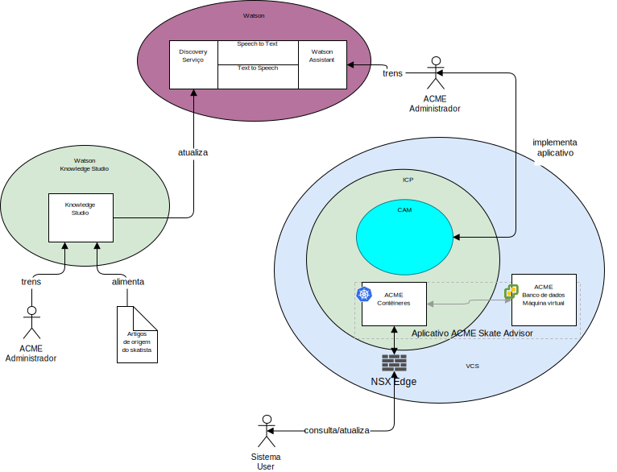

---

copyright:

  years:  2016, 2018

lastupdated: "2018-11-14"

---

## Contexto do sistema
O diagrama a seguir mostra o contexto de sistema para essa arquitetura de
referência. Um diagrama de contexto de sistema é um diagrama que define os elementos
chave de um sistema, o limite do sistema, as entidades que
interagem com ele juntamente com a interação. É um diagrama de alto nível
que fornece ao leitor uma visualização inicial do sistema.

Figura 1. Contexto de sistema

A seguir estão os componentes principais de contexto de sistema:
-	vCenter Server -o VMware vCenter Server on {{site.data.keyword.cloud_notm}} é uma instância do {{site.data.keyword.cloud_notm}} for VMware
Services que é o destino para máquinas virtuais (VMs) migradas por meio do
ambiente no local. Juntamente com a Virtualização no local, é
um ambiente híbrido e permite que as VMs se movam de um ambiente
para outro.
-	{{site.data.keyword.cloud_notm}} Private – o ICP é uma plataforma de aplicativo para
desenvolver e gerenciar aplicativos conteinerizados. O ambiente do ICP é um ambiente
integrado que inclui o orquestrador de contêineres Kubernetes, um
repositório de imagem privada, um console de gerenciamento, estruturas de monitoramento
e uma interface gráfica com o usuário, que fornece um local centralizado
por meio do qual é possível implementar, gerenciar, monitorar e escalar aplicativos.
-	{{site.data.keyword.cloud_notm}} Automation Manager - o CAM é uma infraestrutura pronta
para a empresa como plataforma de código que fornece uma única área de janela de vidro para
provisionar cargas de trabalho baseadas em VM ao lado de cargas de trabalho baseadas em Kubernetes, a
automação de fornecimento de cargas de trabalho, seja VM e/ou contêineres e
seus pré-requisitos de infraestrutura. 
-	Watson - Watson é a plataforma de inteligência artificial e soluções cognitivas da IBM. 
-	Watson Knowledge Studio - o Watson Knowledge Studio fornece um modelo para ser usado
pelo Watson Discovery.

### Atores
O diagrama de contexto de sistema identifica os agentes a seguir:

* Administrador do Acme - o administrador é responsável pela
implementação e manutenção contínuas do aplicativo, incluindo as
tarefas contínuas a seguir:
 - Treinar o robô de bate-papo
 - Treinar o serviço de descoberta.
* Usuário do sistema - o usuário do sistema é o usuário do
sistema. O usuário se comunica com o sistema por meio de um navegador de
dispositivo apto para navegador.

### Sistemas
O diagrama de contexto de sistema identifica os sistemas a seguir:
* Knowledge Studio - o Watson Studio é uma ferramenta usada para projetar a
linguagem de skate para o sistema e usar essa linguagem para reconhecer
os documentos da web que implementam a linguagem de skate.
* Speech to Text - transcreve fala para texto. Esse componente aceita áudio de um dispositivo no qual o robô de bate-papo está em execução e o converte em texto para o Watson processar.
* Text to Speech – Combinar texto com fala Esse componente aceita texto do aplicativo Skate Advisor e o converte em fala para o dispositivo em que o robô de bate-papo está em execução, para reprodução.
* Discovery Service - o Watson Discovery Service é usado pelo
sistema para recuperar Registros de Skate que correspondem aos parâmetros solicitados. Um
exemplo pode ser, “Listar todos os registros para a Manobra Casper”. \ Watson
Assistant - o Watson Discovery Service é usado pelo sistema para recuperar
conteúdo relacionado a skate que corresponde aos parâmetros solicitados. Um exemplo poderia ser "Listar todos os registros do Truque de Casper". O Watson Discovery usa técnicas avançadas de aprendizado de máquina para exibir as passagens mais relevantes do conteúdo alimentado.  
* Banco de dados - o banco de dados do Acme Skate Advisor é hospedado em uma máquina
virtual que é gerenciada pelo vCenter Server.
* Contêineres de aplicativo - os aplicativos que passaram pela jornada de modernização de aplicativo e agora estão sendo executados como contêineres. Para esta arquitetura de referência e neste exemplo para Acme Skateboards, um dos apps conteinerizados é um servidor da web que faz parte da carga de trabalho de presença on-line. Os contêineres ACME hospedam o aplicativo da web Acme e o aplicativo Acme Skate Advisor.
* NSX Edge - os NSX Edges são dispositivos virtuais que gerenciam o tráfego norte-sul para dentro e para fora da instância do vCenter Server.

## Links relacionados

* [Visão geral do vCenter Server on {{site.data.keyword.cloud_notm}} with Hybridity Bundle](../vcs/vcs-hybridity-intro.html)
