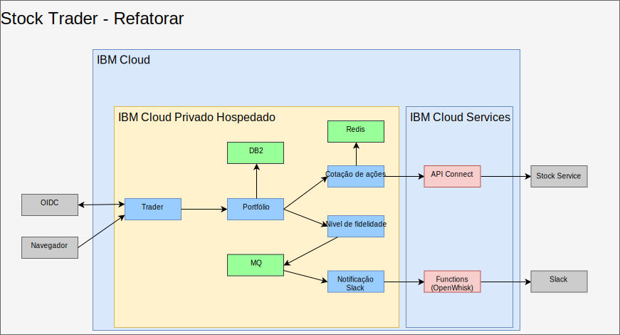
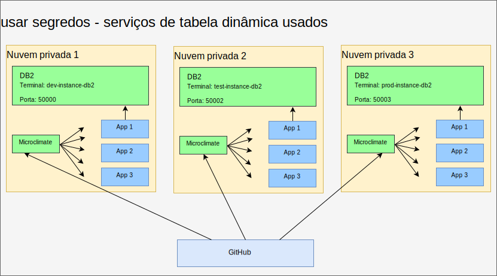
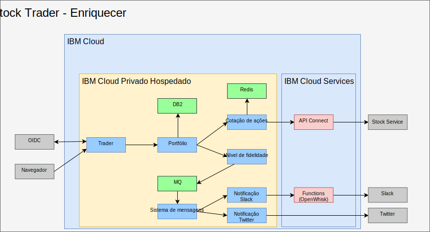

---

copyright:

  years:  2016, 2019

lastupdated: "2019-03-25"

subcollection: vmware-solutions

---

# Refatorar e incluir middleware no IBM Cloud Private
{: #vcscontent-addmidware}

Agora que o Stock Trader está em execução em um contêiner e Jane está satisfeita
com os microsserviços atuais, ela e Todd trabalham em como aprimorar o
aplicativo com recursos extras. Ao refatorar os microsserviços do Stock Trader para manipular a atividade e a escalabilidade aumentadas, eles veem a necessidade de incluir o middleware no {{site.data.keyword.cloud}} Private. Alguns dos
middlewares existiam em seu data center, portanto, isso se torna mais que um
exercício de nova plataforma com um novo middleware incluído.

Figura 1. Refatoração do Stock Trader

Esta refatoração da solução traz uma plataforma comum para executar o aplicativo
e os serviços necessários, trazendo um plano de gerenciamento
mais simples.

## Opções de conteúdo
{: #vcscontent-addmidware-content-choices}

O {{site.data.keyword.cloud_notm}} Private tem uma ampla seleção de conteúdo e tanto Todd quanto Jane precisam decidir qual melhor se adéqua às suas necessidades. Como Todd vê no catálogo do {{site.data.keyword.cloud_notm}} Private, a maioria do conteúdo está disponível para ser experimentado, mas algum conteúdo requer compra e download por meio do Passport Advantage.

* Toolchain e Runtimes
  - UrbanCode Deploy
  - Microclimate
  - Jenkins (software livre)
  - IBM WebSphere Liberty (MicroProfile, Web Profile, Java Platform, Enterprise Edition Profile)
  - Open Liberty (software livre)
  - Tempo de execução do Node.js (software livre)
  - Tempo de execução de Swift (software livre)
  - nginx (software livre)
  - IBM WebSphere Application Server for {{site.data.keyword.cloud_notm}} Private MV Quickstarter Community Edition

* Integração
  -	IBM Integration Bus
  -	IBM Integration Bus for Developers
  -	IBM DataPower Gateway Virtual Edition
  -	IBM DataPower Gateway for Developers
  -	IBM API Connect Professional
  -	IBM API Connect Enterprise
  -	IBM App Connect Enterprise Developer Edition
  -	IBM App Connect Enterprise 11.0.0

* Data Science e Business Analytics
  -	IBM Data Science Experience Local
  -	IBM Data Science Experience Developer Edition
  -	IBM Watson Explorer Deep Analytics Edition
  -	IBM PowerAI (Licenciado por ILAN, oferta de suporte disponível)
  - IBM PowerAI Vision

* Controle de dados e integração
  -	IBM InfoSphere Information Server for evaluation
  móvel
  -	IBM Mobile Foundation

* Conectividade
  -	IBM Voice Gateway Developer Trial

* Conjunto de ferramentas de modernização de aplicativo
  -	IBM Transformation Advisor

* Sistema de mensagens
  -	IBM MQ Advanced
  -	IBM MQ Advanced for Developers
  -	Rabbit MQ (software livre)
  -	IBM Event Streams Tech Preview (baseado no Apache Kafka)

* Automação de negócios digitais
  -	IBM Operational Decision Manager
  -	IBM Operational Decision Manager for Developers
  -	IBM FileNet Content Manager 5.5
  -	IBM Content Foundation 5.5

* Serviços de dados
  -	IBM DB2 Direct Advanced Edition/AESE com Data Server Manager
  -	IBM Db2 Dev-C
  -	IBM Data Server Manager (para Db2 Dev-C)
  -	IBM Db2 Warehouse Enterprise
  - IBM Db2 Warehouse Dev-C
  -	IBM Cloudant Developer Edition
  -	MongoDB (software livre)
  -	PostgreSQL (software livre)
  -	MariaDB (software livre)
  -	Armazenamento em cluster do Galera com MariaDB (software livre)
  -	Redis (software livre)

* HPC / HPDA
  -	IBM Spectrum LSF Community Edition
  -	IBM Spectrum Symphony Community Edition
  -	IBM Spectrum Conductor Technical Preview

* Gerenciamento de multinuvem
  -	{{site.data.keyword.cloud_notm}} Automation Manager

* Watson
  -	IBM Watson Compare and Comply: Element Classification
  -	Compliance Assist

* Gerenciamento
  -	IBM Netcool - integração (análise para serviços do {{site.data.keyword.icpfull_notm}} – eventos de criação de log e
alertas de monitoramento)
  - {{site.data.keyword.cloud_notm}} App Management 2018.2.0
  -	IBM Netcool - integração (análise para gerenciar eventos do {{site.data.keyword.icpfull_notm}}. Vendido com o produto
IBM Netcool Insights)
  - {{site.data.keyword.cloud_notm}} Event Management for IBM
Cloud Private (Licenciado por ILAN para descoberta e tentativa por meio do catálogo)
  - IBM Operations Analytics Predictive Insights Mediation Pack (gerenciar
métricas de monitoramento do {{site.data.keyword.icpfull_notm}}. Licenciado por ILAN para descoberta e tentativa por meio do
catálogo) - IBM Operations Analytics Predictive Insights Mediation Pack
(vendido com o produto Predictive Insights)

* Rede
  -	F5 BIGIP Controller (software livre)
  -	Calico BGP-Peer (software livre)
  -	VPN IPSec strongSwan (software livre)

* Armazenamento
  -	IBM PowerVC FlexVolume Driver (software livre e suportado pelo
produto PowerVC)
  - Cluster de armazenamento GlusterFS com gerenciamento de ciclo de vida do Heketi (software
livre)
  -	NFS de amostra do Container Storage Interface (CSI)
  -	driver (software livre)
  -	Cluster Rook Ceph (software livre)

* Tools (Ferramentas)
  -	Web Terminal (software livre)
  -	Skydive – analisador de rede (software livre)

Para o Stock Trader, com base na arquitetura de solução de Jane, Todd iniciará com o [Db2](https://cloud.ibm.com/catalog/services/db2-hosted), o [MQ](https://cloud.ibm.com/catalog/services/mq) e o [Redis](https://cloud.ibm.com/catalog/services/databases-for-redis).

## Incluindo middleware
{: #vcscontent-addmidware-add-middleware}

Para incluir middleware no {{site.data.keyword.cloud_notm}} Private, localize o [gráfico helm](https://github.com/IBM/charts/blob/master/stable/ibm-microclimate/README.md) no catálogo, leia o arquivo leia-me e, em seguida, continue a instalação.

Para o Stock Trader, Todd decidiu incluir todo o middleware. As informações a seguir resumem o que Todd teve que executar para cada middleware que ele desejava que Jane usasse.

### DB2
{: #vcscontent-addmidware-db2}

Todd inicia com o Db2 porque ele já está usando o Db2 e pode
dedicar um Db2 baseado em contêiner para cada solução.

Como Todd preparou o {{site.data.keyword.icpfull_notm}}, ele já tem sua política de segurança de pod definida. Todd pode se concentrar em criar um segredo de pull de imagem do docker:

`kubectl create secret docker-registry db2dockerregistry
--docker-username=dockeruser
--docker-password=XXXXXXXX-XXXX-XXXX-XXXX-XXXXXXXXX
--docker-email=dockeruser@email.com --namespace=default`

Finalmente, como Todd decidiu usar NFS, ele criou volumes NFS com base nos
requisitos do arquivo leia-me:

Acesse o painel do {{site.data.keyword.icpfull_notm}} e crie o Volume Persistente. Quão grande? Verifique o
arquivo leia-me para descobrir:

`capacity=20Gi
RWO
type=NFS
server = nfs.server.ip.address
path = /shared/db2trader1`

Na interface com o usuário do catálogo, procure "Db2" e clique em ibm-db2oldp-dev.
Revise o arquivo leia-me, em seguida, clique em Configurar.

Na seção Configurar, há uma seção Iniciação rápida e uma seção Todos
os parâmetros. Abra Todos os parâmetros, uma vez que Todd precisa inserir
mais configuração:

*	Nome da liberação = db2trader1
*	namespace = default
*	concordar com licença
*	nome do banco de dados = trader
*	nome do segredo = db2dockerregistry
*	nome do serviço = db2trader1-ibm-db2oltp-dev
*	tipo de serviço = NodePort
*	Porta = 50000
*	nome da instância do DB2 = db2inst1
*	senha para nome da instância do DB2 = xxxxxx
*	Sim (marcar) Ativar persistência para esta implementação

Após o Db2 estar em execução, Todd ou Jane precisa criar as tabelas que a
solução Stock Trader usa.

### MQ
{: #vcscontent-addmidware-mq}

Todd e Jane precisam de software de sistema de mensagens e, como eles já usam o MQ,
essa é uma ótima opção. Além disso, ele pode ser executado em uma área de cobertura pequena, e
a versão dev pode ser ativada para cada Desenvolvedor, economizando o tráfego
precioso de Produção. A instalação do MQ é bastante simples. Todd cria o
armazenamento exatamente como ele fez com o Db2 e, em seguida, instala o gráfico helm:

Painel do {{site.data.keyword.icpfull_notm}} > Catálogo > comece a digitar no MQ > selecione
ibm-mqadvanced-server-dev. Revise o arquivo leia-me, em seguida, clique em Configurar.
Forneça ou verifique os valores de entrada a seguir:

`nome da liberação = mqtrader1
namespace de destino = stock-trader
aceitar licença
ativar persistência
tamanho do PVC dos dados = 2Gi
Tipo de serviço = NodePort
Nome do gerenciador de filas = stocktrader
Senha do administrador = mq1pw
Senha do app = DEIXAR EM BRANCO`

Inicialmente, Todd seleciona NodePort para chegar ao
middleware por meio da interface com o usuário. Eventualmente, Todd pode usar o ClusterIP para que somente
os pods dentro do cluster possam chegar ao middleware.

Para configurar o MQ para usar o Stock Trader, Todd abre a interface com o usuário
do MQ Management, que é exatamente a mesma que aquela da versão da MV.

### Redis
{: #vcscontent-addmidware-redis}

Mesmo que o Stock Trader esteja em execução no {{site.data.keyword.cloud_notm}} Private Hosted, eles
ainda estão preocupados com a latência do serviço de cotação de ações quando tudo o que eles
realmente se importam é o fim do estoque do dia anterior para a maior parte de seu
trabalho. Para ajudar a melhorar o desempenho, eles incluem um cache do Redis.

Essa implementação usa o gráfico ibm-redis-ha-dev de ibm-charts.

Por padrão, esse gráfico instala seis pods: um mestre, dois escravos e três sentinelas. Este é um ótimo exemplo de resiliência no Kubernetes em que
mais de um pod trabalha junto em muitos nós do trabalhador, mesmo quando os
nós do trabalhador estão em mais de uma sub-rede.

A configuração é simples, portanto, Todd insere em qual namespace
instalá-lo e inicia a instalação.

## Refatorar o Stock Trader
{: #vcscontent-addmidware-refactor-stock-trader}

A refatoração do Stock Trader é uma etapa importante para Jane. Enquanto Todd estava ocupado incluindo o
middleware no {{site.data.keyword.cloud_notm}} Private, Jane refatorou sua solução
para otimizá-la para comportamentos do Kubernetes e da nuvem.

Por exemplo, quando Jane transformou o Stock Trader, ela pegou os arquivos
.war e incluiu cada um em um contêiner do Liberty, mas usou a configuração do WebSphere Application Server Network
Deployment para apontar para a origem de dados. Foi um
bom início, e o aplicativo de Jane aproveita o planejamento e a orquestração
do Kubernetes imediatamente.

Existem muitos outros benefícios da otimização de microsserviços de Jane (recodificação
e construção) para o mundo do Kubernetes.

Para otimizar, Jane executou as etapas a seguir:
-	Atualizou o código em seu repositório de código (Jane usou o GitHub Enterprise)
-	Incluiu um pipeline (Jane usou o Jenkins)
-	Construiu usando o Maven

A seguir, um exemplo de [repositório de
código] (https://github.com/IBMStockTrader/) de Jane, junto ao
arquivo do Jenkins, server.xml, etc. Com isso no lugar, Jane pode codificar livremente
recursos extras por meio de segredos para acessar serviços como o ODM e
o Watson, juntamente com mais microsserviços como repositórios individuais
no GitHub.

### Incluindo segredos
{: #vcscontent-addmidware-add-secrets}

Agora que Jane refatorou os microsserviços do Stock Trader, ela
requer uma maneira de abstrair os nomes de serviço, IDs de usuário e senhas, para que seu aplicativo possa captar detalhes exclusivos sobre o serviço quando implementado
sem codificar permanentemente nomes específicos e reconstruir o aplicativo.

Usando segredos do Kubernetes, Jane configura um nome de segredo e parâmetros
bem definidos dentro de cada segredo para assegurar que quando o microsserviço for
implementado, ele capte o nome do host, o ID do usuário, a senha ou
quaisquer outras credenciais sensíveis, tornando seu aplicativo móvel.

Jane deseja um código base unificado, mesmo quando o Stock Trader pode ser executado em
mais de uma nuvem. O DB2 secreto na figura a seguir tem detalhes
de roteamento diferentes, mas no mesmo formato. Quando o microsserviço de portfólio de Jane é implementado, ele procura o parâmetro de terminal secreto do DB2 para se conectar
à instância apropriada do DB2. O aplicativo Stock Trader não se importa se está sendo executado em uma máquina virtual do VMware, um serviço conteinerizado ou como um serviço gerenciado por nuvem.

Figura 2. Stock Trader - serviços de tabela dinâmica

## Resultado
{: #vcscontent-addmidware-result}

Como Jane se comprometeu a refatorar sua solução Stock Trader
e Todd a instalar o middleware no {{site.data.keyword.cloud_notm}} Private Hosted, toda a solução
Stock Trader principal está em execução em uma nuvem privada. Jane agora
inclui mais microsserviços, como um serviço de notificação do Twitter. As
regras de roteamento do Istio ativam o sistema de mensagens de nível de fidelidade dinâmico por meio de um canal
interno do Slack ou um canal público do Twitter.

Figura 3. Enriquecimento do Stock Trader

## Links relacionados
{: #vcscontent-addmidware-related}

* [Visão geral do vCenter Server on {{site.data.keyword.cloud_notm}} with Hybridity Bundle](/docs/services/vmwaresolutions/archiref/vcs?topic=vmware-solutions-vcs-hybridity-intro)
