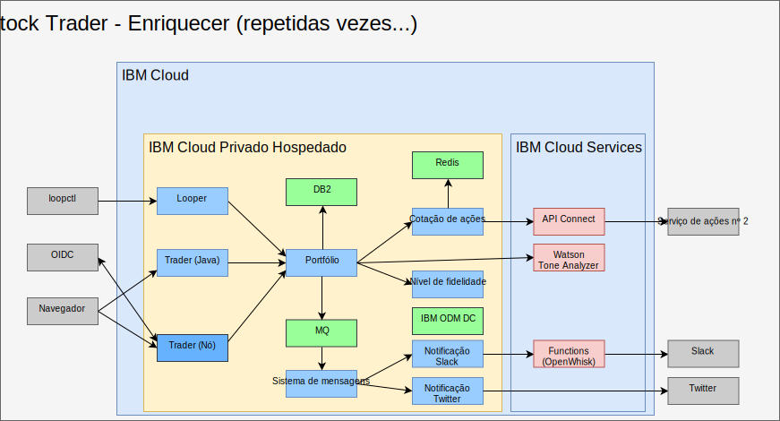

---

copyright:

  years:  2016, 2019

lastupdated: "2019-02-15"

---

# Enriquecer com AI, analítica e outros serviços de nuvem pública
{: #vcscontent-aianalytics}

Enriquecer o Stock Trader não é uma etapa única. Para Todd e Jane, isso é um processo iterativo. Na figura a seguir, você vê que Jane incluiu o serviço Watson Tone Analyzer e uma regra de nível de fidelidade usando o centro de decisão do ODM. Os itens a seguir destacam como o Stock Trader foi enriquecido.

Figura 1. Maior enriquecimento do Stock Trader

## AI Watson Tone Analyzer
{: #vcscontent-aianalytics-ai-watson}

A amostra a seguir é uma maneira simples de enriquecer um aplicativo, mas é aparentemente poderosa. Jane procura no [catálogo do {{site.data.keyword.cloud}}](https://console.cloud.ibm.com/catalog/) os serviços [AI](https://console.cloud.ibm.com/catalog/?category=ai) e [Analytics](https://console.cloud.ibm.com/catalog/?category=analytics) e acha o catálogo rico em conteúdo.

Jane seleciona [Tone Analyzer](https://console.cloud.ibm.com/catalog/services/tone-analyzer), optando pelo plano Padrão e, em seguida, as credenciais para chamada são fornecidas.
Jane refatorou o Stock Trader e apenas cria um segredo de Kubernetes para o Tone Analyzer. Dessa forma, mesmo que Jane mude os planos ou regiões, não é necessário reconstruir o código.

Graças à refatoração, Jane experimentou várias estruturas de interface com o usuário sem interromper a experiência do usuário. Como resultado, a nova interface com o usuário está disponível para ser usada e para ajudar a entender o tom do feedback do usuário.

No futuro, Jane pode fornecer recomendações preditivas de ações com base na variedade de serviços de analítica disponíveis para execução na instância da nuvem privada, {{site.data.keyword.cloud_notm}} Private.

## Regra de negócios de Nível de fidelidade
{: #vcscontent-aianalytics-loyalty-rule}

Originalmente, Jane tinha a lógica em seu código para determinar a quantia monetária
que provavelmente resultaria em um aumento de fidelidade. No entanto, após repetidas solicitações para
mudar o intervalo da diretora de marketing do Stock Trader, Jane decidiu
transferir essa decisão para uma regra de negócios que a diretora de
marketing pode alterar sem o envolvimento de Jane.

Jane falou com Todd, que incluiu o
[serviço](https://console.cloud.ibm.com/catalog/services/decision-optimization) e, em seguida, criou a decisão.

Agora, Margaret, a diretora de marketing, pode efetuar login e mudar os intervalos de níveis de fidelidade sempre que uma campanha está ocorrendo sem mudar nenhum código.

## Novo serviço de ações
{: #vcscontent-aianalytics-new-stock-service}

Você pode observar que o serviço de ações foi mudado.
Isso pode acontecer quando um serviço público muda o proprietário ou sua estrutura
de API. Felizmente, Jane usou [API
Connect](https://console.cloud.ibm.com/catalog/services/api-connect).
Originalmente, ela usou o API Connect para simplificar a resposta do
serviço de ações original, já que era um pouco incômodo receber e
formatar os dados que ela desejava da API bruta fornecida.

Agora, Jane está muito satisfeita porque quando mudou o serviço de ações, ela apenas mudou a forma de mapeamento para a API simplificada criada por ela
e seu código nem precisou ser reiniciado. A solução Stock Trader apenas
continuou solicitando os dados da mesma API como que se ela não tivesse mudado. Todas
as mudanças na API foram mascaradas nos bastidores.

Além disso, com o monitoramento e a medição no API Connect, Jane é capaz de
rastrear quem está usando sua API simplificada.

## Links relacionados
{: #vcscontent-aianalytics-related}

* [Visão geral do vCenter Server on {{site.data.keyword.cloud_notm}} with Hybridity Bundle](/docs/services/vmwaresolutions/archiref/vcs?topic=vmware-solutions-vcs-hybridity-intro)
