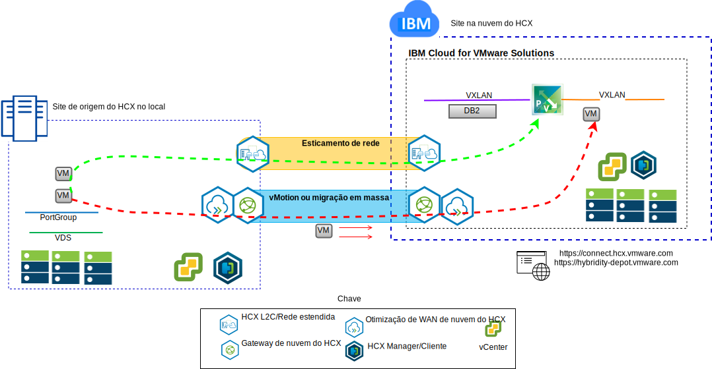

---

copyright:

  years:  2016, 2019

lastupdated: "2019-02-15"

---

# Elevar e deslocar MVs do Stock Trader para o IBM Cloud
{: #vcscontent-hcx}

Todd deseja ampliar continuamente sua instância do VMware SDDC no local
para um VMware vCenter Server no {{site.data.keyword.cloud}} para a primeira etapa em sua
jornada de modernização. O negócio deve permanecer funcionando
e o tempo de inatividade deve ser mantido em um mínimo.

O VMware vCenter Server on {{site.data.keyword.cloud_notm}} with Hybridity Bundle permite a criação de uma conexão
contínua entre as instâncias do vCenter Server e um
data center virtualizado do VMware no local.

Os componentes do vCenter Server with Hybridity Bundle, que são implementados
como máquinas virtuais no site de destino do {{site.data.keyword.cloud_notm}} VMware, permitem o
estabelecimento de uma conexão com os componentes do HCX que estão instalados
no site de origem no local do peer.

Figura 1. vCenter Server with Hybridity Bundle

O hibridismo cria uma interconexão fracamente acoplada entre no local
e o {{site.data.keyword.cloud_notm}} e permite os recursos a seguir:

* Interconectividade simples – as conexões de rede lógica são estabelecidas
facilmente sobre qualquer conexão física que inclui a Internet pública, a VPN
privada ou o link direto.
* Extensão da camada 2 - as redes locais são estendidas para a nuvem e incluem sub-redes no local e endereçamento IP.
* Criptografia – o tráfego de rede é criptografado com segurança entre os dois
lados.
* Rede otimizada – seleciona a melhor conexão e faz com que, de maneira eficiente, ela tenha uma sobrecarga a fim de que o tráfego da rede seja movido o mais rápido possível.
* Deduplicação de dados – até 50% de redução no tráfego de rede pode
ser alcançado.
* Roteamento inteligente - quando uma carga de trabalho é movida, o roteamento de proximidade pode
mudar o gateway de rede para que o tráfego de rede use o
gateway do site de destino e não se prenda de volta ao site de origem.
* Migração de tempo de inatividade zero - um sistema em execução pode ser movido para (ou voltar de)
a nuvem usando vMotion.
* Migração planejada - qualquer número de máquinas virtuais pode ser replicado
para o site de destino e, em seguida, ativado nesse site em um horário
designado, substituindo os sistemas que estão em execução no site de origem.
* Migração de políticas de segurança - se o NSX for usado no local, quaisquer
políticas de segurança, firewalls e outros itens de segurança serão movidos juntamente com a carga de trabalho.

Todd é capaz de migrar o Stock Trader de seu
ambiente do VMware no local para o VMware no ambiente do {{site.data.keyword.cloud_notm}} e atende seus requisitos de pouco a nenhum tempo de inatividade e nenhuma
reconfiguração de aplicativo.

## Links relacionados
{: #vcscontent-hcx-related}

* [Visão geral do vCenter Server on {{site.data.keyword.cloud_notm}} with Hybridity Bundle](/docs/services/vmwaresolutions/archiref/vcs?topic=vmware-solutions-vcs-hybridity-intro)
