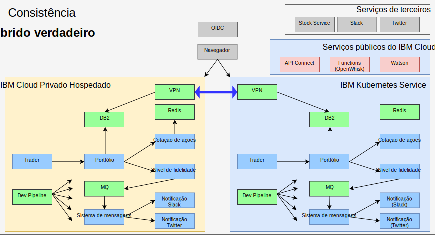

---

copyright:

  years:  2016, 2019

lastupdated: "2019-02-15"

---

# Híbrido verdadeiro com o IBM Cloud Kubernetes Service
{: #vcscontent-iks}

Conforme a equipe de teste de Jane se expande, ela deseja fornecer um ambiente de teste
que execute grandes partes de seu aplicativo e ainda use os dados que ela tem
em seu ambiente. Jane deseja que sua equipe de teste se concentre no teste
de seu aplicativo, e não no gerenciamento do cluster do Kubernetes. Jane e Todd decidem levantar uma instância do [{{site.data.keyword.cloud}} Kubernetes
Service] (https://www.ibm.com/cloud/container-service) e Jane
implementa o Stock Trader, sem mudanças de código, nessa instância.

Todd, em seguida, inclui a VPN strongSwan para se conectar entre as redes
privadas de cada cluster.

Figura 1. Stock Trader como um aplicativo híbrido verdadeiro

## Links relacionados
{: #vcscontent-iks-related}

* [Visão geral do vCenter Server on {{site.data.keyword.cloud_notm}} with Hybridity Bundle](/docs/services/vmwaresolutions/archiref/vcs?topic=vmware-solutions-vcs-hybridity-intro)
