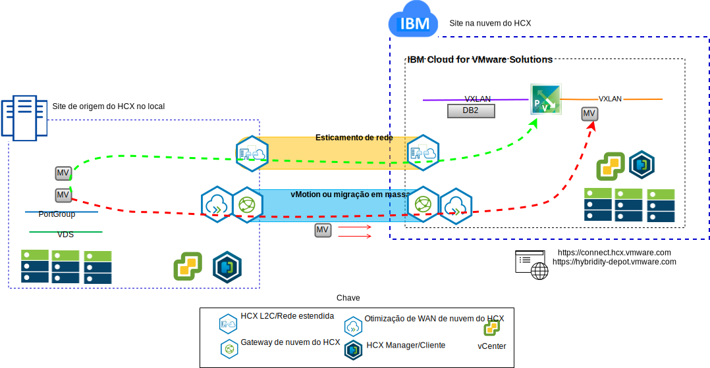

---

copyright:

  years:  2016, 2019

lastupdated: "2019-03-06"

subcollection: vmwaresolutions

---

# Introdução ao VMware Hybrid Cloud Services
{: #vcshcx-intro}

O VMware Hybrid Cloud Services (HCX) permite que instâncias díspares de software defined data centers (SDDC) do vSphere interoperem em vários tipos de rede. Eles incluem LAN ou WAN, independentemente de serem ou não protegidos na Internet pública. O HCX foi projetado para tratar dos problemas de segurança, compatibilidade, complexidade e desempenho que alguém poderia encontrar ao tentar alcançar uma implementação multi-instância e multisite do vSphere que se estende pelos limites do provedor no local e em nuvem.

Figura 1. VMware Hybrid Cloud Services

O HCX é o método preferencial para interoperação entre as ofertas vSphere totalmente automatizadas no {{site.data.keyword.cloud}} e qualquer outra instância implementada do vSphere. O HCX agora é uma oferta totalmente integrada dentro do {{site.data.keyword.vmwaresolutions_short}}.

Esse guia destina-se à implementação e às operações do HCX, incluindo melhores práticas e resolução de problemas, conforme aceitas e entendidas no momento. Como o HCX é desenvolvido usando a metodologia de desenvolvimento ágil, não use este guia como a origem de fato de versões suportadas ou plataformas suportadas.

## Links relacionados
{: #vcshcx-intro-related}

* [Visão geral do vCenter Server on {{site.data.keyword.cloud_notm}} with Hybridity Bundle](/docs/services/vmwaresolutions/archiref/vcs?topic=vmware-solutions-vcs-hybridity-intro)   
