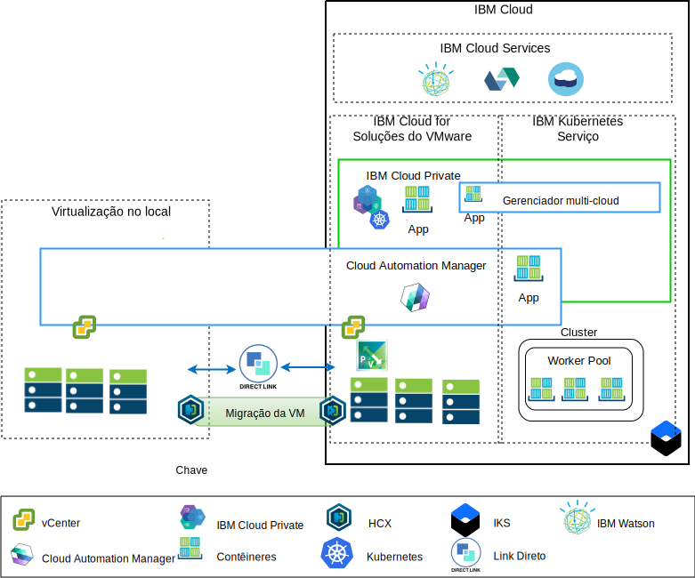

---

copyright:

  years:  2016, 2019

lastupdated: "2019-03-15"

subcollection: vmwaresolutions

---

# Visão geral de modernização do
{: #vcsicp-appmod}

O diagrama a seguir mostra a arquitetura de referência de modernização de aplicativo que o Acme Skateboards implementa. A arquitetura é descrita em profundidade nesta série de documentos.

Figura 1. Diagrama de visão geral da arquitetura

Essa arquitetura híbrida permite que o Acme Skateboards atinja os objetivos a seguir:
- Migrar máquinas virtuais VMware (MVs) no local para o {{site.data.keyword.cloud}} com pouco ou nenhum tempo de inatividade e nenhuma reconfiguração do aplicativo.
- Ativar o início da jornada de modernização de aplicativo, permitindo o foco na conteinerização das interfaces da web e middleware mais simples, enquanto permite que os bancos de dados mais complexos permaneçam como MVs.
- Usar o {{site.data.keyword.cloud_notm}} Automation Manager (CAM) para o infrastructure as code (IaC) de script para editar e orquestrar serviços que são feitos por meio de MVs e contêineres para integração às suas cadeias de ferramentas do DevOps e sua solução ITSM.

A arquitetura de referência tem os componentes principais a seguir:
- **Virtualização no local** - um cluster do VMware que hospeda atualmente as MVs do Acme Skateboards. Essas MVs hospedam atualmente os aplicativos a serem modernizados. Esse cluster é necessário para atender aos pré-requisitos da [arquitetura de solução do VMware HCX on {{site.data.keyword.cloud_notm}}](/docs/services/vmwaresolutions/services?topic=vmware-solutions-hcx-archi-intro#hcx-archi-intro) para que ele possa executar o HCX. O HCX amplia as redes no local para o {{site.data.keyword.cloud_notm}}, permitindo que os clientes migrem MVs para a instância do VMware vCenter Server on {{site.data.keyword.cloud_notm}} que está em execução no {{site.data.keyword.cloud_notm}} e de volta se necessário.

- **{{site.data.keyword.vmwaresolutions_short}}** – a instância do vCenter Server fornece os blocos de construção fundamentais do VMware, como vSphere, vCenter Server, NSX-V e opções de armazenamento, incluindo o armazenamento do vSAN ou do Endurance do {{site.data.keyword.cloud_notm}}, necessários para implementar automaticamente uma solução VMware Software Defined Data Center (SDDC). O cluster do VMware é o destino para as MVs migradas e alguns dos aplicativos modernizados em contêineres hospedados no {{site.data.keyword.icpfull_notm}}. A seguir estão os componentes principais no vCenter Server:
    - **NSX-V** – o NSX-V fornece a camada de virtualização de rede no VCS que fornece uma sobreposição de rede para MVs da Acme Skateboards. O NSX-V ativa o BYOIP e isola as redes de carga de trabalho das redes do IBM Cloud. O NSX-V é programado pelo HCX para criar as redes ampliadas pela Acme Skateboards no local.

    - **NSX-T** - o NSX-T fornece um conjunto comum de ferramentas para o gerenciamento de rede e segurança nos contêineres e MVs. O NSX-T é totalmente compatível com o Container Networking Interface (CNI) do Kubernetes e integra-se ao CNI para fornecer a rede de contêiner. O NSX-T fornece a rede de sobreposição usada pelos aplicativos modernizados e está substituindo o Calico, usado nativamente pelo {{site.data.keyword.icpfull_notm}} e pelo {{site.data.keyword.containerlong_notm}}.

- **{{site.data.keyword.icpfull_notm}}** - O {{site.data.keyword.icpfull_notm}} é uma plataforma de aplicativo para desenvolver e gerenciar aplicativos conteinerizados. O {{site.data.keyword.icpfull_notm}} é um ambiente integrado que inclui o orquestrador de contêineres Kubernetes, um repositório de imagem privada, um console de gerenciamento, estruturas de monitoramento e uma interface gráfica com o usuário que fornece um local centralizado do qual o Acme Skateboards pode implementar, gerenciar, monitorar e escalar seus aplicativos. A instância do vCenter Server hospeda os componentes do {{site.data.keyword.icpfull_notm}}, nós principais, nós do trabalhador, executando-os como MVs. {{site.data.keyword.icpfull_notm}}  hospeda o seguinte:
    - **{{site.data.keyword.cloud_notm}} Automation Manager** - o CAM é uma plataforma infrastructure as code (IaC) pronta para empresa que fornece uma única área de janela de vidro para provisionar cargas de trabalho da MV, no local ou no VCS, juntamente com cargas de trabalho do Kubernetes, no {{site.data.keyword.icpfull_notm}} ou {{site.data.keyword.containerlong_notm}}, usando modelos. O CAM é um aplicativo Dockerizado executado em uma instalação do {{site.data.keyword.icpfull_notm}} e é fortemente integrado para autorização, controle de acesso baseado na função (RBAC) e outras funções.
    - Os aplicativos conteinerizados do Acme Skateboards que os clientes desejam implementar nesse ambiente.

- **{{site.data.keyword.containerlong_notm}}** - O {{site.data.keyword.containerlong_notm}} permite que o Acme Skateboards implemente seus aplicativos modernizados em contêineres do Docker executados em clusters do Kubernetes. Os modos principais são totalmente gerenciados pela IBM enquanto os nós do trabalhador no conjunto de trabalhadores são implementados na mesma conta do {{site.data.keyword.cloud_notm}} que sua instância do vCenter Server. Os nós do trabalhador podem ser instâncias de servidor virtual bare metal, público ou dedicado. O Calico é instalado e configurado automaticamente no {{site.data.keyword.containerlong_notm}}. O Calico fornece conectividade de rede segura para contêineres e está configurado no {{site.data.keyword.containerlong_notm}} para usar o encapsulamento IP-in-IP para pacotes que viajam por meio de sub-redes e para usar NAT para conexões de saída dos contêineres.

- **Direct Link** – o {{site.data.keyword.cloud_notm}} Direct Link usa o provedor WAN da Acme Skateboard para conectar seu data center ao {{site.data.keyword.cloud_notm}} para fornecer uma conexão de rede confiável, segura e de baixa latência. Essa conexão fornece o seguinte:
    - Acesso aos aplicativos hospedados em nuvem por meio de seus usuários corporativos.
    - Tráfego entre MVs no local e MVs de nuvem.
    - Tráfego entre sistemas legados no data center no local e nas MVs de nuvem.

## Benefícios importantes para a Acme Skateboards
{: #vcsicp-appmod-benefits}

O vCenter Server fornece os blocos de construção fundamentais que incluem o VMware vSphere, o vCenter Server, o NSX e as opções de armazenamento compartilhado que incluem o vSAN, necessário para projetar uma solução flexível do VMware Software Defined Data Center (SDDC) que melhor se ajuste às suas cargas de trabalho.

Em resumo, as ofertas do {{site.data.keyword.vmwaresolutions_short}} fornecem os benefícios a seguir:

* Acelera a entrega de projetos de TI para os Desenvolvedores e linhas de negócios, reduzindo o tempo que leva para compras, arquitetura, implementação e implementação de recursos de semanas ou meses até horas.
* Aprimora a segurança com servidores bare metal dedicados em uma nuvem particular hospedada, incluindo a implementação do terminal em serviço de rede privada para os serviços do {{site.data.keyword.cloud_notm}}, incluindo o {{site.data.keyword.containerlong_notm}} e o KMIP.
* Permite o gerenciamento e o controle consistentes da nuvem híbrida implementada, fornecendo acesso administrativo total ao gerenciamento de virtualização, preservando suas ferramentas, scripts e investimentos existentes do VMware em treinamento.
* Usa o conhecimento do VMware em escala global com o IBM Professional and Managed Services abrangendo 30+ {{site.data.keyword.CloudDataCents_notm}} no mundo inteiro.

Os clientes voltados para plataformas de aplicativos nativos de nuvem, como o {{site.data.keyword.icpfull_notm}} e o {{site.data.keyword.containerlong_notm}} concentram-se na velocidade e na inovação e nem sempre têm segurança e rede em mente. O tempo de maturação do aplicativo diminuirá se ele precisar esperar até que a rede ou as equipes de segurança possam pedir serviços como balanceadores de carga, firewalls, comutadores e roteadores.

Essa arquitetura de referência mostra como o VCS, o {{site.data.keyword.icpfull_notm}} e o {{site.data.keyword.containerlong_notm}} movem o Acme Skateboards de forma segura pela jornada de modernização do aplicativo.

## Links relacionados
{: #vcsicp-appmod-related}

* [Visão geral do vCenter Server on {{site.data.keyword.cloud_notm}} with Hybridity Bundle](/docs/services/vmwaresolutions/archiref/vcs?topic=vmware-solutions-vcs-hybridity-intro)
