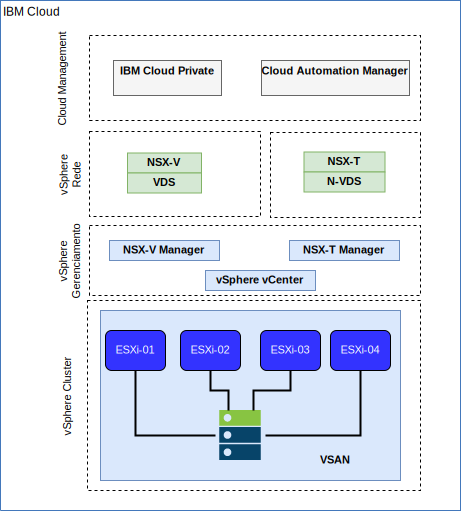

---

copyright:

  years:  2016, 2019

lastupdated: "2019-05-22"

subcollection: vmware-solutions

---

# Rede e infraestrutura do IBM Cloud
{: #vcsicp-arch-overview-infrastructure}

## Virtual Routing and Forwarding
{: #vcsicp-arch-overview-infrastructure-vrf}

É possível configurar as contas do {{site.data.keyword.cloud}} como uma conta de Virtual Routing and Forwarding (VRF), que permite o roteamento global automático entre blocos de IP de sub-rede. Todas as contas com conexões do Direct Link devem ser convertidas para uma conta do VRF ou criadas como tal.

## Link Direto
{: #vcsicp-arch-overview-infrastructure-direct-link}

I {{site.data.keyword.cloud_notm}} Direct Link Connect oferece acesso privado à sua infraestrutura do {{site.data.keyword.cloud_notm}} e a quaisquer outras nuvens vinculadas ao Provedor de Serviços de Rede por meio de seu data center local do IBM Cloud. Essa opção é perfeita para criar conectividade com múltiplas nuvens em um único ambiente. Uma topologia de largura da banda compartilhada é usada para conectar clientes à rede do {{site.data.keyword.icpfull_notm}}. Como ocorre com todos os produtos Direct Link, é possível incluir roteamento global, que permite tráfego de rede privada para todos os locais do {{site.data.keyword.cloud_notm}}.

## Redes privadas virtuais
{: #vcsicp-arch-overview-infrastructure-vp-networks}

### VPN do strongSwan
{: #vcsicp-arch-overview-infrastructure-strongswan}

O serviço de VPN do IPSec do strongSwan fornece um canal de comunicação seguro de ponta a ponta sobre a Internet que é baseado no conjunto de protocolos padrão de mercado da Internet Protocol Security (IPSec).

### Hybridity (HCX)
{: #vcsicp-arch-overview-infrastructure-hcx}

O vCenter Server on {{site.data.keyword.cloud_notm}} with Hybridity Bundle amplia ininterruptamente as redes de data centers no local para o {{site.data.keyword.cloud_notm}}, que permite que máquinas virtuais (MVs) sejam migradas para e do {{site.data.keyword.cloud_notm}} sem nenhuma conversão ou mudança.

## Estrutura física
{: #vcsicp-arch-overview-infrastructure-phys-struct}

A infraestrutura física necessária para implementar uma instância de produção do {{site.data.keyword.icpfull_notm}} em um cluster do VMware vCenter Server on {{site.data.keyword.cloud_notm}} requer a especificação mínima a seguir.

Tabela 1. Especificação do vCenter Server para o  {{site.data.keyword.icpfull_notm}}

| Implementação do NFS | Implementação do vSAN |
:--|:----:|:----:
Número de servidores | 3 | 4
CPU | 28 núcleos 2.2 GHz | 28 núcleos 2.2 GHz
de memória | 384 GB | 384 GB
de armazenamento | 2000 GB 2I OPS/GB de gerenciamento, 2000 GB 4 IOPS/GB de carga de trabalho, 4000 GB 4 IOPS/GB {{site.data.keyword.icpfull_notm}} | SSD mín. de 960 GB x 2

Além dos requisitos de hardware do {{site.data.keyword.icpfull_notm}}, deve-se criar volumes persistentes no ambiente do {{site.data.keyword.icpfull_notm}} para armazenar dados do banco de dados e do log do Cloud Automation Manager (CAM). Embora o CAM suporte todos os tipos de volume persistente suportados pelo {{site.data.keyword.icpfull_notm}}, as duas configurações de armazenamento recomendadas para o CAM são NFS e GlusterFS.

## Estrutura virtual
{: #vcsicp-arch-overview-infrastructure-virtual-struct}

Na instância do vCenter Server, a instância do {{site.data.keyword.icpfull_notm}} é implementada com um NSX Edge Services Gateway (ESG) dedicado e o Distributed Logical Router (DLR). A instalação do {{site.data.keyword.icpfull_notm}} é carregada na sub-rede VXLAN que está definida nos componentes anteriores.

O ESG é configurado com uma regra NAT de origem (SNAT) para permitir tráfego de saída, que permite que a conectividade de Internet faça download dos pré-requisitos do {{site.data.keyword.icpfull_notm}} e se conecte ao GitHub e ao Docker. Como alternativa, é possível usar um proxy da web para conectividade de Internet. O ESG também é configurado para fornecer acesso a serviços DNS e NTP.

O ESG também é configurado com uma regra NAT de destino (DNAT) para os endereços IP virtuais Principais/Proxy do {{site.data.keyword.icpfull_notm}} da rede {{site.data.keyword.cloud_notm}} 10.x para o ambiente VXLAN.

## Links relacionados
{: #vcsicp-arch-overview-infrastructure-related}

* [Visão geral do vCenter Server on {{site.data.keyword.cloud_notm}} with Hybridity Bundle](/docs/services/vmwaresolutions/archiref/vcs?topic=vmware-solutions-vcs-hybridity-intro)
