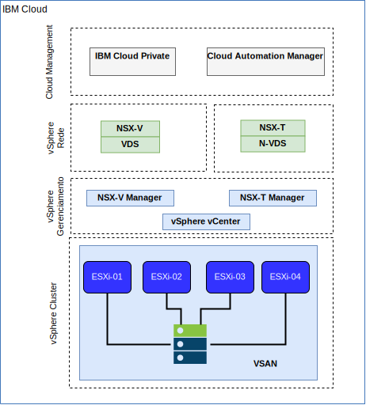

---

copyright:

  years:  2016, 2018

lastupdated: "2018-10-23"

---

# Rede e infraestrutura do IBM Cloud

## Virtual Routing and Forwarding (VRF)
As contas do IBM Cloud também podem ser configuradas como uma conta do VRF. Isso fornece funcionalidade semelhante ao VLAN Spanning, ativando o roteamento automático entre blocos de IP de sub-rede. Todas as contas com conexões de Link direto devem ser convertidas ou criadas como uma conta do VRF.

## Link Direto
O IBM Cloud Direct Link Connect oferece acesso privado à infraestrutura do IBM Cloud e a quaisquer outras nuvens vinculadas ao seu Provedor de Serviços de Rede, por meio do data center local do IBM Cloud. Essa opção é perfeita para criar conectividade com múltiplas nuvens em um único ambiente. Nós conectamos os clientes à rede privada do IBM Cloud usando uma topologia de largura de banda compartilhada. Como ocorre com todos os produtos Direct-Link, é possível incluir o roteamento global, que permite o tráfego de rede privada para todos os locais do IBM Cloud.

## Redes privadas virtuais

### VPN do strongSwan
O serviço de VPN do IPSec do strongSwan fornece um canal de comunicação seguro de ponta a ponta sobre a Internet que é baseado no conjunto de protocolos padrão de mercado da Internet Protocol Security (IPSec).

### Hybridity (HCX)
O serviço VCS Hybridity Bundle on IBM Cloud pode ampliar de forma contínua as redes de data centers no local para o IBM Cloud, o que permite que máquinas virtuais (VMs) sejam migradas para e do IBM Cloud sem qualquer conversão ou mudança.

## Estrutura física
A infraestrutura física necessária para implementar uma instância de produção do IBM Cloud Private (ICP) em um cluster do VMware vCenter Server on IBM Cloud (VCS) requer a especificação mínima a seguir.

Tabela 1. Especificação do VCS para o ICP

| Implementação do NFS  |  Implementação do vSAN |
:--|:----:|:----:
Número de servidores  |  3 |  4
CPU | 28 núcleos 2.2 GHz | 28 núcleos 2.2 GHz
Memória | 384 GB | 384 GB
Armazenamento | Gerenciamento de 2000 GB 2IOPS/GB, Carga de trabalho de 2000 GB 4IOPS/GB, ICP de 4000 GB 4IOPS/GB | Mínimo SSD x2 de 960 GB

Além dos requisitos de hardware do IBM Cloud Private, deve-se criar volumes persistentes no ambiente do ICP para armazenar dados do banco de dados e do log do Cloud Automation Manager (CAM). Embora o CAM suporte todos os tipos de volumes persistentes que o ICP suporta, as duas configurações de armazenamento recomendadas para o CAM são NFS e GlusterFS.

## Estrutura virtual

Figura 1. Estrutura física de implementação do VCS e ICP

Dentro da instância do VCS, a instância do ICP é implementada com um NSX Edge Services Gateway (ESG) dedicado e um Distributed Logical Router (DLR). A instalação do ICP é carregada na sub-rede VXLAN definida nos componentes acima.

O ESG é configurado com uma regra do Source NAT (SNAT) para permitir o tráfego de saída, ativando a conectividade de Internet para fazer download dos pré-requisitos do ICP e a conectividade com o GitHub e o Docker ou um proxy da web pode ser usado para fornecer a conectividade de Internet. O ESG também é configurado para fornecer acesso a serviços DNS e NTP.

O ESG também é configurado com uma regra do Destination NAT (DNAT) para os endereços IP virtuais do ICP Principal/Proxy da rede do IBM Cloud 10.x por meio do ambiente do VXLAN.

### Links Relacionados

* [VMware vCenter Server on IBM Cloud with Hybridity Bundle](../vcs/vcs-hybridity-intro.html)
