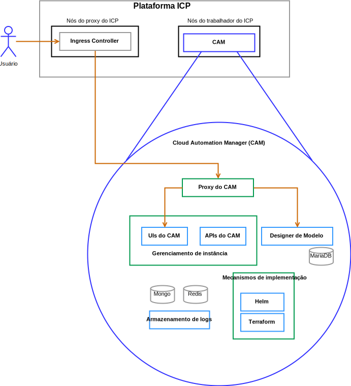

---

copyright:

  years:  2016, 2019

lastupdated: "2019-03-19"

subcollection: vmwaresolutions

---

# Componentes da solução
{: #vcsicp-arch-overview-solution}

## Componentes do VMware vCenter Server on IBM Cloud
{: #vcsicp-arch-overview-solution-vcs-comp}

Figura 1. Diagrama do ambiente do vCenter Server

### Platform Service Controller
{: #vcsicp-arch-overview-solution-psc}

A implementação do vCenter Server usa um único controlador de serviços de plataforma externa instalado em uma sub-rede móvel na VLAN privada associada a máquinas virtuais (MVs) de gerenciamento. Seu gateway padrão é configurado para o backend customer router (BCR).

### vCenter Server
{: #vcsicp-arch-overview-solution-vcs}

Como o controlador de serviços de plataforma, o vCenter Server é implementado como um dispositivo. Além disso, o vCenter Server é instalado em uma sub-rede móvel na VLAN privada associada a MVs de gerenciamento. Seu gateway padrão é configurado para o endereço IP designado no BCR para essa sub-rede específica.

### Gerenciador NSX
{: #vcsicp-arch-overview-solution-nsx-manager}

O NSX Manager é implementado no cluster inicial. Além disso, o NSX Manager é designado a um endereço IP suportado pela VLAN por meio do bloco de endereço móvel privado que está designado a componentes de gerenciamento e configurado com os servidores DNS e NTP

### NSX Controllers
{: #vcsicp-arch-overview-solution-nsx-controllers}

A automação do {{site.data.keyword.cloud}} implementa três Controladores NSX dentro do cluster inicial. Os controladores são designados a um endereço IP suportado pela VLAN por meio da sub-rede móvel privada que é designada a componentes de gerenciamento.

### NSX Edge / DLR
{: #vcsicp-arch-overview-solution-nsx-edge}

Os pares do NSX Edge Services Gateway (ESG) são implementados. Em todos os casos, um par de gateway é usado para o tráfego de saída dos componentes de automação que residem na rede privada. Para o vCenter Server e o {{site.data.keyword.icpfull_notm}}, um segundo gateway, conhecido como a borda gerenciada por icp, é implementado e configurado com um uplink para a rede pública e uma interface designada à rede privada. Qualquer componente NSX necessário, como o Distributed Logical Router (DLR), os comutadores lógicos e os firewalls, pode ser configurado pelo administrador. O [Guia de rede do vCenter Server](/docs/services/vmwaresolutions/archiref/vcsnsxt?topic=vmware-solutions-vcsnsxt-intro) fornece mais detalhes sobre o design da rede.

A tabela a seguir resume as especificações do {{site.data.keyword.icpfull_notm}} ESG/DLR.

Tabela 1. Especificações do {{site.data.keyword.icpfull_notm}} ESG

Atributo  |  Especificação
--|--
Gateway de Serviço de Edge  |  Dispositivo Virtual
Tamanho de borda Grande |   Número de vCPUs 2
Memória	| Disco de 1 GB	| 1000 GB no armazenamento de dados local

Tabela 2. Especificações do {{site.data.keyword.icpfull_notm}} DLR

Atributo  |  Especificação
--|--|
Roteador Lógico Distribuído | 	Dispositivo Virtual
Tamanho de borda	Compacto | Número de vCPUs 1
Memória	| Disco de 512 MB	| 1000 GB no armazenamento de dados local

## Componentes do IBM Cloud Private
{: #vcsicp-arch-overview-solution-icp-comp}

O {{site.data.keyword.icpfull_notm}} é uma plataforma de aplicativo para desenvolver e gerenciar aplicativos conteinerizados no local. É um ambiente integrado para gerenciar contêineres, que inclui o orquestrador de contêiner Kubernetes, um repositório de imagem privada, um console de gerenciamento e estruturas de monitoramento.

Figura 2. Implementação do {{site.data.keyword.icpfull_notm}} virtual com o vCenter Server

###	Nó de Inicialização
{: #vcsicp-arch-overview-solution-boot-node}

Um nó de inicialização ou de autoinicialização (opcional) é usado para executar a instalação, a configuração, o ajuste de escala do nó e as atualizações do cluster. Somente um nó de inicialização é necessário para qualquer cluster. É possível usar um único nó para principal e inicialização.

### Nó Principal
{: #vcsicp-arch-overview-solution-master-node}

Um nó principal fornece serviços de gerenciamento e controla os nós do trabalhador em um cluster. Nós principais hospedam processos que são responsáveis pela alocação de recurso, manutenção de estado, planejamento e monitoramento. Como um ambiente de alta disponibilidade (HA) tem mais de um nó principal, se o nó principal líder falhar, a lógica de failover promoverá automaticamente um nó diferente para a função principal. Os hosts que podem agir como o principal são chamados de candidatos principais.

###	Nó do Trabalhador
{: #vcsicp-arch-overview-solution-worker-node}

Um nó do trabalhador é um nó que fornece um ambiente conteinerizado para executar tarefas. Conforme as demandas aumentam, mais nós do trabalhador podem ser facilmente incluídos em seu cluster para melhorar o desempenho e a eficiência. Um cluster pode conter qualquer número de nós do trabalhador, mas é necessário no mínimo um nó do trabalhador.

### Nó do Proxy
{: #vcsicp-arch-overview-solution-proxy-node}

Um nó do proxy é um nó que transmite uma solicitação externa para os serviços criados dentro de seu cluster. Como um ambiente de alta disponibilidade (HA) tem mais de um nó do proxy, se o nó do proxy líder falhar, a lógica de failover promoverá automaticamente um nó diferente para a função de proxy. Embora seja possível usar um único nó como principal e proxy, use os nós de proxy dedicados para reduzir o carregamento no nó principal. Um cluster deverá ter pelo menos um nó do proxy se o balanceamento de carga for necessário dentro do cluster.

### Nó de Gerenciamento
{: #vcsicp-arch-overview-solution-mgmt-node}

Um nó de gerenciamento é um nó opcional que hospeda somente serviços de gerenciamento, como monitoramento, medição e criação de log. Configurando os nós de gerenciamento dedicados, é possível evitar que o nó principal fique sobrecarregado. É possível ativar o nó de gerenciamento apenas durante a instalação do {{site.data.keyword.icpfull_notm}}.

###	Nó do Vulnerability Advisor
{: #vcsicp-arch-overview-solution-va-node}

Um nó do Vulnerability Advisor é um nó opcional usado para executar os serviços do Vulnerability Advisor. Os serviços do Vulnerability Advisor são intensivos em recurso. Se você usar o serviço Vulnerability Advisor, especifique um nó VA dedicado.

As especificações de MVs a seguir são necessárias para uma instância do {{site.data.keyword.icpfull_notm}} Altamente Disponível:

Tabela 3. {{site.data.keyword.icpfull_notm}}  especificações da máquina virtual

Nó | 	Instâncias	| IP	| CPU	| RAM (GB)	| DISCO (GB)
:-----|------------:|:----|----:|----------:|----------:|
Mestrado|	3	| IP (x3) VIP (x1)	| 4	| 64	| 200
Gerenciamento	|3	| IP (x3)	|8	|64	|500
Proxy	| 3	| IP (x3) VIP (x1)	|2	|4	|150
Vulnerability Advisor	|3	| IP (x3)	| 4	| 16	|500
GlusterFS	| 3	| IP (x3)	|8	|16	|150
Trabalhador	| 3-6	| IP (x3)	|4-8	|4	|150

O CAM requer que os nós do trabalhador tenham uma configuração de vCPU e de memória mais alta.

Tabela 4. {{site.data.keyword.icpfull_notm}}  especificações da máquina virtual

Nó | 	Instâncias	| IP	| CPU	| RAM (GB)	| DISCO (GB)
:-----|------------:|:----|----:|----------:|----------:|
trabalhador  |  3 | IP (x3)  |  4-8 |16-20   |  150

## Componentes do CAM
{: #vcsicp-arch-overview-solution-cam-comp}

O {{site.data.keyword.cloud_notm}} Automation Manager (CAM) é uma plataforma de gerenciamento de autoatendimento multinuvem, executada no {{site.data.keyword.icpfull_notm}}, que confere poderes aos Desenvolvedores e administradores para atender às demandas de negócios.

Figura 3. Referência de componente do CAM 

### Proxy CAM
{: #vcsicp-arch-overview-solution-cam-proxy}

Fornece um acesso de proxy nginx para o CAM.

### Interface com o usuário do CAM
{: #vcsicp-arch-overview-solution-cam-ui}

Os componentes de interface com o usuário são divididos em mais de um contêiner. Os componentes são incluídos na interface com o usuário de conexões em nuvem, na interface com o usuário de Biblioteca de Modelos e na interface com o usuário de instâncias implementadas.

### API CAM
{: #vcsicp-arch-overview-solution-cam-api}

As APIs do CAM são divididas em mais de um contêiner.

### Helm
{: #vcsicp-arch-overview-solution-helm}

Um contêiner com os binários necessários para implementar gráficos helm em clusters do Kubernetes.

### Terraform
{: #vcsicp-arch-overview-solution-terraform}

Um contêiner com os binários necessários para implementar recursos do Terraform em mais de uma nuvem.

### Registros
{: #vcsicp-arch-overview-solution-logs}

O local para os logs do contêiner.

### Banco de dados do Mongo
{: #vcsicp-arch-overview-solution-mongo-db}

O banco de dados Principal para o Aplicativo CAM.

### Redis
{: #vcsicp-arch-overview-solution-redis}

O banco de dados Redis é usado para o armazenamento em cache de sessão e os bloqueios no CAM.

### Designer de Modelo
{: #vcsicp-arch-overview-solution-template-designer}

Uma interface gráfica com o usuário para criar modelos do Terraform, com um recurso de arrastar de módulos do Terraform.

### Maria Database
{: #vcsicp-arch-overview-solution-maria-db}

O banco de dados para o aplicativo de designer modelo.

## Links relacionados
{: #vcsicp-arch-overview-solution-related}

* [Visão geral do vCenter Server on {{site.data.keyword.cloud_notm}} with Hybridity Bundle](/docs/services/vmwaresolutions/archiref/vcs?topic=vmware-solutions-vcs-hybridity-intro)
