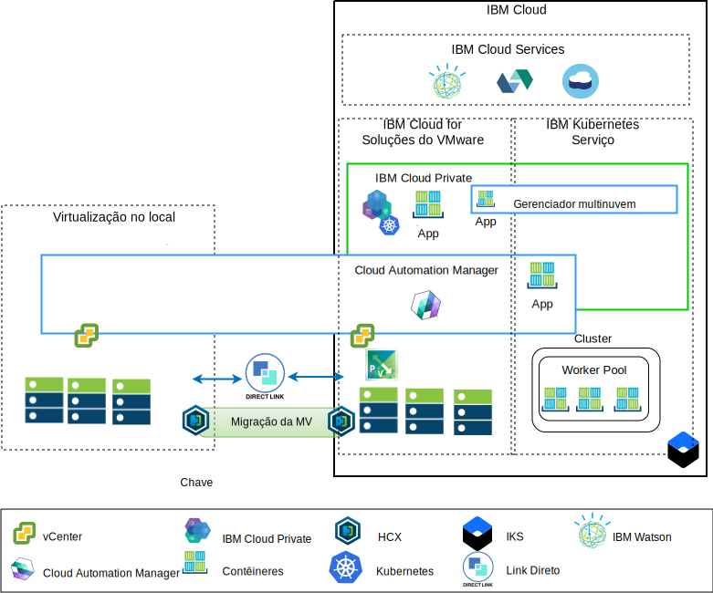

---

copyright:

  years:  2016, 2019

lastupdated: "2019-05-09"

subcollection: vmware-solutions

---

# Visão geral da arquitetura
{: #vcsicp-arch-overview}

As ofertas do {{site.data.keyword.vmwaresolutions_full}} fornecem automação para implementar componentes de tecnologia do VMware em {{site.data.keyword.CloudDataCents_notm}} em todo o mundo.
A arquitetura consiste em uma única região de nuvem e suporta a capacidade de ampliação para mais regiões de nuvem localizadas em outra geografia ou em outro pod do {{site.data.keyword.cloud_notm}} dentro do mesmo data center.

É possível implementar manualmente os produtos {{site.data.keyword.cloud_notm}} Private e Cloud Automation Manager (CAM) em sua plataforma de virtualização no local, ativando o gerenciamento de nuvem por meio de locais no local. Como alternativa, o {{site.data.keyword.icpfull_notm}} e o CAM são oferecidos como extensões de serviço para uma implementação nova ou existente do VMware vCenter Server on {{site.data.keyword.cloud_notm}}, por meio da automação, permitindo o gerenciamento de nuvem por meio do {{site.data.keyword.cloud_notm}}.

O {{site.data.keyword.cloud_notm}} Private é uma plataforma de aplicativo para desenvolvimento e gerenciamento de aplicativos locais e conteinerizados. O {{site.data.keyword.cloud_notm}} Private é um ambiente integrado para gerenciar contêineres que inclui o orquestrador de contêineres Kubernetes, um repositório de imagem privada, um console de gerenciamento e estruturas de monitoramento.

O IBM Multi-Cluster Manager (MCM) fornece visibilidade do usuário, gerenciamento centrado no aplicativo (política, implementações, funcionamento, operações) e conformidade baseada em política entre nuvens e clusters. Com o MCM, você tem o controle de seus clusters do Kubernetes. O MCM ajuda a assegurar que seus clusters sejam seguros, eles operem de maneira eficiente e entreguem uma plataforma de gerenciamento de serviço que é executada no {{site.data.keyword.cloud_notm}} Private, que confere poderes aos desenvolvedores e administradores para atender às demandas de negócios.

Use o Cloud Automation Manager Service Composer para exibir os serviços de nuvem híbrida no catálogo do {{site.data.keyword.cloud_notm}} Private.

## Plataforma de gerenciamento de nuvem do IBM Cloud
{: #vcsicp-arch-overview-ibm-cloud-side-platform}

O diagrama a seguir é um exemplo de uma implementação do {{site.data.keyword.icpfull_notm}} e do CAM com a infraestrutura do {{site.data.keyword.cloud_notm}}, com conexões com o vCenter no local e o {{site.data.keyword.containerlong_notm}} implementado no {{site.data.keyword.cloud_notm}}. Os usuários podem implementar máquinas virtuais (MVs) no local e MVs em uma instância do vCenter Server e contêineres para o cluster do {{site.data.keyword.icpfull_notm}} e do {{site.data.keyword.containerlong_notm}}.

No diagrama, o CAM cria conexões em nuvem logicamente para os vCenters, os provedores em nuvem, o {{site.data.keyword.icpfull_notm}} e os ambientes do {{site.data.keyword.containerlong_notm}}. Os clusters do {{site.data.keyword.icpfull_notm}} devem ser implementados em cada ambiente de nuvem do data center, com o MCM fornecendo o mecanismo para conectar os clusters do {{site.data.keyword.icpfull_notm}} a uma única visualização de gerenciamento.

É possível implementar o {{site.data.keyword.icpfull_notm}} com os componentes NSX-V ou NSX-T. O {{site.data.keyword.icpfull_notm}} com NSX-V permite que as MVs do {{site.data.keyword.icpfull_notm}} sejam executadas na rede VXLAN e usem a rede interna Calico do Kubernetes.

O {{site.data.keyword.icpfull_notm}} com NSX-T, que permite que os usuários controlem e configurem a rede,
a sub-rede, as políticas da IU central (Gerenciador NSX-T). Consulte o [Guia de rede do vCenter Server](/docs/services/vmwaresolutions/archiref/vcsnsxt?topic=vmware-solutions-vcsnsxt-intro) para ver as diferenças entre NSX-V e NSX-T.

## Plataforma de gerenciamento de nuvem no local
{: #vcsicp-arch-overview-on-premises-platform}

O diagrama a seguir em um exemplo de uma implementação do {{site.data.keyword.icpfull_notm}} e do CAM na infraestrutura no local, com conexões com o vCenter e o {{site.data.keyword.containerlong_notm}} implementado no {{site.data.keyword.cloud_notm}}. Os usuários podem implementar MVs e contêineres no local, MVs em instâncias do vCenter Server e contêineres para o cluster do {{site.data.keyword.containerlong_notm}}.

A VPN do strongSwan é usada para estabelecer conectividade com os contêineres implementados do {{site.data.keyword.containerlong_notm}}. A VPM strongSwan pode ser substituída pela conectividade de link direto.

No diagrama, o CAM cria conexões em nuvem logicamente para os vCenters, os provedores em nuvem, o {{site.data.keyword.icpfull_notm}} e os ambientes do {{site.data.keyword.containerlong_notm}}. Os clusters do {{site.data.keyword.icpfull_notm}} devem ser implementados em cada ambiente de nuvem do data center, com o MCM fornecendo o mecanismo para conectar os clusters do {{site.data.keyword.icpfull_notm}} a uma única visualização de gerenciamento.

## Links relacionados
{: #vcsicp-arch-overview-related}

* [Visão geral do vCenter Server on {{site.data.keyword.cloud_notm}} with Hybridity Bundle](/docs/services/vmwaresolutions/archiref/vcs?topic=vmware-solutions-vcs-hybridity-intro)
