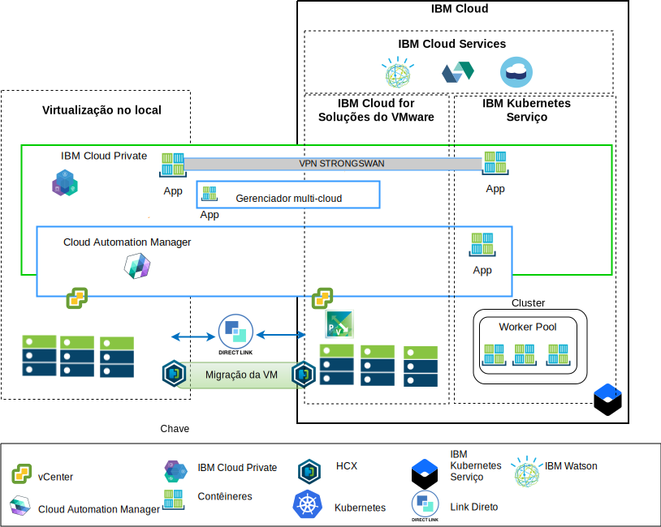

---

copyright:

  years:  2016, 2018

lastupdated: "2018-10-10"

---

# Visão geral da arquitetura

As ofertas do IBM Cloud for VMware fornecem automação para implementar componentes de tecnologia VMware em data centers do IBM Cloud em todo o mundo.
A arquitetura consiste em uma única região de nuvem e suporta a capacidade de se estender em mais regiões em nuvem localizadas em outra geografia e/ou em outro pod do IBM Cloud dentro do mesmo data center.

Os produtos IBM Cloud Private (ICP) e Cloud Automation Manager (CAM) podem ser implementados manualmente em sua plataforma de virtualização no local, permitindo o gerenciamento de nuvem por meio de localizações no local. Como alternativa, o ICP e o CAM são oferecidos como extensões de serviço para uma implementação nova ou existente do VMware vCenter Server on IBM Cloud (VCS), por meio da automação, permitindo o gerenciamento de nuvem por meio do IBM Cloud.

O ICP é uma plataforma de aplicativo para desenvolvimento e gerenciamento de aplicativos conteinerizados no local. É um ambiente integrado para gerenciar contêineres, que inclui o orquestrador de contêiner Kubernetes, um repositório de imagem privada, um console de gerenciamento e estruturas de monitoramento.

O IBM Multi-Cluster Manager (MCM) fornece visibilidade do usuário, gerenciamento centrado no aplicativo (política, implementações, funcionamento, operações) e conformidade baseada em política entre nuvens e clusters. Com o MCM, você tem o controle de seus clusters do Kubernetes. É possível assegurar que seus clusters sejam seguros operando com eficiência e entregando a plataforma de gerenciamento de serviço em execução no ICP que confere poderes aos desenvolvedores e administradores para atender às demandas de negócios.
O Cloud Automation Manager Service Composer permite expor os serviços de nuvem híbrida no catálogo do ICP.

## Plataforma de gerenciamento de nuvem do IBM Cloud

Figura 1. Gerenciamento de nuvem do lado da nuvem

O diagrama acima representa o ICP e o CAM implementados com a infraestrutura do IBM Cloud, com conexões ao serviços vCenter e IBM Kubernetes Service (IKS) no local implementados no IBM Cloud. Os usuários são capazes de implementar máquinas virtuais no local e máquinas virtuais na instância do VCS e contêineres no cluster do ICP e do IKS.

No diagrama, o CAM cria logicamente conexões em nuvem para os ambientes de vCenters, de provedores em nuvem, de ICP e de IKS. Os Clusters do ICP devem ser implementados em cada data center/ambiente de nuvem, com o MCM fornecendo o mecanismo para conectar os clusters do ICP a uma única visualização de gerenciamento.

O ICP pode ser implementado com os componentes NSX-V ou NSX-T. O ICP com NSX-V ativa as máquinas virtuais do ICP para serem executadas na rede VXLAN e utilizarem a rede interna Calico do Kubernetes.

O ICP com o NSX-T permite que os usuários controlem e configurem a rede, a sub-rede, as políticas da UI central (NSX-T Manager). Visite a [Arquitetura de referência do IBM Cloud VCS Networking](../vcsnsxt/vcsnsxt-intro.html) para obter as diferenças entre o NSX-V e o NSX-T.

## Plataforma de gerenciamento de nuvem na pré-mise

Figura 2. Gerenciamento de nuvem por meio do lado no local

O diagrama acima representa o ICP e o CAM implementados na infraestrutura no local, com conexões ao vCenter e ao IKS implementados no IBM Cloud. Os usuários são capazes de implementar máquinas virtuais e contêineres no local, máquinas virtuais na instância do vCenter Server e contêineres no cluster do IKS.

A VPN strongSwan é usada para estabelecer conectividade com os contêineres do IKS implementados, eventualmente isso pode ser substituído pela conectividade de link Direto.

No diagrama, o CAM cria logicamente conexões em nuvem para os ambientes de vCenters, de provedores em nuvem, de ICP e de IKS. Os clusters do ICP devem ser implementados em cada data center/ambiente de nuvem, com o MCM fornecendo o mecanismo para conectar os clusters do ICP a uma única visualização de gerenciamento.

### Links relacionados

* [VMware vCenter Server on IBM Cloud with Hybridity Bundle](../vcs/vcs-hybridity-intro.html)
