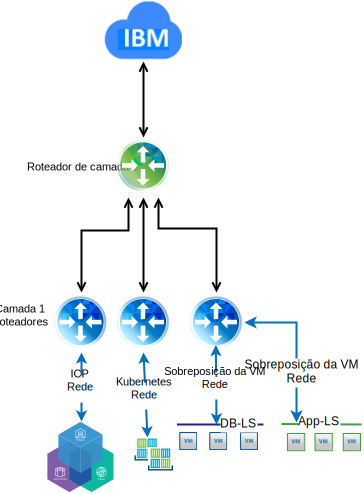

---

copyright:

  years:  2016, 2018

lastupdated: "2018-10-10"

---

# Design Detalhado

## Componentes de serviços comuns
Os serviços comuns fornecem os serviços usados por outros serviços na plataforma de gerenciamento de nuvem. Isso inclui serviços de identidade e acesso, serviços de nomes de domínio, serviços do NTP.

Figura 1. Serviços Comuns do ICP

### Serviços de identidade e de acesso
Como parte da automação do VCS, um Microsoft Active Directory (AD) é empregado para gerenciamento de identidade. Uma única instância de servidor virtual (VSI) do AD é implementada. O vCenter é configurado para utilizar a autenticação do MS AD e o ICP pode ser configurado também para a Autenticação LDAP.

###	Serviços de nome de domínio
A implementação do VCS utiliza os VSIs do Microsoft Active Directory (AD) implementados como servidores DNS para a instância. Todos os componentes implementados (hosts vCenter, PSC, NSX, ESXi) são configurados para apontar para o MS AD como o seu DNS padrão.

###	Serviços NTP
A implementação do VCS utiliza os servidores NTP de infraestrutura do IBM Cloud. Todos os componentes implementados serão configurados para utilizar esses servidores NTP. Ter todos os componentes dentro do design que utilizam os mesmos servidores NTP é crítico para que os certificados e a autenticação do MS AD funcionem corretamente

## Rede

### Rede NSX-V

O NSX-V é projetado para que uma única plataforma do gerenciador do NSX-V esteja vinculada a uma única instância do vCenter Server. Ele fornece serviços de rede para aplicativos em execução dentro de um ambiente do vSphere.

Utilizando a rede NSX-V incluída na implementação do VCS, é possível implementar o ICP em uma rede de sobreposição VXLAN.

O ICP é implementado com a pilha de rede Calico padrão para Kubernetes, que fornece isolamento de rede dentro de seu cluster.

Figura 2. ICP com rede NSX-V

Para obter mais informações, veja [Arquitetura de referência do IBM Cloud VCS Networking](../vcsnsxt/vcsnsxt-intro.html)

### Rede NSX-T

O NSX-T é projetado para que uma única plataforma de rede que possa se conectar a qualquer tipo de aplicativo, seja baseado em máquina virtual ou em contêiner, esteja em execução dentro ou fora de um ambiente do vSphere.

O ICP fornece uma opção para substituir a rede Calico por uma instância do NSX-T, fornecendo um único local para gerenciar a rede e a segurança.

Figura 3. ICP com rede NSX-T

### Links Relacionados

* [VMware vCenter Server on IBM Cloud with Hybridity Bundle](../vcs/vcs-hybridity-intro.html)
