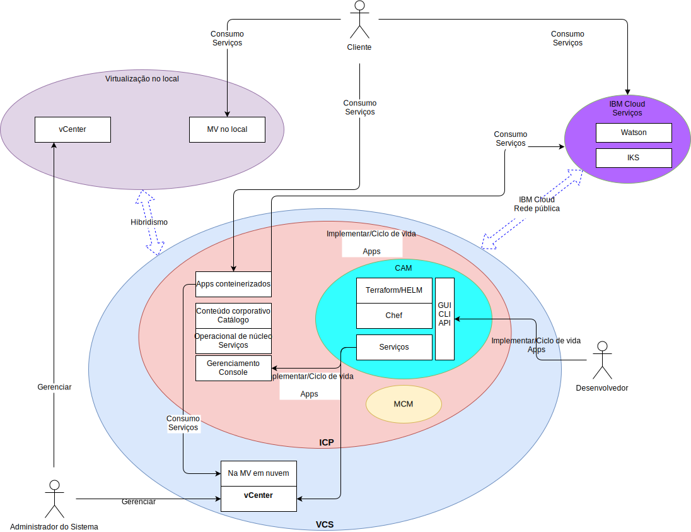

---

copyright:

  years:  2016, 2018

lastupdated: "2018-10-10"

---

# Contexto do sistema

Figura 1. Diagrama de contexto do

Os quatro componentes principais são os seguintes:

- **Virtualização no local** – esse componente é um ambiente do VMware hospedado nas instalações do cliente ou em um local de terceiros e hospeda atualmente as VMs que estão executando os aplicativos a serem modernizados. Ele é o ambiente de origem para migrações de VM e é fracamente acoplado a uma instância do IBM Cloud por meio do VMware Hybridity (HCX).
- **vCenter Server** – o VMware vCenter Server on IBM Cloud (VCS) é uma instância do IBM Cloud for VMware Services que é o destino para VMs migradas do ambiente no local. Junto com o ambiente virtualizado no local, ele forma um ambiente híbrido que permite que as VMs se movam de um site para o outro.
- **IBM Cloud Kubernetes Service** - o IKS alavanca o Kubernetes como a solução de orquestração de contêiner. A IBM opera e gerencia o nó principal do Kubernetes enquanto os nós do trabalhador são implementados na infraestrutura gerenciada pelo cliente. A IBM fornece ferramentas de gerenciamento para implementação de correção do sistema operacional, upgrades de mecanismo de Docker e novas versões do Kubernetes. O IKS fornece uma plataforma isolada e segura para gerenciar contêineres que são móveis, extensíveis e com capacidade de recuperação automática em caso de failovers.
- **IBM Cloud Private** - o ICP é uma plataforma de aplicativos para desenvolvimento e gerenciamento de aplicativos em contêiner. Ele é um ambiente integrado que inclui o orquestrador de contêineres Kubernetes, um repositório de imagem privada, um console de gerenciamento, estruturas de monitoramento e uma interface gráfica com o usuário, que fornece um local centralizado de onde é possível implementar, gerenciar, monitorar e escalar aplicativos.
- **IBM Cloud Automation Manager** – o CAM é uma plataforma infrastructure as code (IaC) pronta para a empresa que fornece uma única área de janela de vidro para provisionar cargas de trabalhos de trabalho baseadas no VMware juntamente com cargas de trabalho baseadas no Kubernetes. Automação de fornecimento de carga de trabalho, se as máquinas virtuais e/ou contêineres e seus pré-requisitos de infraestrutura são ativados via CAM.
- **IBM Multi Cloud Manager** – o MCM fornece visibilidade do usuário, gerenciamento centrado no aplicativo (política, implementações, funcionamento, operações) e conformidade baseada em política entre nuvens e clusters. Com o MCM, você tem o controle de seus clusters do Kubernetes.
- **IBM Cloud Services** – o IBM Cloud Services é uma ampla gama de serviços consumíveis disponíveis, incluindo ofertas de analítica, AI e IoT.

## Atores

Tabela 1. Atores

Ator  | Descrição
--|--
Administrador do Sistema | O recurso qualificado do VMware vSphere que usa o vCenter Server para gerenciar a virtualização no local e a instância do VCS.
Desenvolvedor | O recurso qualificado do contêiner que usa o console do CAM para criar e gerenciar contêineres. Ele cria os novos serviços como parte da modernização de aplicativo. Usando o CAM, o desenvolvedor provisiona cargas de trabalho em VCS, ICP ou IKS, edita e orquestra serviços que são construídos com VMs e contêineres e integra as cadeias de ferramentas do DevOps e as soluções day-2 ITSM.
Cliente | Agente externo que consome serviços da empresa. Para a Acme Skateboards, o cliente é um skatista que deseja comprar produtos de skate. O cliente requer acesso seguro à Internet para o catálogo.
IBM IKS | O recurso IBM que gerencia o Nó Principal do IKS para o serviço.

## Sistemas

Tabela 2. Sistemas

Ator  | Descrição
--|--
vCenter Server | Interface primária que o administrador do sistema usa para gerenciar as VMs no local e as VMs do IBM Cloud na instância do VCS.
VMs em pré-mise| Servidores virtualizados que hospedam os aplicativos destinados à migração na nuvem IBM. Migrados inicialmente como VMs e refaturadas de VMs para contêineres para modernização de aplicativo.
VMs do IBM Cloud | Servidores virtualizados que hospedam os aplicativos migrados do data center no local. No caso desta arquitetura de referência e para a Acme Skateboards, uma das VMs do IBM Cloud é um servidor de banco de dados, que faz parte da carga de trabalho de presença on-line.
Catálogo de conteúdo corporativo | Local centralizado por meio do qual é possível procurar e instalar pacotes em seu cluster. O catálogo contém vários pacotes IBM que são usados para criar contêineres, bem como acessar os gráficos Helm. Helm é uma ferramenta para gerenciar os gráficos do Kubernetes. Os gráficos são pacotes de recursos pré-configurados do Kubernetes que facilitam a versão, o pacote, a liberação, a implementação, a exclusão, o upgrade e até mesmo o retrocesso de implementações do contêiner. O Helm é o sistema de gerenciamento de pacote nativo do Kubernetes e é usado para gerenciamento de aplicativo dentro de um cluster do ICP.
Core Operational Services | O ICP inclui uma série de ferramentas para coletar, armazenar e consultar logs e métricas. Essas ferramentas fornecem um armazenamento centralizado para todos os logs e métricas e entregam desempenho melhorado e maior estabilidade ao acessar e consultar logs e métricas.
Console de Gerenciamento |  O console de gerenciamento do ICP permite gerenciar, monitorar e solucionar problemas de seus aplicativos e cluster por meio de um console de gerenciamento único, centralizado e seguro.
Terraform | Manipula o fornecimento de recursos de nuvem e de infraestrutura usando provedores, como o VMware vSphere, o IBM Cloud, o Microsoft Azure, o Amazon Web Services, o Google Cloud Platform e o OpenStack.
AJUDA |  Gerenciador de pacotes para Kubernetes. Os gráficos Helm são usados para definir recursos do Kubernetes e implementar aplicativos.
Chef | Responsável pelo gerenciamento de configuração e automação de conformidade. O Chef implementa e configura o middleware e os aplicativos após o Terraform concluir o fornecimento inicial.
Serviços | Representa o Service Composer, que é onde os administradores criam, editam e projetam serviços construídos por meio de recursos do Kubernetes e de uma ou mais VMs.
Aplicativos contêineres | Os aplicativos que concluíram a jornada de modernização de aplicativo e agora estão em execução como contêineres. No caso dessa arquitetura de referência e para a Acme Skateboards, um dos aplicativos conteinerizados é um servidor da web, que faz parte da carga de trabalho de presença on-line.
Watson | No caso dessa arquitetura de referência e da Acme Skateboards, o Watson representa o serviço AI usado na arquitetura de “Carro Conceito”.

A migração do aplicativo, a rede e a segurança geralmente são os aspectos mais desafiadores da modernização de aplicativo. O VMware vCenter Server on IBM Cloud, o VMware Hybridity, o VMware NSX, o IBM Cloud Private e o IBM Cloud Kubernetes Service abordam esses desafios e permitem que você construa aplicativos modernos resilientes, seguros e robustos.

### Links relacionados

* [VMware vCenter Server on IBM Cloud with Hybridity Bundle](../vcs/vcs-hybridity-intro.html)
