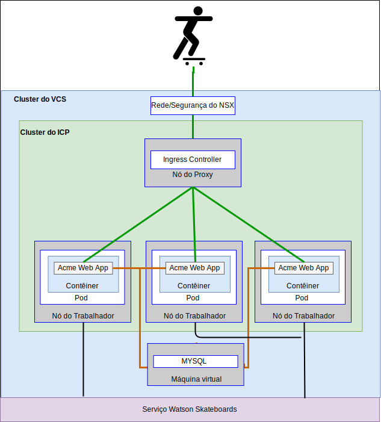
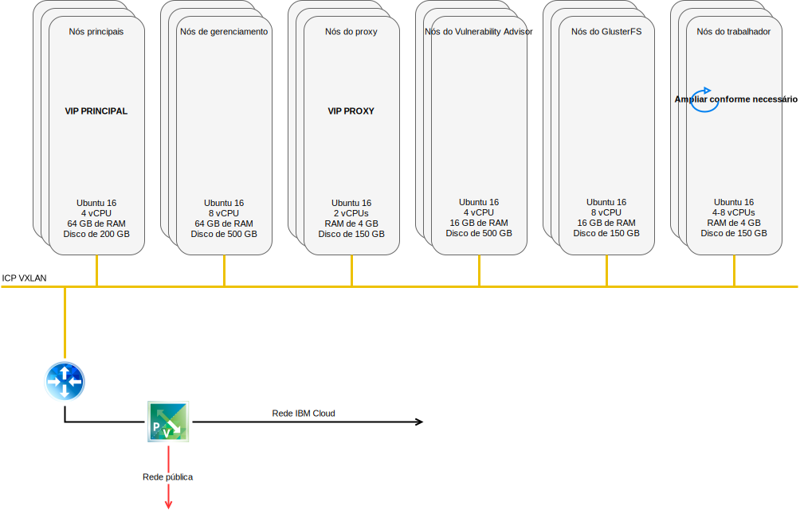

---

copyright:

  years:  2016, 2018

lastupdated: "2018-11-16"

---

# Casos de uso

## Migração de carga de trabalho para o IBM Cloud
A Acme Skateboards deseja ampliar de forma contínua seu VMware SDDC no local para uma instância do VMware vCenter Server on {{site.data.keyword.cloud}}. Ela precisa manter seus negócios em funcionamento e manter seu tempo de inatividade para o mínimo. Reconfigurar seus aplicativos para execução na nuvem não é uma solução ideal.

O VMware vCenter Server on {{site.data.keyword.cloud_notm}} with Hybridity Bundle permite a criação de conexões contínuas entre o {{site.data.keyword.cloud_notm}} e um data center virtualizado do VMware no local.

A oferta vCenter Server with Hybridity Bundle do {{site.data.keyword.cloud_notm}} permite conexões seguras entre o site peer de origem no local e o site de destino do {{site.data.keyword.cloud_notm}}.

Figura 1. Serviços VMware Hybridity

O VMware Hybrid Cloud Extension Services cria uma interconectividade fracamente acoplada entre o {{site.data.keyword.cloud_notm}} e no local e permite recursos como:
- **Interconectividade simples** – as conexões de rede lógica são estabelecidas facilmente sobre qualquer conexão física, incluindo a Internet pública, a VPN privada ou o {{site.data.keyword.cloud_notm}} Direct Link.
- **Extensão da camada 2** – as redes no local são estendidas para a nuvem, incluindo sub-redes no local e endereçamento IP.
- **Criptografia** – o tráfego de rede é criptografado com segurança entre os sites do mesmo nível.
- **Otimização de rede** – seleciona a melhor conexão e inunda eficientemente a conexão para que o tráfego da rede seja movido o mais rápido possível.
- **Deduplicação de dados** – até 50% de redução no tráfego de rede pode ser alcançado.
- **Roteamento inteligente** – quando uma carga de trabalho é movida, o roteamento de proximidade pode mudar o caminho de rede (isto é, o gateway) para que o tráfego de rede use o gateway do site de destino e não "se prenda" de volta ao site de origem.
- **Migração de tempo de inatividade zero** - use vMotion para mover uma máquina virtual (VM) em execução para a nuvem ou de volta da nuvem.
- **Migração planejada** - é possível replicar qualquer número de VMs para o site de destino e, em seguida, ativar nesse site em um tempo designado para substituir os sistemas que são executados no site de origem.
- **Migração de políticas de segurança** – se o NSX for usado no local, quaisquer políticas de segurança, firewalls e assim por diante serão movidos juntamente com a carga de trabalho.

Usando essa solução, a Acme Skateboards migrou com êxito suas cargas de trabalho do VMware no local para o {{site.data.keyword.cloud_notm}} atendendo a seus requisitos de pouco a nenhum tempo de inatividade e nenhuma reconfiguração de aplicativo.

## Implementação de arquitetura híbrida

A Acme Skateboards deseja implementar uma arquitetura híbrida no {{site.data.keyword.cloud_notm}} que consiste no vCenter Server e no ICP para sua jornada para a modernização do aplicativo. Seus requisitos devem executar seus bancos de dados em máquinas virtuais, os aplicativos e os serviços da web em contêineres e usar um conjunto comum de ferramentas para gerenciamento de rede e segurança.

Figura 2. Aplicativo híbrido Acme Skateboards

O {{site.data.keyword.vmwaresolutions_short}} fornece automação para implementar componentes de tecnologia do VMware em {{site.data.keyword.CloudDataCents_notm}} em todo o mundo. A arquitetura consiste em uma única região de nuvem e suporta a capacidade de se estender em mais regiões de nuvem localizadas em outra geografia e/ou em outro pod do {{site.data.keyword.cloud_notm}} dentro do mesmo data center.

Os produtos {{site.data.keyword.cloud_notm}} Private (ICP) e Cloud Automation Manager (CAM) são implementados manualmente na plataforma de virtualização no local, permitindo o gerenciamento de nuvem por meio de localização no local. Como alternativa, o ICP e o CAM são oferecidos como uma extensão de serviço para uma implementação nova ou existente do vCenter Server por meio da automação, permitindo o gerenciamento de nuvem por meio do {{site.data.keyword.cloud_notm}}.

O diagrama a seguir representa o ICP em execução na parte superior de uma instância do vCenter Server. O NSX-V é configurado com um comutador/VXLAN dedicado, um DLR e um ESG especificamente para a rede de sobreposição do ICP, o roteamento é configurado por meio do ESG para acesso à rede subjacente.

Usando a automação do {{site.data.keyword.cloud_notm}}, a Acme Skateboards pode provisionar uma solução híbrida que abrange o VMware on {{site.data.keyword.cloud_notm}} para executar suas VMs de banco de dados e o ICP no VMware on {{site.data.keyword.cloud_notm}} para executar seus apps e serviços da web de front-end em contêineres. O NSX fornece a eles um conjunto comum de ferramentas de gerenciamento para rede e segurança na rede de sobreposição.

Figura 3. vCenter Server com ICP

### Links relacionados

* [Visão geral do vCenter Server on {{site.data.keyword.cloud_notm}} with Hybridity Bundle](../vcs/vcs-hybridity-intro.html)
