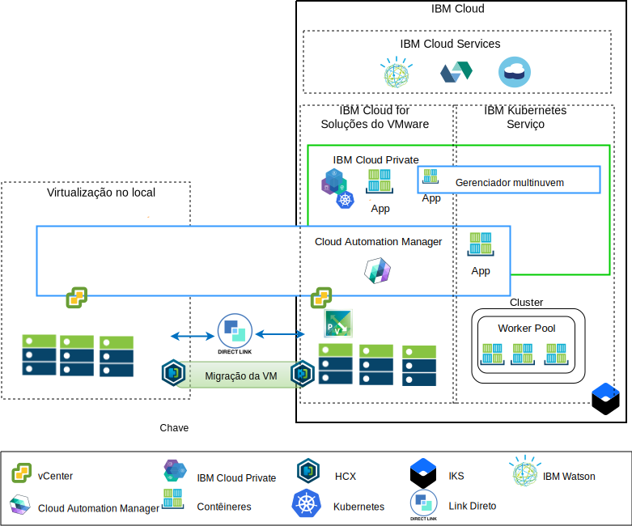

---

copyright:

  years:  2016, 2018

lastupdated: "2018-11-16"

---

# Visão geral de modernização do

O diagrama a seguir mostra a arquitetura de referência de modernização do aplicativo que a Acme Skateboards implementa e é descrita detalhadamente nesta série de documentos.

Figura 1. Diagrama de visão geral da arquitetura

Essa arquitetura híbrida permite à Acme Skateboards:
- Migrar máquinas virtuais VMware (VMs) no local para o {{site.data.keyword.cloud}} com pouco ou nenhum tempo de inatividade e nenhuma reconfiguração do aplicativo.
- Ativá-las para iniciar a jornada de modernização do aplicativo, permitindo que se concentrem na conteinerização das interfaces da web mais simples e do middleware, enquanto permite que bancos de dados mais complexos permaneçam como VMs.
- Use o Cloud Automation Manager (CAM) para o infrastructure as code (IaC) de script para editar e orquestrar serviços que são feitos por meio de VMs e contêineres para integrar às suas cadeias de ferramentas do DevOps e à sua solução ITSM.

A arquitetura de referência tem os componentes principais a seguir:
- **Virtualização no local** - a virtualização no local é um cluster do VMware que hospeda atualmente as VMs do Acme Skateboards. Essas VMs estão hospedando atualmente os aplicativos a serem modernizados. É necessário que esse cluster atenda aos pré-requisitos da arquitetura [VMware HCX on {{site.data.keyword.cloud_notm}} Solution Architecture](https://www.ibm.com/cloud/garage/files/HCX_Architecture_Design.pdf) para que possa executar o HCX.

O HCX amplia as redes no local para o {{site.data.keyword.cloud_notm}} permitindo que os clientes migrem VMs para a instância do VMware vCenter Server on {{site.data.keyword.cloud_notm}} que é executada no {{site.data.keyword.cloud_notm}} e de volta se necessário.
- **{{site.data.keyword.cloud_notm}} for VMware Solutions** - a instância do vCenter Server fornece os blocos de construção fundamentais do VMware, como vSphere, vCenter Server, NSX-V e opções de armazenamento que incluem o armazenamento do vSAN ou do Endurance do {{site.data.keyword.cloud_notm}}, necessários para implementar automaticamente uma solução VMware Software Defined Data Center (SDDC). O cluster do VMware é o destino das VMs migradas e alguns dos aplicativos modernizados em contêineres hospedados no ICP. Os componentes principais no vCenter Server são conforme a seguir:
  - **NSX-V** - o NSX-V fornece a camada de virtualização de rede no vCenter Server que fornece uma sobreposição de rede para VMs do Acme Skateboards. O NSX-V ativa o BYOIP e isola as redes de carga de trabalho das redes do {{site.data.keyword.cloud_notm}}. O NSX-V é programado pelo HCX para criar as redes ampliadas pela Acme Skateboards no local.
  - **NSX-T** - o NSX-T fornece um conjunto comum de ferramentas para o gerenciamento de rede e segurança nos contêineres e VMs. O NSX-T é totalmente compatível com o Container Networking Interface (CNI) do Kubernetes e integra-se ao CNI para fornecer a rede de contêiner. O NSX-T fornece a rede de sobreposição que os aplicativos modernizados usam e está substituindo o Calico, que é usado nativamente pelo ICP e pelo IKS.

- **{{site.data.keyword.cloud_notm}} Private** – o ICP é uma plataforma de aplicativo para desenvolver e gerenciar aplicativos conteinerizados. O ICP é um ambiente integrado que inclui o orquestrador de contêineres Kubernetes, um repositório de imagem privada, um console de gerenciamento, estruturas de monitoramento e uma interface gráfica com o usuário, que fornece um local centralizado por meio do qual a Acme Skateboards pode implementar, gerenciar, monitorar e escalar seus aplicativos. A instância do vCenter Server hospeda os componentes do ICP, nós principais, nós do trabalhador e assim por diante, executando-os como VMs. Hosts do ICP:
- **{{site.data.keyword.cloud_notm}} Automation Manager** - o CAM é uma plataforma infrastructure as code (IaC) pronta para empresa que fornece uma única área de janela de vidro para provisiona cargas de trabalho da VM, no local ou no vCenter Server, juntamente com cargas de trabalho do Kubernetes, no ICP ou IKS, usando modelos. O CAM é um aplicativo Dockerizado que é executado sobre o ICP e é fortemente integrado para autorização, controle de acesso baseado na função (RBAC) e outras funções.
    - Os aplicativos conteinerizados da Acme Skateboards que eles desejam implementar nesse ambiente.

- O **IBM Kubernetes Service** – o IKS permite que o Acme Skateboards implemente seus aplicativos modernizados em contêineres do Docker que são executados em clusters do Kubernetes. Os modos principais são totalmente gerenciados pela IBM enquanto os nós do trabalhador no conjunto de trabalhadores são implementados na mesma conta do {{site.data.keyword.cloud_notm}} que sua instância do vCenter Server. Os nós do trabalhador podem ser: instâncias de servidor virtual bare metal, público ou dedicado. O Calico é instalado e configurado automaticamente no IKS. O Calico fornece conectividade de rede segura para contêineres e está configurado no IKS para usar o encapsulamento IP-in-IP para pacotes que viajam entre sub-redes e para usar NAT para conexões de saída dos contêineres.

- **Direct Link** – o {{site.data.keyword.cloud_notm}} Direct Link usa o provedor WAN da Acme Skateboard para conectar seu data center ao {{site.data.keyword.cloud_notm}} para fornecer uma conexão de rede confiável, segura e de baixa latência. Esta conexão fornece:
  - Acesso aos aplicativos hospedados em nuvem por meio de seus usuários corporativos.
  - Tráfego entre VMs no local e VMs de nuvem.
  - Tráfego entre sistemas legados no data center no local e nas VMs de nuvem.

## Benefícios importantes para a Acme Skateboards

O vCenter Server fornece os blocos de construção fundamentais que incluem o VMware vSphere, o vCenter Server, o NSX e as opções de armazenamento compartilhado que incluem o vSAN, necessário para projetar de forma flexível uma solução VMware Software Defined Data Center (SDDC) que melhor se ajuste às cargas de trabalho do cliente.

Em resumo, as ofertas do {{site.data.keyword.cloud_notm}} for VMware:
* Acelere a entrega de projetos de TI para os Desenvolvedores e linhas de
negócios, reduzindo o tempo que leva para compras, arquitetura,
implementação e implantação de recursos de semanas ou meses para
horas.
* Aprimore a segurança com servidores bare metal dedicados em uma nuvem
particular host, incluindo a implementação de terminal privado para serviços do {{site.data.keyword.cloud_notm}},
incluindo IKS e KMIP.
* Ative o gerenciamento e o controle consistentes da nuvem híbrida
implementada, fornecendo acesso administrativo total para o gerenciamento
de virtualização. O gerenciamento preserva as ferramentas, os scripts e os investimentos
existentes do VMware em treinamento.
* Use o conhecimento do VMware em escala global com o IBM Professional and
Managed Services abrangendo mais de 30 {{site.data.keyword.CloudDataCents_notm}} no mundo inteiro.

O {{site.data.keyword.cloud_notm}} Kubernetes Service (IKS) é uma oferta gerenciada do Kubernetes para
entregar ferramentas poderosas de gerenciamento, uma experiência intuitiva do usuário e
segurança e isolamento integrados para permitir a entrega rápida de aplicativos
durante todo o uso do Cloud Services, incluindo recursos cognitivos
do Watson. A IBM é um membro Platinum do Cloud Native Computing Foundation (CNCF)
e a nossa oferta obedece ao programa de teste de conformidade do Kubernetes
do CNCF.

O IKS fornece recursos nativos do Kubernetes, tais como:

-   O planejamento inteligente maximiza o uso dos recursos de cluster
subjacentes, implementando apps de maneira a assegurar que os pods de uso
intensivo de CPU e de RAM sejam coalocados.
-   Capacidade de recuperação automática para aplicativos e microsserviços conteinerizados,
assegurando que esses componentes sejam reimplementados automaticamente se algo
der errado.
-   Escala horizontal para permitir que você configure uma política de implementação,
que o orquestrador usa para assegurar que as cargas de trabalho tenham a
capacidade necessária.
-   A descoberta de serviço e o balanceamento de carga fornecem um DNS leve
dentro do cluster do Kubernetes que permite que os serviços se registrem e
eliminem a necessidade de codificação estática de seus microsserviços. O balanceamento
de carga distribui as solicitações recebidas para o número de instâncias
executadas em sua arquitetura.
-   Os lançamentos e retrocessos automatizados suportam equipes que implementam novos
recursos e correções de uma maneira controlada. Se algo quebra, podemos
retroceder automaticamente para a versão anteriormente bem conhecida da
imagem.
-   Gerenciamento de segredo e configuração. Os segredos são um objeto dentro
do Kubernetes que armazena dados sensíveis, como uma senha, um token ou
uma chave. Esses segredos são criptografados por padrão e asseguram que o acesso a esses dados sensíveis seja controlado.

Os clientes que se movem para plataformas de aplicativo nativo em nuvem, como o ICP e o IKS, são focados em velocidade e inovação e nem sempre têm segurança e rede em mente. Aguardar que as equipes de rede ou segurança
provisionem serviços como balanceadores de carga, firewalls, comutadores e
roteadores diminui o tempo de maturação do aplicativo. Esta arquitetura de referência
mostra como o vCenter Server, o ICP e o IKS movem o Acme Skateboards com segurança ao longo da
jornada de modernização de aplicativo.

### Links relacionados

* [Visão geral do vCenter Server on {{site.data.keyword.cloud_notm}} with Hybridity Bundle](../vcs/vcs-hybridity-intro.html)
