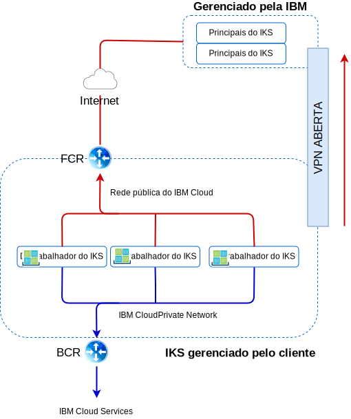

---

copyright:

  years:  2016, 2019

lastupdated: "2019-03-19"

subcollection: vmware-solutions

---

# Rede e infraestrutura do IBM Cloud
{: #vcsiks-arch-overview-infrastructure}

## Virtual Routing and Forwarding
{: #vcsiks-arch-overview-infrastructure-vrf}

As contas do {{site.data.keyword.cloud}} podem ser configuradas como uma conta de Virtual Routing and Forwarding (VRF). As contas de VRF ativam o roteamento global automático entre blocos de IP de sub-rede. Todas as contas com conexões de Link direto devem ser convertidas ou criadas como uma conta do VRF.

## Link Direto
{: #vcsiks-arch-overview-infrastructure-direct-link}

O {{site.data.keyword.cloud_notm}} Direct Link Connect oferece acesso privado à infraestrutura do {{site.data.keyword.cloud_notm}} e a quaisquer outras nuvens vinculadas ao seu Provedor de serviços de rede por meio do {{site.data.keyword.CloudDataCent_notm}} local. Essa opção é perfeita para criar conectividade com múltiplas nuvens em um único ambiente.
Nós conectamos os clientes à rede do {{site.data.keyword.cloud_notm}} Private usando uma topologia de largura de banda compartilhada. Como ocorre com todos os produtos Direct Link, é possível incluir roteamento global, que permite tráfego de rede privada para todos os locais do {{site.data.keyword.cloud_notm}}.

## Redes privadas virtuais
{: #vcsiks-arch-overview-infrastructure-virt-private-network}

### VPN do strongSwan
{: #vcsiks-arch-overview-infrastructure-strongswan}

O serviço de VPN do IPSec do strongSwan fornece um canal de comunicação seguro de ponta a ponta sobre a Internet que é baseado no conjunto de protocolos padrão de mercado da Internet Protocol Security (IPSec).

### Hybridity (HCX)
{: #vcsiks-arch-overview-infrastructure-hcx}

O VMware vCenter Server on {{site.data.keyword.cloud_notm}} with Hybridity Bundle amplia ininterruptamente as
redes de data centers no local para o {{site.data.keyword.cloud_notm}}, que permite
que máquinas virtuais (MVs) sejam migradas para e do {{site.data.keyword.cloud_notm}} sem
nenhuma conversão ou mudança.

## Estrutura física
{: #vcsiks-arch-overview-infrastructure-physical-structure}

A infraestrutura física necessária para implementar um cluster do vCenter Server requer
a especificação mínima a seguir.

Tabela 1. Especificações do vCenter Server

  | Implementação do NFS | Implementação de VSAN
---|---|---
Número de servidores | 3 | 4
CPU | 28 Núcleos 2.2 GHZ | 28 Núcleos 2.2 GHZ
Memória | 384 GB | 384 GB
Armazenamento | Mgmt: 2 TB 2 IOPS, Carga de trabalho: 2 TB 4 IOPS|Mín. SSD: 960 GB(x2)   

As opções de implementação do {{site.data.keyword.containerlong_notm}} variam com base nos requisitos do nó do trabalhador.

Tabela 2. Especificações do {{site.data.keyword.containerlong_notm}}

  | máquina virtual | Bare Metal
--|---|--
Número de servidores | 3 | 3
CPU | 2 – 56 núcleos | 4 – 28 núcleos
Memória | 4 GB - 242 GB | 32 GB - 512 GB
Armazenamento | 100 GB |  SATA: 2 TB / SSD: 960 GB

## Estrutura virtual
{: #vcsiks-arch-overview-infrastructure-virtual-structure}

Figura 1. Estrutura física de implementações do {{site.data.keyword.containerlong_notm}} e do {{site.data.keyword.icpfull_notm}}

Na instância do vCenter Server, os VMSs do cliente são implementados para os NSX
Edge Services Gateways (ESG) e Distributed Logical Routers (DLR) dedicados.

O ESG é configurado com uma regra NAT de origem (SNAT) para permitir tráfego de saída, que permite que a conectividade de Internet faça download dos pré-requisitos do {{site.data.keyword.icpfull_notm}} e se conecte ao GitHub e ao Docker. Como alternativa, é possível usar um proxy da web para conectividade de Internet. O ESG é configurado para acessar serviços DNS e NTP por meio da rede privada. A integração com a instância do {{site.data.keyword.containerlong_notm}} está disponível por meio de rede do {{site.data.keyword.cloud_notm}} entre a instância do vCenter Server e o {{site.data.keyword.containerlong_notm}}.

## Componentes do vCenter Server
{: #vcsiks-arch-overview-infrastructure-vcs-comp}

Figura 2. Componentes de plataforma do vCenter Server

### Platform Service Controller
{: #vcsiks-arch-overview-infrastructure-psc}

A implementação do vCenter Server usa um único platform services controller (PSC)
externo instalado em uma sub-rede móvel na VLAN privada associada a
MVs de gerenciamento. Seu gateway padrão é configurado para o backend customer router (BCR).

### vCenter Server
{: #vcsiks-arch-overview-infrastructure-vcs}

Como o PSC, o vCenter Server é implementado como um dispositivo.
Além disso, o vCenter é instalado em uma sub-rede móvel na
VLAN privada associada a MVs de gerenciamento. Seu gateway
padrão é configurado para o BCR.

### Gerenciador NSX
{: #vcsiks-arch-overview-infrastructure-nsx-manager}

O NSX Manager é implementado no cluster do vCenter Server inicial. Além disso,
um endereço IP é designado ao NSX Manager por meio do bloco de
endereço móvel privado designado a componentes de gerenciamento.

### NSX Controllers
{: #vcsiks-arch-overview-infrastructure-nsx-controllers}

A automação do {{site.data.keyword.cloud_notm}} implementa três Controladores NSX dentro do cluster inicial. Os controladores são designados a endereços IP da
sub-rede móvel privada que é designada a componentes de gerenciamento.

### NSX ESGs/DLRs
{: #vcsiks-arch-overview-infrastructure-nsx-esg}

Os pares do NSX Edge Services Gateway (ESG) são implementados. Em todos os casos, um par de gateway é usado para o tráfego de saída dos componentes de automação que residem na rede privada. Para o vCenter Server e o {{site.data.keyword.icpfull_notm}}, um segundo gateway, conhecido como a borda gerenciada por icp, é implementado e configurado com um uplink para a rede pública e uma interface designada à rede privada.
Qualquer componente NSX necessário, como o Distributed Logical Router (DLR), os comutadores lógicos e os firewalls, pode ser configurado pelo administrador. Para obter mais informações sobre os NSX Edges que são
implementados como parte da solução, veja [Guia de rede do vCenter Server](/docs/services/vmwaresolutions/archiref/vcsnsxt?topic=vmware-solutions-vcsnsxt-intro).

As tabelas a seguir resumem as especificações do {{site.data.keyword.icpfull_notm}} ESG/DLR.

Tabela 3. Especificações do {{site.data.keyword.icpfull_notm}} ESG

Atributo |  Especificação
--|--
Gateway de Serviço de Edge | Dispositivo Virtual
Tamanho de borda Grande | Número de vCPUs 2
Memória	| 1 GB
Disk	| 1000 GB no armazenamento de dados local

Tabela 4. Especificações do {{site.data.keyword.icpfull_notm}} DLR

Atributo  |  Especificação
--|--|
Roteador Lógico Distribuído |	Dispositivo Virtual
Tamanho de borda	Compacto | Número de vCPUs 1
Memória	| 512 MB
Disk	| 1000 GB no armazenamento de dados local

## Componentes do IBM Cloud Kubernetes Service
{: #vcsiks-arch-overview-infrastructure-iks-comp}

Figura 3. Componentes do {{site.data.keyword.containerlong_notm}} 

### Mestre do Kubernetes
{: #vcsiks-arch-overview-infrastructure-kube-master}

O mestre do Kubernetes é encarregado de gerenciar todos os recursos de cálculo, rede e armazenamento no cluster. O mestre do Kubernetes assegura que seus apps e serviços conteinerizados sejam igualmente implementados nos nós do trabalhador no cluster.

###	Nó do trabalhador
{: #vcsiks-arch-overview-infrastructure-worker-node}

Cada nó do trabalhador é uma máquina física (bare metal) ou uma MV
que é executada no hardware físico no ambiente de nuvem. Ao provisionar um nó do trabalhador, você determina os recursos que estão disponíveis para os contêineres hospedados nesse nó do trabalhador. Prontos para utilização,
os nós do trabalhador são configurados com um Mecanismo de Docker gerenciado pela IBM, recursos
de cálculo separados, rede e um serviço de volume. Os recursos de segurança integrada fornecem isolamento, capacidades de gerenciamento de recurso e conformidade de segurança do nó do trabalhador.

## Links relacionados
{: #vcsiks-arch-overview-infrastructure-related}

* [Visão geral do vCenter Server on {{site.data.keyword.cloud_notm}} with Hybridity Bundle](/docs/services/vmwaresolutions/archiref/vcs?topic=vmware-solutions-vcs-hybridity-intro)
