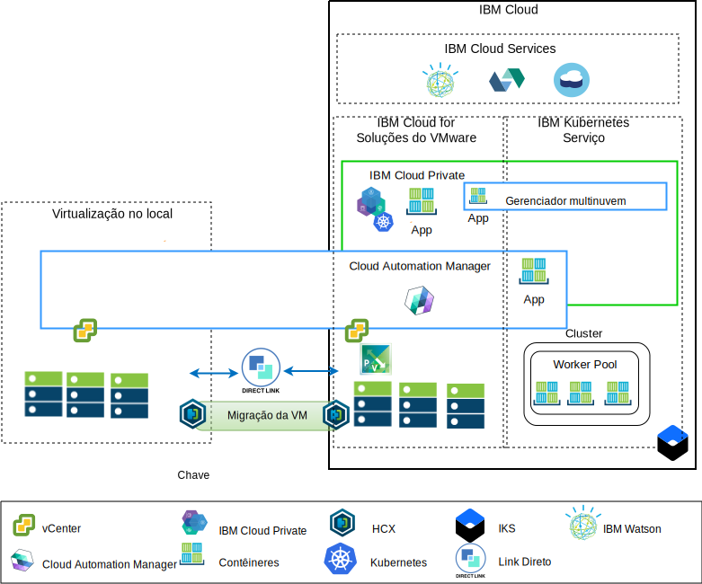
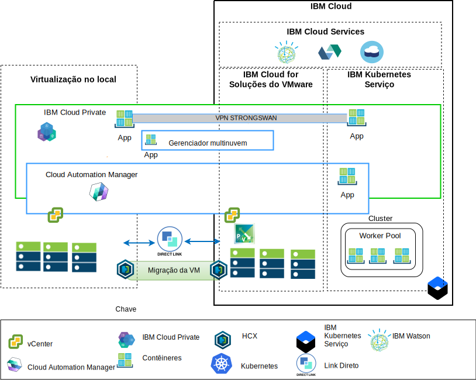

---

copyright:

  years:  2016, 2019

lastupdated: "2019-01-23"

---

# Visão geral da arquitetura
As ofertas do {{site.data.keyword.vmwaresolutions_full}} fornecem automação para implementar componentes de tecnologia do VMware em {{site.data.keyword.CloudDataCents_notm}} em todo o mundo. A arquitetura consiste em uma única região de nuvem e suporta a capacidade de ampliação para mais regiões de nuvem localizadas em outra geografia ou em outro pod do {{site.data.keyword.cloud_notm}} dentro do mesmo data center.

É possível implementar manualmente os produtos {{site.data.keyword.icpfull_notm}} e Cloud Automation Manager (CAM) em sua plataforma de virtualização no local,
permitindo o gerenciamento de nuvem por meio de locais no local. Como alternativa, o {{site.data.keyword.icpfull_notm}} e o CAM são oferecidos como extensões de serviço para uma implementação nova ou existente do VMware vCenter Server on {{site.data.keyword.cloud_notm}}, via automação, permitindo o gerenciamento de nuvem por meio do {{site.data.keyword.cloud_notm}}.

O {{site.data.keyword.icpfull_notm}} é uma plataforma de aplicativo para desenvolver e gerenciar aplicativos conteinerizados no local. O {{site.data.keyword.icpfull_notm}} é um ambiente integrado para gerenciar contêineres que inclui o orquestrador de contêineres Kubernetes, um repositório de imagem privada, um console de gerenciamento e estruturas de monitoramento.

O IBM Multi-Cluster Manager fornece visibilidade do usuário, gerenciamento centrado
no aplicativo (política, implementações, funcionamento, operações) e conformidade
com base em política entre nuvens e clusters. Com o IBM Multi-Cluster Manager, você tem controle de seus clusters do Kubernetes. É possível assegurar que os clusters sejam seguros, operando com eficiência e entregando os níveis de serviço que os aplicativos esperam.

O {{site.data.keyword.cloud_notm}} Automation Manager é uma plataforma de gerenciamento de autoatendimento
multinuvem que é executada no {{site.data.keyword.cloud_notm}} Private que confere poderes aos Desenvolvedores e
administradores para atender às demandas de negócios. O Cloud Automation Manager
Service Composer permite que você exponha os serviços de nuvem híbrida no
catálogo do IBM Cloud Private.

## Plataforma de gerenciamento de nuvem do IBM Cloud

O diagrama a seguir exibe o {{site.data.keyword.icpfull_notm}} e o CAM implementados com a infraestrutura
do {{site.data.keyword.cloud_notm}}, com conexões com o vCenter no local e o serviço {{site.data.keyword.containerlong_notm}} implementado no {{site.data.keyword.cloud_notm}}. Os usuários podem implementar máquinas virtuais (MVs) no local e MVs em instâncias e contêineres
do vCenter Server para o cluster do {{site.data.keyword.icpfull_notm}} e do {{site.data.keyword.containerlong_notm}}.

Figura 1. Gerenciamento de nuvem do lado da nuvem

No diagrama, o CAM cria conexões em nuvem logicamente para os vCenters, os provedores em nuvem, o {{site.data.keyword.icpfull_notm}} e os ambientes do {{site.data.keyword.containerlong_notm}}. Os clusters do {{site.data.keyword.icpfull_notm}} devem ser
implementados em cada data center ou ambiente de nuvem, com o MCM fornecendo o
mecanismo para conectar os clusters do {{site.data.keyword.icpfull_notm}} a uma única visualização de gerenciamento.

O {{site.data.keyword.icpfull_notm}} pode ser implementado com os componentes NSX-V ou NSX-T. O {{site.data.keyword.icpfull_notm}} com NSX-V permite que as MVs do {{site.data.keyword.icpfull_notm}} sejam executadas na rede VXLAN e usem a rede interna Calico do Kubernetes.

O {{site.data.keyword.icpfull_notm}} com NSX-T, que permite que os usuários controlem e configurem a rede,
a sub-rede, as políticas da IU central (Gerenciador NSX-T). Para obter informações sobre as diferenças entre NSX-V e NSX-T, consulte a [Arquitetura de referência de rede VCS do {{site.data.keyword.cloud_notm}}](/docs/services/vmwaresolutions/archiref/
vcsnsxt/vcsnsxt-intro.html).

## Plataforma de gerenciamento de nuvem no local

O diagrama a seguir exibe o {{site.data.keyword.icpfull_notm}} e o CAM implementados na infraestrutura
no local, com conexões com o vCenter e o {{site.data.keyword.containerlong_notm}} implementado no {{site.data.keyword.cloud_notm}}. Os usuários podem implementar MVs e contêineres
no local, MVs em instâncias e contêineres do vCenter Server
para o cluster do {{site.data.keyword.containerlong_notm}}.

Figura 2. Gerenciamento de nuvem do lado no local

A VPN do strongSwan é usada para estabelecer conectividade com os contêineres implementados do {{site.data.keyword.containerlong_notm}}. O strongSwan pode eventualmente ser substituído por conectividade
de link direto.

No diagrama, o CAM cria conexões em nuvem logicamente para os vCenters, os provedores em nuvem, o {{site.data.keyword.icpfull_notm}} e os ambientes do {{site.data.keyword.containerlong_notm}}. Os clusters do {{site.data.keyword.icpfull_notm}} devem ser
implementados em cada data center ou ambiente de nuvem, com o MCM fornecendo o
mecanismo para conectar os clusters do {{site.data.keyword.icpfull_notm}} a uma única visualização de gerenciamento.

### Links relacionados

* [Visão geral do vCenter Server on {{site.data.keyword.cloud_notm}} with Hybridity Bundle](/docs/services/vmwaresolutions/archiref/vcs/vcs-hybridity-intro.html)
