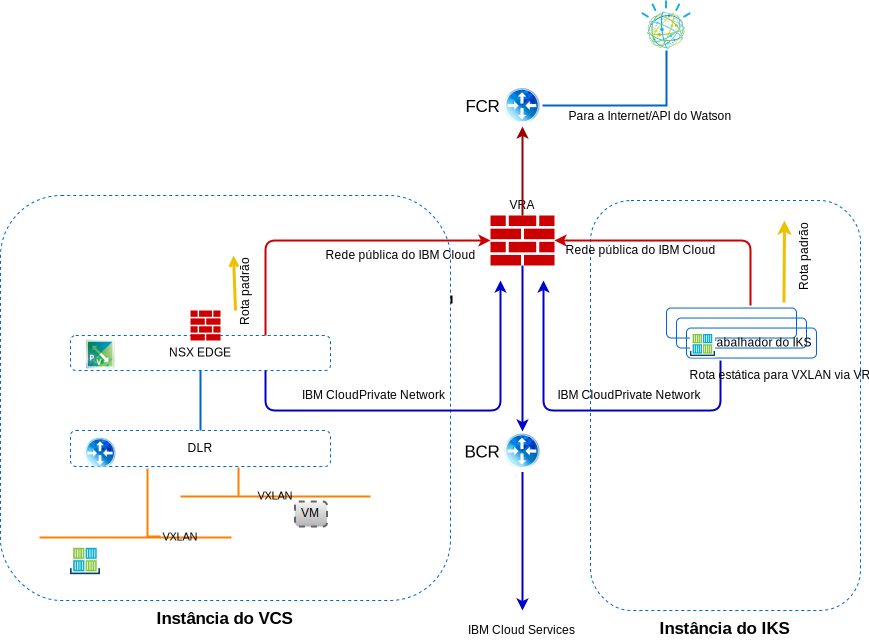

---

copyright:

  years:  2016, 2019

lastupdated: "2019-01-23"

---

# Rede, backup, recuperação de desastre e escalabilidade

## Rede

O {{site.data.keyword.cloud}} tem duas redes. A rede pública permite que os servidores sejam acessados da Internet e a rede privada permite que os servidores se comuniquem entre si por meio de um backbone de alta velocidade em todos os {{site.data.keyword.CloudDataCents_notm}}.

Por padrão, o {{site.data.keyword.containerlong_notm}} configura o cluster com acesso a uma VLAN pública e uma VLAN privada.
- Um endereço IP público para cada nó do trabalhador, que fornece aos nós do trabalhador uma interface de rede pública.
  - Todo o tráfego de rede de saída é permitido para todos os nós do trabalhador.
  - O tráfego de rede de entrada está bloqueado, exceto para algumas portas. Essas portas são abertas para que a IBM possa monitorar o tráfego de rede e instalar automaticamente atualizações de segurança para o mestre do Kubernetes.
- Um endereço IP privado para cada nó do trabalhador, que fornece aos nós do trabalhador uma interface de rede privada
- Uma conexão OpenVPN automática e segura entre todos os nós do trabalhador e o nó principal

Figura 1. Rede do vCenter Server e do {{site.data.keyword.containerlong_notm}}

### Integração do IBM Cloud Kubernetes Service e do vCenter Server

Atualmente, os cenários a seguir integram a rede do {{site.data.keyword.containerlong_notm}} e do VMware vCenter Server on {{site.data.keyword.cloud_notm}}:
- **Roteamento de VRA** - esse cenário requer que os nós do trabalhador do {{site.data.keyword.containerlong_notm}} sejam implementados na mesma VLAN que a instância do vCenter Server. Isso permite que um ESG seja um peer do BGP com o VRA e ative o roteamento da sobreposição para a rede subjacente entre o vCenter Server e o {{site.data.keyword.containerlong_notm}}. Uma rota estática é necessária nos nós do trabalhador do {{site.data.keyword.containerlong_notm}} para que cada rede VXLAN roteie essas solicitações de volta para o BCR/VRA para rotear corretamente.
- **VPN strongSwan** - esse cenário usa a solução de conectividade padrão de {{site.data.keyword.containerlong_notm}} para empresa. Um contêiner strongSwan fornece um gateway VPN para o cluster que encaminha pacotes para redes remotas por meio de um túnel IPSec para o gateway remoto. Esse gateway remoto é um ESG na instância do vCenter Server. Nos gateways, as rotas são configuradas enviando todos os intervalos de IP de cluster e de serviço para o contêiner do StrongSwan e todos os endereços BYOIP do vCenter Server para o ESG. Os endereços IP de destino dos gateways são o endereço IP móvel privado do serviço de balanceador de carga que é designado ao contêiner do strongSwan e ao endereço IP móvel privado do ESG.

#### VLANs de rede do IBM Cloud Kubernetes Service

##### Sub-redes Public VLAN

- A sub-rede pública primária determina os endereços IP públicos que são designados aos nós do trabalhador durante a criação do cluster. Múltiplos clusters na mesma VLAN podem compartilhar uma sub-rede pública primária.
- A sub-rede pública móvel é ligada a somente um cluster e fornece o cluster com oito endereços IP públicos. Três IPs são reservados para funções de rede. Um IP é usado pelo ALB do Ingress público padrão e quatro IPs são usados para criar serviços de rede pública do balanceador de carga.

Os IPs públicos móveis são endereços IP fixos permanentes usados para acessar serviços do balanceador de carga por meio da Internet.

##### Sub-redes privadas de VLAN

- A sub-rede privada primária determina os endereços IP privados que são designados aos nós do trabalhador durante a criação do cluster. Múltiplos clusters na mesma VLAN podem compartilhar uma sub-rede privada primária.
- A sub-rede privada móvel é ligada a somente um cluster e fornece ao cluster oito endereços IP privados. Três IPs são reservados para funções de rede. Um IP é usado pelo ALB do Ingress privado padrão e quatro IPs são usados para criar serviços de rede privada do balanceador de carga.

Os IPs privados móveis são endereços IP fixos permanentes que são usados para acessar serviços do balanceador de carga por meio da Internet.

#### Calico

Cada cluster do Kubernetes é configurado com um plug-in de rede chamado Calico.

##### Controlando o tráfego com políticas de rede

As políticas de rede padrão são configuradas para assegurar a interface de rede pública de cada nó do trabalhador no {{site.data.keyword.containerlong_notm}}. Se você tiver requisitos de segurança exclusivos ou tiver um cluster de múltiplas zonas com o VLAN Spanning ativado, será possível usar o Calico e o Kubernetes para criar políticas de rede para um cluster. Com políticas de rede do Kubernetes, é possível especificar o tráfego de rede que você deseja permitir ou bloquear para/de um pod em um cluster. Para configurar políticas de rede mais avançadas, como bloquear o tráfego de entrada (ingresso) para serviços LoadBalancer, use políticas de rede do Calico.

###### Políticas de rede do Kubernetes

Essas políticas especificam como os pods podem se comunicar com outros pods e com terminais externos. O tráfego também pode ser filtrado com base nos rótulos de pod e de namespace. As políticas de rede do Kubernetes são aplicadas usando comandos kubectl ou as APIs do Kubernetes. Quando essas políticas são aplicadas, elas são automaticamente convertidas em políticas de rede Calico e o Calico cumpre essas políticas.

###### Políticas de rede Calico para Kubernetes

As políticas de rede Calico são um superconjunto das políticas de rede do Kubernetes e são aplicadas usando comandos calicoctl.

As políticas do Calico incluem os recursos a seguir:
- Permitir ou bloquear tráfego de rede em interfaces de rede específicas independentemente do endereço IP de origem ou destino do pod do Kubernetes ou CIDR.
- Permitir ou bloquear tráfego de rede para os pods em namespaces.
- Bloquear o tráfego de entrada (ingresso) para os serviços do Kubernetes LoadBalancer ou NodePort.

O Calico cumpre essas políticas, incluindo quaisquer políticas de rede do Kubernetes que são convertidas automaticamente em políticas do Calico, configurando regras iptables do Linux nos nós do trabalhador do Kubernetes. As regras de Iptables servem como um firewall para o nó do trabalhador para definir as características que o tráfego de rede deve atender para ser encaminhado para o recurso de destino.

### Fluxos de tráfego

#### Usuário externo na Internet para uma camada da web hospedada em um contêiner no IBM Cloud Kubernetes Service

1. O usuário externo faz uma solicitação para a camada da web usando a URL.
2. O DNS é usado para determinar o endereço IP. Esse endereço IP é um endereço público do {{site.data.keyword.cloud_notm}} em uma sub-rede móvel que é designada ao Serviço ALB ou Ingress.
3. A rede pública encaminha automaticamente a solicitação para o nó do trabalhador que hospeda o Serviço ALB ou Ingress.
4. O nó do trabalhador encaminha a solicitação para o endereço IP do cluster interno e o número da porta do Serviço ALB ou Ingress. Esse endereço IP do cluster interno é acessível somente dentro do cluster.
5. Dentro do nó do trabalhador, o proxy do kube roteia a solicitação para o serviço ALB ou Ingress.
6. Se o aplicativo estiver no mesmo nó do trabalhador, o iptables será usado para determinar qual interface interna será usada para encaminhar a solicitação. Se o app estiver em um nó trabalhador diferente, o Calico vRouter roteará para o nó do trabalhador aplicável usando o encapsulamento IP-in-IP somente se o nó do trabalhador estiver em uma sub-rede diferente.

#### Camada da web hospedada em um contêiner no IBM Cloud Kubernetes Service para a camada de banco de dados hospedada em uma máquina virtual no vCenter Server

Recursos de terminal são criados que detalham máquinas virtuais (MVs) de banco de dados externo que incluem o endereço IP NAT e o número da porta das MVs de banco de dados mysql, por exemplo.

- kind: Endpoints
- apiVersion: v1
- metadados:
  - nome: mysqldb
- subsets:
  - addresses:
      - ip: 10.x.x.x
  - ports:
      - porta: 3306

O recurso de Terminal pode ter vários endereços listados e o Kubernetes efetuará round-robin entre esses endereços.  

Os recursos de serviço são usados para criar um IP e um nome DNS em kube-dns para serviços:

- kind: Service
- apiVersion: v1
- metadados:
  - nome: mysqldb
- labels:
  - nome: mysqldb
- spec:
  - ports:
    - protocol: TCP
    - porta: 3306

##### Fluxo

1. A camada da web em execução em um contêiner no {{site.data.keyword.containerlong_notm}} faz uma solicitação para o banco de dados em execução em uma MV na instância do vCenter Server chamando mysqldb. O Kubernetes resolve esse nome para um endereço IP e envia essa solicitação
para fora do cluster com um endereço IP de destino do IP com NAT do
servidor de banco de dados (10.x/26) e um IP de origem do nó do trabalhador (10.x/26).
2. Como o endereço IP de destino não está na mesma sub-rede que o
nó do trabalhador, ele é encaminhado para o {{site.data.keyword.cloud_notm}} BCR.
3. O BCR roteia a solicitação e coloca a solicitação na VLAN **Privada A**, na sub-rede de Cargas de trabalho do cliente, na qual o customer-nsx-edge está conectado.

Este NSX Edge tem:
- Regra de firewall que permite essa conexão.
- Regra DNAT que muda o endereço IP de destino do
endereço 10.x para o endereço 192.168 usado para o servidor de banco de dados.
4. O ESG, em seguida, encaminha para o DLR.
5. O DLR coloca a solicitação na VXLAN necessária.
6. A MV do banco de dados recebe a solicitação.

## Backup e DR

### Backup do vCenter Server
Como parte do {{site.data.keyword.vmwaresolutions_short}}, o software de backup Veeam é
opcionalmente implementado em uma instância de servidor virtual (VSI) do {{site.data.keyword.cloud_notm}} que usa
o armazenamento do Endurance do {{site.data.keyword.cloud_notm}} fora do cluster do VMware. O propósito desse software é fazer backup dos componentes de gerenciamento nessa solução.

### backup do NSX
O backup adequado de todos os componentes do NSX será crucial para restaurar o sistema para seu estado de funcionamento se ocorrer falha. Não é suficiente fazer backup das
MVs do NSX. A função de backup do NSX dentro do gerenciador NSX deve ser empregada
para um backup adequado. Esse backup requer que um servidor FTP ou SFTP seja
especificado para o repositório de dados de backup do NSX. O backup do NSX Manager contém toda a configuração do NSX, incluindo controladores, entidades lógicas de alternância e roteamento, segurança, regras de firewall e tudo o mais que você configurar dentro da UI ou API do NSX Manager. O banco de dados
do vCenter e os elementos relacionados, como os comutadores virtuais, são submetidos a backup
separadamente. A configuração do NSX deve ser submetida a backup junto a um backup do vCenter.

### Backup e DR para o IBM Cloud Kubernetes Service
Os backups do banco de dados etcd são fornecidos para o cliente como parte do serviço gerenciado, quaisquer dados do aplicativo devem ser suportados por si mesmo.

## Escalabilidade

### Escalabilidade do vCenter Server
Após a implementação dos hosts iniciais, o usuário pode
ampliar a capacidade de cálculo de dentro do portal do
{{site.data.keyword.vmwaresolutions_short}}. Essa escala fora do ambiente segue um dos três caminhos:
- Adição de novos sites gerenciados por vCenter Servers separados.
- Adição de novos clusters.
- Adição de novos hosts em um cluster existente.

#### Implementações multisite
O VMware on {{site.data.keyword.cloud_notm}} pode usar a presença do data center mundial do IBM Cloud e o backbone de rede integrada para permitir que vários casos de uso de geografia cruzada sejam implementados e funcionem dentro de uma fração do tempo que levaria para construir tal infraestrutura do zero.

#### Ampliar com novo cluster
O usuário também pode ampliar a capacidade de cálculo criando um novo
cluster de dentro do console, pedindo os hosts e os novos hosts
são automaticamente incluídos no novo cluster. Essa opção cria um cluster
extra no ambiente e fornece aos usuários a capacidade de segregar física
e logicamente as cargas de trabalho de gerenciamento das cargas de trabalho do aplicativo, a
capacidade de segregar cargas de trabalho com base em outras características (por
exemplo, cluster de banco de dados Microsoft SQL) e a capacidade de implementar
aplicativos em topologias altamente disponíveis.

#### Escalar o cluster existente
O usuário pode ampliar um cluster existente pedindo hosts de dentro do console e os novos hosts serão incluídos automaticamente no cluster.
Os usuários podem precisar ajustar a política de reserva de HA do cluster com base em seus requisitos de reserva.

### expansão do IBM Cloud Kubernetes Service

Os usuários podem provisionar um ambiente do {{site.data.keyword.containerlong_notm}} por meio do Portal do {{site.data.keyword.cloud_notm}} para
ampliar ou usar um ambiente de contêiner. As implementações do aplicativo no {{site.data.keyword.containerlong_notm}}
podem ser feitas por meio de:
  - A conexão e os serviços do {{site.data.keyword.containerlong_notm}} são desenvolvidos no CAM e publicados no catálogo do {{site.data.keyword.icpfull_notm}}.
  - Aprimoramento futuro do Multi-Cloud Manager para gerenciar as instâncias do {{site.data.keyword.containerlong_notm}}.
  - Interface da linha de comandos do Helm.
  - Use os clusters Multizona para aumentar a alta disponibilidade.

[Planejando sua configuração do cluster e do nó do trabalhador](/docs/containers/cs_clusters_planning.html#plan_clusters) explica as opções e o processo para projetar uma solução para atender aos seus requisitos.

## Segurança e conformidade
Quando se trata de atender às diretrizes estritas da indústria, o {{site.data.keyword.cloud_notm}} faz o trabalho para você, promovendo a conformidade verdadeira. [A conformidade no {{site.data.keyword.cloud_notm}}](https://www.ibm.com/cloud/compliance) fornece detalhes sobre as certificações de conformidade específicas, regulamentações globais, alinhamentos e estruturas para segurança e privacidade. [ Segurança para detalhes de segurança do  {{site.data.keyword.containerlong_notm}} ](/docs/containers/cs_secure.html#security)   {{site.data.keyword.containerlong_notm}} .

### Links relacionados

* [Visão geral do vCenter Server on {{site.data.keyword.cloud_notm}} with Hybridity Bundle](/docs/services/vmwaresolutions/archiref/vcs/vcs-hybridity-intro.html)
