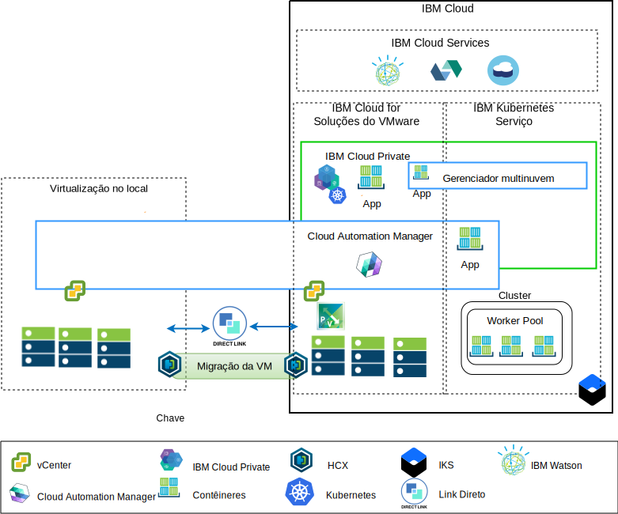

---

copyright:

  years:  2016, 2019

lastupdated: "2019-02-21"

---

# Visão geral de modernização do
{: #vcsnsxt-appmod}

O diagrama a seguir mostra a arquitetura de referência de modernização do aplicativo que a Acme Skateboards implementa e é descrita detalhadamente nesta série de documentos.

Figura 1. Visão geral da arquitetura

Essa arquitetura híbrida permite à Acme Skateboards:
- Migrar máquinas virtuais VMware (MVs) no local para o {{site.data.keyword.cloud}} com pouco ou nenhum tempo de inatividade e nenhuma reconfiguração do aplicativo.
-	Ativá-las para iniciar a jornada de modernização de aplicativo, permitindo que eles se concentrem na conteinerização das interfaces da web mais simples e do middleware, enquanto também permite que bancos de dados mais complexos permaneçam como MVs.
-	Usar o Cloud Automation Manager (CAM) para criar script de Infrastructure as code (IaC) a fim de editar e orquestrar serviços que são feitos por meio de MVs e contêineres para integração com suas cadeias de ferramentas do DevOps e sua solução ITSM.

Concentrando-se na arquitetura de rede, a arquitetura de referência tem os componentes principais a seguir:
- **Virtualização no local** - um cluster do VMware que hospeda atualmente as MVs da Acme Skateboards. Essas MVs estão hospedando atualmente os aplicativos que serão modernizados. Esse cluster é necessário para atender aos pré-requisitos, conforme documentado no documento [Arquitetura da solução VMware HCX on {{site.data.keyword.cloud_notm}}](https://www.ibm.com/cloud/garage/files/HCX_Architecture_Design.pdf) para permitir que os clientes migrem MVs para a instância do VMware vCenter Server on {{site.data.keyword.cloud_notm}} em execução no {{site.data.keyword.cloud_notm}} e de volta, se necessário.
- **VMware vCenter Server on IBM Cloud** - o vCenter Server fornece os blocos de construção fundamentais do VMware: vSphere, vCenter Server, NSX-V e opções de armazenamento que incluem o armazenamento do vSAN ou {{site.data.keyword.cloud_notm}} Endurance, necessário para implementar automaticamente uma solução VMware Software Defined Data Center (SDDC). Esse cluster do VMware é o destino das MVs migradas e alguns dos aplicativos modernizados em contêineres hospedados no {{site.data.keyword.icpfull_notm}}.

Os componentes principais da arquitetura são:
- **NSX-V** - o NSX-V fornece a camada de virtualização de rede no vCenter Server que fornece uma sobreposição de rede para MVs do Acme Skateboards. O NSX-V ativa o BYOIP e isola as redes de carga de trabalho das redes do {{site.data.keyword.cloud_notm}}. O NSX-V é programado pelo HCX para criar as redes que a Acme Skateboards amplia no local.
- **{{site.data.keyword.icpfull_notm}}** - O {{site.data.keyword.icpfull_notm}} é uma plataforma de aplicativo para desenvolver e gerenciar aplicativos conteinerizados. É um ambiente integrado que inclui o orquestrador de contêineres Kubernetes, um repositório de imagem privada, um console de gerenciamento, estruturas de monitoramento e uma interface gráfica com o usuário que fornece um local centralizado por meio do qual o Acme Skateboards pode implementar, gerenciar, monitorar e escalar seus aplicativos. A instância do vCenter Server hospeda os componentes, os nós principais, os nós do trabalhador e outros do {{site.data.keyword.icpfull_notm}}, executando-os como MVs.
- **IBM Cloud Automation Manager** - o CAM é uma plataforma infrastructure as code (IaC) pronta para empresa que fornece uma única área de janela de vidro para provisionar cargas de trabalho baseadas em máquina virtual juntamente com cargas de trabalho baseadas em Kubernetes usando modelos. O CAM é um aplicativo Dockerizado que é executado em uma instalação do {{site.data.keyword.icpfull_notm}} e é fortemente integrado para autorização, RBAC e outras funções.
- **{{site.data.keyword.containerlong_notm}}** - O {{site.data.keyword.containerlong_notm}} permite que o Acme Skateboards implemente seus aplicativos modernizados em contêineres do Docker executados em clusters do Kubernetes. Os modos principais são totalmente gerenciados pela IBM enquanto os nós do trabalhador no conjunto de trabalhadores são implementados na mesma conta do {{site.data.keyword.cloud_notm}} que sua instância do vCenter Server. Os nós do trabalhador são instâncias de servidor virtual bare metal, público ou dedicado. O Calico é instalado e configurado automaticamente no {{site.data.keyword.containerlong_notm}}. O Calico fornece conectividade de rede segura para contêineres e está configurado no {{site.data.keyword.containerlong_notm}} para usar o encapsulamento IP-in-IP para encapsular pacotes que viajam pelas sub-redes. O Calico usa NAT para conexões de saída dos contêineres.
- **Direct Link** - o {{site.data.keyword.cloud_notm}} Direct Link usa o provedor de WAN do Acme Skateboard para conectar seu data center ao {{site.data.keyword.cloud_notm}} fornecendo uma conexão de rede confiável, de baixa latência e segura. Esta conexão fornece:
  - Acesso aos aplicativos hospedados em nuvem por meio de seus usuários corporativos.
  - Tráfego entre MVs no local e MVs de nuvem.
  - Tráfego entre sistemas legados no data center no local e nas MVs de nuvem.

## Benefícios importantes para a Acme Skateboards
{: #vcsnsxt-appmod-benefits}

- Entrega acelerada de projetos de TI para desenvolvedores e linhas de negócios, reduzindo o tempo que leva para compras, arquitetura, implementação e implementação de recursos de semanas ou mesmo meses até horas. O tempo de maturação do aplicativo diminuirá se os clientes precisarem esperar até que as equipes de rede ou segurança possam pedir serviços, como balanceadores de carga, firewalls, comutadores e roteadores.
- Segurança aprimorada com servidores bare metal dedicados em uma nuvem privada hospedada, incluindo a implementação de terminal em serviço de rede privada para serviços do {{site.data.keyword.cloud_notm}}, como o {{site.data.keyword.containerlong_notm}} e o KMIP.
- Gerenciamento e controle consistentes da nuvem híbrida implementada, fornecendo acesso administrativo total ao gerenciamento de virtualização, preservando suas ferramentas, scripts e investimentos existentes do VMware em treinamento.
- Conhecimento do VMware em escala global com o IBM Professional and Managed Services abrangendo 30+ {{site.data.keyword.CloudDataCents_notm}} no mundo inteiro.

Os clientes voltados para plataformas de aplicativos nativos de nuvem, como o {{site.data.keyword.icpfull_notm}} e o {{site.data.keyword.containerlong_notm}} concentram-se na velocidade e na inovação e nem sempre têm segurança e rede em mente.

Essa arquitetura de referência mostra como o VCS, o {{site.data.keyword.icpfull_notm}} e o {{site.data.keyword.containerlong_notm}} movem o Acme Skateboards de forma segura pela jornada de modernização do aplicativo.

## Links relacionados
{: #vcsnsxt-appmod-related}

* [Visão geral do vCenter Server on {{site.data.keyword.cloud_notm}} with Hybridity Bundle](/docs/services/vmwaresolutions/archiref/vcs?topic=vmware-solutions-vcs-hybridity-intro)
