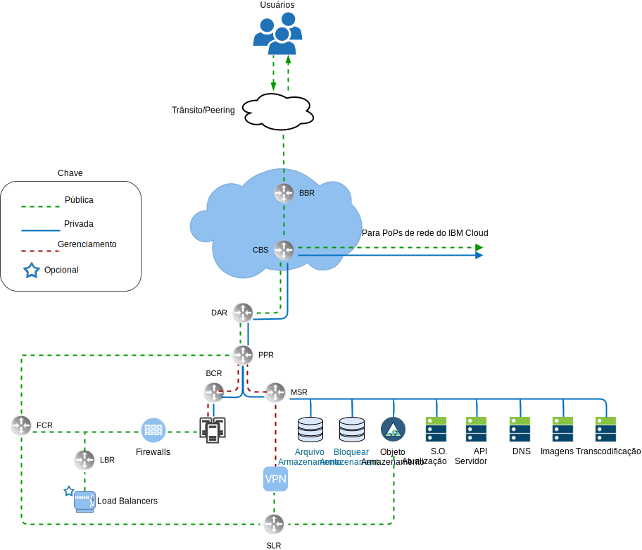
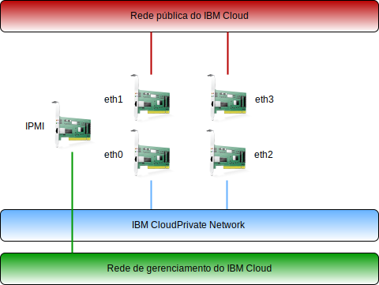

---

copyright:

  years:  2016, 2019

lastupdated: "2019-05-08"

subcollection: vmware-solutions

---

# Visão geral de rede do IBM Cloud
{: #vcsnsxt-overview-ic4vnetwork}

O {{site.data.keyword.cloud}} manipula a rede física. As informações a seguir descrevem a rede física que é fornecida pelo {{site.data.keyword.cloud_notm}} e as conexões de host físico (VLANs, MTU) associadas aos hosts físicos descritos anteriormente.

A rede física do {{site.data.keyword.cloud_notm}} é separada em três redes distintas: pública, privada e de gerenciamento.

## Rede pública
{: #vcsnsxt-overview-ic4vnetwork-public-net}

Os pontos de presença (PoP) do {{site.data.keyword.CloudDataCents_notm}} e da rede têm mais de uma conexão de 1 Gbps ou 10 Gbps para o trânsito de camada superior e as transportadoras de rede de peering. O tráfego de rede de qualquer lugar no mundo se conecta ao PoP de rede mais próximo e viaja diretamente pela rede para seu data center, minimizando o número de hops e handoffs de rede entre os provedores. Dentro do data center, uma largura da banda da rede de 1 Gbps ou 10 Gbps é fornecida para servidores individuais por meio de um par de front-end customer switches (FCS) agregados em peer. Esses comutadores agregados são conectados a um par de roteadores separados (isto é, front-end customer routers, FCR) para a rede L3. Esse design multicamada permite que a rede seja escalada em racks, linhas e pods dentro de um {{site.data.keyword.CloudDataCent_notm}}.

## Rede Privada
{: #vcsnsxt-overview-ic4vnetwork-private-net}

Todos os {{site.data.keyword.CloudDataCents_notm}} e os PoPs são conectados pela backbone de rede privada. Essa rede privada é separada da rede pública e permite a conectividade com serviços em {{site.data.keyword.CloudDataCents_notm}} ao redor do mundo. A movimentação de dados entre os data centers é feita usando mais de uma conexão de 10 Gbps ou 40 Gbps com a rede privada. Semelhante à rede pública, a rede privada possui multicamada em que os servidores e outras infraestruturas estão conectados aos back-end customer switches (BCS) agregados. Esses comutadores agregados estão conectados a um par de roteadores separados (isto é, back-end customer routers, BCR) para rede L3. A rede privada também suporta a capacidade de usar quadros jumbo (MTU 9000) para conexões de host físico.

## Rede de gerenciamento
{: #vcsnsxt-overview-ic4vnetwork-mgmt-net}

Junto com as redes públicas e privadas, cada servidor {{site.data.keyword.cloud_notm}} é conectado a uma rede de gerenciamento fora da banda. Essa rede de gerenciamento, acessível via VPN, permite acesso do Intelligent Platform Management Interface (IPMI) ao servidor independentemente de sua CPU, do firmware e do sistema operacional para propósitos de manutenção e administração.

## Blocos IP primários e móveis
{: #vcsnsxt-overview-ic4vnetwork-ip-blocks}

O {{site.data.keyword.cloud_notm}} aloca dois tipos de endereços IP para serem usados dentro da infraestrutura do {{site.data.keyword.cloud_notm}}:
* Os endereços IP primários são designados a dispositivos, bare metal e servidores virtuais fornecidos pelo {{site.data.keyword.cloud_notm}}. Os usuários não devem designar nenhum endereço IP nesses blocos.
* Os endereços IP móveis são fornecidos ao usuário para designar e gerenciar conforme necessário.

Os endereços IP primários ou móveis poderão ser tornados roteáveis para qualquer VLAN dentro da conta do cliente se a conta estiver configurada como uma conta de Virtual Routing and Forwarding (VRF).

## Virtual Routing and Forwarding
{: #vcsnsxt-overview-ic4vnetwork-vrf}

As contas do {{site.data.keyword.cloud_notm}} também podem ser configuradas como uma conta Virtual Routing and Forwarding (VRF). Uma conta de VRF ativa o roteamento global automático entre blocos de IP de sub-rede dentro da conta. Todas as contas com conexões de Link direto devem ser convertidas ou criadas como uma conta do VRF.

## Conexões físicas do host
{: #vcsnsxt-overview-ic4vnetwork-host-connect}

Cada host físico dentro do design tem dois pares redundantes de conexões Ethernet de 10 Gbps em cada comutador Top of Rack (ToR) do {{site.data.keyword.cloud_notm}} (público e privado). Os adaptadores são configurados como conexões individuais (desvinculadas) para um total de 4 × conexões de 10 Gbps. Isso permite que cada conexão da placa de interface de rede (NIC) funcione independentemente das outras.

## VLANs
{: #vcsnsxt-overview-ic4vnetwork-vlans}

As ofertas do VMware on {{site.data.keyword.cloud_notm}} são projetadas com três VLANs (uma público e duas privadas) designadas na implementação. A VLAN pública é designada a eth1 e eth3, enquanto as conexões privadas são designadas a eth0 e eth2. É importante observar que a primeira VLAN privada e a pública criadas e designadas a esse design não são identificadas por padrão. Posteriormente, a VLAN privada adicional será truncada nas portas do comutador físico e identificada nos grupos de portas do VMware que estão consumindo essas sub-redes.

Conforme declarado anteriormente, a rede privada é constituída por duas VLANs dentro deste design. Três sub-redes são alocadas para a primeira dessas VLANs (aqui designada VLAN Privada A). A primeira é um intervalo de sub-redes privadas de IP primárias que o {{site.data.keyword.cloud_notm}} designa aos hosts físicos. A segunda sub-rede é usada para máquinas virtuais de gerenciamento (por exemplo, vCenter Server Appliance, Platform Services Controller). A terceira é usada para os VXLAN Tunnel Endpoints (VTEPs) designados a cada host usando o NSX Manager.

Junto com a VLAN Privada A, uma segunda VLAN privada (aqui designada como VLAN Privada B) existe para suportar recursos do VMware, como vSAN e vMotion, e para conectividade com o armazenamento conectado à rede (NAS). Como tal, a VLAN é dividida em duas ou três sub-redes móveis. A primeira sub-rede é designada a um grupo de portas do kernel para o tráfego vMotion. A sub-rede ou sub-redes restantes são usadas para o tráfego de armazenamento e, ao usar vSAN, uma é designada a grupos de portas do kernel usados para tráfego de vSAN. Ao usar NAS, uma é designada a um grupo de portas dedicado ao tráfego de NFS. Todas as sub-redes configuradas como parte de uma implementação automatizada do vCenter Server usam intervalos gerenciados pelo {{site.data.keyword.cloud_notm}}. Isso é para assegurar que qualquer endereço IP possa ser roteado para qualquer data center dentro da conta do {{site.data.keyword.cloud_notm}} que é usada, se necessário, atualmente ou no futuro.

Tabela 1. Resumo de VLAN e sub-rede

VLAN 	|Tipo de sub-rede 	|Descrição
---|---|---
Pública 	|Primária 	|Designada a hosts físicos para acesso à rede pública. Não usada na implementação inicial.
Pública	|Móvel 	|Designada ao uso de uplink e NAT no customer-nsx-esg.
Pública	|Móvel 	|Designada ao uso de NAT de uplink no mgmt-nsx-esg.
Pública	|Móvel 	|Designada ao uso de NAT de uplink no hcx-mgmt-esg, caso o Hybridity Bundle esteja selecionado.
Privada A 	|Primária 	  |Designada aos hosts físicos designados pelo {{site.data.keyword.cloud_notm}}. Usada pela interface de gerenciamento para o tráfego de gerenciamento do vSphere.
Privada A 	|Móvel 	|Designada a máquinas virtuais funcionando como componentes de gerenciamento.
Privada A 	|Móvel 	|Designada ao NSX VTEP.
Privada A 	|Móvel 	|Designada ao HCX para uso interno, se o Hybridity Bundle estiver selecionado.
Privada A 	|Móvel 	|Designada ao uso de uplink no customer-nsx-esg.
Privada A 	|Móvel 	|Designada ao HCX, se o Hybridity Bundle estiver selecionado.
Privada B	  |Primária	  |Não usada na implementação inicial.
Privada B 	|Móvel 	|Designada ao vSAN se em uso.
Privada B 	|Móvel 	|Designada ao NAS se em uso.
Privada B 	|Móvel 	|Designada ao vMotion.

Esse design é implementado com hosts físicos e instâncias de sistema virtual (VSI) em VLANs e configurado para apontar para o {{site.data.keyword.cloud_notm}} BCR (back-end customer router de “rede privada”) como a rota padrão. Ao passo que as instâncias do vCenter Server permitem o uso de rede definida pelo software. Quaisquer sobreposições de rede criadas pelo NSX que incluem roteamento para sub-redes VLAN não são conhecidas pelos roteadores gerenciados pelo {{site.data.keyword.cloud_notm}} e você pode precisar criar rotas estáticas, regras de firewall e regras NAT para gerenciar adequadamente os fluxos de rede.

As conexões de rede privada são configuradas para usar quadros gigantes com o tamanho de MTU de 9000, o que melhora o desempenho para transferências de dados grandes, como armazenamento e vMotion. Esta é a MTU máxima permitida dentro do VMware e por {{site.data.keyword.cloud_notm}}. As conexões de rede pública usam uma MTU Ethernet padrão de 1500. Isso deve ser mantido, pois quaisquer mudanças podem causar fragmentação de pacotes na internet.

## Links relacionados
{: #vcsnsxt-overview-ic4vnetwork-related}

* [Visão geral do vCenter Server on {{site.data.keyword.cloud_notm}} with Hybridity Bundle](/docs/services/vmwaresolutions/archiref/vcs?topic=vmware-solutions-vcs-hybridity-intro)
