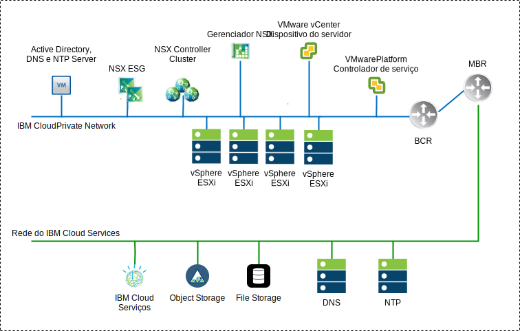

---

copyright:

  years:  2016, 2018

lastupdated: "2018-11-06"

---

# Visão geral do NSX-V

A virtualização de rede fornece uma sobreposição de rede que existe dentro da camada virtual. Isso fornece a arquitetura com recursos, como provisionamento rápido, implementação, reconfiguração e destruição de redes virtuais sob demanda. Esse design usa o vSphere distributed switch (vDS) e o VMware NSX for vSphere para implementar a rede virtual.

Nesse design, o NSX Manager é implementado no cluster inicial. Além disso, o NSX Manager é designado a um endereço IP suportado pela VLAN por meio do bloco de endereço móvel privado que é designado para componentes de gerenciamento e também é configurado com os servidores DNS e NTP anteriormente discutidos.

Tabela 1. Especificações do dispositivo virtual NSX-V Manager

Atributo |Especificação
---|---
Gerenciador NSX	|Dispositivo Virtual
Número de vCPUs	|4
Memória	|16 GB
Disco	|60 GB no compartilhamento do NFS de gerenciamento
Tipo de disco |Thin provisioned
Rede |Móvel Privada A designada para componentes de gerenciamento

A visão geral de rede do NSX-V Manager abaixo mostra o posicionamento do NSX Manager em relação aos outros componentes nessa arquitetura.

Figura 1. Visão geral de rede do NSX-V Manager

Após a implementação inicial, a automação do {{site.data.keyword.cloud}} implementa três NSX Controllers dentro do cluster inicial. Os controladores são designados a um endereço IP da sub-rede móvel Privada A que é designada para componentes de gerenciamento. As regras de antiafinidade VM-VM são criadas de modo que os controladores sejam separados entre os hosts no cluster. Observe que o cluster inicial deve ser implementado com um mínimo de três nós para assegurar alta disponibilidade para os controladores.

Além dos controladores, a automação do {{site.data.keyword.cloud_notm}} prepara os hosts vSphere implementados com VIBS NSX que permitem o uso de uma rede virtualizada (VXLAN) por meio do uso de VXLAN Tunnel Endpoints (VTEP). Os VTEPs são os endereços IP designados por meio do intervalo de endereço IP móvel Privado que é especificado para VTEPs. O tráfego de VXLAN reside na VLAN não identificada e é designado ao virtual distributed switch (vDS) privado. Posteriormente, um conjunto de IDs de segmento é designado e os hosts no cluster são incluídos na zona de transporte. Observe que somente unicast é usado na zona de transporte, uma vez que a espionagem do IGMP não está configurada dentro do {{site.data.keyword.cloud_notm}}.

Os pares de NSX Edge Services Gateway (ESG) são então implementados. Em todas as implementações, um par de gateways é usado para tráfego de saída dos componentes de automação residentes na rede privada. As instâncias do VCS incluem um segundo gateway, conhecido como a borda gerenciada pelo cliente, que é implementada e configurada com um uplink para a rede pública e uma interface designada à rede privada. Qualquer componente necessário do NSX, como Distributed Logical Routers (DLR), comutadores lógicos e firewalls, pode ser configurado pelo administrador.

## Design de distribuição de comutador

O design usa um número mínimo de virtual distributed switches (vDS). Os hosts no cluster são conectados a redes públicas e privadas. Eles são configurados com dois comutadores distribuídos virtuais. O uso de dois comutadores segue a separação de rede física de redes públicas e privadas que são implementadas no {{site.data.keyword.cloud_notm}}.

Um total de dois comutadores distribuídos são configurados. O primeiro é para a conectividade de rede pública (SDDC-Dswitch-Public) e o segundo é para conectividade de rede privada (SDDC-Dswitch-Private).
A separação de tipos diferentes de tráfego é necessária para reduzir a contenção e a latência. As redes separadas também são necessárias para segurança de acesso. As VLANs são usadas para segmentar funções de rede física. Esse design usa três VLANs. Duas para o tráfego de rede privada e outra para o tráfego de rede pública.

Tabela 2. Mapeamento de tráfego de VLAN

VLAN |Designação |Tipo de Tráfego
---|---|---
VLAN1 | Pública | Disponível para acesso à Internet
VLAN2 | Privada A | Gerenciamento do ESXi, Gerenciamento, VXLAN (VTEP)
VLAN3 | Privada B | vSAN, NFS, vMotion

O tráfego de cargas de trabalho viaja em comutadores lógicos do NSX. O cluster vSphere usa dois vSphere Distributed Switches (vDS) para o cluster convergido.

Tabela 3. Comutadores distribuídos do cluster Convergido

Nome do comutador distribuído do vSphere |Função |Controle de E/S de rede |Modo de balanceamento de carga |Portas físicas de NIC |MTU
---|---|---|---|---|---
SDDC-Dswitch-Private | Gerenciamento do ESXi SAN virtual vSphere vMotion VXLAN Tunnel Endpoint (VTEP) NFS | Ativado | Rota baseada em failover explícito (vSAN, vMotion). Porta virtual de origem (todas as outras) | 2 | 9.000 (quadros gigantes)
SDDC-Dswitch-Public | Tráfego de gerenciamento externo (Norte-Sul) | Ativado |Rota Baseada na Porta Virtual de Origem | 2 | 1.500 (padrão)

Tabela 4. Configuração de equipe e de failover do grupo de portas do comutador distribuído

Parâmetro |Configuração
---|---
Balanceamento de	|Rota baseada na porta virtual de origem*
Detecção de Failover	|Somente status do link
Notificar comutadores	|Ativado
Failback	|Ativado
Ordem de Failover	|Uplinks ativos: Uplink1, Uplink2*

\* O grupo de portas do vSAN usa failover explícito com a espera ativa, já que o balanceamento de carga do tráfego de armazenamento vSAN não é suportado.

Figura 2. Mapeamento de grupos de portas da interface do kernel da VM do cluster

Tabela 5. Grupos de portas do comutador virtual do cluster, VLANs e política de equipe

Comutador Distribuído do vSphere	|Nome do Grupo da Porta	|Equipe |Uplinks	|ID de VLAN
---|---|---|---|---
SDDC-Dswitch-Private	|SDDC-DPortGroup-Mgmt	|Porta virtual de origem	|Ativo: 0, 1	|VLAN1
SDDC-Dswitch-Private	|SDDC-DPortGroup-vMotion	|Porta virtual de origem	|Ativo: 0, 1	|VLAN2
SDDC-Dswitch-Private	|SDDC-DPortGroup-VSAN	|Failover explícito	|Ativo: 0 Standby: 1	|VLAN2
SDDC-Dswitch-Private	|SDDC-DPortGroup-NFS	|Porta virtual de origem	|Ativo: 0, 1	|VLAN2
SDDC-Dswitch-Private	|Gerado Automaticamente pelo NSX	|Porta virtual de origem	|Ativo: 0, 1	|VLAN1
SDDC-Dswitch-Public	  |SDDC-DPortGroup-External	|Porta virtual de origem	|Ativo: 0, 1	|VLAN3

## NSX-V

Esse design especifica a configuração de componentes NSX, mas não aplica nenhuma configuração de componente de sobreposição de rede. Cabe ao cliente projetar a sobreposição de rede com base em suas necessidades.

Os componentes a seguir são configurados:
-	Os servidores de gerenciamento e controladores são instalados e integrados à interface com o usuário da web do vCenter.
-	Os agentes ESXi são instalados e os endereços IP do VTEP são configurados por host ESXi.
-	Configuração do VTEP, configuração do controlador, configuração de VXLAN (zona de transporte).
-	Dispositivos NSX Edge Services Gateway (ESG) para uso pelos componentes de gerenciamento.
-	Somente para VCS, dispositivos NSX Edge Services Gateway (ESG) para uso do cliente.

O que NÃO é configurado:
-	Roteadores distribuídos virtuais.
-	Microssegmentação.
-	VXLANs.
-	Gerenciamento do NSX vinculado a outras instâncias do VMware.

### Segurança do NSX-V

O NSX for vSphere permite que as organizações dividam o data center em segmentos de segurança distintos, abaixo do nível da carga de trabalho individual independente de onde a carga de trabalho está em execução. As equipes de TI podem definir políticas para cada carga de trabalho com base no aplicativo e no contexto do usuário, o que assegura respostas imediatas a ameaças dentro do data center e o cumprimento para o aplicativo.

A seguir estão alguns componentes chave do NSX:
-	O firewall stateful distribuído do NSX é integrado ao kernel do hypervisor para até 20 Gbps de capacidade de firewall por host do hypervisor. Fornece a capacidade de firewall norte-sul via NSX Edge.
-	O NSX permite a criação de grupos de segurança dinâmicos e políticas associadas para mais do que apenas o endereço IP e o MAC. Essas políticas incluem objetos e tags do vCenter, tipo de sistema operacional e informações do aplicativo da Camada 7 para ativar a microssegmentação com base no contexto do aplicativo.
-	A política baseada em identidade que usa as informações de login da integração de VMs, Active Directory e Mobile Device Management permite segurança com base no usuário, incluindo a segurança no nível de sessão nos ambientes de área de trabalho remota e virtual.
- O Application Rule Manager e o Endpoint Monitoring permitem a visualização do fluxo de tráfego de rede de ponta a ponta até a Camada 7, permitindo que as equipes de aplicativos identifiquem os terminais dentro e entre os data centers e respondam criando as regras de segurança apropriadas.
- Suporte para gerenciamento, plano de controle e integração de plano de dados com fornecedores de terceiros, como firewalls de próxima geração, IDS/IPS, antivírus sem agente, comutação, segurança avançada e muito mais.

O diagrama a seguir mostra um diagrama de alto nível de como é possível implementar alguns dos recursos de microssegmentação do NSX-V, criando grupos de segurança. Neste exemplo, Prod e Dev são os grupos de segurança e as regras de segurança são designadas com base nesses grupos.

Figura 3. Segurança do NSX-V

### Links relacionados

* [Visão geral do VCS Hybridity Bundle](../vcs/vcs-hybridity-intro.html)
