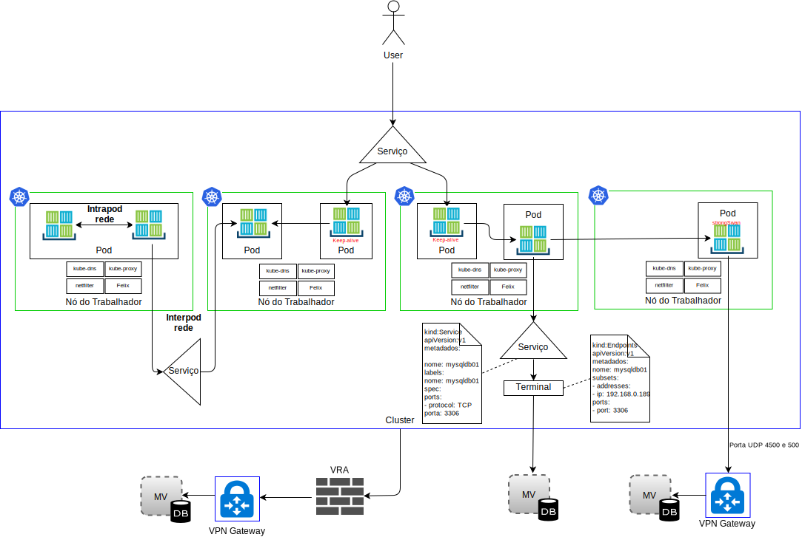
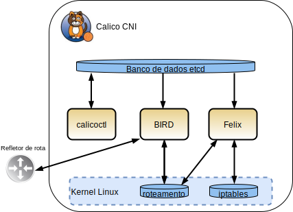

---

copyright:

  years:  2016, 2019

lastupdated: "2019-02-15"

subcollection: vmware-solutions

---

# IBM Cloud Kubernetes Service
{: #vcsnsxt-overview-iks}

## Visão geral do IBM Cloud Kubernetes Service
{: #vcsnsxt-overview-iks-ovw}

O {{site.data.keyword.containerlong_notm}} fornece uma plataforma isolada e segura para gerenciar contêineres. Essa plataforma é móvel, extensível e com capacidade de recuperação automática se ocorrer um failover.

A arquitetura consiste nos componentes principais a seguir:
-	**Conta do {{site.data.keyword.cloud}}** – os nós do trabalhador são implementados em uma conta do {{site.data.keyword.cloud_notm}}. O nó principal é implementado em uma Conta de Nuvem central que é gerenciada pela IBM.
-	**Cluster** - um cluster do Kubernetes consiste em um ou mais nós do trabalhador.
-	**Nós do trabalhador** - um nó do trabalhador é um bare metal ou uma instância de servidor virtual hospedada em uma conta IBM. Ao provisionar um nó do trabalhador, você determina os recursos que estão disponíveis para os contêineres hospedados nesse nó do trabalhador. Os nós do trabalhador incluem um Mecanismo de Docker gerenciado pela IBM, recursos de cálculo separados, rede e um serviço de volume de armazenamento.
-	**Nó principal** - os nós do trabalhador são gerenciados por um nó principal do Kubernetes que controla e monitora centralmente todos os recursos do Kubernetes no cluster. Esse nó principal é gerenciado pela IBM.

O {{site.data.keyword.containerlong_notm}} tem os conceitos a seguir:
-	**Serviço** - um serviço é um recurso do Kubernetes que agrupa um conjunto de pods e fornece conectividade de rede para esses pods sem exibir o endereço IP privado real de cada pod. É possível
usar um serviço para tornar seu app disponível no cluster ou na Internet pública.
-	**Implementação** - uma implementação é um recurso do Kubernetes no qual é possível especificar informações sobre outros recursos ou capacidades que são necessários para executar seu app, como serviços, armazenamento persistente ou anotações. Você documenta uma implementação em um arquivo YAML de configuração e, depois, aplica ao cluster. O mestre do Kubernetes configura os recursos e implementa os contêineres em pods nos nós do trabalhador com capacidade disponível. Defina as estratégias de atualização para seu app, incluindo o número de pods que você deseja incluir durante uma atualização contínua e o número de pods que podem ser desativados de cada vez. Quando você executar a uma atualização contínua, a implementação verificará se a atualização está funcionando e parará o lançamento quando falhas forem detectadas.
-	**Pod** - todos os apps em um cluster são implementados, executados e gerenciados por um recurso Kubernetes que é chamado de pod. Os pods representam pequenas unidades implementáveis em um cluster do Kubernetes e são usados para agrupar os contêineres que devem ser tratados como uma unidade única. Na maioria dos casos, cada contêiner é implementado em seu próprio pod. Um aplicativo pode requerer que um contêiner e outros contêineres auxiliares sejam implementados em um pod para que esses contêineres sejam endereçáveis usando o mesmo endereço IP privado.
-	**Aplicativo** - um app pode referir-se a um app completo ou a um componente de um app. Você pode implementar componentes de um app em pods separados ou nós do trabalhador separados.

O Kubernetes não dita uma solução de rede específica.

O modelo de rede do Kubernetes estabelece três requisitos fundamentais:
* Os contêineres podem se comunicar com todos os outros contêineres sem NAT
* Os nós podem se comunicar com todos os contêineres (e vice-versa) sem NAT
* O IP que um próprio contêiner vê é o mesmo IP que outros veem.

### Espaços de Tabelas
{: #vcsnsxt-overview-iks-namespaces}

Os namespaces são um aspecto fundamental de redes de contêineres. Os namespaces são um recurso do kernel do Linux que particiona os recursos do kernel de modo que um conjunto de processos veja um conjunto de recursos, enquanto outro conjunto de processos vê um conjunto diferente de recursos. Os recursos incluem pontos de montagem, processIDs, pilha de rede, IPC e IDs do usuário. Cada namespace tem um conjunto privado de endereços IP, sua própria tabela de roteamento, listagem de soquetes, tabela de rastreamento de conexão, firewall e outros recursos relacionados à rede.

### Container Network Interface
{: #vcsnsxt-overview-iks-container-network-interfaces}

O Kubernetes usa o Container Network Interface (CNI) como sua solução de rede orientada por plug-in. Ele consiste em uma especificação e bibliotecas para gravar plug-ins para configurar interfaces de rede em contêineres do Linux. A especificação CNI é leve, pois ela lida somente com a conectividade de rede de contêineres e a coleta de lixo de recursos depois que os contêineres são excluídos.

As duas definições centrais a seguir estão no contexto de CNI no Kubernetes:
- **Pod** - sinônimo de um namespace de rede do Linux. A unidade de planejamento no Kubernetes é um pod que é um conjunto fortemente acoplado de um ou mais contêineres que estão sempre colocados (planejados em um nó como uma unidade). Um pod não pode ser distribuído para mais de um nó do trabalhador.
- **Rede** - um grupo de entidades exclusivamente endereçáveis que podem se comunicar entre si. Essas entidades podem ser um contêiner individual, uma máquina ou algum outro dispositivo de rede, como um roteador.

Para que o CNI inclua um contêiner em uma rede, o tempo de execução do contêiner deve primeiro criar um novo namespace de rede para o contêiner e, em seguida, iniciar um ou mais dos plug-ins definidos. A configuração de rede está no formato JSON e inclui campos obrigatórios, como nome, tipo e campos específicos do tipo de plug-in. Espera-se que um plug-in CNI designe um endereço IP à interface e configure as rotas de rede relevantes para ele. O {{site.data.keyword.containerlong_notm}} usa o Calico como o plug-in de rede para CNI. O Calico designa a cada carga de trabalho um endereço IP. No {{site.data.keyword.containerlong_notm}}, o Calico usa tunelamento IP-in-IP para que os endereços IP de rede de contêiner fiquem ocultos da Rede do {{site.data.keyword.cloud_notm}}.

De uma perspectiva de tráfego de rede, diferenciamos entre quatro tipos no {{site.data.keyword.containerlong_notm}}, conforme mostrado no diagrama a seguir.

Figura 1. Tipos de tráfego de rede do contêiner

- **Rede de pod interno** - conhecido como comunicações de contêiner para contêiner. Todos os contêineres dentro de um pod compartilham um namespace de rede, o mesmo endereço IP e se veem no host local. O tráfego para cada app é diferenciado com um número de porta diferente. O Desenvolvedor deve certificar-se de que os contêineres dentro de um pod não entrem em conflito uns com os outros com as portas usadas. Dentro de uma pod, existe um contêiner de infraestrutura. Este é o primeiro contêiner que o kubelet ativa e ele adquire o IP do pod e configura o namespace de rede. Em seguida, todos os outros contêineres no pod se associam ao namespace de rede e de IPC do contêiner de infraestrutura. O contêiner tem o modo de ponte de rede que está ativado e todos os outros contêineres no pod se associem a esse namespace por meio do modo de contêiner. Se o contêiner de infraestrutura é desativado, o kubelet encerra todos os contêineres no pod e, em seguida, reprovisiona, geralmente com um novo endereço IP. Nós não forneceremos mais detalhes sobre esse fluxo de tráfego neste documento.

- **Rede entre pods** – conhecido como comunicações “pod a pod”. A seguir estão os três tipos de tráfego leste-oeste:
  - Os pods podem se comunicar diretamente com outros pods na mesma sub-rede. No {{site.data.keyword.containerlong_notm}}, cada pod tem um endereço IP que é designado por meio de um intervalo fornecido pelo {{site.data.keyword.containerlong_notm}}. Cada nó trabalhador é designado a uma sub-rede no fornecimento. A comunicação de pod para pod sem proxies, tunelamento ou NAT ocorre com pods na mesma sub-rede e host.
  - Os pods podem se comunicar diretamente com outros pods em sub-redes diferentes. O encapsulamento IP-in-IP é configurado automaticamente no {{site.data.keyword.containerlong_notm}} para encapsular somente pacotes que estão viajando pelas sub-redes. Esse encapsulamento oculta o espaço de endereço de rede do pod da rede do {{site.data.keyword.cloud_notm}}. O encapsulamento usa o endereço IP da sub-rede privada primária do {{site.data.keyword.cloud_notm}}.
  - Os pods podem usar serviços para se comunicar com outros pods, que são conhecidos como pod para comunicações de serviço. No entanto, os pods que podem se comunicar diretamente com outros pods conforme os dois pods de pontos anteriores são mortais. Eles nascem e, quando morrem, não são ressuscitados. Os conjuntos de réplicas criam e destroem os pods dinamicamente, como ao escalar para cima ou para baixo. Embora cada pod obtenha seu próprio endereço IP, mesmo esses endereços IP não podem ser considerados estáveis ao longo do tempo. Preferivelmente, os Desenvolvedores usam uma construção de serviço para comunicação, em que, um endereço IP virtual estável é usado que pode ser descoberto via DNS.

- **Ingresso** - refere-se ao tráfego de roteamento de usuários ou apps externos para pods. Um serviço fornece um endereço virtual IP (vIP) estável para um conjunto de pods. Embora os pods sejam efêmeros, os serviços permitem que os clientes descubram e se conectem de forma confiável aos contêineres em execução nos pods usando o vIP. Esse vIP não é um endereço IP real que está conectado a uma interface de rede. Seu propósito é puramente agir como um terminal estável para encaminhar o tráfego para um ou mais pods. Acessar um pod de fora do cluster é um pouco mais desafiador. O Kubernetes tem como objetivo fornecer balanceamento de carga altamente disponível e de alto desempenho para serviços.
Há três opções para o tráfego norte-sul no {{site.data.keyword.containerlong_notm}}:

  - **NodePort** - o serviço NodePort é considerado adequado para teste ou se você precisa de acesso público ou privado por somente um curto período de tempo. Um serviço NodePort abre uma porta em um nó do trabalhador sobre o endereço IP privado e público do nó do trabalhador. Deve-se usar uma política de rede preDNAT do Calico se deseja bloquear o público ou privado. Os endereços IP público e privado do nó do trabalhador não são permanentes.
  - **LoadBalancer** - os endereços IP públicos e privados móveis designados ao balanceador de carga são permanentes e não mudam quando um nó trabalhador é recriado no cluster. É possível customizar seu balanceador de carga expondo qualquer porta que seu app requer. Um serviço de balanceador de carga com um endereço IP privado móvel ainda tem uma porta do nó público aberta em cada nó do trabalhador. Deve-se usar uma política de rede preDNAT do Calico para bloquear as portas de nó público nele.
  - **Serviços de ingresso** - o ALB usa um ponto de entrada público ou privado protegido e exclusivo para rotear solicitações recebidas para seus apps. O ALB atende às solicitações de serviço HTTP ou HTTPS, TCP ou UDP recebidas. Ele encaminha solicitações entre os pods do aplicativo com base nas regras definidas no recurso de ingresso. Ao criar um cluster, um balanceador de carga do aplicativo (ALB) de ingresso privado e um público são criados automaticamente. Como o ALB público está ativado e o ALB privado está indisponível por padrão, deve-se desativar o ALB público e ativar o ALB privado.

- **Egresso** - refere-se à chamada de recursos externos fora dos pods, como APIs, ou ao consumo de recursos de MVs. Opções de egresso:
    - Defina um recurso de serviço para um sistema em execução fora do cluster. É criado um recurso de Terminal que detalha o sistema externo; o endereço IP e o número da porta. O recurso de Terminal pode ter vários endereços listados e o Kubernetes efetuará round-robin entre esses endereços como entre pods que estão em execução dentro do cluster. Em seguida, um recurso de Serviço é usado para criar um IP do cluster e um Nome DNS em kube-dns para o serviço.
    - Use a VPN IPSec stongSwan que pode ser usada para se conectar a aplicativos que são externos ao cluster. Pelo uso de um gráfico Helm, um serviço de VPN IPSec strongSwan dentro de um pod do Kubernetes é implementado e configurado. Quando a conectividade de VPN é estabelecida, as rotas são configuradas automaticamente em todos os nós do trabalhador no cluster. Essas rotas permitem a conectividade bidirecional por meio do túnel VPN entre pods em qualquer nó do trabalhador e o sistema remoto. Se o pod falha, o cluster reinicia o pod, no entanto, você pode ter um tempo de inatividade curto enquanto o novo pod é iniciado e a conexão VPN é restabelecida. Um endereço IP público ou privado móvel é usado para o serviço de VPN strongSwan. A configuração local.subnet pode usar a sub-rede do pod do cluster, a sub-rede do serviço de cluster ou a sub-rede móvel pública ou privada. O remapeamento de sub-redes do cluster pode ser alcançado usando a configuração localSubnetNAT. Como alternativa, os endereços IP do cluster podem ser ocultos atrás de um único endereço IP, configurando enableSingleSourceIP como true. Para remapear as sub-redes de rede remota, use a configuração remoteSubnetNAT.
    - Um {{site.data.keyword.cloud_notm}} Virtual Router Appliance pode ser implementado como um gateway VPN para se conectar com segurança a uma rede externa. O tráfego de rede pública ou privada pode ser roteado por meio do VRA. O VRA cria um túnel IPSec criptografado para o gateway VPN remoto.

## Componentes do IBM Cloud Kubernetes Service
{: #vcsnsxt-overview-iks-components}

Os nós do trabalhador são gerenciados por um nó principal do Kubernetes que controla e monitora centralmente todos os recursos do Kubernetes no cluster. Quando um Desenvolvedor implementa os recursos para um contêiner, o nó principal decide em qual nó do trabalhador implementar esses recursos, levando em conta os requisitos de implementação e a capacidade disponível no cluster. Os nós principais e do trabalhador se comunicam entre si por meio de certificados TLS seguros e uma conexão openVPN por meio da rede pública do {{site.data.keyword.cloud_notm}}. Os Desenvolvedores acessam o kube-apiserver, hospedado no Nó Principal via Internet.

O kubelet no nó trabalhador observa o kube-apiserver no nó principal para atualizações e relata o status. O kubelet é um pod que é executado em cada nó do trabalhador e é responsável por monitorar o funcionamento de pods que são executados no nó do trabalhador e por observar os eventos que o servidor de API do Kubernetes envia. Com base nos eventos, a kubelet cria ou remove os pods, emite análises de vivacidade e prontidão e relata de volta o status dos pods para o servidor de API do Kubernetes.

De uma perspectiva de rede, os componentes a seguir são implementados no nó do trabalhador:

-	**openvpn-client** - o cliente OpenVPN trabalha com o servidor OpenVPN para conectar com segurança o principal ao nó do trabalhador. Esse componente opera no espaço de nomes kube-system.
-	**Nó Calico** - o nó Calico é um contêiner que empacota os vários componentes que são necessários para contêineres de rede com o Calico. Esse componente opera no espaço de nomes kube-system.
-	**Controlador de política do Calico** - o controlador de política do Calico observa o tráfego de rede de entrada e saída para conformidade com as políticas de rede configuradas. Se o tráfego não for permitido no cluster, o acesso ao cluster será bloqueado. O controlador de política do Calico também é usado para criar e configurar políticas de rede para um cluster. Esse componente opera no espaço de nomes kube-system.
-	**CNI do Calico** - o container network interface (CNI) do Calico gerencia a conectividade de rede de contêineres e remove os recursos alocados quando um contêiner é excluído.
-	**IPAM do Calico** - o IPAM do Calico gerencia a designação de endereço IP para contêineres.
-	**kube proxy** - o proxy de rede do Kubernetes é um daemon que é executado em cada nó trabalhador e que encaminha ou equilibra a carga do tráfego de rede TCP e UDP para serviços que são executados no cluster. Esse componente opera no espaço de nomes kube-system.
-	**kube DNS** - o DNS do Kubernetes planeja um pod e serviço DNS no cluster. Os contêineres usam automaticamente o IP do serviço DNS para resolver nomes do DNS em suas procuras para outros pods e serviços. Esse componente opera no espaço de nomes kube-system.
-	**ALB do Ingress** - Ingress é um serviço do Kubernetes pode ser usado para equilibrar cargas de trabalho de tráfego de rede em seu cluster, encaminhando solicitações públicas ou privadas para múltiplos apps em seu cluster. Para expor seus apps por meio da rede pública ou privada, deve-se criar um recurso Ingresso para registrar seus apps com o balanceador de carga do aplicativo (ALB) de ingresso. Múltiplos apps podem então ser acessados usando uma única URL ou endereço IP. Esse componente opera no espaço de nomes ibm-system.
-	**Balanceador de carga** - um balanceador de carga é um serviço do Kubernetes que pode ser usado para equilibrar cargas de trabalho de tráfego de rede em seu cluster, encaminhando solicitações públicas ou privadas para um app. Esse componente opera no espaço de nomes ibm-system.

### Calico
{: #vcsnsxt-overview-iks-calico}

O {{site.data.keyword.containerlong_notm}}  usa o Calico como seu provedor de rede. O Calico usa uma abordagem de Camada 3 em vez de redes de sobreposição. Por meio dos plug-ins CNI, o Calico integra-se ao Kubernetes para fornecer uma rede em que os usuários usam uma abordagem de uso de uma rede IP pura combinada com o Protocolo de Roteamento de Borda para distribuição de rota.

O Calico fornece uma solução de malha L3 e, em vez de um vSwitch, o Calico usa uma função vRouter em cada nó de cálculo. O vRouter alavanca os recursos de encaminhamento L3 existentes do kernel do Linux. O Calico conecta cada carga de trabalho por meio do vRouter diretamente à rede de infraestrutura. A função vRouter faz uso do BGP para anunciar as rotas para os pods hospedados em cada nó do trabalhador. Cada vRouter anuncia todos os terminais aos quais ele está conectado, para todos os outros vRouters usando BGP.

No Calico, os pacotes de IP para ou de um pod são roteados e protegidos por firewall pela tabela de roteamento do Linux e a infraestrutura de iptables no nó do trabalhador.

-	Para uma carga de trabalho que está enviando pacotes, o Calico assegura que o nó do trabalhador seja sempre retornado como o próximo endereço MAC de hop, independentemente de qualquer roteamento que a carga de trabalho em si possa configurar.
-	Para pacotes endereçados a uma carga de trabalho, o último hop de IP é aquele do nó do trabalhador da carga de trabalho de destino para a carga de trabalho em si.

Figura 2. CNI do Calico

O diagrama anterior mostra os componentes do Calico a seguir:
-	**calicoctl** - interface da linha de comandos.
-	**Plug-in do CNI**
-	**armazenamento de chave/valor** - mantém o estado da política e da configuração da rede do Calico. O Calico usa etcd para fornecer a comunicação entre componentes e como um armazém de dados consistentes, o que assegura que o Calico possa sempre construir uma rede precisa. O componente etcd é distribuído na implementação inteira. Ele é dividido em dois grupos de máquinas: o cluster principal e os proxies.
-	**calico/nó** - um contêiner “auxiliar” que empacota os vários componentes necessários para a rede:
 -	**Felix** - o agente Calico primário que é executado em cada máquina que hospeda terminais. Ele é responsável por programar rotas e ACLs e qualquer outra coisa que seja necessária no host para fornecer a conectividade desejada para os terminais nesse host.
 - **BIRD** - BIRD é um cliente BGP de software livre usado para trocar informações de roteamento entre hosts. Quando o Felix insere rotas no FIB do kernel do Linux, elas são selecionadas e distribuídas pelo cliente BGP para os outros nós na implementação. Isso assegura que o tráfego seja roteado de maneira eficiente em torno da implementação.
 - **Confd** - o mecanismo de modelagem confd monitora o armazenamento de dados etcd para quaisquer mudanças na configuração do BGP e alguma configuração padrão global de nível superior, como Número AS, níveis de criação de log e informações de IPAM. Em seguida, ele gera dinamicamente arquivos de configuração do BIRD com base nos dados no etcd, acionados automaticamente por meio de atualizações para os dados. Quando o arquivo de configuração muda, o confd aciona o BIRD para carregar os novos arquivos.

Como a rede do {{site.data.keyword.cloud_notm}} Private encaminha somente os esquemas de endereçamento IP do {{site.data.keyword.cloud_notm}}, o Calico precisa usar o encapsulamento IP-in-IP do tráfego entre cargas de trabalho no {{site.data.keyword.containerlong_notm}} para ocultar os endereços IP de rede de pod. O {{site.data.keyword.containerlong_notm}}  usa o modo de sub-rede cruzada IP-in-IP.

### Calico no IBM Cloud Kubernetes Service
{: #vcsnsxt-overview-iks-calico-iks}

O Calico é instalado e configurado automaticamente no {{site.data.keyword.containerlong_notm}}. As políticas padrão são criadas para proteger o cluster do Kubernetes, com a opção de criar suas próprias políticas para proteger serviços específicos. O encapsulamento IP-in-IP é configurado automaticamente para encapsular somente pacotes que viajam entre sub-redes e usa o NAT para conexões de saída de seus contêineres. O tráfego de Carga de trabalho para WAN também é ativado automaticamente no {{site.data.keyword.containerlong_notm}}, portanto, nenhuma configuração adicional do Calico é necessária.

#### Escalabilidade de rede com o Calico
{: #vcsnsxt-overview-iks-net-scalability-calico}

O Calico baseia-se em uma arquitetura de ampliação de escala distribuída que fornece a capacidade de escalar suavemente de um único bloco de notas do Desenvolvedor para grandes implementações corporativas e usa o plano de dados padrão do Linux para entregar desempenho bare metal para cargas de trabalho virtuais.

#### Segurança com Calico
{: #vcsnsxt-overview-iks-sec-calico}

O Calico usa um conjunto de políticas que controla cada componente do sistema, essas políticas podem ser configuradas para permitir que os serviços e as instâncias de contêiner conversem entre si somente quando necessário. Ele usa endereços IP para identificar instâncias de contêiner e cria políticas com base nesses endereços. A integração de Kubernetes com o Calico é uma infraestrutura ciente e pode escalar políticas de segurança com base em mudanças com infraestrutura.

#### Integração com o Calico
{: #vcsnsxt-overview-iks-integration-calico}

O Calico fornece uma rede altamente escalável e uma solução de política de rede para conectar pods do Kubernetes com base nos mesmos princípios de rede de IP que a Internet. Ele pode ser implementado sem encapsulamento ou sobreposições para fornecer uma rede de data center de alta escala e alto desempenho. O Calico fornece uma política de segurança de Rede de baixa granularidade, baseada na intenção, para pods do Kubernetes por meio de seu firewall distribuído. O Calico também pode ser executado no modo de cumprimento de política juntamente com outras soluções de rede, como o Flannel, conhecido como canal ou rede GCE nativa.

## IBM Cloud Kubernetes Service Networking
{: #vcsnsxt-overview-iks-networking}

Por padrão, o {{site.data.keyword.containerlong_notm}} configura o cluster com acesso a uma VLAN pública e a uma VLAN privada com os itens a seguir.
- Um endereço IP público para cada nó do trabalhador, que fornece aos nós do trabalhador uma interface de rede pública. Por padrão:
  -	Todo o tráfego de rede de saída é permitido para todos os nós do trabalhador.
  -	O tráfego de rede de entrada está bloqueado, exceto para algumas portas. Essas portas são abertas para que a IBM possa monitorar o tráfego de rede e instalar automaticamente atualizações de segurança para o mestre do Kubernetes.
-	Um endereço IP privado para cada nó trabalhador, que fornece aos nós trabalhadores uma interface de rede privada.
-	Uma conexão OpenVPN automática e segura entre todos os nós do trabalhador e o nó principal.

Na primeira vez que um cluster é criado em uma zona, uma VLAN pública e uma VLAN privada nessa zona são provisionadas automaticamente para você na conta de infraestrutura do {{site.data.keyword.cloud_notm}}. Para cada cluster subsequente criado nessa zona, é possível reutilizar a mesmo VLAN pública e privada porque múltiplos clusters podem compartilhar VLANs.

Os nós do trabalhador podem ser conectados a uma VLAN pública e à VLAN privada ou somente à VLAN privada. Se você desejar conectar os nós do trabalhador a somente uma VLAN privada, será possível usar o ID de uma VLAN privada existente ou criar uma VLAN privada e usar o ID durante a criação do cluster.

As sub-redes de IP para os nós e os pods do trabalhador também são provisionadas automaticamente em VLANs. As sub-redes fornecem conectividade de rede para os componentes do cluster designando endereços IP a eles. As sub-redes a seguir são provisionadas automaticamente nas VLANs públicas e privadas padrão:
-	**Sub-redes VLAN públicas:**
    - A sub-rede pública primária determina os endereços IP públicos que são designados aos nós do trabalhador durante a criação do cluster. Múltiplos clusters na mesma VLAN podem compartilhar uma sub-rede pública primária.
    - A sub-rede pública móvel é ligada a somente um cluster e fornece o cluster com 8 endereços IP públicos. Três IPs são reservados para funções de rede. 1 IP é usado pelo ALB do Ingresso público padrão e 4 IPs podem ser usados para criar serviços de rede do balanceador de carga público. Os IPs públicos móveis são endereços IP fixos permanentes que podem ser usados para acessar serviços de balanceador de carga na Internet.
-	**Sub-redes VLAN privadas:**
    - A sub-rede privada primária determina os endereços IP privados que são designados aos nós do trabalhador durante a criação do cluster. Múltiplos clusters na mesma VLAN podem compartilhar uma sub-rede privada primária.
    - A sub-rede privada móvel é ligada a somente um cluster e fornece o cluster com 8 endereços IP privados. Três IPs são reservados para funções de rede. 1 IP é usado pelo ALB do Ingresso privado padrão e 4 IPs podem ser usados para criar serviços de rede do balanceador de carga privado. Os IPs privados móveis são endereços IP fixos permanentes que podem ser usados para acessar serviços de balanceador de carga na Internet.

## Links relacionados
{: #vcsnsxt-overview-iks-links}

* [Visão geral do vCenter Server on {{site.data.keyword.cloud_notm}} with Hybridity Bundle](/docs/services/vmwaresolutions/archiref/vcs?topic=vmware-solutions-vcs-hybridity-intro)
