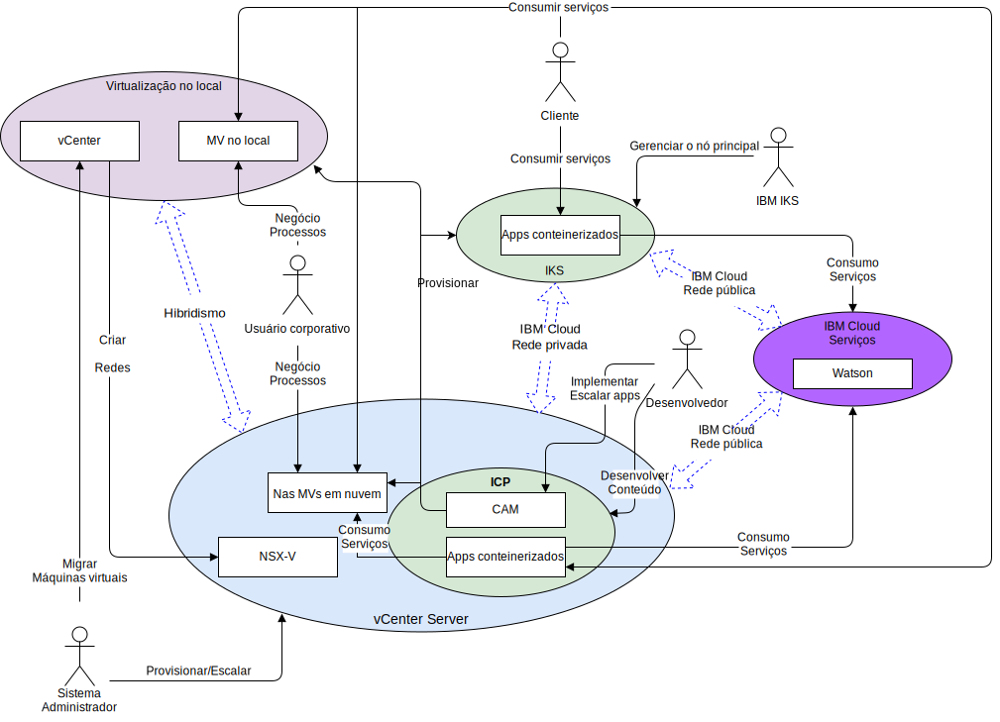

---

copyright:

  years:  2016, 2019

lastupdated: "2019-08-05"

subcollection: vmware-solutions

---

# Contexto do sistema
{: #vcsnsxt-systemcontext}

O diagrama de contexto de sistema define os elementos chave de um sistema, o limite do sistema e as entidades que interagem com ele juntamente com as interações. É um diagrama de alto nível que fornece ao leitor uma visualização inicial do sistema.

Os quatro componentes principais, de uma perspectiva de rede, são conforme a seguir:
- **Virtualização no local** - um ambiente do VMware que é hospedado nas instalações do cliente ou de um terceiro e hospeda atualmente as máquinas virtuais (MVs) que executam os aplicativos a serem modernizados. É o ambiente de origem para migrações de MV e é fracamente acoplado ao {{site.data.keyword.cloud}} via VMware HCX.
- **vCenter Server** - uma instância do {{site.data.keyword.vmwaresolutions_short}} que é o destino para MVs migradas por meio do ambiente no local. Junto com a virtualização no local, isso forma um ambiente híbrido que permite que as MVs se movam ininterruptamente de um ambiente para o outro.
- **{{site.data.keyword.containerlong_notm}}** - usa o Kubernetes como a solução de orquestração de contêiner. A IBM opera e gerencia o nó principal do Kubernetes enquanto os nós do trabalhador são implementados na infraestrutura gerenciada pelo cliente. A IBM fornece ferramentas de gerenciamento para implementação de correção do sistema operacional, upgrades de mecanismo de Docker e novas versões do Kubernetes. O {{site.data.keyword.containerlong_notm}} fornece uma plataforma isolada e segura para gerenciar contêineres que são móveis, extensíveis e com capacidade de recuperação automática em caso de failovers.
- **IBM Cloud Private** - uma plataforma de aplicativo para desenvolver e gerenciar aplicativos conteinerizados. Ele é um ambiente integrado que inclui o orquestrador de contêineres Kubernetes, um repositório de imagem privada, um console de gerenciamento, estruturas de monitoramento e uma interface gráfica com o usuário, que fornece um local centralizado de onde é possível implementar, gerenciar, monitorar e escalar aplicativos.
- **IBM Cloud Services** - uma ampla variedade de serviços disponíveis por meio do {{site.data.keyword.cloud_notm}} que são consumíveis. As opções de serviço incluem analítica, AI e IoT como exemplos.

## Atores
{: #vcsnsxt-systemcontext-actors}

O diagrama de contexto de sistema identifica os agentes a seguir.

Tabela 1. Atores

Ator  |  Descrição
---|---
Administrador do sistema |Os administradores de sistema são os recursos corporativos do VMware que usam o vCenter e o plug-in HCX. Eles identificam candidatos para migração, estendem redes, migram MVs e gerenciam NSX-V. Eles usam o console do {{site.data.keyword.cloud_notm}} para provisionar instâncias do VMware vCenter Server on {{site.data.keyword.cloud_notm}} e para escalar a capacidade.
Desenvolvedor | Os Desenvolvedores são os recursos corporativos de contêiner qualificados que usam os consoles e as APIs do {{site.data.keyword.containerlong_notm}}, do {{site.data.keyword.icpfull_notm}} e do CAM para criar e gerenciar contêineres. Ele cria os novos serviços como parte da modernização de aplicativo.
Usuário corporativo | Esse recurso corporativo requer acesso à rede para os aplicativos para concluir processos de negócios, como atualizar conteúdo.
Cliente | O cliente é um agente externo que deseja consumir serviços da empresa. Para o Acme Skateboards, é um skatista que deseja comprar produtos de skate. O Cliente requer acesso seguro à Internet para o catálogo.
{{site.data.keyword.containerlong_notm}} | Esse é um recurso IBM que gerencia o Nó principal do {{site.data.keyword.containerlong_notm}} do serviço.

## Sistemas
{: #vcsnsxt-systemcontext-systems}

O diagrama de contexto de sistema identifica os sistemas a seguir.

Tabela 2. Sistemas

Ator | Descrição
---|---
vCenter | O vCenter é a interface primária para que o administrador do sistema gerencie as MVs no local e acesse o plug-in HCX para estender redes e migrar MVs. Com o vCenter Server with Hybridity Bundle, o administrador de sistemas pode integrar de forma contínua as redes do vSphere no local à instância do vCenter Server que é executada no {{site.data.keyword.cloud_notm}}. A rede híbrida amplia as redes no local para o {{site.data.keyword.cloud_notm}} permitindo que os clientes migrem seus aplicativos para uma instância do vCenter Server que é executada no {{site.data.keyword.cloud_notm}} e de volta no local, se necessário. Para obter mais detalhes sobre o vCenter Server with Hybridity Bundle, consulte [Arquitetura da solução VMware HCX on {{site.data.keyword.cloud_notm}}](/docs/services/vmwaresolutions/services?topic=vmware-solutions-hcx-archi-intro#hcx-archi-intro).
MVs no local | As MVs no local hospedam os aplicativos que estão migrando para a nuvem. Inicialmente, eles são migrados como MVs e, em seguida, por meio da jornada de modernização de aplicativo migrada de MVs para contêineres.
Nas MVs em nuvem | Nas MVs em nuvem, os aplicativos de host que foram migrados de no local. Elas se comunicam com os aplicativos no local por meio da rede L2 estendida. Para essa arquitetura de referência e nesse exemplo para o Acme Skateboards, uma das MVs em nuvem é um servidor de banco de dados, que faz parte da carga de trabalho de presença on-line.
NSX-V | O NSX-V no vCenter Server fornece a rede de sobreposição definida pelo software que é gerenciada pelo administrador do sistema. A rede de sobreposição é o destino para redes estendidas do HCX, uma vez que ela manipula o tráfego das MVs para o {{site.data.keyword.icpfull_notm}}. O NSX-V fornece a arquitetura de referência com recursos, como implementação, reconfiguração e destruição de redes virtuais sob demanda e serviços de microssegmentação no VMware usando vSphere distributed switches (vDS). Para obter mais informações, veja [Visão geral do NSX-V](/docs/services/vmwaresolutions/archiref/vcsnsxt?topic=vmware-solutions-vcsnsxt-overview-ic4vnsxv).
CAM | O {{site.data.keyword.cloud_notm}} Automation Manager (CAM) é executado no {{site.data.keyword.icpfull_notm}} e fornece uma única área de janela de vidro para provisionar cargas de trabalho baseadas em MV juntamente com cargas de trabalho baseadas em Kubernetes, usando modelos. O CAM permite ao Desenvolvedor:   - Provisionar cargas de trabalho no vCenter Server, {{site.data.keyword.icpfull_notm}} ou {{site.data.keyword.containerlong_notm}}.  - Editar e orquestrar serviços que são constituídos de MVs e contêineres.   -Integrar suas cadeias de ferramentas do DevOps e a solução day-2 ITSM.
Aplicativos conteinerizados | Os apps que passaram pela jornada de modernização de aplicativo e estão agora em execução como contêineres. Para essa arquitetura de referência e nesse exemplo para o Acme Skateboards, um dos apps conteinerizados é um servidor da web, que faz parte da carga de trabalho de presença on-line.
Watson | Para essa arquitetura de referência e, neste exemplo, para o Acme Skateboards, o Watson representa o serviço de IA usado na _arquitetura do protótipo_.
