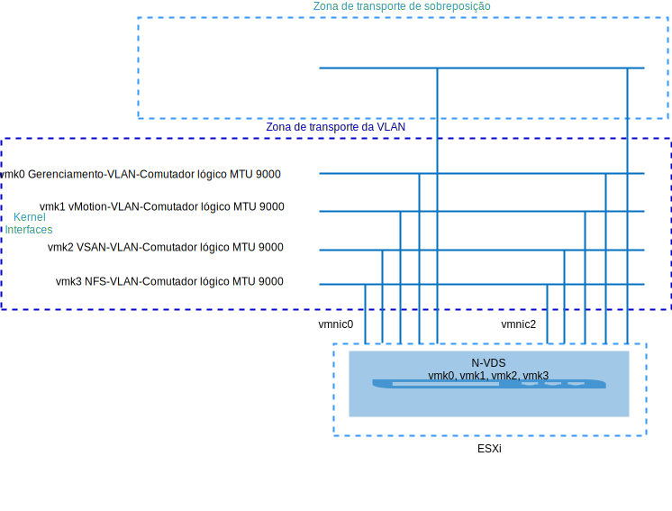
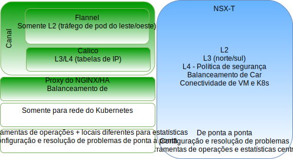
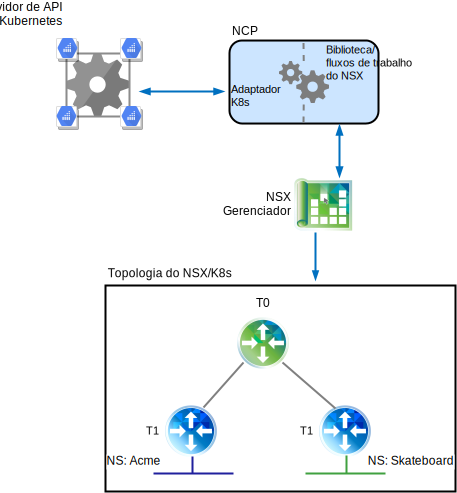
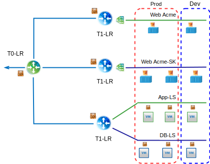
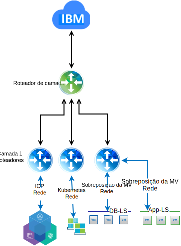

---

copyright:

  years:  2016, 2018

lastupdated: "2018-11-06"

---

# Visualização técnica do VMware NSX-T no VCS

## Visão geral do NSX-T

O VMware NSX-T é projetado para tratar de estruturas de aplicativos e arquiteturas que têm terminais heterogêneos e pilhas de tecnologia. Além do vSphere, esses ambientes podem incluir outros hypervisors, KVM, contêineres e bare metal. O NSX-T permite que as equipes de TI e desenvolvimento escolham as tecnologias mais adequadas para seus aplicativos. O NSX-T também é projetado para gerenciamento, operações e consumo por organizações de desenvolvimento, além de uso por TI.

Nesse design, a infraestrutura de gerenciamento do NSX-T é implementada no cluster VCS inicial ou é implementada em um cluster existente.

O NSX-T Manager é designado a um endereço IP do bloco de endereços móveis privados que é designado para componentes de gerenciamento e configurado para usar os servidores DNS e NTP comuns.

Um cluster extra é implementado e usado como nós de Transporte do Hypervisor, juntamente com o armazenamento vSAN ou NFS usado como o armazenamento de dados de carga de trabalho. A Tabela 1 resume os requisitos para um ambiente de tamanho médio.

Tabela 1. Especificações de componentes do NSX-T

Recursos |NSX-T Manager	|Controlador x 3	|Borda x 2	|Borda do Bare Metal*
---|---|---|---|---
Tamanho médio	|Dispositivo Virtual	|Dispositivo Virtual	|Dispositivo Virtual	|Servidor físico*
Número de vCPUs	|4	|4	|4	|8
Memória	|16 GB	|16 GB	|8 GB	|32 GB
Disco	|vSAN de 140 GB ou compartilhamento do NFS de gerenciamento.	|vSAN de 120 GB ou o compartilhamento NFS de gerenciamento.	|vSAN de 120 GB ou o compartilhamento NFS de gerenciamento.	|200 GB
Tipo de disco |Thin provisioned	|Thin provisioned	|Thin provisioned	|Físico
Rede |Privada A móvel designada a componentes de gerenciamento.	|Privada A móvel designada a componentes de gerenciamento.	|Privada A móvel designada a componentes de gerenciamento.	|Privada A móvel designada a componentes de gerenciamento.

\* **Nota**: verifique a lista de compatibilidade de hardware para obter os requisitos específicos.

Figura 1. Layout de componentes de gerenciamento do NSX-V e T

### Configuração inicial

Implemente o NSX-T Manager, um cluster de controlador que consiste em três controladores e um cluster de borda dentro do cluster VCS inicial. Designe endereços IP a todos os componentes por meio da sub-rede móvel **Privada A**.

Crie regras de antiafinidade VM-VM de tal maneira que os controladores sejam separados entre os hosts no cluster. Observe que o cluster inicial é implementado com um mínimo de três nós para assegurar alta disponibilidade para os controladores.

Implemente mais dois hosts vSphere para o NSX-T Manager e instale o software NSX-T (VIBs) neles. Crie os perfis de uplink de host e de borda, o perfil do NIOC e defina o conjunto de IPs que é usado para comunicação do Tunnel Endpoint (TEP). Para obter mais informações, veja a tabela de definição de perfil de uplink e a tabela de definições de perfil do NIOC.

Os endereços IP definidos nos conjuntos são do intervalo de endereço IP móvel **Privado A**. As zonas de transporte de VLAN e de sobreposição são criadas e os dois hosts ESXi extras são configurados como nós de transporte para ambas as zonas. Atualmente, os perfis de uplink equivalentes são designados. Crie um comutador N-VDS nos hosts ESXi e designado ao uplink1 e uplink2.

No momento, duas VLANs extras são necessárias para acomodar as políticas de equipe, failover e uplink para a migração de porta vmkernel do grupo de portas vDS para comutadores lógicos de VLAN do NSX-T. Os comutadores lógicos de VLAN são criados com os IDs de VLAN apropriados e as portas vmkernel são migradas.

O NSX-T cria o vmk10, que é usado para a interface de encapsulamento, e o vmk50, que é usado para as sub-redes de trânsito de Camada0 interna e trânsito de Camada0-Camada1 interna nos hosts ESXi. Por padrão, a sub-rede 169.254.0.0 28 é usada para trânsito de Camada0 interna e sub-rede 100.64.0.0/16 para trânsito de Camada0-Camada1.

Tabela 2. Definição de perfil de uplink

Perfil de uplink |Especificação
---|---
ATRASOS	|Nenhum definido atualmente.
Equipe |Failover: Ativo = Uplink1 = vmnic0, Espera = Uplink2 = vmnic2
VLAN de transporte	|0
MTU	|9000

Tabela 3. Definição de perfil do NIOC

Tipo de tráfego/nome do tráfego	|Limite (%)	|Compartilhamentos |Reserva (%)
---|---|---|---
Tráfego de	|Ilimitado	|20	|0
Tráfego de máquina virtual	|Ilimitado	|30	|0
Tráfego tolerante a falhas |Ilimitado	|50	|0
Tráfego de replicação do vSphere	|Ilimitado	|50	|0
Tráfego de iSCSI	|Ilimitado	|50	|0
Tráfego de backup de proteção de dados do vSphere |Ilimitado	|50	|0
Tráfego vMotion	|Ilimitado	|50	|0
Tráfego de NFS	|Ilimitado	|100	|0
Tráfego de vSAN	|Ilimitado	|100	|0

Figura 2. Comutador lógico de VLAN para a interface vmkernel

## NSX-T

Esse design especifica a configuração de componentes do NSX-T, da VLAN e das zonas de transporte de sobreposição, mas não aplica nenhuma configuração de componente de rede de sobreposição. Cabe ao cliente projetar a sobreposição de rede com base em suas necessidades.

O seguinte é configurado:
-	Os servidores de gerenciamento e controladores são instalados.
-	Os agentes ESXi são instalados e um conjunto de endereços IP do TEP é configurado para os nós de transporte.
-	Os nós de transporte são configurados para zonas de transporte de VLAN e de sobreposição.
-	O N-VDS é criado nos nós de transporte do ESXi.
-	As portas do VMkernel são migradas de VSS/VDS para N-VDS.
-	Roteador de camada 0 para uso por componentes de gerenciamento.

O que NÃO é configurado:
-	Comutadores lógicos de sobreposição.
-	Microssegmentação.
-	Gerenciamento do NSX vinculado a outras instâncias do VMware.

### VCS com NSX-V e NSX-T

O cluster VCS original contém todos os componentes de gerenciamento para NSX-V e NSX-T juntamente com os dispositivos vCenter Server. Os hosts nesse cluster são preparados para NSX-V, conforme descrito em [Visão geral do NSX-V](vcsnsxt-overview-ic4vnsxv.html). Os hosts no segundo cluster são preparados para NSX-T e configurados como nós de transporte. Essa configuração dá aos clientes a capacidade de migrar de NSX-V para NSX-T se eles escolherem fazer isso.

### NSX-T versus NSX-V

Esta seção destaca a grande diferença entre os produtos SDN do VMware, NSX-V e NSX-T. Ambas as soluções fornecem microssegmentação em um ambiente do VMware, o NSX-T leva isso um pouco mais adiante conforme descrito abaixo.

Para obter diferenças arquiteturais detalhadas, veja [Guia de design de referência do VMware NSX-T](https://communities.vmware.com/servlet/JiveServlet/download/37591-3-195840/VMware%20NSX-T%20Reference%20Design%20Guide.pdf) (download em PDF).

#### NSX for vSphere

O NSX-V é projetado somente para implementações do vSphere e é arquitetado para que um único NSX-V Manager seja ligado a uma única instância do VMware vCenter Server. Basicamente, se você precisar de virtualização de rede em seu ambiente do VMware, o NSX-V será a solução apropriada.

Destaques do NSX-V:
-	Centrado no VMware.
-	Projetado para SDN no vSphere (única área de janela de vidro para virtualização de rede na interface com o usuário do vSphere).
-	Usa o protocolo de encapsulamento VXLAN (suportado pela maioria dos fornecedores de terceiros).
-	NICs físicos não são de propriedade do NSX-V, eles são designados aos virtual distributed switches (vDS) SDDC-Dswitch-Private e SDDC-Dswitch-Public.
-	A terminologia diferencia o Distributed Logical Router (DLR) para tráfego leste-oeste e o Edge Service Gateway (ESG) para tráfego norte-sul.

#### Transformadores do NSX

O NSX-T é uma solução independente para ambientes do vCenter e do vSphere, mas também suporta KVM, nuvem pública, contêineres e pode ser integrado a estruturas como IKS e ICP, Redhat OpenShift, Pivotal e outras. Isso dá a você a capacidade de gerenciar seu SDN em múltiplos hypervisors, contêineres e nuvens.

Destaques do NSX-T:
-	Produto independente. O vCenter não é necessário.
-	Suporte ao multi-hypervisor:
    - Os controladores podem ser implementados no KVM ou ESXi.
    - As bordas podem ser implementadas como virtual ou bare metal.
-	Integração de contêiner (plug-in NSX-T CNI).
-	Suporte ao OpenSwitch (OvS).
- Roteamento otimizado com multicamadas:
    - Propaganda de rota no roteador da Camada 1.
    - Redistribuição de rota no roteador da Camada 0.
-	Usa o protocolo de encapsulamento Geneve.
-	Os NICs físicos são de propriedade do nó de Transporte do NSX-T e designados ao N-VDS.
-	A terminologia diferencia o Roteador lógico da Camada 1 para tráfego leste-oeste e o Roteador lógico da Camada 0 para tráfego norte-sul.

## Calico

O Calico baseia-se em uma arquitetura de ampliação de escala distribuída que oferece a capacidade de escalar suavemente de um único bloco de notas do desenvolvedor para grandes implementações corporativas e usa o plano de dados padrão do Linux para entregar desempenho bare metal para cargas de trabalho virtuais. O Calico é composto por vários componentes interdependentes:
-	Felix, um daemon que é executado em cada nó que hospeda um terminal, um contêiner ou uma VM. O Felix é responsável pelo gerenciamento de interface, programação de rota e acl, roteamento para o terminal, validação de tráfego entre terminais e relatório de estado, basicamente funcionamento da rede para o host que ele está gerenciando.
- O Plug-in do Orchestrator, que liga o plug-in do orquestrador ao Calico, neste caso os plug-ins do Kubernetes, fornece a conversão de API do Kubernetes para o Calico e feedback do Calico de volta para o Kubernetes na configuração de rede de terminais com falha.
-	O etcd fornece a comunicação entre os componentes e é armazenado em um armazenamento de dados consistentes, o que assegura que o Calico sempre possa construir uma rede precisa.
-	O BIRD fornece funções do cliente BGP em cada nó que também hospeda o Felix. Quando o Felix insere uma rota no kernel Linux, o cliente BGP capta as rotas e as distribui para outros nós na implementação. Em ambientes grandes, um refletor de rota do BGP também é implementado, que age como um ponto central para os clientes BGP se conectarem. Isso evita que cada cliente precise conversar com todos os outros clientes e distribuir as rotas para os outros nós na implementação.

Figura 3. Visão geral do Calico

### NSX-T e Calico

#### Detalhes do componente NSX-T

A arquitetura do NSX-T tem uma separação integrada do plano de dados, do plano de controle e do plano de gerenciamento. Essa separação entrega múltiplos benefícios, incluindo escalabilidade, desempenho, resiliência e heterogeneidade. Os destaques da arquitetura chave incluem o seguinte:
-	Plano de gerenciamento: o plano de gerenciamento do NSX-T foi projetado do zero com a avançada tecnologia de armazenamento em cluster, que permite que a plataforma processe solicitações simultâneas de API em grande escala.
-	Plano de controle: o plano de controle do NSX-T mantém o controle da rede virtual em tempo real e do estado de segurança do sistema. O plano de controle do NSX-T separa o plano de controle em um clustered control plane (CCP) central e um local control plane (LCP). Isso simplifica a tarefa do CCP significativamente e permite que a plataforma amplie e escale para terminais heterogêneos.
-	Plano de dados: o plano de dados do NSX-T apresenta um comutador de host (em vez de depender do vSwitch), que o desacopla do gerenciador de cálculo e normaliza a conectividade de rede. Todas as operações de criação, leitura, atualização e exclusão (CRUD) são executadas por meio do NSX-T Manager.

#### Diferenças entre o Calico e o NSX

Calico é um projeto de software livre Tigera e é mantido principalmente pela equipe da Tigera. Ele é entregue como um CNI que ativa a rede e a segurança para sistemas de orquestração como o Kubernetes, que tanto o ICP quanto o IKS usam.

O Calico cria e gerencia uma rede de Camada 3 simples, designando a cada carga de trabalho um endereço IP totalmente roteável. As cargas de trabalho podem se comunicar sem encapsulamento de IP ou conversão de endereço de rede para desempenho do bare metal, resolução de problemas mais fácil e melhor interoperabilidade. Em ambientes que requerem uma sobreposição, o Calico usa tunelamento IP-in-IP ou pode trabalhar com outra rede de sobreposição, como Flannel. Há um projeto de software livre chamado Canel, que é um esforço para fornecer a instalação do Calico e do Flannel ao mesmo tempo e fornecer rede VXLAN pronta para utilização, enquanto também permite tirar proveito do isolamento de políticas com as políticas do Calico.

O Calico é composto de vários componentes interdependentes que fornecem comunicação de terminal, segurança, roteamento e integração de plug-in com o Kubernetes. Isso tudo é feito por meio da linha de comandos e do arquivo de configuração, tornando difícil fornecer políticas consistentes de rede e segurança em um ambiente híbrido. Para obter mais detalhes sobre os componentes do Calico, veja a documentação [Projeto Calico](https://www.projectcalico.org/).

NSX-T é uma solução independente para ambientes do vCenter e do vSphere; ele também suporta KVM, nuvem pública, contêineres e pode ser integrado a estruturas como IKS e ICP, Redhat OpenShift, Pivotal e outras. Isso dá a você a capacidade de gerenciar seu SDN em múltiplos hypervisors, contêineres e nuvem. O NSX-T opera em Camadas 2, 3 e 4 e fornece funcionalidade em cada camada.

O NSX-T permite gerenciamento de política de rede e segurança em um ambiente de vm e de contêiner em uma interface da web fácil de entender.

Figura 4. Comparação de alto nível entre os componentes do NSX-T e do Calico

## NSX-T e Kubernetes

O componente principal que fornece a integração entre o Kubernetes e o gerenciador NSX é o NSX Container Plugin (NCP). O NCP é executado como contêiner dentro de um pod do Kubernetes, monitora e observa mudanças de objetos relevantes no servidor de API do Kubernetes como namespaces e pods. Os desenvolvedores executam tarefas no lado do Kubernetes e o NCP vê essas mudanças e reage criando os Objetos do NSX relacionados, como comutadores lógicos, roteadores lógicos e objetos de firewall, usando uma coleta de chamadas de API em direção ao gerenciador NSX.

A seguir, há dois namespaces do Kubernetes, Acme e Skateboards, para cada namespace, nós temos um comutador lógico dedicado, um roteador de Camada 1 e um segmento IP que o conecta a um roteador lógico T0.

Figura 5. NCP do Kubernetes

### Gerenciador de política de segurança NSX

Além de fornecer virtualização de rede, o NSX-T também serve como uma plataforma de segurança avançada, fornecendo um rico conjunto de recursos para aperfeiçoar a implementação de soluções de segurança. Esta seção descreve os recursos de microssegmentação que podem ser aplicados em múltiplas plataformas.

Os conceitos chave para exame incluem:
-	O firewall distribuído pelo NSX-T fornece proteção stateful da carga de trabalho no nível do vNIC. O cumprimento do DFW ocorre no kernel do hypervisor, ajudando a entregar microssegmentação.
-	Modelo de política de segurança uniforme para implementação no local e na nuvem, suportando múltiplos hypervisors (isto é, ESXi e KVM) e múltiplas cargas de trabalho, com um nível de granularidade reduzido para os atributos de VM e contêiner.
-	Gerenciamento de cálculo agnóstico, suportando hypervisors que são gerenciados por diferentes gerenciadores de cálculo enquanto permite que qualquer política de microssegmentação definida seja aplicada entre hypervisores que abrangem múltiplos ambientes do vCenter.
-	O firewall do NSX-T Edge serve como um serviço de firewall stateful centralizado para o tráfego N-S. O firewall do Edge é implementado por roteador lógico e suportado na camada 0 e camada 1. O firewall do Edge é independente de NSX-T DFW da perspectiva de configuração e cumprimento de política.
-	Agrupamento dinâmico de objetos em construções lógicas chamadas NSGroups com base em vários critérios, incluindo tag, nome da máquina virtual, sub-rede e comutador lógico.
-	O escopo de cumprimento de política pode ser seletivo, com granularidade no nível de aplicativo ou de carga de trabalho.
-	O Distributed Network Encryption (DNE) fornece confidencialidade e integridade dos dados que fluem pela rede.
-	O mecanismo de descoberta de IP identifica dinamicamente o endereçamento de carga de trabalho
-	O SpoofGuard bloqueia o spoofing de IP no nível do vNIC.
-	A segurança do comutador fornece controle de tempestade e segurança contra tráfego desautorizado.

Figura 6. Microssegmentação do NSX-T

### Diferenças entre NSX–T e NSX-V

O NSX for vSphere (NSX-V) é projetado somente para implementações do vSphere e é arquitetado para que uma única plataforma do gerenciador NSX-V esteja ligada a uma única instância do VMware vCenter Server. Basicamente, se você precisa de virtualização de rede em seu ambiente do VMware, o NSX-V é provavelmente a solução apropriada.

O NSX Transformers (NSX-T) é uma solução independente que pode suportar múltiplos vCenters e ambientes do vSphere, ela também suporta KVM, nuvem pública, contêineres e pode ser integrada a estruturas como o IBM IKS e o ICP, Redhat OpenShift, Pivotal e outras. Isso dá a você a capacidade de gerenciar seu SDN em múltiplos hypervisors, contêineres e nuvens com um conjunto comum de ferramentas.

#### Escalabilidade de rede com NSX-V

O VMware NSX-V é projetado para tratar de estruturas e arquiteturas de aplicativos que têm milhares de terminais e pilhas de tecnologia que permitem que ele abranja de um único cluster do vSphere com três hosts a uma implementação do Cross-vCenter com mais de mil hosts e milhares de máquinas virtuais.

#### Escalabilidade da rede com NSX-T

O VMware NSX-T é projetado para tratar de estruturas e arquiteturas de aplicativos que têm terminais heterogêneos e pilhas de tecnologia que permitem que ele abranja de qualquer site, qualquer nuvem ou qualquer dispositivo de terminal. Isso permite que ele escale de um data center pequeno para um ambiente multinuvem.

#### Segurança com NSX-V

O VMware NSX-V permite definir políticas de segurança que são definidas de forma consistente em todo o ambiente, independentemente do tipo de aplicativo ou onde ele foi implementado dentro da infraestrutura do VMware. À medida que novas cargas de trabalho são implementadas, elas herdam automaticamente as políticas de segurança e ficam com essas cargas de trabalho por todo o ciclo de vida, independentemente de para onde isso foi provisionado ou movido. O NSX desacopla a política de segurança de atributos de rede estática, como endereço IP, porta e protocolo, e permite a definição de políticas com base em um entendimento contextual do aplicativo e da infraestrutura. O NSX também permite a inserção de serviços de segurança avançada de terceiros em um microssegmento especificado, em vez de rotear todo o tráfego de rede por meio de um dispositivo físico ou um dispositivo virtual. Ao fazer isso, os serviços de segurança avançada podem ser inseridos nos locais certos, no momento certo, maximizando a eficiência do tráfego de rede enquanto aumenta a eficácia dos próprios serviços de segurança.

#### Segurança com NSX-T

O VMware NSX-T fornece os mesmos recursos que o NSX-V em um ambiente do VMware vSphere. Além disso, o NSX-T oferece segurança de microssegmentação consistente e escalável para aplicativos em execução em ambientes de nuvem pública e privada, como {{site.data.keyword.cloud}} Private e IBM Kubernetes Services, juntamente com outras ofertas de nuvem.

#### Integração com o NSX-V

Para integração do NSX-V com o Kubernetes, a automação do {{site.data.keyword.cloud_notm}} instala o ICP sobre uma instância do VCS. Um comutador dedicado/VXLAN, DLR e ESG são criados especificamente para a rede Kubernetes. A rede de sobreposição do dia 1 para o ICP é uma sub-rede 192.168.20.0/24 com a configuração de roteamento por meio do ESG para acesso à rede subjacente.

Figura 7. NSX-V e Kubernetes

#### Integração com o NSX-T

A integração do NSX-T com o Kubernetes é por meio do NSX-T container plug-in (NCP). O NCP é executado em cada nó do Kubernetes e se comunica com o NSX Manager e o plano de controle do Kubernetes. O plug-in NSX-T cria automaticamente uma topologia lógica para o cluster do Kubernetes, cria redes lógicas separadas para cada namespace, conecta os pods do Kubernetes a redes lógicas e aloca endereços IP e MAC.

O firewall distribuído pelo NSX-T permite a criação de políticas de rede, que são implementadas para o cluster do Kubernetes. Além disso, ele suporta políticas de ingresso e de egresso, rótulo e políticas de correspondência de expressão e tem recursos do balanceador de carga, que podem ser todos aplicados à infraestrutura do Kubernetes.

Figura 8. NSX-T e Kubernetes

### Mais recursos
* [Guia de design de referência do VMware NSX-T](https://communities.vmware.com/servlet/JiveServlet/download/37591-3-195840/VMware%20NSX-T%20Reference%20Design%20Guide.pdf) (download de PDF)
* [Rotear para o NSX-T em nuvem](https://www.routetocloud.com/category/nsx-t/)
* [Contêineres do VMware e rede de contêiner para engenheiros de rede](https://www.vmware.com/content/dam/digitalmarketing/vmware/en/pdf/products/nsx/vmware-containers-and-container-networking-whitepaper.pdf)
