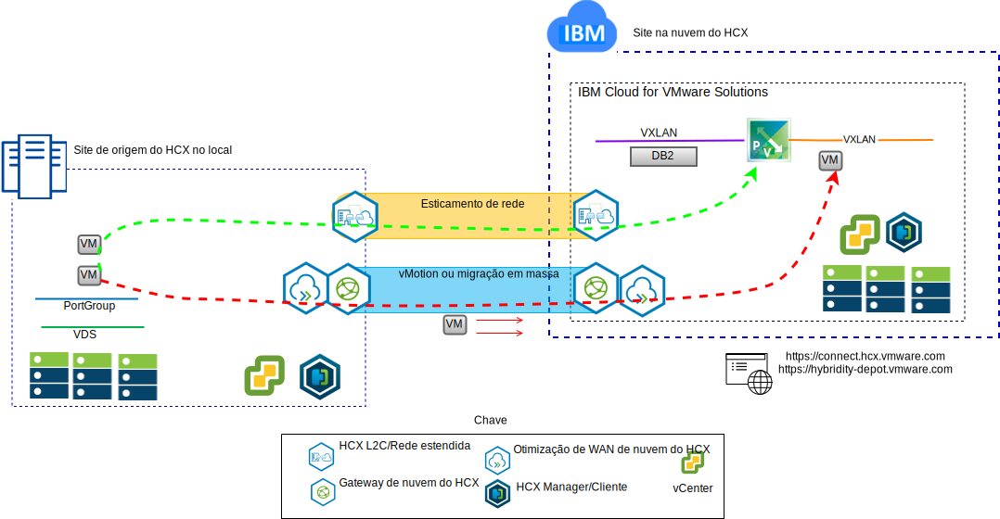
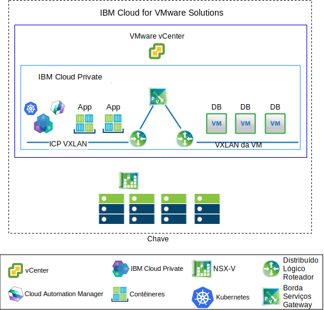

---

copyright:

  years:  2016, 2019

lastupdated: "2019-02-15"

---

# Casos de uso
{: #vcsnsxt-usecases}

## Migração de carga de trabalho do VMware para o IBM Cloud
{: #vcsnsxt-usecases-wkld-mig}

O Acme Skateboards deseja estender de forma contínua sua instância do VMware SDDC no local para uma instância do VMware vCenter Server on {{site.data.keyword.cloud}}. Eles devem manter seus negócios em funcionamento e minimizar o tempo de inatividade. Reconfigurar seus aplicativos para execução na nuvem não é uma solução ideal.

O VMware vCenter Server on {{site.data.keyword.cloud_notm}} with Hybridity Bundle permite a criação de uma conexão
contínua entre as instâncias do vCenter Server e um
data center virtualizado do VMware no local.

Os componentes do VMware HCX, que são implementados como máquinas virtuais (MVs) no site de destino do vCenter Server, permitem o estabelecimento de uma conexão com os componentes do VMware HCX que estão instalados no site de origem no local do peer.

Figura 1. Serviço VMware Hybrid Cloud Extension

A interconectividade fracamente acoplada entre no local e o {{site.data.keyword.cloud_notm}} permite recursos, tais como:
- **Interconectividade simples** - as conexões de rede lógica são estabelecidas facilmente sobre qualquer conexão física que inclua a Internet pública, a VPN privada ou o link direto.
- **Extensão da camada 2** – as redes no local são estendidas para a nuvem, incluindo sub-redes no local e endereçamento IP.
- **Criptografia** – o tráfego de rede é criptografado com segurança entre os dois lados.
- **Rede otimizada** – seleciona a melhor conexão e faz com que, de maneira eficiente, ela tenha uma sobrecarga a fim de que o tráfego da rede seja movido o mais rápido possível.
- **Deduplicação de dados** – até 50% de redução no tráfego de rede pode ser alcançado.
- **Roteamento inteligente** - quando uma carga de trabalho é movida, o roteamento de proximidade pode mudar o caminho de rede (ou seja, gateway) para que o tráfego de rede use o gateway do site de destino e não faça "hairpin" de volta ao site de origem.
- **Migração de tempo de inatividade zero** - um sistema em execução pode ser movido para (ou voltar de) a nuvem usando vMotion.
- **Migração planejada** - qualquer número de MVs pode ser replicado para o site de destino e, em seguida, ativado nesse site em um horário designado que substitui os sistemas que são executados no site de origem.
- **Migração de políticas de segurança** – se o NSX for usado no local, quaisquer políticas de segurança, firewalls e assim por diante serão movidos juntamente com a carga de trabalho.

## Implementação de arquitetura híbrida
{: #vcsnsxt-usecases-hybrid-archi-deployment}

O Acme Skateboards deseja implementar uma arquitetura híbrida no {{site.data.keyword.cloud_notm}} que consiste no vCenter Server with Hybridity Bundle e no {{site.data.keyword.icpfull_notm}} para sua jornada para a modernização de aplicativo. Seus requisitos são executar seus bancos de dados em MVs, os apps e as interfaces da web em contêineres e gostaria de usar um conjunto comum de ferramentas para gerenciamento de rede e segurança.

O {{site.data.keyword.vmwaresolutions_short}} fornece automação para implementar componentes de tecnologia do VMware em {{site.data.keyword.CloudDataCents_notm}} em todo o mundo. A arquitetura consiste em uma única região de nuvem e suporta a capacidade de ampliação para mais regiões de nuvem localizadas em outra geografia ou em outro pod do {{site.data.keyword.cloud_notm}} dentro do mesmo data center.

Os produtos {{site.data.keyword.icpfull_notm}} e Cloud Automation Manager (CAM) podem ser implementados manualmente em sua plataforma de virtualização no local que permite o gerenciamento de nuvem por meio do local no local. Como alternativa, o {{site.data.keyword.icpfull_notm}} e o CAM são oferecidos como uma extensão de serviço para uma implementação nova ou existente do vCenter Server que permite o gerenciamento de nuvem por meio do {{site.data.keyword.cloud_notm}}.

O diagrama a seguir representa o {{site.data.keyword.icpfull_notm}} em execução em uma instância do vCenter Server. O NSX-V é configurado com um comutador dedicado/VXLAN dedicado, o Distributed Logical Router (DLR) e um Edge Services Gateway (ESG) especificamente para a rede de sobreposição do {{site.data.keyword.icpfull_notm}}. O roteamento é configurado por meio do ESG para obter acesso à rede subjacente.

Usando a automação do {{site.data.keyword.cloud_notm}}, o Acme Skateboards pode provisionar uma solução híbrida que abranja o vCenter Server para executar suas MVs de banco de dados e o {{site.data.keyword.icpfull_notm}} no vCenter Server para executar seus aplicativos e serviços da web de front-end em contêineres. O NSX fornece a eles um conjunto comum de ferramentas de gerenciamento para rede e segurança na rede de sobreposição.

Para obter mais informações sobre NSX-V, veja [Visão geral do NSX-V](/docs/services/vmwaresolutions/archiref/vcsnsxt?topic=vmware-solutions-vcsnsxt-overview-ic4vnsxv). Para obter mais informações sobre o vCenter Server e a oferta {{site.data.keyword.icpfull_notm}}, veja [vCenter Server e {{site.data.keyword.cloud_notm}} Private](/docs/services/vmwaresolutions/archiref/vcsicp?topic=vmware-solutions-vcsicp-intro).

Figura 2. vCenter Server com {{site.data.keyword.icpfull_notm}}

Isso cria uma interconectividade fracamente acoplada entre o local e o {{site.data.keyword.cloud_notm}} e permite recursos como:
-	**Interconectividade simples** - as conexões de rede lógica são estabelecidas facilmente sobre qualquer conexão física, incluindo a Internet pública, a VPN privada ou o link direto.
-	**Extensão da camada 2** – as redes no local são estendidas para a nuvem, incluindo sub-redes no local e endereçamento IP.
-	**Criptografia** – o tráfego de rede é criptografado com segurança entre os dois lados.
-	**Rede otimizada** – seleciona a melhor conexão e faz com que, de maneira eficiente, ela tenha uma sobrecarga a fim de que o tráfego da rede seja movido o mais rápido possível.
-	**Deduplicação de dados** – até 50% de redução no tráfego de rede pode ser alcançado.
-	**Roteamento inteligente** – quando uma carga de trabalho é movida, o roteamento de proximidade pode mudar o caminho de rede (isto é, o gateway) para que o tráfego de rede use o gateway do site de destino e não "se prenda" de volta ao site de origem.
-	**Migração de tempo de inatividade zero** - um sistema em execução pode ser movido para (ou voltar de) a nuvem usando vMotion.
-	**Migração planejada** – qualquer número de MVs pode ser replicado para o site de destino e, em seguida, ativado nesse site em um horário designado para substituir os sistemas em execução no site de origem.
-	**Migração de políticas de segurança** – se o NSX for usado no local, quaisquer políticas de segurança, firewalls e assim por diante serão movidos juntamente com a carga de trabalho.

Usando essa solução, o Acme Skateboards foi capaz de migrar suas cargas de trabalho do VMware no local com êxito para o {{site.data.keyword.cloud_notm}} atendendo a seus requisitos de pouco a nenhum tempo de inatividade e nenhuma reconfiguração do aplicativo. Para obter mais informações sobre o vCenter Server with Hybridity Bundle, veja [Arquitetura da solução VMware HCX on {{site.data.keyword.cloud_notm}}](https://www.ibm.com/cloud/garage/files/HCX_Architecture_Design.pdf).

## Links relacionados
{: #vcsnsxt-usecases-related}

* [Visão geral do vCenter Server on {{site.data.keyword.cloud_notm}} with Hybridity Bundle](/docs/services/vmwaresolutions/archiref/vcs?topic=vmware-solutions-vcs-hybridity-intro)
