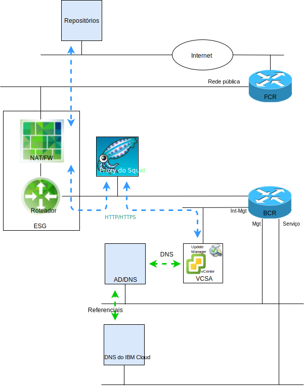

---

copyright:

  years:  2016, 2019

lastupdated: "2019-05-08"

subcollection: vmware-solutions

---

# Introdução ao VMware Update Manager
{: #vum-intro}

O propósito deste documento é fornecer a você, o administrador do sistema da instância do {{site.data.keyword.vmwaresolutions_full}} vCenter Server, instruções sobre como configurar o VMware Update Manager (VUM) para manter a moeda do ambiente do vCenter Server.

O VUM permite o gerenciamento centralizado e automatizado de correção e versão para o VMware vSphere e permite concluir as tarefas a seguir em seu ambiente do VMware vCenter Server on {{site.data.keyword.cloud_notm}}:
* Fazer upgrade e corrigir os hosts vSphere ESXi.
* Instalar e atualizar o software de terceiros nos hosts.
* Faça upgrade do hardware da máquina virtual, do VMware Tools e dos dispositivos virtuais.

Este documento também descreve os processos para manter os componentes a seguir da instância do vCenter Server:
* vCenter Server Appliance
* NSX
* vSAN

Este documento descreve o uso de uma implementação do servidor proxy, com base no CentOS e Squid, para permitir que o VUM acesse os repositórios do VMware. Quando um VUM solicita um recurso do servidor de atualização no VMware, a solicitação é enviada para o servidor proxy primeiro e o servidor proxy, em seguida, envia a solicitação para o servidor de atualização por meio do External Services Gateway (ESG). Depois que o recurso é obtido pelo servidor proxy, ele o envia para o VUM.

O vCenter Server implementa atualmente o vSphere 6.5, que significa que o VUM agora está integrado ao vCenter Server Appliance (VCSA) e, como o componente do cliente VUM é um plug-in executado no vSphere Web Client, ele é ativado automaticamente após a implementação do VCSA. No entanto, o VUM não tem acesso à Internet para acessar os repositórios do VMware.

Esta configuração documentada usa o modelo de implementação do VUM “tudo-em-um”, conectado à Internet, que usa a rede pública do {{site.data.keyword.cloud_notm}} para fornecer acesso à Internet para fazer download de upgrades e correções.

Os clientes que requerem o uso de conexões de Internet alternativas devem investigar o VMware vSphere Update Manager Download Service (UMDS), que está além do escopo desta publicação.

Embora o VUM possa ser configurado para importar atualizações de um repositório compartilhado ou importar correções e extensões manualmente de um arquivo compactado, esses tópicos não são discutidos neste documento.

No vSphere 6.5, não é mais suportado registrar o VUM em um VCSA durante a instalação do servidor VUM em um sistema Windows separado. Não é possível implementar o VUM em uma MV dentro do ambiente do vCenter Server.

Este documento é organizado nas seções a seguir:
* [Visão geral do VMware Update Manager](/docs/services/vmwaresolutions/archiref/vum?topic=vmware-solutions-vum-overview) - descreve o processo do VUM e introduz termos chave que são necessários para entender as operações e a UI da ferramenta.
* **Instalação, configuração e uso** - descreve as etapas que são necessárias para fazer o VUM funcionar em uma instância do vCenter Server:
  - [Configuração inicial](/docs/services/vmwaresolutions/archiref/vum?topic=vmware-solutions-vum-init-config) - uma tarefa única para:
      - Configure a rede NSX para permitir o acesso do servidor proxy à Internet.
      - Instale e configure um servidor proxy para fornecer acesso à Internet para o VUM.
      - A configuração inicial do VUM para usar o servidor proxy.
  - [Coletando os metadados](/docs/services/vmwaresolutions/archiref/vum?topic=vmware-solutions-vum-metadata) - o VUM faz download de metadados sobre os upgrades, as correções ou as extensões por meio de um processo automático predefinido que pode ser modificado. Em intervalos configuráveis regulares, o VUM entra em contato com o VMware, ou origens de terceiros, para reunir os metadados mais recentes sobre upgrades, correções ou extensões disponíveis.
  - [Criando linhas de base](/docs/services/vmwaresolutions/archiref/vum?topic=vmware-solutions-vum-baselines) - use as linhas de base predefinidas e os grupos de linhas de base ou crie os customizados. Linhas de base e grupos de linha de base são, então, anexados a objetos de inventário.
  - [Varredura e revisão](/docs/services/vmwaresolutions/archiref/vum?topic=vmware-solutions-vum-scanning) - os objetos de inventário são varridos e os resultados são revisados para determinar como eles obedecem às linhas de base e aos grupos de linhas de base. Os resultados da varredura podem ser filtrados por procura de texto, seleção de grupo, seleção de linha de base e seleção de status de conformidade.
  - [Preparação e correção](/docs/services/vmwaresolutions/archiref/vum?topic=vmware-solutions-vum-staging) - as correções e extensões podem ser opcionalmente montadas antes da correção para assegurar que sejam transferidas por download para o host. Durante a correção, o VUM aplica as correções, as extensões e os upgrades aos objetos de inventário.

Este documento supõe que você tenha uma instância Primária do vCenter Server que está implementada ou várias instâncias Primárias do vCenter Server separadas. Se você tiver instâncias Primária e Secundária do vCenter Server que estão implementadas e que usam a Conexão Única (SSO), veja [vCenters vinculados por SSO](/docs/services/vmwaresolutions/archiref/vum?topic=vmware-solutions-vum-updating-vcsa).

Se você implementou um vCenter Server usando vSAN, veja [Atualizando clusters do vSAN ](/docs/services/vmwaresolutions/archiref/vum?topic=vmware-solutions-vum-updating-vsan) primeiro.

Se você desejar atualizar a automação de gerenciamento de infraestrutura do {{site.data.keyword.cloud_notm}}, use o console do {{site.data.keyword.vmwaresolutions_short}}.

O [console do {{site.data.keyword.vmwaresolutions_short}}](https://cloud.ibm.com/infrastructure/vmware-solutions/console) permite a execução das ações a seguir:
*	Fazer upgrade de licenças, por exemplo, fazer upgrade do NSX Base para outra versão
*	Iniciar atualizações para a plataforma do vCenter Server, por exemplo, mover para a versão 2.5
*	Visualizar o status das atualizações
*	Visualizar as atualizações instaladas

Esse recurso permite a atualização automatizada apenas para os componentes de gerenciamento das instâncias do vCenter Server. As atualizações do produto VMware devem ser aplicadas usando os procedimentos que são detalhados neste documento.

## Links relacionados
{: #vum-intro-related}

* [Arquitetura da solução VMware HCX on {{site.data.keyword.cloud_notm}}](/docs/services/vmwaresolutions/services?topic=vmware-solutions-hcx-archi-intro#hcx-archi-intro)
* [VMware Solutions on	{{site.data.keyword.cloud_notm}} Digital Technical Engagement](https://ibm-dte.mybluemix.net/vmware) (demonstrações)
