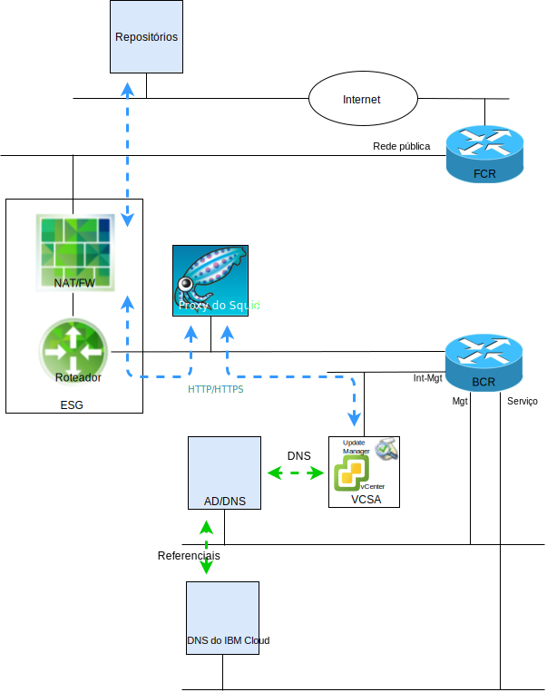

---

copyright:

  years:  2016, 2018

lastupdated: "2018-10-29"

---

# Introdução ao VMware Update Manager

O propósito deste documento é fornecer a você, o administrador do sistema da instância do IBM Cloud for VMware Solutions vCenter Server, instruções sobre como configurar o VMware Update Manager (VUM) para manter o curso do seu ambiente do vCenter Server.

O VUM permite o gerenciamento de correção e versão automatizado e centralizado para o VMware vSphere e permite executar as tarefas a seguir em seu ambiente do VCS:
* Fazer upgrade e corrigir os hosts vSphere ESXi.
* Instalar e atualizar o software de terceiros nos hosts.
* Faça upgrade do hardware da máquina virtual, do VMware Tools e dos dispositivos virtuais.

Este documento também descreve os processos para manter os componentes a seguir de sua instância do VCS:
* vCenter Server Appliance
* NSX
* vSAN

Este documento descreve o uso de uma implementação do servidor proxy, com base no CentOS e Squid, para permitir que o VUM acesse os repositórios do VMware. Quando um VUM solicita um recurso do servidor de atualização no VMware, a solicitação é enviada para o servidor proxy primeiro e o servidor proxy, em seguida, envia a solicitação para o servidor de atualização por meio do External Services Gateway (ESG). Depois que o recurso é obtido pelo servidor proxy, ele envia o recurso para VUM.

Figura 1. Diagrama de visão geral  

O VCS implementa atualmente o vSphere 6.5, que significa que o VUM agora está integrado ao vCenter Server Appliance (VCSA) e, como o componente do cliente VUM é um plug-in que é executado no vSphere Web Client, ele é ativado automaticamente após a implementação do VCSA. No entanto, o VUM não terá acesso à Internet para acessar os repositórios do VMware.

Essa configuração documentada usa o modelo de implementação do VUM "tudo-em-um", conectado à Internet, que usa a rede pública do IBM Cloud para fornecer acesso à Internet para fazer download de upgrades e correções.

Clientes que requerem o uso de conexões de Internet alternativas devem investigar o VMware vSphere Update Manager Download Service (UMDS), que está além do escopo desta publicação.

Embora o VUM possa ser configurado para importar atualizações de um repositório compartilhado ou importar correções e extensões manualmente de um arquivo .zip, esses tópicos não são discutidos neste documento.

Portanto, observe que, no vSphere 6.5, não é mais suportado registrar o VUM em um VCSA. Durante a instalação do servidor VUM em uma máquina Windows separada não será possível implementar o VUM em uma VM dentro do ambiente do VCS.

Este documento é organizado nas seções a seguir:
* [Visão geral do VMware Update Manager](vum-overview.html) - esta seção descreve o processo do VUM e introduz termos chave que são necessários para entender as operações e a UI da ferramenta
* **Instalação, configuração e uso** - esta seção descreve as etapas que são necessárias para ter o VUM funcionando em uma instância do VCS:
  - [Configuração inicial](vum-init-config.html) - uma tarefa única para:
      - Configurar a rede NSX para permitir que o servidor proxy acesse a Internet
      - Instalar e configurar um servidor proxy para fornecer acesso à Internet para o VUM
      - A configuração inicial do VUM para usar o servidor proxy
  - [Coletando os metadados](vum-metadata.html) - o VUM faz download de metadados sobre os upgrades, as correções ou as extensões por meio de um processo automático predefinido que pode ser modificado. Em intervalos configuráveis regulares, o VUM entra em contato com o VMware, ou origens de terceiros, para reunir os metadados mais recentes sobre upgrades, correções ou extensões disponíveis
  - [Criando linhas de base](vum-baselines.html) - use as linhas de base predefinidas e os grupos de linhas de base ou crie os customizados. As linhas de base e os grupos de linhas de base são, então, anexados a objetos de inventário
  - [Varredura e revisão](vum-scanning.html) - os objetos de inventário são varridos e os resultados são revisados para determinar como eles obedecem às linhas de base e aos grupos de linhas de base. Os resultados da varredura podem ser filtrados por procura de texto, seleção de grupo, seleção de linha de base e seleção de status de conformidade
  - [Preparação e correção](vum-staging.html) - as correções e extensões podem ser opcionalmente montadas antes da correção para assegurar que sejam transferidas por download para o host. Durante a correção, o VUM aplica as correções, as extensões e os upgrades aos objetos de inventário

Este documento supõe que você tenha uma instância primária do VCS implementada ou várias instâncias primárias do VCS separadas. Se você tiver instâncias do VCS primárias e secundárias implementadas e, portanto, estiver usando a Conexão Única (SSO), veja [vCenters vinculados à SSO](vum-updating-vcsa.html).

Se você implementou um VCS usando vSAN, veja [Atualizando clusters vSAN](vum-updating-vsan.html) primeiro.

Se você deseja atualizar a automação de gerenciamento de infraestrutura do IBM Cloud, use o IBM Cloud for VMware Solutions Console.

O [console do IBM Cloud for VMware Solutions](https://console.bluemix.net/infrastructure/vmware-solutions/console) permite que você realize as ações a seguir:
*	Fazer upgrade de licenças, por exemplo, fazer upgrade do NSX Base para outra versão
*	Iniciar atualizações para a plataforma VCS, por exemplo, mover para a versão 2.5
*	Visualizar o status das atualizações
*	Visualizar as atualizações instaladas

Esse recurso ativa a atualização automatizada para os componentes de gerenciamento somente das instâncias do VCS. As atualizações do produto VMware devem ser aplicadas usando os procedimentos que são detalhados neste documento.

### Links relacionados

* [VMware HCX on IBM Cloud Solution Architecture](https://www.ibm.com/cloud/garage/files/HCX_Architecture_Design.pdf)
* [Soluções VMware no IBM Cloud Digital Technical Engagement](https://ibm-dte.mybluemix.net/ibm-vmware) (Demos)
