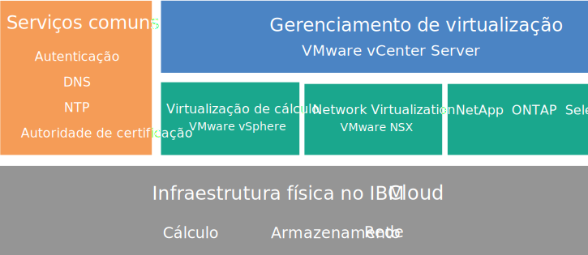
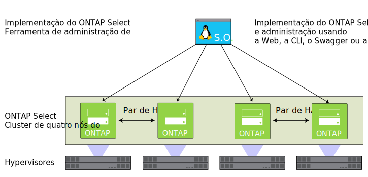

---

copyright:

  years:  2016, 2018

lastupdated: "2018-05-18"

---

# Visão geral do NetApp ONTAP Select

Revise a arquitetura e os componentes do NetApp ONTAP Select na implementação do {{site.data.keyword.cloud}}.

## Arquitetura do NetApp ONTAP Select

O NetApp ONTAP Select na oferta do {{site.data.keyword.cloud_notm}} complementa a implementação do vCenter Server fornecendo serviços de virtualização de armazenamento.

O gráfico a seguir descreve a arquitetura geral do NetApp ONTAP Select na implementação do vCenter Server.

Figura 1. Arquitetura de alto nível do NetApp ONTAP Select no {{site.data.keyword.cloud_notm}}

### Infraestrutura física

Essa camada fornece a infraestrutura física (recursos de cálculo, rede e armazenamento) a ser usada pela infraestrutura virtual.

### Infraestrutura de virtualização (Cálculo, Rede e NetApp ONTAP Select)

Essa camada virtualiza a infraestrutura física por meio de diferentes produtos VMware e do produto NetApp ONTAP Select:
* O VMware vSphere virtualiza os recursos de cálculo físicos.
* VMware NSX é a plataforma de virtualização de rede que fornece componentes de rede lógica e redes virtuais.
* O NetApp ONTAP Select no {{site.data.keyword.cloud_notm}} implementa um cluster do ONTAP Select que consiste em quatro VMs para os quatro hosts.

O gráfico a seguir descreve os componentes da implementação do NetApp ONTAP Select.

Figura 2. Componentes do NetApp ONTAP Select

### Gerenciamento de virtualização

Essa camada consiste no dispositivo virtual vCenter Server, NSX Manager, dois NSX ESGs, 3 NSX Controllers, dispositivo virtual Platform Services Controller (PSC), vCenter Server Appliance (vCSA) e a máquina virtual IBM CloudDriver.

O NetApp ONTAP Select é executado em um cluster VMware e virtualiza o armazenamento local nos hosts. O NetApp ONTAP Select é implementado no modelo dedicado, em que não se espera que outras cargas de trabalho compartilhem o mesmo cluster com ele. Como resultado, a configuração de hardware do NetApp ONTAP Select na oferta do {{site.data.keyword.cloud_notm}} é dimensionada apenas com base nos requisitos do NetApp ONTAP Select.

<!--For details about the architecture, see the _Reference architecture_ document in the [Architecture Center](https://www.ibm.com/devops/method/content/architecture/virtVCenterServerPlatform){:new_window}.-->

## Componentes da instância do NetApp ONTAP Select

Os componentes a seguir estão incluídos em sua instância do NetApp ONTAP Select.

**Nota**: a disponibilidade e a precificação de configurações padronizadas podem variar com base no {{site.data.keyword.CloudDataCent_notm}} que é selecionado para implementação.

### Armazenamento

* Três opções: **Alto desempenho (médio)**, **Alto desempenho (grande)** e **Alta capacidade**
* RAID 5 com hot spare
* Duas unidades SATA 1 TB ESXi OS – RAID 1
* Armazenamento de dados de gerenciamento – 500 GB para VMs de gerenciamento

### Configurações predefinidas

Quatro {{site.data.keyword.cloud_notm}} {{site.data.keyword.baremetal_short}} com as seguintes opções de configuração:
* **Alto desempenho (Médio)** – Licença completa/Dual Intel Xeon E5-2650 v4 (Total de 24 núcleos, 2,2 GHz)/128 GB de RAM/Capacidade de vinte e duas unidades SSD de 1,9 TB por nó/Capacidade efetiva de um cluster de 4 nós – 59 TB
* **Alto desempenho (Grande)** – Licença completa/Dual Intel Xeon E5-2650 v4 (Total de 24 núcleos, 2,2 GHz)/128 GB de RAM/Capacidade de vinte e duas unidades SSD de 3,8 TB por nó/Capacidade efetiva de um cluster de 4 nós – 118 TB
* **Alta capacidade** - Licença padrão/Dual Intel Xeon E5-2650 v4 (Total de 24 núcleos, 2,2 GHz)/64 GB de RAM/Capacidade de trinta e quatro unidades SATA de 4 TB por nó/Capacidade efetiva de um cluster de 4 nós – 190 TB

**Nota:** as unidades SSD (Solid State Disk) de 3,8 TB serão suportadas quando forem disponibilizadas geralmente em um data center.

### Hardware

* Três opções de RAM e disco: **Alto desempenho (médio)**, **Alto desempenho (grande)** e **Alta capacidade**
* Duas unidades SATA 1 TB ESXi OS
* Um controlador de disco RAID
* VMware Server Virtualization 6.5

### Redes

* Uplinks duais de rede pública e privada de 10 Gbps
* Três VLANs (Virtual LANs): uma VLAN pública e duas VLANs privadas
* Uma VXLAN (Virtual eXtensible LAN) com DLR (Roteador Lógico Distribuído)
* Dois gateways de serviço seguros VMware NSX Edge

### Instâncias do Virtual Server

Duas VSIs (Instâncias do Virtual Server):
* Um VSI para o Active Directory (AD) da Microsoft e serviços do Sistema de Nomes de Domínio (DNS).
* Um VSI for IBM CloudBuilder, que será encerrado depois que a implementação da instância for concluída.

### Licenças e taxas

*  Quatro licenças Premium/Standard Edition do NetApp ONTAP Select (fornecidas pelo usuário)
*  VMware vSphere 6.5 Enterprise Plus Edition
*  VMware vCenter Server 6.5
*  VMware NSX Base para Service Providers Edition
*  Taxa de suporte e serviços (uma licença por nó)

<!--For details about the components, see the _Bill of Materials_ document on the [Reference Architecture](https://www.ibm.com/cloud/garage/content/architecture/virtualizationArchitecture/reference-architecture) page.-->

**Importante**: deve-se gerenciar os componentes do {{site.data.keyword.vmwaresolutions_short}} criados em sua conta do {{site.data.keyword.cloud_notm}} apenas por meio do console do {{site.data.keyword.vmwaresolutions_short}}, não do {{site.data.keyword.slportal}} ou de qualquer outro meio fora do console. Se você mudar esses componentes fora do console do {{site.data.keyword.vmwaresolutions_short}}, as mudanças não serão sincronizadas com o console.

**CUIDADO**: gerenciar quaisquer componentes do {{site.data.keyword.vmwaresolutions_short}} (que foram instalados em sua conta do {{site.data.keyword.cloud_notm}} quando você pediu a instância) fora do console do {{site.data.keyword.vmwaresolutions_short}} pode desestabilizar seu ambiente. Estas atividades de gerenciamento incluem:
*  Inclusão, modificação, retorno, remoção ou desligamento de componentes
*  Expansão ou redução da capacidade da instância por meio da inclusão ou remoção de servidores ESXi
*  Reinício dos serviços

   As exceções a essas atividades incluem o gerenciamento de compartilhamentos de arquivos de armazenamento compartilhado por meio do {{site.data.keyword.slportal}}. Essas atividades incluem: pedido, exclusão (que poderá afetar armazenamentos de dados, se montado), autorização e montagem de compartilhamentos de arquivos de armazenamento compartilhado.

## Links relacionados

* [Planejando instâncias do NetApp ONTAP Select](np_planning.html)
* [Pedindo instâncias do NetApp ONTAP Select](np_orderinginstances.html)
* [Visão geral do vCenter Server](../vcenter/vc_vcenterserveroverview.html)
* [Centro de Documentação do NetApp ONTAP](http://docs.netapp.com/ontap-9/index.jsp?topic=%2Fcom.netapp.doc.exp-clus-peer%2Fhome.html){:new_window}
