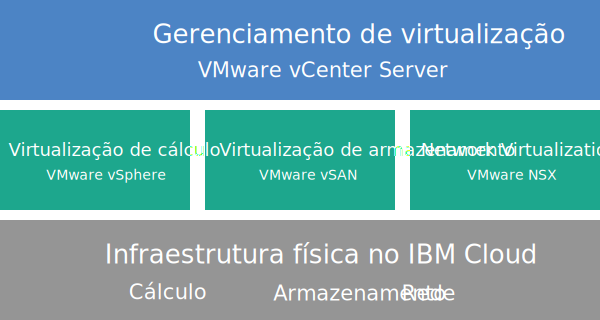

---

copyright:

  years:  2016, 2018

lastupdated: "2018-09-27"

---

# Visão geral do Cloud Foundation

Quando você pede o VMware Cloud Foundation no {{site.data.keyword.cloud}}, um ambiente inteiro do VMware é implementado automaticamente. A implementação base consiste em quatro {{site.data.keyword.cloud_notm}} {{site.data.keyword.baremetal_short}} com a pilha do VMware Cloud Foundation pré-instalada e configurada para fornecer uma plataforma unificada do data center definido por software (SDDC). O Cloud Foundation integra nativamente o VMware vSphere, o VMware NSX, o VMware Virtual SAN e é projetado com base em designs validados do VMware.

## Arquitetura do Cloud Foundation

O gráfico a seguir descreve a arquitetura geral e os componentes da implementação do Cloud Foundation.

Figura 1. Arquitetura do Cloud Foundation

### Infraestrutura física

Esta camada fornece a infraestrutura física (recursos de cálculo, armazenamento e rede) a ser usada pela infraestrutura virtual.

### Infraestrutura de virtualização (Cálculo, Armazenamento e Rede)

Esta camada virtualiza a infraestrutura física por meio de produtos VMware diferentes:
* O VMware vSphere virtualiza os recursos de cálculo físico.
* VMware Virtual SAN (vSAN) fornece armazenamento compartilhado definido por software com base no armazenamento nos servidores físicos.
* VMware NSX é a plataforma de virtualização de rede que fornece componentes de rede lógica e redes virtuais.

### Gerenciamento de virtualização

Essa camada consiste no vCenter Server, que representa a camada de gerenciamento para o ambiente virtualizado. As mesmas ferramentas e scripts compatíveis com o vSphere API familiares podem ser usadas para gerenciar o ambiente do VMware hospedado pela IBM.

No console do {{site.data.keyword.vmwaresolutions_short}}, é possível expandir e contrair a capacidade de suas instâncias usando o recurso de inclusão e remoção de servidores ESXi. Além disso, as funções de gerenciamento de ciclo de vida, como aplicar atualizações e fazer upgrade dos componentes do VMware no ambiente hospedado, também estão disponíveis.

Para obter mais informações sobre a arquitetura, consulte [Visão geral da solução](../archiref/solution/solution_overview.html).

## Especificações técnicas para instâncias do Cloud Foundation

Os componentes a seguir estão incluídos em sua instância do Cloud Foundation.

**Nota:** os encargos que são incorridos para o hardware, a rede, as máquinas virtuais e o armazenamento podem variar com base no {{site.data.keyword.CloudDataCent_notm}} que é selecionado para implementação.

### Bare Metal Server

É possível pedir o {{site.data.keyword.cloud_notm}} {{site.data.keyword.baremetal_short}} com uma das configurações a seguir:
*  **Customizado**: {{site.data.keyword.baremetal_short}} com seu modelo de CPU selecionado e tamanho de RAM.   
   * Geração Intel Broadwell de 2 CPUs (Série Intel Xeon E5-2600 v4)
   * Geração Intel Skylake de 2 CPUs (série Intel Xeon 4100/5100/6100)
**Nota:** se você planeja usar o armazenamento vSAN, a configuração requer quatro {{site.data.keyword.baremetal_short}}.
* **Pré-configurado**: geração Intel Broadwell de 2 CPUs (série Intel Xeon E5-2600 v4)
  * **Pequeno** (Dual Intel Xeon E5-2650 v4/total de 24 núcleos, 2.2 GHz/128 GB de RAM/12 discos)
  * **Grande** (Dual Intel Xeon E5-2690 v4/total de 28 núcleos, 2.6 GHz/512 GB de RAM/12 discos)

### Redes

Os componentes de rede a seguir são pedidos:
* Uplinks duais de rede pública e privada de 10 Gbps
* Três VLANs (Virtual LANs): uma VLAN pública e duas VLANs privadas
* Serviços de gerenciamento seguro VMware NSX Edge Services Gateway (ESG) para o tráfego de gerenciamento HTTPS de saída, que é implementado pela IBM como parte da tipologia de rede de gerenciamento. Este ESG é usado pelas máquinas virtuais de gerenciamento da IBM para se comunicar com componentes de gerenciamento externo específicos da IBM relacionados à automação. Para obter mais informações, veja [Os serviços de gerenciamento NSX Edge representam um risco de segurança?](../vmonic/faq.html#does-the-management-services-nsx-edge-pose-a-security-risk-)

  **Importante:** esse ESG não está acessível para você e não é possível usá-lo. Se modificá-lo, talvez você não consiga gerenciar a instância do Cloud Foundation do console do {{site.data.keyword.vmwaresolutions_short}}. Além disso, usar um firewall ou desativar as comunicações ESG para os componentes de gerenciamento externos da IBM fará com que o {{site.data.keyword.vmwaresolutions_short}} se torne inutilizável.

* O recurso EVC (Enhanced vMotion Compatibility) será ativado automaticamente se você tiver um cluster existente com servidores ESXi que são suportados pela versão atual do VMware vSphere. O EVC fornece compatibilidade vMotion para todos os servidores ESXi em um cluster, assegurando que todos os servidores ESXi em um cluster exponham o mesmo conjunto de recursos de CPU para máquinas virtuais. Usando EVC, as máquinas virtuais podem migrar entre quaisquer servidores ESXi no cluster, mesmo que as CPUs reais nos servidores ESXi possam ser diferentes.

### Virtual Server Instances

As VSIs (Virtual Server Instances) a seguir são pedidas:
* Um VSI para o Active Directory (AD) da Microsoft e serviços do Sistema de Nomes de Domínio (DNS). O VSI é necessário para suporte à configuração multisite. Essa especificação da VSI é: Windows 2012 R2 (8 GB de RAM / 2 núcleos de CPU / 100 GB de disco / uplinks privados de 1 Gbps dual).
* Um VSI for IBM CloudBuilder, que será encerrado depois que a implementação da instância for concluída.
* (Se o Veeam no {{site.data.keyword.cloud_notm}} for pedido) É pedido um VSI para o serviço de backup Veeam.

### Armazenamento

O armazenamento a seguir é pedido, dependendo da configuração do {{site.data.keyword.baremetal_short}} que você selecionar:
* Dois discos de inicialização SATA de 1 TB
* Dois discos de cache SSD (Solid-State Disk) de 960 GB
* Um controlador de disco RAID
* Apenas para a configuração **Customizado**, é possível configurar o número de unidades de disco, o tipo de disco e a capacidade de acordo com seus requisitos. Além disso, você tem a opção Intel Optane de alto desempenho, que oferece dois compartimentos de disco de capacidade extras para um total de 10 discos de capacidade. A opção Intel Optane de alto desempenho depende do modelo de CPU.
* Apenas para a configuração **Pré-configurado**, **Pequeno**: dois discos de capacidade SSD de 1,9 TB
* Apenas para a configuração **Pré-configurado**, **Grande**: quatro discos de capacidade SSD de 3,8 TB

### Licenças (fornecidas pela IBM ou BYOL) e taxas

* Quatro VMware vSphere Enterprise Plus 6.5u1
* Quatro VMware vCenter Server 6.5
* Quatro VMware NSX Enterprise 6.3
* Quatro VMware vSAN Advanced ou Enterprise 6.6
* Quatro licenças do SDDC Manager (apenas fornecidas pela IBM)
* Quatro taxas de Suporte e Serviços

## Especificações técnicas para nós de expansão do Cloud Foundation

Cada nó de expansão do Cloud Foundation é implementado e incorre em encargos para os seguintes componentes em sua conta do {{site.data.keyword.cloud_notm}}.

### Hardware para nós de expansão

Um {{site.data.keyword.cloud_notm}} Bare Metal Server com a configuração apresentada em [Especificações técnicas para instâncias do Cloud Foundation](../sddc/sd_cloudfoundationoverview.html#technical-specifications-for-cloud-foundation-instances).

### Licenças e taxas para os nós de expansão

* Um VMware vSphere Enterprise Plus 6.5u1
* Um VMware vCenter Server 6.5
* Um VMware NSX Enterprise 6.3
* Um VMware vSAN Advanced ou Enterprise 6.6
* Uma licença do SDDC Manager
* Uma taxa de Suporte e Serviços

**Importante:** deve-se gerenciar os componentes do {{site.data.keyword.vmwaresolutions_short}} criados em sua conta do {{site.data.keyword.cloud_notm}} somente por meio do console do {{site.data.keyword.vmwaresolutions_short}}, não do	{{site.data.keyword.slportal}} ou de qualquer outro meio fora do console. Se você mudar esses componentes fora do console do {{site.data.keyword.vmwaresolutions_short}}, as mudanças não serão sincronizadas com o console.

**CUIDADO:** gerenciar quaisquer componentes do {{site.data.keyword.vmwaresolutions_short}}, que foram instalados em sua conta do {{site.data.keyword.cloud_notm}} quando você solicitou a instância, fora do console do {{site.data.keyword.vmwaresolutions_short}} pode tornar seu ambiente instável. Estas atividades de gerenciamento incluem:
*  Incluindo, modificando, retornando ou removendo componentes
*  Expandindo ou contraindo a capacidade da instância por meio da inclusão ou remoção de servidores ESXi
*  Desativando componentes
*  Reiniciando os serviços

   As exceções a essas atividades incluem o gerenciamento de compartilhamentos de arquivos de armazenamento compartilhado por meio do {{site.data.keyword.slportal}}. Essas atividades incluem: pedido, exclusão (que poderá afetar armazenamentos de dados, se montado), autorização e montagem de compartilhamentos de arquivos de armazenamento compartilhados.

### Links relacionados

* [Lista de materiais de software do Cloud Foundation](sd_bom.html)
* [Planejando instâncias do Cloud Foundation](sd_planning.html)
* [Pedindo instâncias do Cloud Foundation](sd_orderinginstance.html)
* [Centro de documentação do VMware vSphere](https://pubs.vmware.com/vsphere-60/index.jsp){:new_window}
* [Centro de documentação do VMware NSX 6](https://pubs.vmware.com/NSX-6/index.jsp){:new_window}
* [FAQ de compatibilidade de EVC e CPU](https://kb.vmware.com/s/article/1005764)
