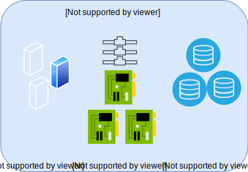

---

copyright:

  years:  2019

lastupdated: "2019-08-06"

keywords: vmware solutions shared, get started shared, tech specs shared

subcollection: vmware-solutions

---

{:external: target="_blank" .external}
{:tip: .tip}
{:note: .note}
{:important: .important}

# Visão geral do IBM Cloud for VMware Solutions Shared
{: #shared_overview}

O {{site.data.keyword.vmwaresolutions_full}} Shared é fornecido como uma oferta experimental.
{:note}

Com os VMware Virtual Data Centers, é possível migrar e implementar rápida e facilmente ou implementar cargas de trabalho do VMware na nuvem na parte superior de sua infraestrutura de VMware gerenciada por profissionais. A IBM fornece uma plataforma de computação em nuvem on demand do VMware de autoatendimento com o vCloud Director em execução no {{site.data.keyword.cloud_notm}}. Essa oferta de Pagamento conforme o uso da infraestrutura como serviço (IaaS) permite que os usuários consumam vCPU, armazenamento, vRAM, rede e IP específicos, conforme necessário.

O {{site.data.keyword.vmwaresolutions_short}} tem três tipos de serviço de assinatura de "Infraestrutura como serviço" (IaaS):
- Virtual Data Center reservado de diversos locatários
- Virtual Data Center de pagamento conforme o uso de diversos locatários
- Virtual Data Center dedicado de locatário único

Os clientes gerenciam o ciclo de vida de data centers virtuais usando a oferta {{site.data.keyword.vmwaresolutions_short}}. As funções a seguir são suportadas, pela IU da web ou pela API pública:
- Criação do Virtual Data Center
- Elasticidade do Virtual Data Center
- Exclusão do Virtual Data Center
- Incluindo e removendo Serviços do VMware
- Licenciamento do Windows on demand
- Licenciamento do Red Hat on demand

Todas as três ofertas do {{site.data.keyword.cloud_notm}} Virtual Data Center vêm, como padrão, com cinco endereços IP públicos em um NSX Edge Service Gateway com ingresso ilimitado por meio da rede pública.

Os datacenters virtuais incorrem em encargos para os componentes a seguir:
- Alocações de armazenamento com precificação em camadas com base no desempenho do armazenamento
- Uso de CPU virtual
- Uso de memória virtual
- Egresso na rede pública
- Licenças comerciais do sistema operacional usadas
- Serviços opcionais do VMware

## Arquitetura do IBM Cloud for VMware Solutions Shared
{: #shared_overview-archi}

O gráfico a seguir representa a arquitetura de alto nível e os componentes de implementação do {{site.data.keyword.vmwaresolutions_short}} Shared.

### VMware vCloud Director
{: #shared_overview-vcloud-dir}

Essa camada representa a interface de gerenciamento. O VMware® vCloud Director fornece acesso baseado em função a um portal de locatário baseado na web que permite que os membros de uma organização interajam com os recursos da organização para criar e trabalhar com vApps e máquinas virtuais (VMs).

### Organização
{: #shared_overview-org}

Uma organização é uma unidade de administração para uma coleção de usuários, grupos e recursos de computação. Os usuários são autenticados no nível da organização, fornecendo credenciais estabelecidas por um administrador da organização quando o usuário foi criado ou importado. Os administradores da organização gerenciam usuários, grupos e catálogos da organização.

### Usuários e políticas
{: #shared_overview-users-policies}

Uma organização pode conter um número arbitrário de usuários e grupos. Os usuários podem ser criados localmente pelo administrador da organização ou importados de um serviço de diretório, como o LDAP. As permissões dentro de uma organização são controladas por meio da designação de direitos e funções para usuários e grupos.

### Catalogs
{: #shared_overview-cat}

As organizações usam catálogos para armazenar modelos e arquivos de mídia do vApp. Os membros de uma organização que têm acesso a um catálogo podem usar os modelos e os arquivos de mídia do vApp do catálogo para criar seus próprios vApps. Os administradores da organização podem copiar itens de catálogos públicos para seu catálogo de organização.

### Data centers virtuais
{: #shared_overview-vc}

Um data center virtual da organização fornece recursos para uma organização. Os data centers virtuais fornecem um ambiente no qual os sistemas virtuais podem ser armazenados, implementados e operados. Elas também fornecem armazenamento para mídia virtual de CD e DVD. Uma organização pode ter múltiplos data centers virtuais.

## Especificações técnicas para o IBM Cloud for VMware Solutions Shared
{: #shared_overview-specs}

Os componentes a seguir estão incluídos em seu {{site.data.keyword.cloud_notm}}:

### Cálculo
{: #shared_overview-specs-comp}

O processamento de cálculo é alocado para data centers virtuais em incrementos de virtual CPU (vCPU). Cada incremento de vCPU representa um único núcleo de 2.0 GHz. A memória de cálculo é alocada em incrementos de GB.

### Rede
{: #shared_overview-specs-net}

Por padrão, cada data center virtual vem configurado com um gateway de borda com cinco endereços IP públicos e um endereço IP de serviço privado. O gateway de borda é configurável pelo cliente e pode ser customizado.

Os endereços públicos podem ser usados para vApps públicos para tráfego de Internet pública de entrada ou de saída.

O endereço de serviço pode ser usado para acesso a serviços de infraestrutura do IBM Cloud na rede privada interna do IBM Cloud, incluindo os serviços a seguir:
- NTP
- Licenciamento e atualizações do S.O. Windows
- Licenciamento e atualizações do S.O. Red Hat
- Object Storage de nuvem

### Armazenamento
{: #shared_overview-specs-storage}

Quando você cria ou implementa vApps ou VMs, uma política de armazenamento é selecionada. Há quatro camadas diferentes de armazenamento disponíveis, dependendo do desempenho do armazenamento necessário:

- NFS Platina: a camada de armazenamento com um rendimento máximo de 10 IOPS/GB, o desempenho mais alto
- NFS Ouro: camada de armazenamento com um rendimento máximo de 4 IOPS/GB
- NFS Prata: a camada de armazenamento com um rendimento máximo de 2 IOPS/GB
- NFS Bronze: camada de armazenamento com um rendimento máximo de 0,25 IOPS/GB

## Links relacionados
{: #shared_overview-related}

* [Pedindo o Shared On-demand](/docs/services/vmwaresolutions/services?topic=vmware-solutions-shared_ordering_ondemand)
* [Pedindo o Shared Reserved](/docs/services/vmwaresolutions/services?topic=vmware-solutions-shared_ordering_reserved)
* [Gerenciando o {{site.data.keyword.cloud_notm}} for VMware Solutions Shared](/docs/services/vmwaresolutions/services?topic=vmware-solutions-shared_managing)
* [VMware vCloud Director](https://docs.vmware.com/en/vCloud-Director/9.7/com.vmware.vcloud.tenantportal.doc/GUID-74C9E10D-9197-43B0-B469-126FFBCB5121.html){:external}
