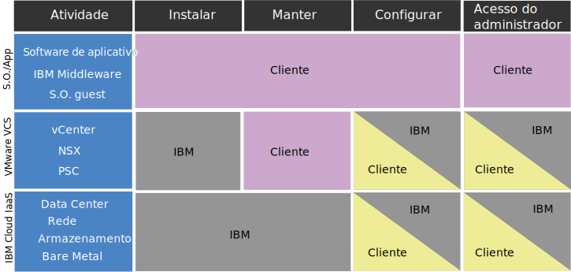

---

copyright:

  years:  2016, 2019

lastupdated: "2019-05-27"

keywords: vCenter Server Hybridity compliance, compliance info Hybridity, vCenter Server Hybridity policy

subcollection: vmware-solutions

---

# Informações de conformidade para instâncias do vCenter Server with Hybridity Bundle
{: #vc_hybrid_compl_info}

Revise as informações a seguir para obter detalhes sobre a conformidade com as instâncias do VMware vCenter Server with Hybridity Bundle.

## A responsabilidade do cliente versus da IBM para o vCenter Server IBM Cloud with Hybridity Bundle
{: #vc_hybrid_compl_info-responsibility}

O diagrama a seguir fornece detalhes sobre as responsabilidades do cliente (você) e da IBM para atividades de conformidade.

## Restrições de dados de funcionamento
{: #vc_hybrid_compl_info-health-data-restrictions}

Os termos nesta seção se aplicam ao portfólio inteiro do {{site.data.keyword.vmwaresolutions_full}}.

### HIPAA
{: #vc_hybrid_compl_info-hipaa}

Não obstante as informações na planilha de dados para este Serviço de nuvem sobre o Health Information Portability and Accountability Act de 1996 ("HIPAA") e o uso permitido de Informações de funcionamento e Dados de funcionamento como Tipos de dados pessoais e/ou Categorias especiais de dados pessoais (coletivamente, "Dados de funcionamento") com este Serviço de nuvem, o uso de Dados de funcionamento com este Serviço de nuvem está sujeito às limitações e condições a seguir:

{{site.data.keyword.vmwaresolutions_short}}

Somente as ofertas listadas acima poderão ser provisionadas para implementar os controles de Regra de Privacidade e Segurança do HIPAA para uso com os Dados de funcionamento se o Cliente notificar a IBM com antecedência de que usará Dados de funcionamento com o Serviço de nuvem e a IBM confirmará por escrito que o Serviço de nuvem será provisionado para uso de Dados de funcionamento. Portanto, o Serviço de nuvem pode não ser usado para a transmissão, o armazenamento ou outro uso de quaisquer Dados de funcionamento protegidos sob o HIPAA, a não ser que (i) o Cliente forneça à IBM tal notificação; (ii) a IBM e o Cliente entrem em um Contrato de associação de negócios aplicável e (iii) a IBM forneça ao Cliente confirmação expressa por escrito de que o Serviço de nuvem pode ser usado com Dados de funcionamento. Em nenhuma hipótese o Serviço de nuvem será usado para processar PHI como uma câmara de compensação de assistência médica, na acepção do HIPAA.

No caso de uma falha do sistema, um provedor de serviços de terceiros pode solicitar a depuração de artefatos do cliente (logs, dumps de memória principal, e assim por diante). É responsabilidade única do cliente reunir e transmitir esses artefatos para o provedor de terceiro. A equipe de suporte IBM pode ajudar fornecendo links para a documentação ou fornecendo orientação por meio de sessões de compartilhamento de tela. No entanto, o cliente é responsável por purificar os dados de qualquer PHI e assegurar que esteja criptografado adequadamente antes de transmitir. Também é responsabilidade do cliente avaliar se requer que um BAA seja executado com o provedor de terceiro antes de enviar dados.

## Informação pessoais e dados regulamentados
{: #vc_hybrid_compl_info-personal-info-and-regulated-data}

Este Serviço de nuvem não foi projetado para nenhum requisito de segurança específico para conteúdo regulamentado, como informações pessoais ou informações pessoais sigilosas. O cliente é responsável por determinar se este Serviço de nuvem atende às necessidades do Cliente em relação ao tipo de conteúdo usado por ele em conexão com o Serviço de nuvem.

## Política para acessar instâncias do cliente
{: #vc_hybrid_compl_info-policy-for-access-client-inst}

Os ambientes do VMware vCenter Server, que são entregues como {{site.data.keyword.vmwaresolutions_short}}, fornecem uma camada de plataforma de gerenciamento do VMware para os nossos clientes gerenciarem os recursos de virtualização. Ao longo do ciclo de vida de produtos e serviços do IBM Cloud for VMware, o Suporte IBM pode ser necessário para ajudar a garantir seu sucesso. Na maioria das vezes, a intervenção pelo Suporte IBM é o resultado de uma solicitação do cliente (ou seja, um chamado de suporte). No entanto, em raras ocasiões, o Suporte IBM pode ajudar proativamente e sem um chamado de suporte por escrito pelo cliente para evitar problemas futuros. Esse acesso é por meio da rede de suporte interno do IBM Cloud e é documentado por meio de um chamado de suporte aberto pelo Suporte IBM e monitorado continuamente pelo IBM Cloud SOC. Em nenhum momento o Suporte IBM modificará a configuração da instância sem o consentimento prévio do cliente. O acesso é para componentes de gerenciamento do VMware e/ou componentes de gerenciamento do IBM Cloud e nunca para as máquinas virtuais do cliente ou aplicativos.

## Suporte proativo
{: #vc_hybrid_compl_info-proactive-support}

### Suporte Proativo para Fornecimento Inicial
{: #vc_hybrid_compl_info-proactive-support-for-initial-provision}

* Durante o pedido e o fornecimento iniciais de uma instância ou um serviço, o Suporte IBM pode acessar instâncias e informações do cliente sem notificação prévia do cliente para assegurar que os pedidos sejam devidamente cumpridos.
* O Suporte IBM monitora ativamente as operações de ciclo de vida da instância, como a inclusão de novos hosts, além dos processos de pedido, fornecimento e instalação.
* Para corrigir problemas que surgiram ou podem surgir no futuro, o Suporte IBM pode tomar várias ações, incluindo, mas não se limitando a: revisar detalhes do pedido do cliente, reiniciar tarefas de automação, executar operações de recarregamento do Sistema operacional ou abrir chamados do IBM Cloud usando o nome de usuário e a chave API do IBM Cloud do cliente fornecido.

### Suporte proativo para operações de estado estável
{: #vc_hybrid_compl_info-proactive-support-for-steady-state-operations}

* Em raras ocasiões, o Suporte IBM pode requerer acesso a instâncias do cliente durante operações de estado estável para solucionar proativamente um problema de instância ou para verificar a função de serviços ou componentes provisionados.
* Esse acesso é por meio da rede de suporte interno do IBM Cloud. Em nenhum momento o Suporte IBM modificará a configuração da instância sem o consentimento prévio do cliente.
* O acesso é para componentes de gerenciamento do VMware e/ou componentes de gerenciamento do IBM Cloud e nunca para as máquinas virtuais do cliente ou aplicativos.

### Chamados de Suporte
{: #vc_hybrid_compl_info-support-tickets}

* Os ambientes do servidor vCenter não são monitorados ativamente pela IBM e o Suporte IBM não entrará na camada de gerenciamento do VMware em operações normais sem um chamado de suporte escrito pelo cliente.
* Quando um cliente abre um chamado de suporte para um problema de instância, de serviço ou de fornecimento, o chamado é designado rapidamente à equipe de Suporte IBM apropriada, que será a parte principal responsável pela resolução do problema.
* Devido ao nível de especialização necessário para manter o conhecimento técnico superior no nível da equipe, às vezes é necessário envolver mais de uma equipe de suporte na resolução de um problema de software específico. Isso é facilmente manipulado, uma vez que nossas equipes de suporte estão todas em rede juntas e trabalham como uma para resolver quaisquer problemas ou problemas que surjam.
* Para investigar o problema, a IBM pode precisar acessar informações sobre o sistema relativas à falha ou pode precisar recriar a falha para obter informações adicionais.
* Um chamado de suporte gerado pelo cliente serve como reconhecimento de que o Suporte IBM pode acessar a camada de gerenciamento do VMware para investigação, depuração e triagem. Se a indisponibilidade de manutenção ou mudanças no ambiente forem necessárias, o Suporte IBM solicitará confirmação adicional documentada do cliente por meio de chamados como parte de nosso processo de gerenciamento de mudanças.
* Para obter mais informações sobre chamados de suporte, consulte [Guia de suporte IBM](https://www-01.ibm.com/support/docview.wss?uid=ibm10733923) e [Contatando o suporte IBM](/docs/services/vmwaresolutions/vmonic?topic=vmware-solutions-trbl_support).

## Responsabilidades do cliente
{: #vc_hybrid_compl_info-client-responsibilities}

* Enquanto elogiamos os clientes que tomam medidas para tornar seus ambientes mais seguros, é necessário observar que algumas práticas podem ter efeitos adversos na eficácia do IBM Cloud for VMware.
* Os clientes são responsáveis pelos firewalls que criam e pelas limitações resultantes impostas às comunicações entre os componentes do IBM Cloud for VMware. Esses firewalls também podem impedir a capacidade de o Suporte IBM acessar instâncias do cliente e resolver problemas.
* Os clientes são totalmente responsáveis por criptografar os dados em seu sistema.
* Na implementação inicial, a automação da oferta e a conta do cliente são separadas. O cliente tem permissão e é encorajado a mudar todas as senhas fornecidas pela IBM no portal.
* O acesso ao vCenter e as credenciais são criados durante as implementações iniciais e fornecidos para o cliente. Como parte do requisito de nossa oferta, o Suporte IBM deve reter acesso total à camada de gerenciamento para fornecer gerenciamento de ciclo de vida, bem como suporte para nossos clientes.
* Se credenciais, como senhas, forem mudadas a qualquer momento, o Suporte IBM não poderá mais ajudar o cliente a recuperar credenciais perdidas ou esquecidas ou até mesmo a solucionar problemas de ambientes do cliente.
* Para obter mais informações sobre a importância desse problema e preocupações relacionadas, consulte [Considerações ao mudar senhas de componentes NSX](/docs/services/vmwaresolutions/vcenter?topic=vmware-solutions-vc_networkingonvcenterserver#vc_networkingonvcenterserver-change-nsx-component-password-considerations) e [Considerações sobre a mudança de artefatos do vCenter Server](/docs/services/vmwaresolutions/vcenter?topic=vmware-solutions-vcenter_chg_impact).

### Comunicação e resolução de problemas
{: #vc_hybrid_compl_info-communication-troubleshooting}

* A IBM não garante que nossos produtos sejam livres de defeitos, no entanto, nos esforçamos para corrigi-los para funcionar como projetados. Os clientes desempenham um papel importante neste esforço.
* Enquanto o Suporte IBM está disponível para fornecer assistência durante todo o ciclo de vida do produto, o suporte pode ser limitado pelas informações e pelo acesso fornecidos pelo cliente.
* O cliente é responsável por fornecer documentação detalhada no momento de uma falha e por responder em tempo hábil para o Suporte IBM quando for necessário mais esclarecimento.
* Os clientes também são responsáveis por seguir as diretrizes estabelecidas neste documento para conceder o consentimento para suporte proativo.
* Ao recusar o consentimento ou falhar em cumprir as diretrizes fornecidas, o cliente assume a responsabilidade de possível atraso na resolução de problemas causada pelos atrasos de comunicação entre o cliente e a equipe de suporte.
* O cliente deve estar preparado para executar resolução de problemas técnicos adicionais que seriam, de outra maneira, feitos pelo Suporte IBM. A IBM fornecerá a documentação e a assistência apropriadas, quando necessário.

### Medidas de segurança
{: #vc_hybrid_compl_info-security-measures}

* Gerenciamento do Serviço de nuvem: o cliente é responsável por gerenciar a administração, a operação, a manutenção e a segurança dos aplicativos, incluindo o middleware subjacente.
* Integridade de serviço e disponibilidade: a IBM encaminhará para o Cliente todas as notificações de intrusão de rede detectadas para este Serviço de nuvem. É responsabilidade do Cliente determinar o impacto de cada notificação relatada. O Cliente será notificado sobre falhas de hardware. O monitoramento e a resposta a falhas do S.O. ou do software é responsabilidade do Cliente, iniciando o suporte IBM conforme necessário.
* Criação de log de atividade: o cliente é responsável pela criação de log de atividade do S.O./Sistema e do Banco de dados/Aplicativos, conforme necessário.
* Criptografia: o cliente é responsável por configurar e gerenciar toda a criptografia (para os dados em repouso e em trânsito), conforme necessário.
* Continuidade de negócios e recuperação de desastre: o cliente é responsável pela configuração e pelo gerenciamento de todos os processos de continuidade de negócios e de recuperação de desastre, conforme necessário.

### Serviços de terceiros
{: #vc_hybrid_compl_info-third-party-services}

* O software ou o código de terceiros é incluído ou empacotado com algumas de nossas ofertas IBM. Esse código é incluído para sua conveniência, mas não é considerado parte do programa IBM.
* Esses programas não IBM são licenciados diretamente por seus provedores. O Cliente concorda em usar os programas não IBM sob os termos e condições do fornecedor. Eles são fornecidos no contrato de licenciamento da IBM que acompanha a oferta IBM no momento da compra.
* A IBM testa para assegurar que os produtos de terceiros funcionem com os programas IBM e de forma adequada.
* O suporte de Software IBM diagnosticará problemas relacionados a problemas do cliente utilizando o conhecimento de como nossas ofertas IBM funcionam com o software de terceiros. Assim que for concluído que o programa IBM está funcionando corretamente, mas o problema ainda existe, a IBM deve referir o cliente ao fornecedor de terceiro para diagnóstico adicional.
* Informações adicionais sobre as responsabilidades do cliente referentes ao software ou código de Terceiros podem ser localizadas no [Guia de suporte IBM](https://www-01.ibm.com/support/docview.wss?uid=ibm10733923).

## Consentimento para acessar ambientes do cliente
{: #vc_hybrid_compl_info-consent-to-access-client-environment}

* O Suporte IBM requer acesso às instâncias do cliente para assegurar seu fornecimento e manutenção adequados. Os clientes são responsáveis por controlar e fornecer o acesso necessário.
* Um chamado de suporte escrito pelo cliente serve como reconhecimento e consentimento para o Suporte IBM acessar uma instância do cliente para atender aos interesses descritos no referido chamado de suporte.
* Os clientes são responsáveis por seguir as diretrizes estabelecidas neste documento para conceder o consentimento para o suporte proativo. Ao recusar o consentimento ou falhar em cumprir as diretrizes fornecidas, o cliente assume a responsabilidade de atrasos na determinação e solução de problemas causadas por atrasos de comunicação entre o cliente e a equipe de suporte e possível resolução de problemas técnicos adicionais.

## Fornecimento inicial
{: #vc_hybrid_compl_info-initial-provision}

* No momento do fornecimento e do pedido iniciais, o cliente será apresentado com este documento.
* Ao enviar o pedido, o cliente concorda com esses termos e, assim, concede o consentimento para o Suporte IBM acessar suas instâncias a qualquer momento sem notificação prévia para resolver rapidamente os problemas relacionados ao ambiente ou para evitar futuras falhas.
* Esse consentimento se aplica a todas as instâncias que estão sendo pedidas atualmente em todo seu ciclo de vida. Instâncias e componentes de instância provisionados no futuro podem requerer consentimento adicional.

## Operações de estado estável
{: #vc_hybrid_compl_info-steady-state-operations}

Se o cliente não tiver concedido o consentimento para o suporte proativo para uma instância no fornecimento e pedido iniciais, ele deverá incluir um consentimento explícito em quaisquer chamados de serviço futuros, se desejado. As declarações de consentimento devem seguir as diretrizes configuradas ou serão consideradas nulas.

## Links relacionados
{: #vc_hybrid_compl_info-related}

* [VCenter Server with Hybridity Bundle Visão Geral](/docs/services/vmwaresolutions/vcenter?topic=vmware-solutions-vc_hybrid_overview)
* [Entrando em contato com o Suporte IBM](/docs/services/vmwaresolutions/vmonic?topic=vmware-solutions-trbl_support)
