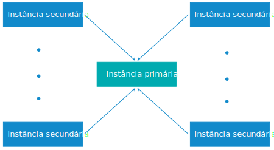

---

copyright:

  years:  2016, 2018

lastupdated: "2018-10-29"

---

{:tip: .tip}
{:note: .note}
{:important: .important}

# Configuração multissite para instâncias do vCenter Server with Hybridity Bundle

O {{site.data.keyword.vmwaresolutions_full}} permite que as instâncias sejam implementadas em locais diferentes e fiquem funcionais em pouco tempo.

## Componentes de implementação de vários sites

Uma implementação de vários sites consiste nos componentes a seguir.

* **Instância primária**: a instância do vCenter Server with Hybridity Bundle tem a configuração a seguir:
  *  Domínio-raiz do Microsoft Active Directory (AD) e DNS (Sistema de Nomes de Domínio)
  *  Subdomínio do vCenter Server
  *  Domínio SSO (Conexão Única)
  *  Nome do site SSO
* **Instância ou instâncias secundárias**: uma ou mais instâncias secundárias do vCenter Server with Hybridity Bundle, vinculadas à instância primária, com a configuração a seguir:
   *  Nome do site SSO
   *  Subdomínio do DNS que é vinculado ao domínio-raiz na instância primária
   *  Configuração de replicação DNS e AD entre as máquinas virtuais AD nas instâncias primárias e secundárias.
   *  PSC (Platform Services Controller) implementado e configurado para replicar com o PSC na instância primária.
   *  O VMware vCenter nas instâncias secundárias é configurado com o Modo vinculado avançado para o vCenter na instância primária.

## Implementação multissite do vCenter Server with Hybridity Bundle

O recurso de configuração de vários sites usa uma topologia de hub e spoke com um site primário e um máximo de sete sites secundários. Uma única camada de sites é suportada, ou seja, não é possível configurar sites subsequentes vinculados a outros sites secundários. É possível ter um total de 128 servidores ESXi em uma configuração de vários sites em todas as instâncias.

Se a sua configuração requerer uma implementação de vários sites com mais de 128 servidores ESXi, entre em contato com o Suporte IBM para obter assistência. Para obter mais informações, veja [Entrando em contato com o Suporte IBM](../vmonic/trbl_support.html).
{:note}

O gráfico a seguir descreve a visão geral da implementação multissite do vCenter Server with Hybridity Bundle.

Figura 1. Implementação multissite do vCenter Server with Hybridity Bundle

O modelo contém as camadas a seguir:

* **Instância primária**: em uma configuração de vários sites, para implementar a primeira instância, defina-a como primária durante o processo de pedido da instância.
* **Instâncias secundárias**: em uma configuração de vários sites, defina as instâncias anexadas à instância primária como instâncias secundárias durante o processo de pedido.

É possível designar apenas uma instância secundária para uma instância primária de cada vez. Não é possível designar múltiplas instâncias secundárias a uma instância primária ao mesmo tempo. Para fazer isso, deve-se passar pelo processo de pedido novamente e selecionar a instância primária definida anteriormente como uma instância primária para a instância secundária. Deve-se repetir o processo para todas as instâncias secundárias que você deseja criar.

É possível ter um máximo de 8 instâncias (1 primária e 7 secundárias) que serão implementadas em uma configuração de vários sites.

A exclusão de instâncias do vCenter Server with Hybridity Bundle que fazem parte de uma configuração multisite requer planejamento especial. Para obter mais informações, veja [Excluindo instâncias do vCenter Server with Hybridity Bundle em uma configuração multisite](vc_hybrid_deletinginstance_multi.html).
{:note}

### Links relacionados

* [Designar função principal ao NSX Manager](https://pubs.vmware.com/NSX-62/topic/com.vmware.nsx-cross-vcenter-install.doc/GUID-44E8AE16-BA3F-4DD9-B582-FC1E137E6CFC.html){:new_window}
* [Configurando gerenciadores NSX secundários](https://pubs.vmware.com/NSX-62/topic/com.vmware.nsx-cross-vcenter-install.doc/GUID-9E48BC57-15E3-49C7-8BC5-F94ED8918BBE.html){:new_window}
* [Confianças AD suportadas com o vCenter Single Sign-On](https://kb.vmware.com/kb/2064250){:new_window}
* [Conectar com segurança suas cargas de trabalho privadas do VMware no {{site.data.keyword.cloud_notm}}](https://www.ibm.com/developerworks/library/se-securely-connect-private-vmware-workloads-ibm-cloud/index.html){:new_window}
