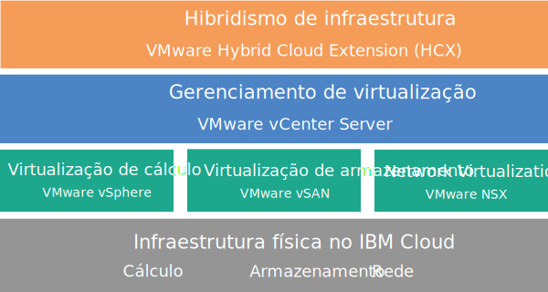

---

copyright:

  years:  2016, 2018

lastupdated: "2018-07-18"

---

# VCenter Server with Hybridity Bundle Visão Geral

O VCenter Server with Hybridity Bundle é uma instância disponível na V2.3 e liberações mais recentes.

O VMware vCenter Server on {{site.data.keyword.cloud}} with Hybridity Bundle é uma nuvem particular host que entrega a pilha do VMware vSphere como um serviço. O ambiente do VMware é construído no topo de quatro {{site.data.keyword.cloud_notm}} {{site.data.keyword.baremetal_short}}, inclui o VMware vSAN como armazenamento dedicado, fornece implementação automática e configuração de um firewall de borda lógica fácil de gerenciar que é desenvolvido pelo VMware NSX e inclui o serviço VMware HCX on {{site.data.keyword.cloud_notm}}.

Em muitos casos, o ambiente inteiro pode ser provisionado em menos de um dia e a infraestrutura bare metal pode aumentar e diminuir rápida e elasticamente a capacidade de cálculo, conforme necessário.

Para aumentar a capacidade de armazenamento baseada em vSAN de um cluster vSAN, é possível incluir mais servidores ESXi após a implementação.

É possível fazer upgrade da edição Advanced do VMware NSX para a edição Enterprise e comprar componentes adicionais do VMware, como VMware vRealize Operations.

Será possível incluir Serviços Gerenciados IBM se você desejar transferir as operações diárias e manutenção da virtualização, S.O. guest ou camadas de aplicativo. A equipe do {{site.data.keyword.cloud_notm}} Professional Services também está disponível para ajudá-lo a acelerar sua jornada para a nuvem com serviços de migração, implementação, planejamento e onboarding.

## VCenter Server com arquitetura Hybridity Bundle

O gráfico a seguir descreve a arquitetura de alto nível e os componentes de uma implementação do vCenter Server with Hybridity Bundle de três nós.

Figura 1. Arquitetura de alto nível do vCenter Server with Hybridity Bundle

### Infraestrutura física

Esta camada fornece a infraestrutura física (recursos de cálculo, armazenamento e rede) a ser usada pela infraestrutura virtual.

### Infraestrutura de virtualização (Cálculo, Armazenamento e Rede)

Esta camada virtualiza a infraestrutura física por meio de produtos VMware diferentes:
* O VMware vSphere virtualiza os recursos de cálculo físico.
* O VMware Virtual SAN (vSAN) fornece armazenamento compartilhado definido por software, com base no armazenamento nos servidores físicos.
* VMware NSX é a plataforma de virtualização de rede que fornece componentes de rede lógica e redes virtuais.

### Gerenciamento de virtualização

Essa camada consiste no vCenter Server Appliance (vCSA), no NSX Manager, em dois NSX ESGs, três NSX Controllers, no dispositivo virtual Platform Services Controller (PSC) e na instância de servidor virtual (VSI) do IBM CloudDriver. A VSI do CloudDriver é implementada sob demanda conforme necessário para determinadas operações, como inclusão de hosts no ambiente.

A oferta de base é implementada com um dispositivo vCenter Server que é dimensionado para suportar um ambiente com até 400 hosts e até 4000 VMs. As mesmas ferramentas e scripts compatíveis com o vSphere API podem ser usados para gerenciar o ambiente do VMware hospedado pela IBM.

No total, a oferta de base requer 38 vCPU e 67 GB de vRAM que são reservados para a camada de gerenciamento de virtualização. A capacidade restante do host para suas VMs depende de vários fatores, como a taxa de alocação excessiva, o dimensionamento da VM e os requisitos de desempenho de carga de trabalho.

Para obter os requisitos de recursos de gerenciamento adicionais ao implementar o serviço HCX on {{site.data.keyword.cloud_notm}}, consulte a visão geral do [VMware HCX on {{site.data.keyword.cloud_notm}}](../services/hcx_considerations.html).

### Infraestrutura Hybridity

Essa camada fornece uma abstração de recursos entre os sites no local e os sites do {{site.data.keyword.cloud_notm}} para que seja possível mover cargas de trabalho para a frente e para trás de forma segura e fácil sem a necessidade de mudar as características das VMs, como seus endereços IP.

Com base no VMware Hybrid Cloud Extension (HCX), é possível criar interconexões fracamente acopladas entre sites do {{site.data.keyword.cloud_notm}} e no local para ativar a migração em massa de VMs ou o vMotion em tempo real de VMs sem tempo de inatividade.

## Especificações técnicas para instâncias do vCenter Server with Hybridity Bundle

Os componentes a seguir estão incluídos em sua instância do vCenter Server with Hybridity Bundle:

**Nota:** a disponibilidade e a precificação de configurações de hardware padronizadas podem variar com base no {{site.data.keyword.CloudDataCent_notm}} que está selecionado para implementação.

### Bare Metal Server

Quatro {{site.data.keyword.baremetal_short}} customizados vêm com sua ordem da instância do vCenter Server with Hybridity Bundle. Os seguintes modelos de CPU estão disponíveis:
  * Geração Intel Broadwell de 2 CPUs (Série Intel Xeon E5-2600 v4)
  * Geração Intel Skylake de 2 CPUs (série Intel Xeon 4100/5100/6100)

### Rede

Os componentes de rede a seguir são pedidos:
*  Uplinks duais de rede pública e privada de 10 Gbps
*  Três VLANs (Virtual LANs): uma VLAN pública e duas VLANs privadas
*  Uma VXLAN (Virtual eXtensible LAN) com DLR (Distributed Logical Router) para comunicação leste-oeste potencial entre cargas de trabalho locais conectadas a redes de camada 2 (L2). A VXLAN é implementada como uma topologia de roteamento de amostra, que pode ser modificada, usada para construção ou ser removida. Também é possível incluir zonas de segurança anexando VXLANs adicionais em novas interfaces lógicas no DLR.
*  Dois VMware NSX Edge Services Gateways:
  * Um serviço de gerenciamento seguro VMware NSX Edge Services Gateway (ESG) para tráfego de gerenciamento de saída HTTPS, que é implementado pela IBM como parte da tipologia de rede de gerenciamento. Esse ESG é usado pelas VMs de gerenciamento da IBM para se comunicar com componentes de gerenciamento externo específicos da IBM relacionados à automação. Para obter mais informações, veja [Configurando sua rede para usar o ESG gerenciado pelo cliente](../vcenter/vc_esg_config.html#configuring-your-network-to-use-the-customer-managed-nsx-esg-with-your-vms).

    **Importante**: esse ESG não está acessível e não pode ser usado. Se você o modificar, poderá não ser capaz de gerenciar a instância do vCenter Server with Hybridity Bundle por meio do console do {{site.data.keyword.vmwaresolutions_short}}. Além disso, observe que usar um firewall ou desativar as comunicações ESG para os componentes de gerenciamento externo da IBM fará com que o {{site.data.keyword.vmwaresolutions_short}} se torne inutilizável.
  * Um VMware NSX Edge Services Gateway seguro e gerenciado pelo cliente para tráfego de carga de trabalho de entrada e saída HTTPS, que é implementado pela IBM como um modelo que pode ser modificado por você para fornecer acesso VPN ou acesso público. Para obter mais informações, veja [O NSX Edge gerenciado pelo cliente representa um risco de segurança?](../vmonic/faq.html#does-the-customer-managed-nsx-edge-pose-a-security-risk-).

Para obter informações adicionais sobre os componentes de rede pedidos ao implementar o serviço HCX on {{site.data.keyword.cloud_notm}}, veja [Visão geral do HCX on {{site.data.keyword.cloud_notm}}](../services/hcx_considerations.html).

### Virtual Server Instances

Os virtual server instances (VSIs) a seguir são pedidos:
* Um VSI for IBM CloudBuilder, que será encerrado depois que a implementação da instância for concluída.
* É possível escolher implementar um único VSI do Microsoft Windows Server para o Microsoft Active Directory (AD) ou duas VMs de alta disponibilidade do Microsoft Windows no cluster de gerenciamento para ajudar a aprimorar a segurança e robustez.

### Armazenamento

O armazenamento vSAN oferece configurações customizadas, com várias opções para tipo de disco e quantidade:
* Quantidade de disco: 2, 4, 6 ou 8.
* Disco de armazenamento: SSD SED de 960 GB, SSD SED de 1,9 TB ou SSD SED de 3,8 TB.

  Além disso, também são pedidos 2 discos de cache de 960 GB por host.

### Licenças e taxas fornecidas pela IBM

As licenças a seguir são incluídas no seu pedido de instância do vCenter Server with Hybridity Bundle.

* VMware vSphere Enterprise Plus 6.5u1
* VMware vCenter Server 6.5
* VMware NSX Service Providers Edition (Advanced ou Enterprise) 6.4
* VMware vSAN (Advanced ou Enterprise) 6.6

Suporte adicional e taxas de serviços podem se aplicar.

## Especificações técnicas para nós de expansão do vCenter Server with Hybridity Bundle

Cada nó de expansão do vCenter Server with Hybridity Bundle implementará e incorrerá em encargos para os componentes a seguir em sua conta do {{site.data.keyword.cloud_notm}}.

### Hardware para nós de expansão

Um Bare Metal Server com a configuração customizada.

### Licenças e taxas para os nós de expansão

* Um VMware vSphere Enterprise Plus 6.5u1
* Um VMware NSX Service Providers Edition (Advanced ou Enterprise) 6.4
* Uma taxa de suporte e de serviços
* VMware vSAN (Advanced ou Enterprise) 6.6

**Importante**: deve-se gerenciar os componentes do {{site.data.keyword.vmwaresolutions_short}} criados em sua conta do {{site.data.keyword.cloud_notm}} apenas por meio do console do {{site.data.keyword.vmwaresolutions_short}}, não do {{site.data.keyword.slportal}} ou de qualquer outro meio fora do console. Se você mudar esses componentes fora do console do {{site.data.keyword.vmwaresolutions_short}}, as mudanças não serão sincronizadas com o console.

**CUIDADO**: gerenciar quaisquer componentes do {{site.data.keyword.vmwaresolutions_short}} que foram instalados em sua conta do {{site.data.keyword.cloud_notm}} quando você pediu a instância, fora do console do {{site.data.keyword.vmwaresolutions_short}} pode desestabilizar seu ambiente. Estas atividades de gerenciamento incluem:
*  Incluindo, modificando, retornando ou removendo componentes
*  Expandindo ou contraindo a capacidade da instância por meio da inclusão ou remoção de servidores ESXi
*  Desativando componentes
*  Reiniciando os serviços

   As exceções a essas atividades incluem o gerenciamento de compartilhamentos de arquivos de armazenamento compartilhado por meio do {{site.data.keyword.slportal}}. Essas atividades incluem: pedido, exclusão (que poderá afetar armazenamentos de dados, se montado), autorização e montagem de compartilhamentos de arquivos de armazenamento compartilhados.

### Links relacionados

* [Lista de materiais do software vCenter Server](vc_bom.html)
* [Requisitos e planejamento para instâncias do vCenter Server with Hybridity Bundle](vc_hybrid_planning.html)
* [Pedindo instâncias do vCenter Server with Hybridity Bundle](vc_hybrid_orderinginstance.html)
* [HCX no {{site.data.keyword.cloud_notm}} visão geral](../services/hcx_considerations.html)
* [Entrando em contato com o Suporte IBM](../vmonic/trbl_support.html)
