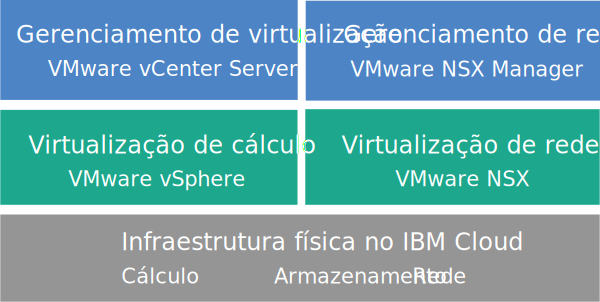

---

copyright:

  years:  2016, 2019

lastupdated: "2019-03-21"

subcollection: vmwaresolutions

---

{:tip: .tip}
{:note: .note}
{:important: .important}

# Visão geral do vCenter Server com NSX-T
{: #vc_nsx-t_overview}

O VMware vCenter Server com NSX-T no {{site.data.keyword.cloud}} é uma nuvem privada hospedada que entrega a pilha do VMware vSphere como um serviço. O ambiente do VMware é construído sobre um mínimo de três {{site.data.keyword.cloud_notm}} {{site.data.keyword.baremetal_short}}, oferece opções de armazenamento conectado à rede compartilhada e de armazenamento definido pelo software dedicado e inclui a implementação e a configuração automáticas de um firewall de borda lógica fácil de gerenciar que é desenvolvido com o VMware NSX-T.

Em muitos casos, o ambiente inteiro pode ser provisionado em menos de um dia e a infraestrutura bare metal pode aumentar e diminuir rápida e elasticamente a capacidade de cálculo, conforme necessário.

Pós-implementação, é possível aumentar o armazenamento compartilhado pedindo mais compartilhamentos de arquivos NFS (Network File System) do {{site.data.keyword.slportal}} e anexando-os manualmente a todos os servidores ESXi em um cluster.

VMware vSAN também está disponível como uma opção de armazenamento dedicado. Para aumentar a capacidade de armazenamento baseada em vSAN de um cluster vSAN, é possível incluir mais servidores ESXi após a implementação.

As instâncias do vCenter Server com NSX-T são somente para teste de prova de conceito (POC) ou teste de simulação. Não execute cargas de trabalho de trabalho de produção nesse ambiente. Funções de gerenciamento, como o pedido de serviços complementares e a aplicação de atualizações, não são suportadas.
{:important}

## vCenter Server com arquitetura NSX-T
{: #vc_nsx-t_overview-archi}

O gráfico a seguir descreve a arquitetura de alto nível e os componentes de uma implementação do vCenter Server com NSX-T de três nós.

Figura 1. vCenter Server com arquitetura de alto nível do NSX-T para um cluster de três nós

### Infraestrutura física
{: #vc_nsx-t_overview-physical-infras}

Esta camada fornece a infraestrutura física (recursos de cálculo, armazenamento e rede) a ser usada pela infraestrutura virtual.

### Infraestrutura de virtualização (cálculo e rede)
{: #vc_nsx-t_overview-virtualization-infras}

Esta camada virtualiza a infraestrutura física por meio de produtos VMware diferentes:
* O VMware vSphere virtualiza os recursos de cálculo físico.
* O VMware NSX-T é a plataforma de virtualização de rede que fornece componentes de rede lógica e redes virtuais.

### Gerenciamento de virtualização
{: #vc_nsx-t_overview-virtualization-mgmt}

Essa camada consiste no vCenter Server Appliance (vCSA) com o Platform Services Controller (PSC) integrado, três Nós do NSX, três NSX Edge Services Gateways (ESGs) e a instância do servidor virtual (VSI) do IBM CloudDriver. A VSI do CloudDriver é implementada sob demanda conforme necessário para determinadas operações, como inclusão de hosts no ambiente.

A oferta de base é implementada com um dispositivo vCenter Server que é dimensionado para suportar um ambiente com até 400 hosts e até 4000 MVs. As mesmas ferramentas e scripts compatíveis com o vSphere API podem ser usados para gerenciar o ambiente do VMware hospedado pela IBM.

No total, a oferta base requer 38 vCPU e 128 GB de vRAM que são reservados para a camada de gerenciamento de virtualização. A capacidade de host restante para suas VMs depende de vários fatores, como a taxa de alocação excessiva, dimensionamento da máquina virtual (VM) e requisitos de desempenho de carga de trabalho.

Para obter mais informações sobre a arquitetura, consulte a [Referência de arquitetura do {{site.data.keyword.vmwaresolutions_short}}](/docs/services/vmwaresolutions/archiref/solution?topic=vmware-solutions-solution_overview).

## Especificações técnicas para instâncias do vCenter Server com NSX-T
{: #vc_nsx-t_overview-specs}

Os componentes a seguir estão incluídos em sua instância do vCenter Server com NSX-T.

A disponibilidade e a precificação de configurações padronizadas de hardware podem variar com base no {{site.data.keyword.CloudDataCent_notm}} que é selecionado para implementação.
{:note}

### Bare Metal Server
{: #vc_nsx-t_overview-bare-metal}

É possível pedir três ou mais {{site.data.keyword.baremetal_short}} com uma das configurações a seguir:
* **Skylake**: servidores de geração do Intel Skylake de 2 CPUs (série Intel Xeon 4100/5100/6100) com o seu modelo de CPU selecionado e o tamanho de RAM.  
* **Broadwell**: servidores de geração Intel Broadwell de 4 CPUs (Intel Xeon série E7-4800) com o seu modelo de CPU e tamanho de RAM selecionados.

Se você planeja usar o armazenamento vSAN, a configuração requer quatro {{site.data.keyword.baremetal_short}}.
{:note}

### Rede
{: #vc_nsx-t_overview-networking}

Os componentes de rede a seguir são pedidos:
*  Uplinks duais de rede pública e privada de 10 Gbps
*  Três VLANs (Virtual LANs): uma VLAN pública e duas VLANs privadas
* Uma rede de sobreposição com um roteador T1 e T0 para a potencial comunicação leste-oeste entre as cargas de trabalho locais que estão conectadas às redes da camada 2 (L2). Isso é implementado como uma topologia de roteamento de amostra, que pode ser modificada, removida ou servir de base para construção.
*  Três gateways de serviços de borda do VMware NSX-T:
  * Um serviço de gerenciamento seguro VMware NSX ESGs para o tráfego de gerenciamento de HTTPS de saída, que é implementado pela IBM como parte da tipologia de rede de gerenciamento. Esse ESG é usado pelas MVs de gerenciamento da IBM para se comunicar com componentes de gerenciamento externo específicos da IBM relacionados à automação. Para obter mais informações, veja [Configurando sua rede para usar o NSX ESG gerenciado pelo cliente com suas VMs](/docs/services/vmwaresolutions/vcenter?topic=vmware-solutions-vc_esg_config).
  * Dois VMware NSX ESGs seguros gerenciados pelo cliente para o tráfego de carga de trabalho HTTPS de saída e de entrada. Esse gateway é implementado pela IBM como um modelo que pode ser modificado por você para fornecer acesso à VPN ou acesso público. Para obter mais informações, veja [O NSX Edge gerenciado pelo cliente representa um risco de segurança?](/docs/services/vmwaresolutions/vmonic?topic=vmware-solutions-faq-customer-nsx)

  Esse ESG é denominado **mgmt-nsx-edge0**. O ESG não está acessível a você e você não pode usá-lo. Se você modificá-lo, poderá não ser capaz de gerenciar a instância do vCenter Server do console do {{site.data.keyword.vmwaresolutions_short}}. Além disso, o uso de um firewall ou a desativação das comunicações do ESG com os componentes de gerenciamento externos da IBM, pode fazer com que o {{site.data.keyword.vmwaresolutions_short}} se torne não utilizável.
  {:important}

### Virtual Server Instances
{: #vc_nsx-t_overview-vsi}

Os virtual server instances (VSIs) a seguir são pedidos:
* Um VSI for IBM CloudBuilder, que será encerrado depois que a implementação da instância for concluída.
* É possível escolher implementar um único VSI do Microsoft Windows Server para o Microsoft Active Directory (AD) ou duas MVs de alta disponibilidade do Microsoft Windows no cluster de gerenciamento para ajudar a aprimorar a segurança e robustez.

### Armazenamento
{: #vc_nsx-t_overview-storage}

Durante a implementação inicial, é possível escolher entre as opções de armazenamento vSAN e NFS.

Após a implementação, é possível incluir compartilhamentos de armazenamento NFS em um cluster NFS ou vSAN existente. Para obter mais informações, consulte a seção *Incluindo armazenamento NFS em instâncias do
vCenter Server* em
[Expandindo
e reduzindo capacidade para instâncias do vCenter Server](/docs/services/vmwaresolutions/vcenter?topic=vmware-solutions-vc_addingremovingservers).
{:note}

#### Armazenamento vSAN
{: #vc_nsx-t_overview-vsan-storage}

A opção vSAN oferece configurações customizadas com várias opções para tipo de disco, tamanho e quantidade:
* Quantidade de disco: 2, 4, 6 ou 8
* Disco de armazenamento: SSD SED de 960 GB, SSD SED de 1,9 TB ou SSD SED de 3,8 TB.

  Além disso, também são pedidos dois discos de cache de 960 GB por host.

  As unidades SSD (Disco de Estado Sólido) de 3,8 TB serão suportadas quando forem geralmente disponibilizadas em um data center.
  {:note}
* Opção Intel Optane de alto desempenho, que fornece dois compartimentos de disco de capacidade extras para um total de 10 discos de capacidade. Essa opção depende do modelo de CPU.

#### Armazenamento NFS
{: #vc_nsx-t_overview-nfs-storage}

A opção NFS oferece armazenamento compartilhado customizado no nível de arquivo para cargas de trabalho com várias opções para tamanho e desempenho:
* Tamanho: 20 GB a 24 TB
* Desempenho: 0,25, 2, 4 ou 10 IOPS/GB
* Configuração individual de compartilhamentos de arquivos

  O nível de desempenho de 10 IOPS/GB é limitado a uma capacidade máxima de 4 TB por compartilhamento de arquivo.
  {:note}

Se você escolher a opção NFS, um compartilhamento de arquivo de 2 TB e 4 IOPS/GB para componentes de gerenciamento será pedido.

### Licenças (fornecidas pela IBM ou BYOL) e taxas
{: #vc_nsx-t_overview-license-and-fee}

* VMware vSphere Enterprise Plus 6.7u1
* VMware vCenter Server 6.5
* VMware NSX Service Providers Edition (Base, Advanced ou Enterprise) 6.4 (fornecido pela IBM apenas)
* (Para clusters do vSAN) VMware vSAN Advanced ou Enterprise 6.6
* Taxa de suporte e serviços (uma licença por nó)

## Especificações técnicas para o vCenter Server com nós de expansão NSX-T
{: #vc_nsx-t_overview-expansion-node-specs}

Cada vCenter Server com nó de expansão NSX-T é implementado e incorre em encargos para os componentes a seguir em sua conta do {{site.data.keyword.cloud_notm}}.

### Hardware para nós de expansão
{: #vc_nsx-t_overview-expansion-node-hardware}

Um Bare Metal Server com a configuração apresentada em [Especificações técnicas para instâncias do vCenter Server com NSX-T](/docs/services/vmwaresolutions/vcenter?topic=vmware-solutions-vc_nsx-t_overview-specs).

### Licenças e taxas para os nós de expansão
{: #vc_nsx-t_overview-expansion-node-license-and-fee}

* Um VMware vSphere Enterprise Plus 6.7u1
* Um VMware NSX Service Providers Edition (Base, Advanced ou Enterprise) 6.4
* Uma taxa de suporte e de serviços
* (Para clusters do vSAN) VMware vSAN Advanced ou Enterprise 6.6

Deve-se gerenciar os componentes do {{site.data.keyword.vmwaresolutions_short}} que são criados em sua conta do {{site.data.keyword.cloud_notm}} somente por meio do console do
{{site.data.keyword.vmwaresolutions_short}}, não do {{site.data.keyword.slportal}} ou de qualquer outro meio fora do console. Se você mudar esses componentes fora do console do {{site.data.keyword.vmwaresolutions_short}}, as mudanças não serão sincronizadas com o console.
Gerenciar quaisquer componentes do {{site.data.keyword.vmwaresolutions_short}}, que foram instalados em sua conta do {{site.data.keyword.cloud_notm}} quando você pediu a instância, de fora do console do {{site.data.keyword.vmwaresolutions_short}} pode tornar o seu ambiente instável. Estas atividades de gerenciamento incluem:
*  Incluindo, modificando, retornando ou removendo componentes
*  Expansão ou redução da capacidade da instância por meio da inclusão ou remoção de servidores ESXi
*  Desativando componentes
*  Reiniciando serviços
      As exceções a essas atividades incluem gerenciar os compartilhamentos de arquivo de armazenamento compartilhado por meio do {{site.data.keyword.slportal}}. Essas atividades incluem: pedido, exclusão (que poderá afetar armazenamentos de dados, se montado), autorização e montagem de compartilhamentos de arquivos de armazenamento compartilhado.
   {:important}

## Links relacionados
{: #vc_nsx-t_overview-related}

* [Lista de materiais do software vCenter Server](/docs/services/vmwaresolutions/vcenter?topic=vmware-solutions-vc_bom)
* [Planejando instâncias do vCenter Server](/docs/services/vmwaresolutions/vcenter?topic=vmware-solutions-vc_planning)
* [ Pedindo o vCenter Server com instâncias do NSX-T ](/docs/services/vmwaresolutions/vcenter?topic=vmware-solutions-vc_nsx-t_orderinginstance)
* [Armazenamento de arquivo e de bloco do {{site.data.keyword.cloud_notm}}](https://www.ibm.com/cloud/garage/content/architecture/virtualizationArchitecture/shared-storage){:new_window}
* [ Expandindo Capacidade de Compartilhamento de Arquivo ](/docs/infrastructure/FileStorage?topic=FileStorage-expandCapacity#expandCapacity)
